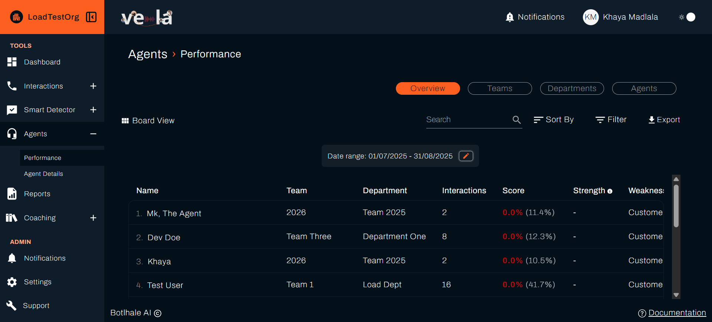

# Monitor Agent Performance
The Vela platform gives Team Leads and Administrators the tools to track agent performance, identify skill gaps, and implement targeted coaching. Use the **Dashboard** for trends across a team, and the **Agents** section for detail on one person.

---

## 1. Daily Performance Overview (Dashboard)

Start your day with a quick **Performance Check** on the Dashboard. This gives you an immediate view of trends and red flags across your teams.

### A. Access and Filter Data

1.  Log into Vela and go to the **Dashboard**.
2.  Set the **Date Filter** to **"Today"** or **"Yesterday"** for a current performance check.
3.  Click **Filter** to narrow the metrics by department, team, or agent.

### B. Critical Metrics to Monitor

Focus on these key indicators to spot areas needing attention:

| Metric | What to Look For | Action Trigger |
| :--- | :--- | :--- |
| **Average Agent Score** | The overall quality performance for your scope. | A score consistently below your team's expected standard. |
| **Agent Scores Distribution** | How scores are spread across the team. | A clustering of agents in the lower score ranges, indicating a team-wide training need. |
| **No. Alerts** and **Resolved vs Unresolved Alerts** | How many Smart Search matches were raised, and how many are still open. | A high number of unresolved alerts, meaning issues are going unactioned. |
| **Sentiment Distribution** | The proportion of positive, neutral, and negative customer moods. | A sudden spike in **Negative** sentiment, pointing to a service or system issue. |
| **Talk to Listen Ratio** | Agent talking time relative to customer talking time. | A consistently high ratio, which may indicate the agent is dominating the conversation and not actively listening. |

:::tip
**Dashboard Customisation**

Click the customisation option on the Dashboard to select the specific metrics and chart types (table, line, bar, pie, doughnut, or card) that align with your team's current Key Performance Indicators (KPIs). The chart types offered vary by metric.
:::

---

## 2. In-Depth Agent Review

The **Agents** section lets you dive into individual performance details, compare peers, and identify specific strengths and weaknesses.

### A. Access Agent Performance Data

1.  Navigate to the **Agents → Performance** section. It opens on the **Overview** tab, with **Teams**, **Departments**, and **Agents** alongside it.
2.  Click **Filter** to narrow the list. The **Filter By** modal covers **Department**, **Team**, **Strengths**, **Weaknesses**, a **Total Calls** range, and a **Rank** range. Click **Apply**, or **Clear All Fields** to reset.
3.  Click **Sort By** to order the table. Choose **Ascending** or **Descending**, then sort on Name, Team, Department, Interactions, Score, Strength, Weakness, or Rank, and click **Save Changes**. Sorting by **Score** ascending puts the agents who need coaching first at the top.

Use **Export** to download the table, as a PDF or as a CSV, and **Board View** to switch from the table to a card layout.

### B. Analyse Individual Performance

Click **View** in the agent's row to open their individual performance page.

* **View Individual Agent Scores and Rankings:** Track their **Overall Score** against the **Team Overall Score**, and how they rank against their peers.
* **Track Strengths and Weaknesses:** The system highlights which scorecard categories are their strongest and weakest points based on your organisation's defined criteria. Categories come from the **Category** field on each scorecard question, so how you group your questions decides what a strength or weakness can be. See [How Scoring Works](../explanation/how-scoring-works.md).
* **Check Agent Scorecard Results:** Review the agent's performance across the categories defined in your organisation's Agent Scorecard.

Voice profiles, which improve AI accuracy and speaker separation in transcripts, are managed separately under **Agents → Agent Details**.

### C. Benchmark Against the Team

Use the Dashboard to understand whether an agent is an outlier or part of a broader team trend.

1.  On the Dashboard, review **Agent Scores Distribution** for your scope.
2.  Compare the agent's score against the spread to see where they sit relative to the team.

---

## 3. Reporting and Exporting

Turn what you see into something you can share with management. Build a report over a date range with the metrics that matter, for example Average Agent Score and Sentiment Distribution, and schedule it to run daily, weekly, or monthly so managers receive it automatically. For the full steps, see [Generate Reports](./custom-reporting.md).

To export the performance table itself, use **Export** on **Agents → Performance**, described above.

---

## 4. Turning Insights into Action (Coaching)

Performance monitoring must lead directly to coaching and development to drive improvement.

### A. Identify Coaching Opportunities

* **Low Scores:** Any interaction with a low Automatic or Manual Scorecard score is a direct coaching opportunity.
* **Alerts:** Agents who frequently trigger **Smart Search Alerts**, for example compliance issues or high-risk phrases, need targeted intervention.
* **Trends:** Agents whose score **Trends** are consistently declining require immediate attention.

### B. Act on What You Find

1.  **Leave coaching comments** on the specific interactions that show the issue, tagging the agent so they receive a notification.
2.  **Assign training** through the Coaching section, targeted at the identified gap.
3.  **Track results** by monitoring the agent's score trend over the following weeks.

:::info
**Workflow: Performance Gap to Training**

1.  **Find the gap:** the Dashboard shows an agent scoring low in a specific scorecard category.
2.  **Review interactions:** open that agent's recent calls or chats to identify the recurring issue.
3.  **Assign training:** use the Coaching section to assign a course targeting the skill gap.
4.  **Track results:** monitor the agent's score trend to confirm improvement.
:::

:::note Coaching is documented separately
The **Coaching** section appears if your organisation has the Coaching Portal enabled. Creating courses, assigning training, tracking completion, and managing awards are covered in the [Vela Coaching Portal documentation](https://docs-coaching.botlhale.xyz).
:::

---

## Related

- [Metrics](../reference/metrics.md): what each figure on the Dashboard measures
- [Review and Score Interactions](./quality-assurance-tools.md): score the interactions behind the numbers
- [Generate Reports](./custom-reporting.md): share performance trends outside the platform

## Need Help?

**Contact Support:** support@botlhale.ai
