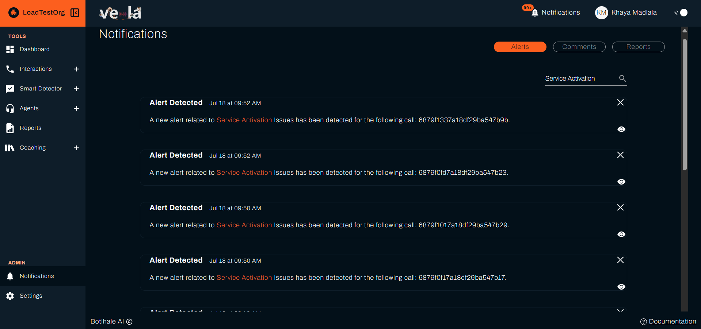
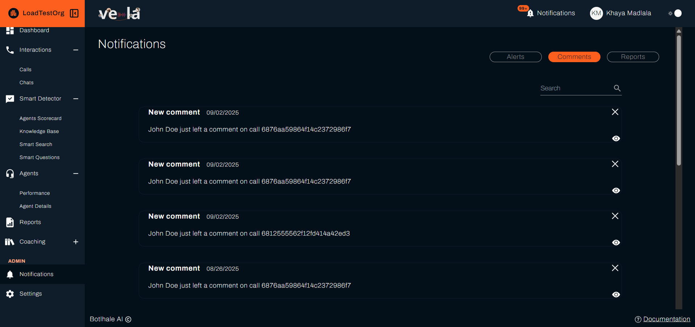
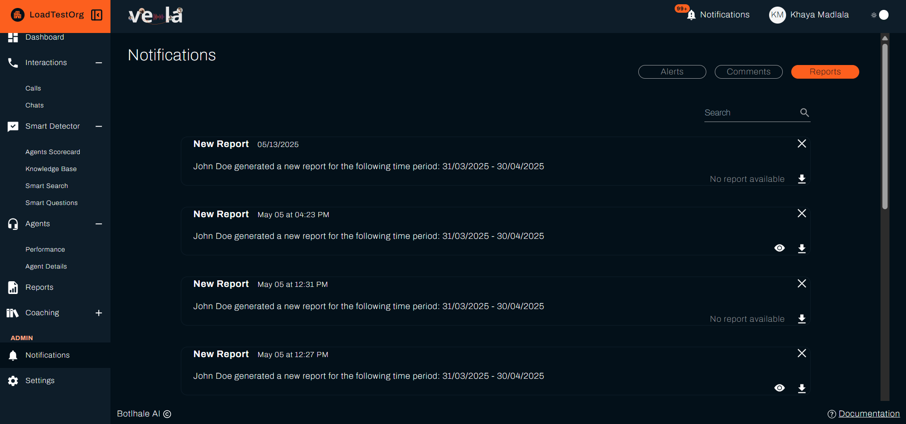

# Manage Notifications
Vela notifies you when something needs your attention. That might be a Smart Search or Smart Question alert, a comment on an interaction, or a report that has finished generating. Not all of them arrive in the same place. Some are email only, and some belong to the Agent Portal. This page covers what triggers a notification, where each one arrives, and how to control what reaches you.

---

## Before You Begin

You need:

- **Something to be notified about.** Notifications follow activity, so a new organisation with nothing uploaded and no Smart Searches configured has an empty page rather than an error.
- **Your own preferences set.** What arrives, and by which route, comes from **Settings → Notifications** on your own account. Another user's settings do not affect yours.
- **A Smart Search with notifications on**, if you are expecting alerts. See [Set Up Smart Search](../smart-search-guide.md).

---

## 1. Find Your Notifications

### A. The Tabs

Select **Notifications** in the left sidebar. Three tabs sit at the top right of the page:

| Tab | What it contains |
| :--- | :--- |
| **Alerts** | Smart Search matches, and Smart Question answers that hit the outcome you set them to alert on. |
| **Comments** | Comments on interactions, according to the comment preferences on your account. |
| **Reports** | Reports that have finished generating, whether one-time or scheduled. |

The **Alerts** tab appears on every edition except [Lite](../reference/glossary.md#lite), where the page opens on **Comments** instead.

Unread notifications are also indicated in the top navigation bar, so you can see at a glance whether anything new has arrived.

:::note The page lists unread notifications only
Once a notification is dismissed it leaves the list for good. There is no read or archived view to recover it from, so treat the page as a queue to work through rather than a history to search later.

Nothing is lost when you dismiss one. The interaction, comment, or report it pointed at stays exactly where it was, and you reach it through **Interactions**, **Smart Detector**, or **Reports** as usual.
:::

### B. Work a Notification

Every notification, on all three tabs, carries the same controls:

| Control | What it does |
| :--- | :--- |
| **Search** | Sits above the list and narrows it by wording, matching both the heading and the body of a notification. Matches are highlighted |
| The **eye** icon | Opens what the notification is about: the interaction on **Alerts** and **Comments**, the report itself on **Reports** |
| The **×** | Dismisses the notification and takes it off the list |

Each notification shows its heading, how long ago it arrived, and a line of detail. Past one page, pagination sits at the foot of the list: **Previous** and **Next**, with **Page 1 of 2** between them.

On the **Reports** tab there is also a download control beside the eye, so you can take a finished report straight from the notification without going to the Reports list. A report whose file is no longer available reads **No report available** in place of the link.

---

## 2. What Triggers a Notification

Not everything lands in the same place, which is the usual reason a notification you expected seems to be missing:

| Notification Type | When You Receive It | Where It Appears |
| :--- | :--- | :--- |
| **Smart Search alert** | A processed interaction matches one of your Smart Searches | **Alerts** tab |
| **Smart Question alert** | A Smart Question returns the outcome you set it to alert on, under **Receive notifications when** | **Alerts** tab |
| **Comment** | Someone comments on an interaction your preferences cover | **Comments** tab |
| **Report ready** | A scheduled or one-time report has finished generating | **Reports** tab |
| **Access request** | A request to view redacted information has been approved or declined | **Email**, to the person who raised it and to the administrators who process these requests. The outcome also shows on the request itself, under **Settings → Requests → Completed** |
| **Call processed** | A call has finished transcription and analysis | **Email only.** There is no in-app notification for this |
| **Course assigned** | A training course has been assigned to you | **Agent Portal**, not the main platform |
| **Award presented** | An award has been presented to you | **Agent Portal**, not the main platform |

The last three only appear where they are relevant to your role. Email delivery depends on your own preferences in **Settings → Notifications**.

---

## 3. Work Through Your Alerts

An alert is raised automatically when a processed interaction matches one of your Smart Searches, or when a Smart Question returns the outcome you set it to alert on. Each one links to the interaction that raised it.

A practical routine for each alert:

1. Open the matched interaction from the alert.
2. Review the full context. The transcript and AI analysis show whether the match is a genuine issue.
3. Decide what it needs. A genuine issue usually warrants a coaching comment on the interaction, tagging the agent with **@** so it reaches them. A false match needs nothing further.
4. Select **Resolve** on the alert either way, so your list holds only what you still have to look at.

:::tip Use alerts as your review queue
Rather than sampling interactions at random, work your alerts first. They are the conversations your own searches have identified as worth looking at.
:::

---

## 4. Control What Reaches You

Two separate switches decide whether an alert reaches you, and both have to be on. The search decides whether it raises alerts at all, covered here. Your account decides whether alerts reach you, covered in [Set Your Preferences](#6-set-your-preferences). A search with notifications on still tells you nothing if your own **New Alerts Detected** is unticked.

Each Smart Search has a **Notifications** setting. Turn it on when you create the search, or change it later by editing the search.

Matches still appear in the Smart Search results view whether or not notifications are on. The setting only controls whether Vela notifies you about them.

:::tip Turning down the volume
A search generating more alerts than your team can act on has two fixes. Tighten its phrases so it matches less, or turn its Notifications off and review the matches in the results view instead.
:::

A Smart Question has the same **Notifications** setting, and one more. **Receive notifications when** takes a **Yes** or a **No**, and Vela alerts you only when the answer matches it.

Ask whether a customer mentioned a competitor, set it to **Yes**, and you hear about the calls where one was mentioned. The rest are answered and recorded as usual, without reaching you. See [Set Up Smart Questions](../smart-questions-guide.md#notifications).

For more on building searches, see [Smart Search](../smart-search-guide.md).

---

## 5. Comments and @ Mentions

Comments are how feedback reaches your agents, and the **@** mention is what makes a comment a notification.

Type **@** in the comment box and pick the agent. Vela then notifies them in their Agent Portal, where they can read it and reply. An untagged comment stays visible to team leads and never reaches the agent.

Mentions work in new comments rather than replies, as the panel itself notes. A reply therefore carries no tag and raises no notification, so anything the agent has to see belongs in a new comment with a tag on it.

For writing and resolving comments, see [Review and Score Interactions](./quality-assurance-tools.md#b-comment-to-coach).

---

## 6. Set Your Preferences

Go to **Settings → Notifications**. Everything here applies to your own account only.

### A. Choose What You Receive

Two lists, **Platform Notifications** and **Email Notifications**, offer the same choices. Tick an item in both lists to receive it in Vela and by email, or in one list to receive it only there. Leave it unticked in both to stop receiving it.

| Setting | What it covers |
| :--- | :--- |
| **Comments** | Any comment added anywhere in your organisation |
| **Activity On Your Comments** | Replies and activity on comments you wrote |
| **Comments Mentioning You** | Comments where someone tagged you with **@** |
| **New Reports** | A report has finished generating |
| **New Alerts Detected** | A Smart Search matched an interaction, or a Smart Question returned the outcome it alerts on. One setting covers both |

**New Alerts Detected** appears in both lists on every edition except [Lite](../reference/glossary.md#lite).

The three comment settings widen as you go up the list. **Comments Mentioning You** is the narrowest and **Comments** the broadest, so tick that one only if you want every comment in the organisation.

Select **Save** to apply your changes. Leaving the tab without saving discards them.

### B. Choose How Often Email Arrives

Below the two lists, choose how often email is sent. This applies to email only. Notifications appear in Vela as they happen whichever you pick.

- **Real-time**: each email is sent as the event happens.
- **Daily**: one email a day, gathering everything since the last one. Choosing this reveals a time picker, so you can set the hour it arrives.

Pick daily if alerts arrive faster than you act on them.

:::note The Notifications tab belongs to the Administrator and User roles
Agents have no notification settings of their own. Their Agent Portal carries an **account** and a **security** tab only.
:::

---

## Check Your Work

Open **Notifications** and confirm the tab you expect to use has entries in it. An empty tab is a result, not a fault: it means nothing of that type is waiting on you.

Selecting **Save** shows a confirmation message, and that message is what tells you the ticks were stored.

Testing an alert end to end takes one interaction. Upload an interaction you know matches a Smart Search that has notifications on, then check the **Alerts** tab once processing finishes. Alerts are raised during analysis, so one that has not appeared yet usually means the interaction is still being processed.

---

## Troubleshooting

| Problem | Solution |
| :--- | :--- |
| Too many notifications | **Comments** sends you every comment in the organisation, so untick it in **Settings → Notifications** if that is the source. For alerts, tighten the search's phrases or turn its **Notifications** off |
| Alerts not arriving | Two settings have to agree. Confirm **New Alerts Detected** is ticked in **Settings → Notifications**, and that the Smart Search has **Notifications** on with a scope covering the relevant teams |
| Comments not arriving | Check which comment settings you have ticked in **Settings → Notifications**. **Comments Mentioning You** covers only comments that tag you with **@** |
| Reports not arriving | Confirm **New Reports** is ticked in **Settings → Notifications**, then check the schedule and that its date range contains data |
| Email missing, but notifications appear in Vela | Check the **Email Notifications** list in **Settings → Notifications**. On a daily frequency the email arrives at the time you set rather than as the event happens |
| A notification dismissed by mistake | Dismissing is final. Open the interaction, comment, or report directly instead |

---

## Related

- [Set Up Smart Search](../smart-search-guide.md): create the searches that raise alerts
- [Review and Score Interactions](./quality-assurance-tools.md): turn alerts into scored reviews and coaching
- [Generate Reports](./custom-reporting.md): create and schedule the reports you are notified about

## Need Help?

**Contact Support:** support@botlhale.ai
