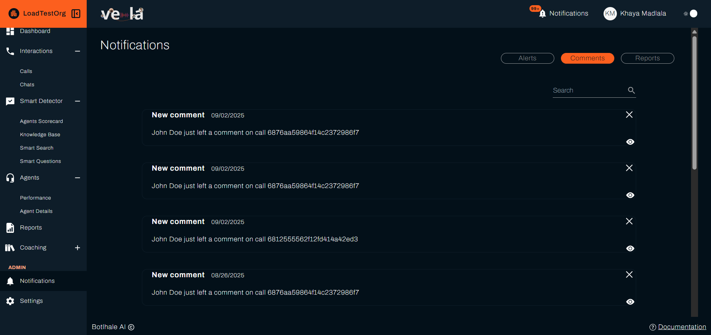
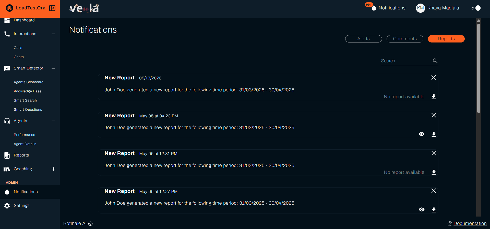
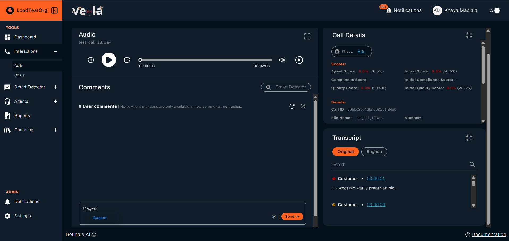
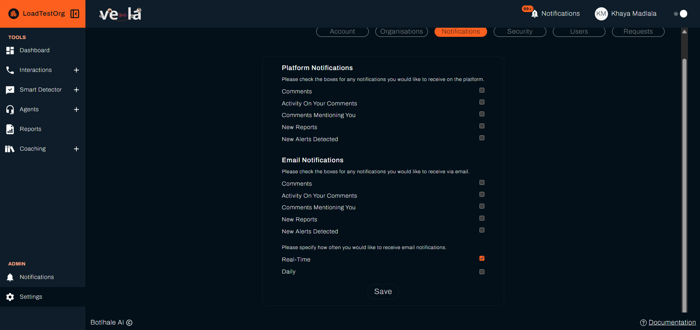

import Hotspots from '@site/src/components/Hotspots';
import notificationsPage from '@site/img/screenshots/notifications/notifications-tabs.png';

# Manage Notifications
Vela notifies you when something needs your attention. That might be a Smart Search or Smart Question alert, a comment on an interaction, or a report that has finished generating. Not all of them arrive in the same place. Some are email only, and some belong to the Agent Portal. This page covers what triggers a notification, where each notification arrives, and how to control what reaches you.

:::tip In short
By the end you will have worked through your notifications and chosen what reaches you, and how.

1. Select **Notifications** in the left sidebar and [open its **Comments** or **Reports** tab](#1-find-your-notifications), or **Alerts** on every version except [Lite](../reference/glossary.md#lite).
2. [Open the interaction behind each alert](#3-work-through-your-alerts) and act on it. For a Smart Search alert, select **Resolve** on its row in the interaction's **Alerts** tab.
3. [Tick what you want](#6-set-your-preferences) in **Settings → Notifications** and select **Save**.
:::

---

## Before You Begin

You need:

- **Something to be notified about.** Notifications follow activity, so a new organisation with nothing uploaded and no Smart Searches configured has an empty page rather than an error.
- **Your own preferences set.** What arrives, and by which route, comes from **Settings → Notifications** on your own account. Another user's settings do not affect yours.
- **A Smart Search with notifications on**, if you are expecting alerts. See [Set Up Smart Search](../smart-search-guide.md).

---

## 1. Find Your Notifications

### A. The Tabs

Select **Notifications** in the left sidebar. Three tabs sit at the top right of the page.

<Hotspots
  src={notificationsPage}
  alt="The Notifications page on the Alerts tab, with the Comments and Reports tabs beside it, the search box above the list, and each notification card carrying a dismiss cross and an eye icon"
  points={[
    { x: 67.2, y: 14.2, title: 'The Alerts, Comments, and Reports tabs', body: 'Alerts holds Smart Search matches and the Smart Question answers set to alert. Comments holds interaction comments. Reports holds finished reports, one-time or scheduled.' },
    { x: 74.5, y: 23.9, title: 'Search', body: 'Narrows the list by wording, matching both the heading and the body of a notification. Matches are highlighted.' },
    { x: 41.7, y: 31.2, title: 'A notification', body: 'Each shows a heading, how long ago it arrived, and a line of detail.' },
    { x: 84.9, y: 31.2, title: 'The dismiss cross', body: 'Takes the notification off the list for good. Nothing it pointed at is lost, and you still reach that through Interactions, Smart Detector, or Reports.' },
    { x: 84.9, y: 39.2, title: 'The eye icon', body: 'Opens what the notification is about: the interaction on Alerts and Comments, the report itself on Reports.' },
  ]}
/>

The **Alerts** tab appears on every version except [Lite](../reference/glossary.md#lite), where the page opens on **Comments** instead.

Unread notifications are also indicated in the top navigation bar, so you can see at a glance whether anything new has arrived.

:::note The page lists unread notifications only
Once a notification is dismissed it leaves the list for good. There is no read or archived view to recover it from, so treat the page as a queue to work through rather than a history to search later.
:::

### B. Work a Notification

All three tabs have the same **Search** box, and every notification on them carries the same **eye** and **×** controls shown above.

Past one page, pagination sits at the foot of the list: **Previous** and **Next**, with **Page 1 of 2** between them.

{/* ENGINEERING (known bug, documented as intended): on vela origin/vela-fly and origin/main, app/(pages)/notifications/Issues.jsx:60 links every alert to /interactions/calls/${issue.ref.call}. A Smart Question alert's ref is the Call itself (vela-data origin/dev-hold lib/inference/engine.js createSmartQuestionNotifications, refModel "Call"), so ref.call is undefined and the eye icon opens /interactions/calls/undefined, confirmed on the live product. Workaround until fixed: open the interaction from Interactions, or from the Smart Questions Results tab. Raised as a product bug. Converted from a visible limitation 2026-10-08. */}

On the **Reports** tab there is also a download control beside the eye, so you can take a finished report straight from the notification without going to the Reports list. A report whose file is no longer available reads **No report available** in place of the link.

---

## 2. What Triggers a Notification

Each kind of notification arrives in its own place, so check the right one before treating a notification as missing. Every in-app alert reads **Alert Detected**, whatever raised it.

| What triggers it | When you receive it | Where it appears |
| :--- | :--- | :--- |
| A Smart Search match | A processed interaction matches one of your Smart Searches | **Alerts** tab |
| A Smart Question alert | A Smart Question returns the outcome you set it to alert on, under **Receive notifications when** | **Alerts** tab |
| A comment | Someone comments on an interaction your preferences cover | **Comments** tab |
| A finished report | A scheduled or one-time report has finished generating | **Reports** tab, for a report someone else created. Your own reports always arrive by **email** instead |
| A redaction decision | A request to view redacted information has been approved or declined | **Email**, to the person who raised it and to the administrators who process these requests. The outcome also shows on the request itself, under **Settings → Requests → Completed** |
| A processed call | A call you uploaded on its own has finished analysis, subject **Call analysis complete** | **Email only**, to the address you signed in with, whatever your preferences. There is no in-app notification for this |
| A processed batch | A bulk upload has finished analysis | **Email only**, a summary to users with **New Alerts Detected** ticked under email notifications, and to every user on the [Lite](../reference/glossary.md#lite) version, sent straight away whatever the frequency |
| A rescored interaction | You reassigned the agent on an interaction, and the AI has finished scoring it again, subject **Checklist Search Complete** | **Email only**, to the address you signed in with. There is no in-app notification for this |
| A course assignment | A training course has been assigned to you | **Agent Portal**, not the main platform |
| An award | An award has been presented to you | **Agent Portal**, not the main platform |

Course assignments and awards appear only for agents. For the rest, email delivery depends on your own preferences in **Settings → Notifications**, except where the table says otherwise.

---

## 3. Work Through Your Alerts

An alert is raised automatically when a processed interaction matches one of your Smart Searches, or when a Smart Question returns the outcome you set it to alert on. Each alert links to the interaction that raised it.

A practical routine for each alert:

1. Open the matched interaction from the alert.
2. Review the full context. The transcript and AI analysis show whether the match is a genuine issue.
3. Decide what it needs. A genuine issue usually warrants a coaching comment on the interaction. Where your organisation has the Coaching Portal, tag it **@agent** so it reaches the agent. A false match needs nothing further.
4. For a Smart Search alert, select **Resolve** on its row in the interaction's **Alerts** tab either way, so the interaction leaves the Smart Search's Returned Interactions list. Then, for any alert, select the cross on the notification to clear it from your list, so it holds only what you still have to look at.

:::tip Use alerts as your review queue
Rather than sampling interactions at random, work your alerts first. They are the conversations your own searches have identified as worth looking at.
:::

---

## 4. Control What Reaches You

Two switches decide whether an alert reaches you, and both have to be on. The search's own **Notifications** setting, covered here, decides whether its alerts raise notifications at all. Your **New Alerts Detected** preference, covered in [Set Your Preferences](#6-set-your-preferences), decides whether they reach you. Matches appear on the interaction and in the Smart Search results view either way.

Each Smart Search has a **Notifications** setting. Turn it on when you create the search, or change it later by editing the search.

:::tip Turning down the volume
A search generating more alerts than your team can act on has two fixes. Tighten its phrases so it matches less, or turn its Notifications off and review the matches in the results view instead.
:::

A Smart Question has the same **Notifications** setting, and one more. **Receive notifications when** takes a **Yes** or a **No**, and Vela alerts you only when the answer matches it.

Ask whether a customer mentioned a competitor, set it to **Yes**, and you hear about the calls where one was mentioned. The rest are answered and recorded as usual, without reaching you. See [Set Up Smart Questions](../smart-questions-guide.md#notifications).

For more on building searches, see [Smart Search](../smart-search-guide.md).

---

## 5. Comments and @ Mentions

Comments are how feedback reaches your agents, and the **@** mention is what shares a comment with them.

Type **@** in the comment box. The list offers **@agent** and the colleagues who can see the interaction, by name. A colleague you name gets a mention notification. Select **@agent** to share the comment with the agent. The comment then appears on that interaction in the agent's Agent Portal, where they can read it and reply. The agent is not notified, so they find it by opening the interaction. An untagged comment stays visible to team leads and never reaches the agent.

{/* VERIFIED 2026-10-01 on origin/main, origin/vela-fly, and origin/dev-hold: app/(pages)/interactions/calls/[id]/comments.js sets agent: true for @agent but creates no notification for the agent. The "New mention" notification matches profile names, and @agent stores the string "agent". Org-comment recipients exclude role "agent". Like and resolve notifications reach a comment's author only where notifications.platform.own_comments is set, which addUser never sets for an agent. Never seen on an agent account (user, 2026-10-01). */}

:::note Tagging the agent needs the Coaching Portal
The **@agent** option appears where your organisation has the Coaching Portal enabled, because a tagged comment reaches the agent in their Agent Portal. Without it, every comment stays visible to team leads only.
:::

Tagging the agent works in new comments only, as the panel itself notes. A reply in a thread that already tagged the agent is shared with them too. A reply raises **New reply** for colleagues with **Comments** ticked, and for the author of the comment replied to where they have **Activity On Your Comments** ticked. Anyone named in a reply gets a mention.

For writing and resolving comments, see [Review and Score Interactions](./quality-assurance-tools.md#b-comment-to-coach).

---

## 6. Set Your Preferences

Go to **Settings → Notifications**. Everything here applies to your own account only.

### A. Choose What You Receive

Two lists, **Platform Notifications** and **Email Notifications**, offer the same choices. Tick an item in both lists to receive it in Vela and by email, or in one list to receive it only there. Leave it unticked in both to stop receiving it.

| Setting | What it covers |
| :--- | :--- |
| **Comments** | Any comment added anywhere in your organisation |
| **Activity On Your Comments** | Replies and activity on comments you wrote |
| **Comments Mentioning You** | Comments where someone tagged you with **@** |
| **New Reports** | A report someone else created has finished generating. Your own reports always arrive by email |
| **New Alerts Detected** | A Smart Search matched an interaction, or a Smart Question returned the outcome it alerts on. One setting covers both |

**New Alerts Detected** appears in both lists on every version except [Lite](../reference/glossary.md#lite).

Likes and resolves on your own comments reach you only through **Activity On Your Comments**.

Select **Save** to apply your changes. Leaving the tab without saving discards them.

### B. Choose How Often Email Arrives

Below the two lists, choose how often email is sent. This applies to email only. Notifications appear in Vela as they happen whichever you pick.

- **Real-time**: each email is sent as the event happens.
- **Daily**: one email a day, gathering everything since the last one. Choosing this reveals a time picker, so you can set the hour it arrives.

Pick daily if alerts arrive faster than you act on them.

:::note The Notifications tab belongs to the Administrator and User roles
Agents have no notification settings of their own. Their Agent Portal carries an **account** and a **security** tab only.
:::

---

## Check Your Work

Open **Notifications** and confirm the tab you expect to use has entries in it. An empty tab is a result, not a fault: it means nothing of that type is waiting on you.

Selecting **Save** shows a confirmation message, and that message is what tells you the ticks were stored.

Testing an alert end to end takes one interaction. Upload an interaction you know matches a Smart Search that has notifications on, then check the **Alerts** tab once processing finishes. Alerts are raised during analysis, so one that has not appeared yet usually means the interaction is still being processed.

---

## Troubleshooting

| Problem | Solution |
| :--- | :--- |
| Too many notifications | **Comments** sends you every comment in the organisation, so untick it in **Settings → Notifications** if that is the source. For alerts, tighten the search's phrases or turn its **Notifications** off |
| Alerts not arriving | Two settings have to agree. Confirm **New Alerts Detected** is ticked in **Settings → Notifications**, and that the Smart Search has **Notifications** on with a scope covering the relevant teams |
| Comments not arriving | Check which comment settings you have ticked in **Settings → Notifications**. **Comments Mentioning You** covers only comments that tag you with **@** |
| Reports not arriving | Your own reports arrive by email, never on the **Reports** tab, so check your inbox and spam folder. For colleagues' reports, confirm **New Reports** is ticked in **Settings → Notifications**. Then check the schedule and that its date range contains data |
| Email missing, but notifications appear in Vela | Check the **Email Notifications** list in **Settings → Notifications**. On a daily frequency the email arrives at the time you set rather than as the event happens |
| A notification dismissed by mistake | Dismissing is final. Open the interaction or report directly instead, from **Interactions**, **Smart Detector**, or **Reports** |

---

## Related

- [Set Up Smart Search](../smart-search-guide.md): create the searches that raise alerts
- [Review and Score Interactions](./quality-assurance-tools.md): turn alerts into scored reviews and coaching
- [Generate Reports](./custom-reporting.md): create and schedule the reports you are notified about

## Need Help?

**Contact Support:** support@botlhale.ai
