# Review and Score Interactions
Vela analyses every customer interaction, so you review a full picture rather than a sample. This guide takes Team Leads and Administrators through reviewing interactions, scoring them, and giving agents feedback.

---

## Before You Begin

You need:

- **An interaction that has finished processing.** Vela analyses each call and chat after upload, and notifies you when the analysis is ready.
- **An Agent Scorecard covering the agent's team.** Without one, the interaction has nothing to be scored against and the Scorecard tab is empty. See [Build an Agent Scorecard](../agent-scorecard-guide.md), or [Scorecard and Scoring Issues](../support/troubleshooting-guide.md#scorecard-and-scoring-issues).
- **Access level**, covering the agent. See [Access Level](../reference/glossary.md#access-level).
  - **Organisational**: every agent in the organisation.
  - **Departmental**: the agents in your department.
  - **Team**: the agents in your immediate team.

---

## 1. Prioritise Interactions for Review

Use Smart Search alerts, Dashboard metrics, and the interaction filters to focus on the conversations that matter most. For how often to review and how much to cover, see [Daily and Weekly QA Workflows](../advanced/best-practices.md#daily-and-weekly-qa-workflows).

### A. Review Smart Search Alerts

A Smart Search flags interactions that match the example phrases you gave it, by meaning rather than by exact wording. These are your first priority, because your own searches raised them rather than chance.

1.  Navigate to **Smart Detector** → **Smart Search**.
2.  Review the flagged interactions for each search.

:::tip Try it: put the busiest searches first
1. Select **Sort By**.
2. Choose **Descending**.
3. Sort on **Results**.
4. Select **Save Changes**.

The searches with the most matches move to the top, so you start where the volume is.
:::

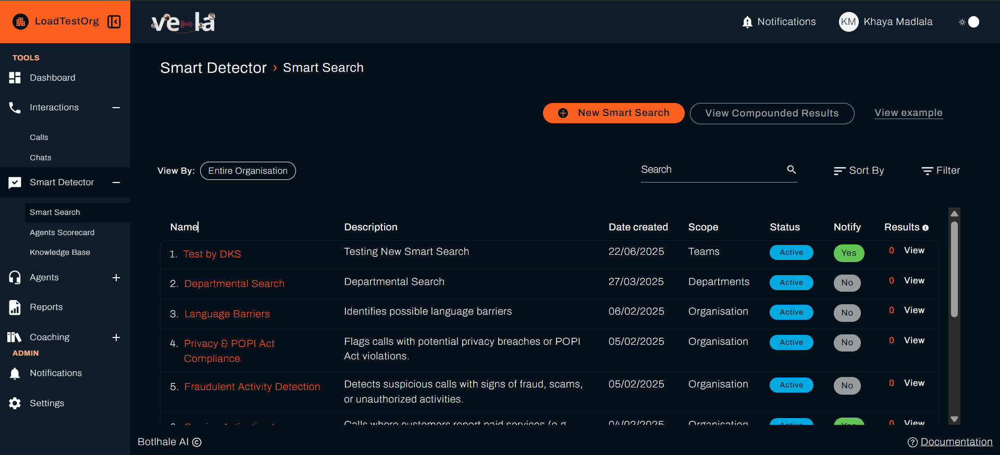

:::tip Cover your compliance terms first
A Smart Search checks every processed interaction, so compliance terms are worth setting up before anything else. They help you identify potential compliance violations without relying on manual reviews or sampled calls.
:::

### B. Use Dashboard Metrics

The Dashboard shows how your teams and agents are scoring over the period you select. It reports the figures and does not judge them, so read them against the standard your organisation expects.

1.  Go to the **Dashboard**.
2.  Check **Agent Scores Distribution** to see how scores are spread, and how many agents sit in the red band below the Lower Bound your administrator set. See [Score Boundaries](../reference/glossary.md#score-boundaries).
3.  Check **Sentiment Distribution**, in the **Customer Sentiment** group, for a rising negative share, and **No. Alerts** for a high volume of Smart Search matches. Either can point to a problem that is systemic rather than individual.

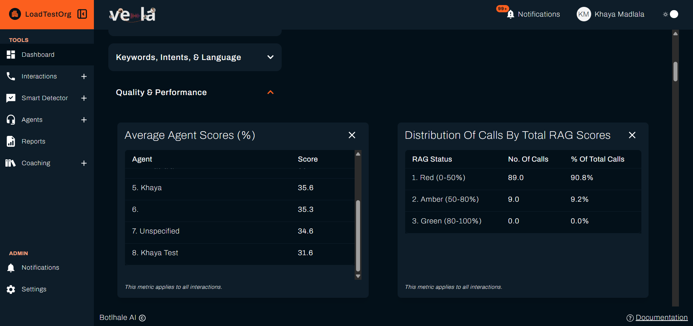

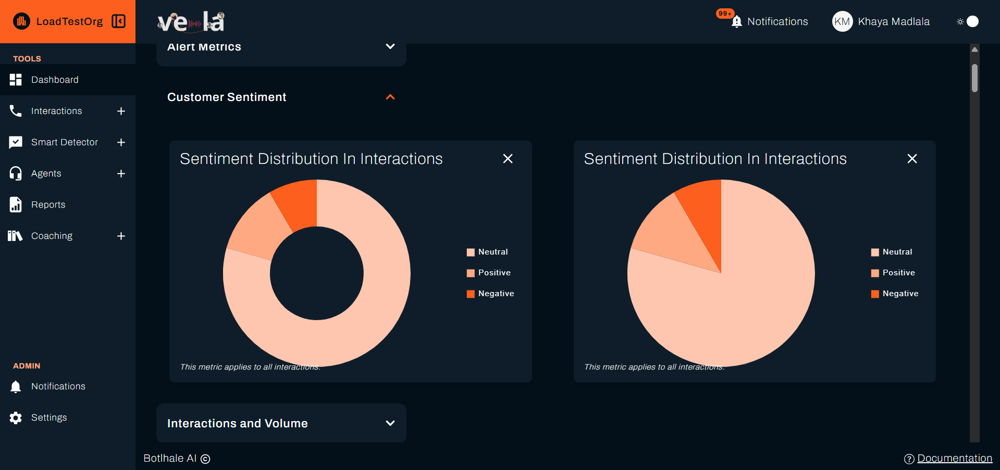

### C. See Where Your Volume Is

Selecting **Interactions** in the sidebar opens a page with a **Calls** card and a **Chats** card, and an **Interactions Distribution** section below them. Set a date range there to see **Calls by Department** and **Chats by Department**, each showing the department, its total, its percentage of all interactions, and a daily average.

Read it before you decide where to spend review time. A department carrying most of your volume deserves proportionate review, and a channel that has grown since you last looked is usually where unreviewed interactions are piling up.

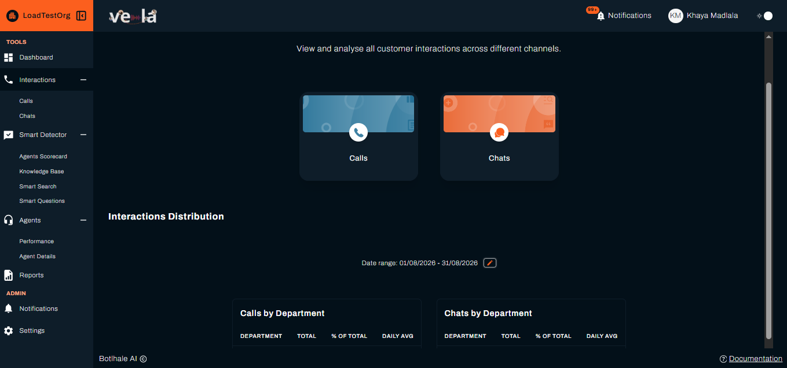

### D. Read the Interactions List

Go to **Interactions**, then **Calls** or **Chats**. The list itself tells you enough to prioritise before you open anything:

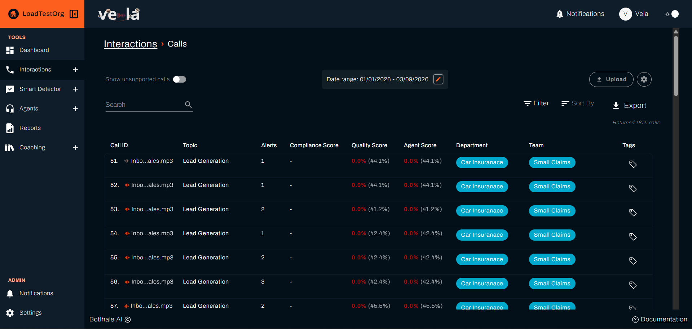

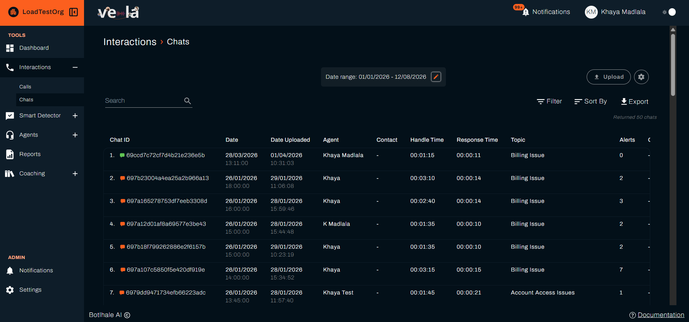

The two lists work the same way, with columns suited to the channel. Chats carry **Contact** and **Response Time** where calls carry **Silent Time**, because the rest needs call audio.

* **Handle and silent time:** the length of the conversation and any significant silent gaps.
* **Agent, compliance, and quality scores:** the scores Vela assigned to the interaction. The compliance and quality scores split the scorecard into its compliance items and everything else. See [Quality & Performance](../reference/metrics.md#quality--performance).
* **Alerts:** how many Smart Searches the interaction triggered.
* **Topic and tags:** what the conversation was about.

:::tip Choose your columns
Not every column is shown by default. Select the settings icon next to **Upload** on the Interactions list to choose which appear. The full set is:

Call ID, Date, Date Uploaded, Agent, Handle Time, Silent Time, Topic, Alerts, Compliance Score, Quality Score, Agent Score, Department, Team, and Tags.

Your choice is remembered per browser, so each machine keeps its own. The Alerts column appears on every edition except [Lite](../reference/glossary.md#lite).
:::

### E. Filter Interactions Directly

Filter the list of all interactions to find specific examples based on performance data.

1.  Go to **Interactions** (Calls or Chats).
2.  Select **Filter** and set any of the options in the **Filter By** modal:
    * **Agent Score:** filter for a score range, for example the lowest performers.
    * **Agent, Team, or Department:** focus reviews on the people you are coaching.
    * **Reviewed:** show everything, only interactions already marked as reviewed, or only those not marked as reviewed.

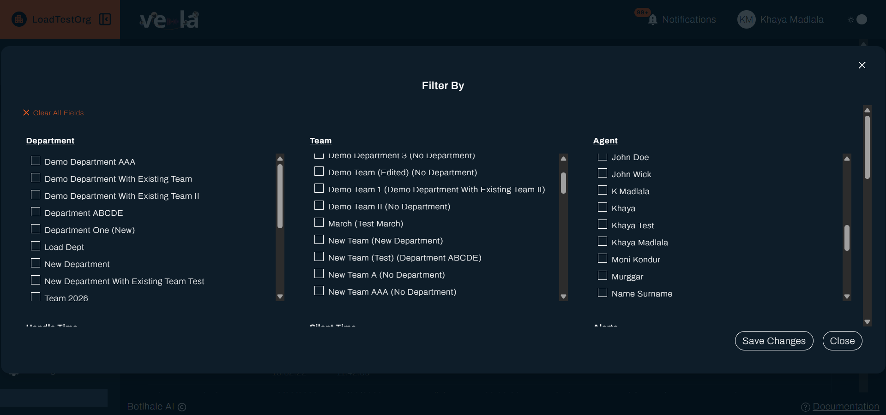

---

## 2. Review and Analyse the Interaction

Once you have selected an interaction, the **Detailed View** gives you everything you need to assess it.

### A. Open the Detailed View

1.  Open the interaction from one of the places that link to it:
    * The **Interactions** list, under Calls or Chats.
    * The **Returned Interactions** section of a Smart Search's results.
    * A **Notifications** entry, where an alert or a comment links to the interaction it came from.

    The Dashboard does not link to individual interactions. Use it to spot which agents or teams need attention, as in [Use Dashboard Metrics](#b-use-dashboard-metrics) above, then find their interactions from one of the routes here.

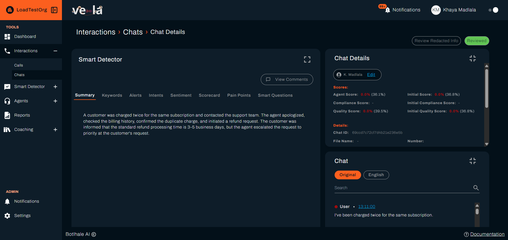

### B. Use the AI Analysis

Vela has already analysed the interaction by the time you open it. Its findings sit under the **Smart Detector** panel, one tab each, and reading them first tells you where to spend your attention.

| Tab | What it shows | What to look for |
| :--- | :--- | :--- |
| **Summary** | A recap of what happened and how it ended. | Whether the agent resolved the customer's query, and whether the outcome was stated clearly before the conversation closed. |
| **Keywords** | Tracked terms that came up. | Whether your mandatory phrases were said, and whether products and policies were named correctly. |
| **Alerts** | Which Smart Searches this interaction matched, with links to the moment and a **Resolve** control on each row. | Whether the flagged moment holds up once you read it in context. If a search keeps matching interactions it should not, tell your administrator so its phrases can be tightened. |
| **Intents** | What the customer came for, such as sales, a complaint, or support. | Whether the agent handled it as that kind of conversation, for example following the complaints process when the intent is a complaint. |
| **Sentiment** | The positive, neutral, and negative split for the conversation, shown for the agent and the customer separately. | A high negative share on the customer's side, and whether the agent's own tone held steady. Use the transcript timestamps to find where it turned. |
| **Scorecard** | How Vela scored the interaction against your Agent Scorecard, question by question. | Any item you would have judged differently. Hover over the information icon beside a score to read why Vela answered as it did. This is the tab where you override an item, in [Score and Provide Feedback](#3-score-and-provide-feedback) below. |
| **Pain Points** | Signs of customer frustration. | Whether each frustration was acknowledged when it was raised, rather than left unanswered. |
| **Smart Questions** | The answers to any questions your organisation asks of every interaction for reporting. These carry no score. | Answers that change how you would coach, even though they do not move the score. The information icon here shows Vela's reasoning too, and the download icon saves the answers as CSV (**Download Smart Questions as CSV**). This tab appears on plans that include [Smart Questions](../smart-questions-guide.md). |

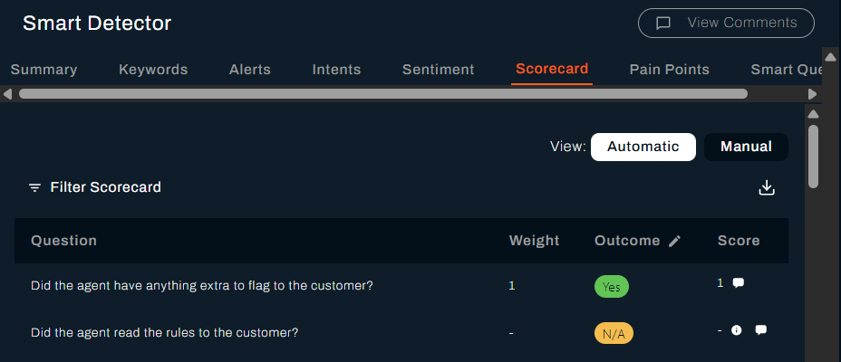

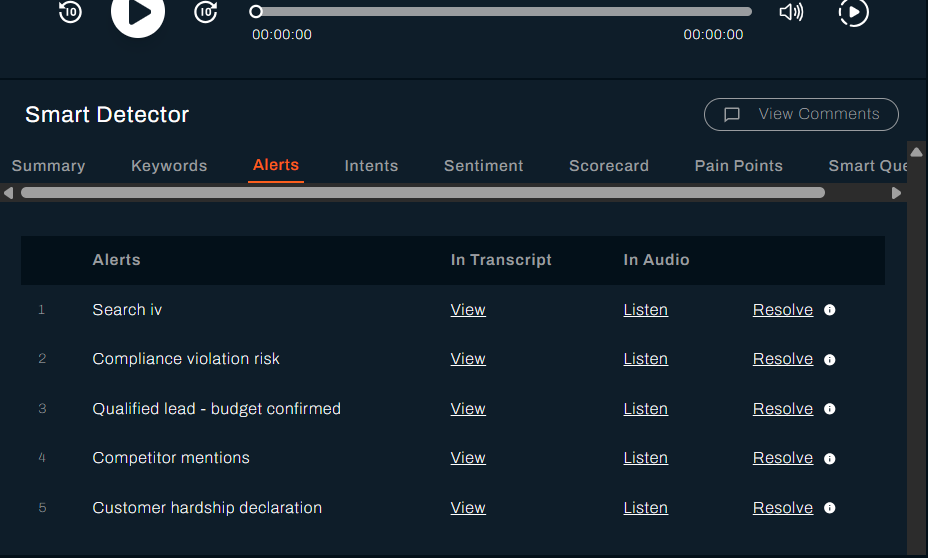

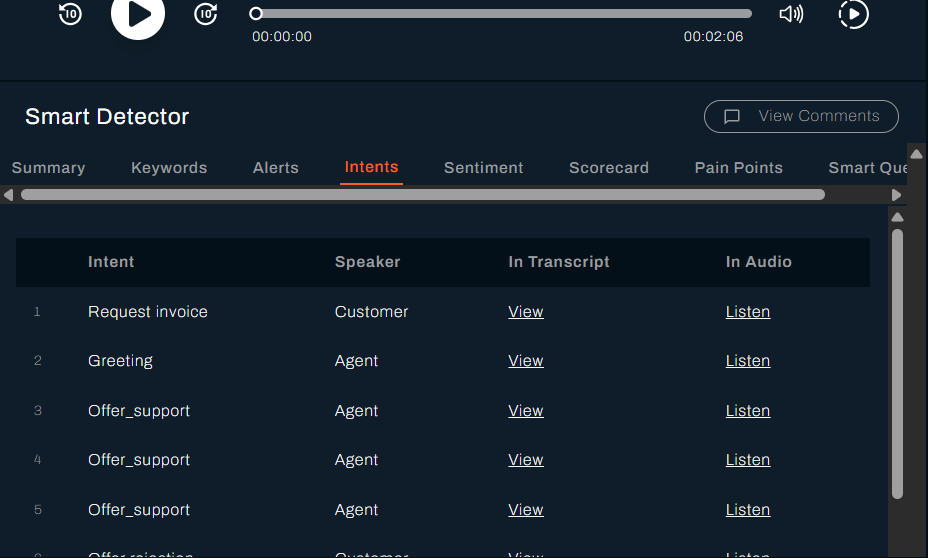

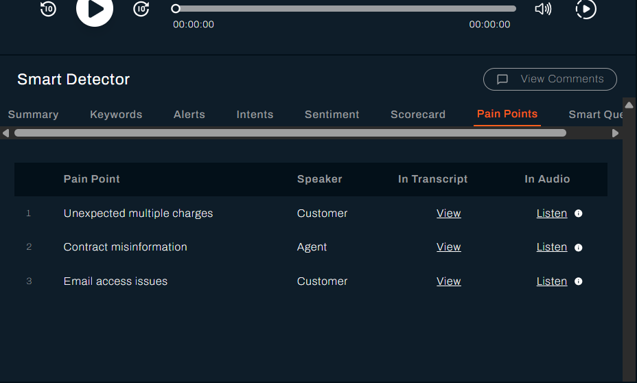

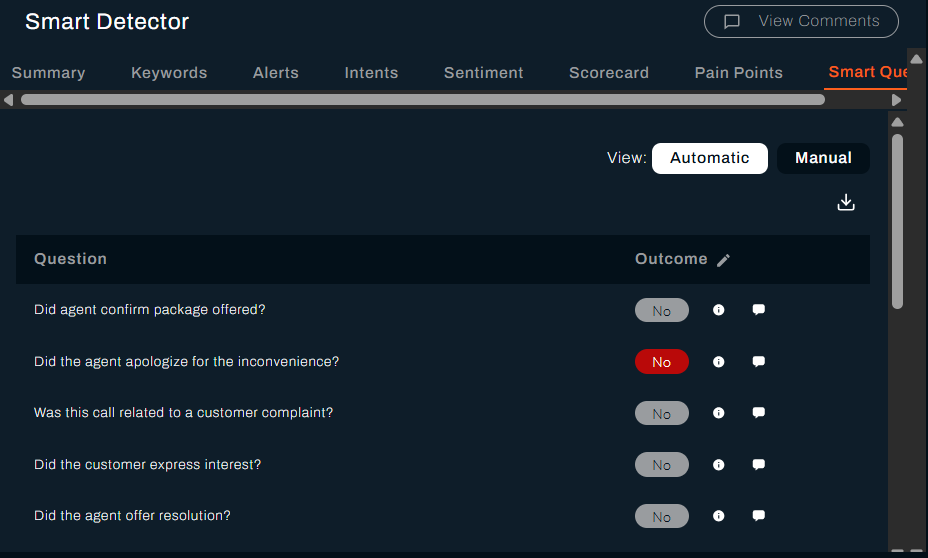

On the **Alerts** tab, two columns take you straight to the moment the alert refers to:

* **In Transcript**: select **View** to scroll the transcript to the line that triggered the alert.
* **In Audio**: select **Listen** to move the player to that second, so you can hear the exchange rather than infer it from a phrase. On a chat this column reads **In Chat**.

Where no timestamp was recorded for a match, both columns read `-`.

Select **Resolve** once you have acted on the alert. The row then reads **Resolved**.

A tab with nothing to show says so, for example `No alerts detected in call` or `No pain points detected in call`. Vela analysed the interaction and found nothing of that kind in it.

The tab strip scrolls, so use the arrows at either end if a tab is out of view.

### C. Listen to the Call or Read the Chat

The player and the transcript follow each other. As the audio plays, the transcript scrolls to keep the current line in view, and selecting a line's timestamp moves the player to that point.

1.  Listen to the **Audio** or read the **Chat Transcript**.
2.  Use the **Playback Speed** control to review calls efficiently. Available rates are 0.5x, 0.75x, 1x, 1.25x, 1.5x, and 2x.
3.  Select a **timestamp** in the transcript to jump to that moment in the recording.
4.  Switch the transcript between **Original** and **English** when the conversation was not in English. Vela translates every interaction to English as it processes it.

While you listen, attend to the agent's tone, whether they listened actively, and whether they followed procedure.

Transcription covers all 11 official South African languages: Afrikaans, English, isiNdebele, isiXhosa, isiZulu, Sesotho (Southern Sotho), Sepedi (Northern Sotho), Setswana, siSwati, Tshivenda, and Xitsonga. Speakers are separated automatically, so agent and customer turns are distinguishable in the transcript.

Chats carry the same analysis as calls. Vela reports average response time on them, in place of the measures that need call audio. See [Metrics](../reference/metrics.md).

---

## 3. Score and Provide Feedback

Your manual scorecard and comments are the core of the quality process, turning the analysis into coaching the agent can act on.

The Scorecard tab has a **View** control with two settings. **Automatic** is Vela's own assessment of the interaction, judged against a Knowledge Base document on any question set to use one. **Manual** is yours. Where the two differ, your outcome is the one that counts, and both stay visible so an agent can see which is which.

### A. Complete a Manual Scorecard

Vela's assessment gives you a base score. You make the final judgement.

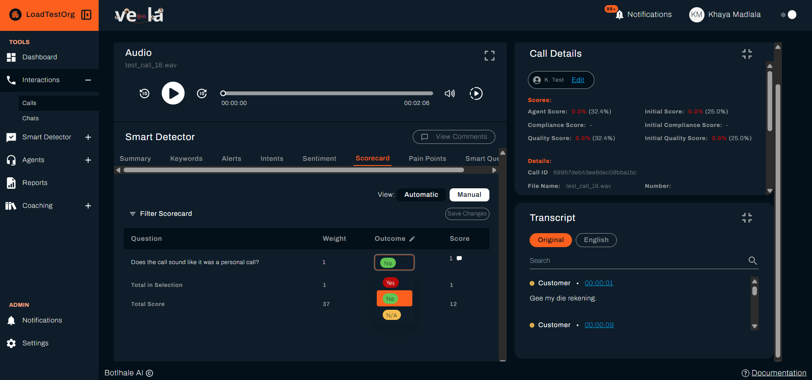

1.  On the Detailed View, open the **Scorecard** tab in the Smart Detector panel.
2.  Switch **View** between **Automatic** and **Manual** to find the item you want to change.
3.  Read why Vela answered as it did before you change anything. Hover over the information icon beside an item's score to see its reasoning for that question. Check that reasoning against the transcript: the AI having missed context is the case for overriding, and the AI being right is the case for leaving the score and coaching instead.
4.  Select the **edit icon** (pencil) to enter edit mode.
5.  Set the **Outcome** for each item to **Yes**, **No**, or **N/A**, using your judgement.
    * **N/A removes the question from the score** rather than counting it as a failure, so use it where the question did not apply to this conversation. The difference is large: see [How Scoring Works](../explanation/how-scoring-works.md) for a worked example.
6.  Select **Save Changes**.
    * Your edited outcome replaces the AI's for that item, and the score is recalculated.

:::note Overriding an item hides its reasoning
The information icon appears only on items Vela answered itself. Once you override an item, the icon goes from that row, because the reasoning explained the AI's answer rather than yours. Read it before you override, and put anything worth keeping into a comment. The scorecard download still carries the reasoning for every item you left as it was.
:::

The **Call Details** panel keeps **Initial Score**, **Initial Compliance Score**, and **Initial Quality Score** beside the current ones, so Vela's original assessment stays visible next to your override.

:::tip If you are overriding the same question every week
A question you keep correcting in the same direction is usually a question that needs rewording, not an AI that keeps getting it wrong. Take it back to whoever maintains the scorecard rather than fixing it one interaction at a time. See [How Scoring Works](../explanation/how-scoring-works.md).
:::

For the same record question by question, use the download icon on the Scorecard tab (**Download Scorecard as CSV**). The file lists each question with its **Initial Outcome**, **Current Outcome**, weight, score, and the reason Vela gave, which is what you need when an agent disputes a score.

#### Narrow a Long Scorecard

**Filter Scorecard**, above the table, opens **Filter Scorecard By**. Tick the categories you want and select **Apply**, or **clear all fields** to go back to everything. On a long scorecard this lets you review one category at a time.

The table then carries two totals, and they are not the same figure:

| Row | What it counts |
| :--- | :--- |
| **Total in Selection** | Only the categories you filtered to |
| **Total Score** | Every question on the interaction, whatever the filter |

**Total Score** is the agent's score for the interaction. **Total in Selection** is there to help you read the categories in front of you, so **Total Score** is the figure to use when you discuss the result with an agent.

#### Comment Straight from a Question

Each row has a comment icon beside its score. Select it and the **Comments** panel opens with that question and its outcome already written in, ready for you to add the coaching point.

This is quicker than retyping the question, and it keeps the agent's feedback tied to the exact scorecard item it came from.

### B. Comment to Coach

Add specific, time-stamped feedback to make coaching clear and concrete.

1.  Select **View Comments** on the interaction to open the panel.
2.  Add your comment. Remember the best practices:
    * **Be specific:** "At 1:45, you missed the required closing statement."
    * **Be constructive:** "Try to summarise the solution before ending the call next time."
    * **Tag the agent:** type `@` and pick them from the list. Without the tag the comment stays visible to team leads only.
3.  The agent can read and respond to your comments in their Agent Portal.
4.  Select **Mark as Resolved** on a comment or reply once the point has been dealt with. It then reads **Resolved by** your name. This closes that comment only, so an alert on the same interaction stays open until you select **Resolve** on it.

:::warning A posted comment is final
Comments cannot be edited or deleted once sent. Read yours back before selecting **Send**, particularly where you have tagged the agent. The delete icon beside the reply box clears what you have typed, not a comment already posted.
:::

---

## 4. Close the Review and Plan Coaching

### A. Track Review Status

Marking an interaction reviewed is what tells the rest of Vela you are done with it.

* Select **Mark as Reviewed** to record that you have finished assessing this interaction. This drives the **Reviewed** filter on the Interactions list and the reviewed-interaction metrics on your Dashboard, so your team can see review coverage at a glance. See [Reviewed Interactions](../reference/metrics.md#reviewed-interactions).
* If follow-up is needed, add coaching comments for the agent.

:::note Reviewing can be what releases the interaction to the agent
Organisations using the Coaching Portal choose, under **Coaching → Preferences → Agent View Permissions**, whether agents see all their interactions or only the reviewed ones. Where it is set to reviewed only, an agent sees nothing of a conversation until someone marks it as reviewed, so an unreviewed backlog is invisible coaching.
:::

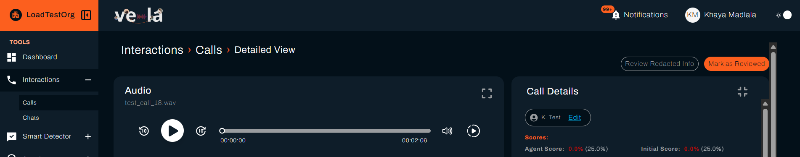

### B. Tag the Interaction

Tags are your own labels for classifying interactions, and they are what you filter and report on later. Give one to anything you want to find again as a group, such as every call about a failed delivery.

You can tag without opening an interaction. The **Tags** column on the Interactions list carries a tag icon on every row, reading **Add a tag** when you hover it. The same control sits on the **Tags** line of the **Call Details** panel in the Detailed View. Both open the same window, and both work for calls and chats.

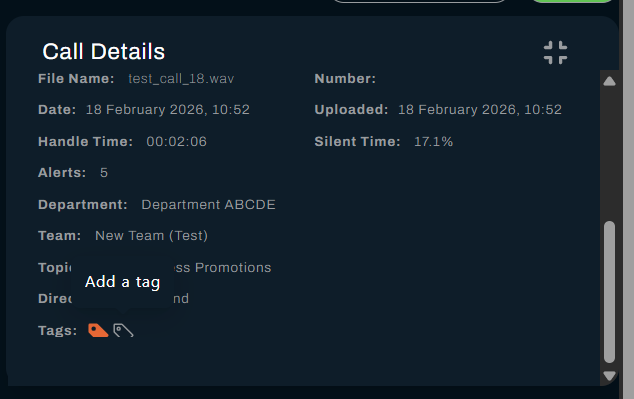

1. Select the tag icon to open **Edit Tags**.
2. On **Select a Tag**, pick one from the list. To make a new one, switch to **Create a Tag**, type the name, and give it a colour. Both are required.
3. Select **Add Tag**, or **Discard** to abandon it.

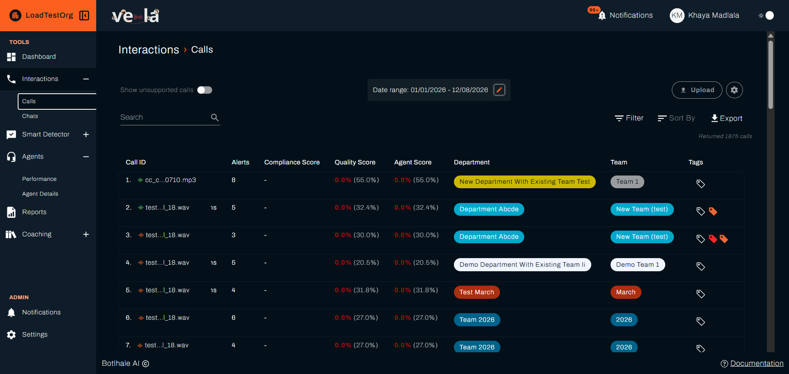

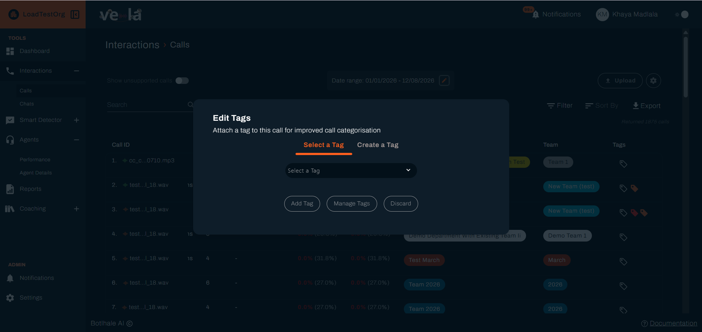

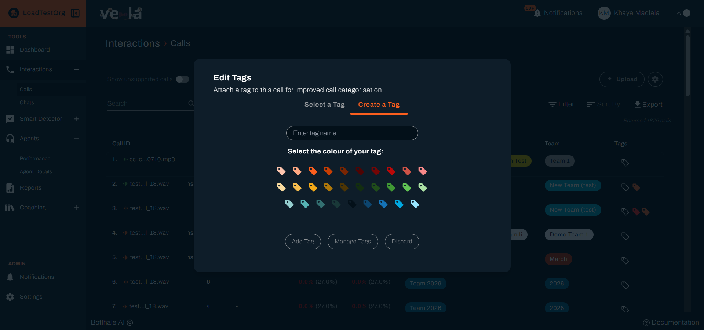

Tags already on an interaction appear beside the icon, and each one can be removed from there.

:::tip Tag from the list when working through a batch
Tagging from the **Tags** column lets you classify a whole screen of interactions without opening any of them. The settings icon beside **Upload** adds the column.
:::

Tags belong to the organisation rather than to you, so one you create is available to everyone and appears in their filters too. Agree a small set with your team before everyone invents their own wording for the same thing.

#### Managing the Tag List

**Manage Tags**, on the **Edit Tags** window, opens the organisation's tag list in a new browser tab. From there you can add a tag with **New Tag**, change a tag's name or colour with **Edit Tag**, and remove one with **Delete Tag**.

Both editing and deleting reach further than the list, so treat them as organisation-wide changes rather than tidying:

| Action | What happens to interactions already tagged |
| :--- | :--- |
| **Delete Tag** | The tag is stripped from every interaction carrying it, in one go. There is no undo, and no warning that says how many are affected |
| **Edit Tag** | The list shows the new name, but interactions keep the name they were tagged with. The filter offers only the new name, which now matches nothing, so those interactions can no longer be found by tag |

Renaming therefore loses you the interactions rather than relabelling them. The **Tags** filter builds its options from the organisation's list, so after a rename it offers the new name and matches nothing, while the old name it would match is no longer on the list to select.

To change a tag's wording safely, create the tag you want, apply it to the interactions concerned, and delete the old one once nothing depends on it.

**To manage the list**, select **Manage Tags** in the same window, which opens the Tags page in a new tab. It is not in the sidebar, so this is how you reach it. The page lists every tag by **Name**, each with its colour, and gives you **New Tag**, **Edit**, and **Delete**.

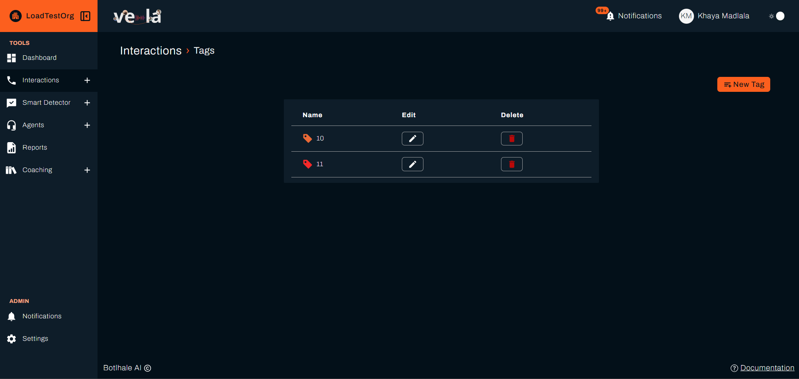

**New Tag** on that page opens its own window, where you name the tag and pick its colour from the swatches before selecting **Create Tag**.

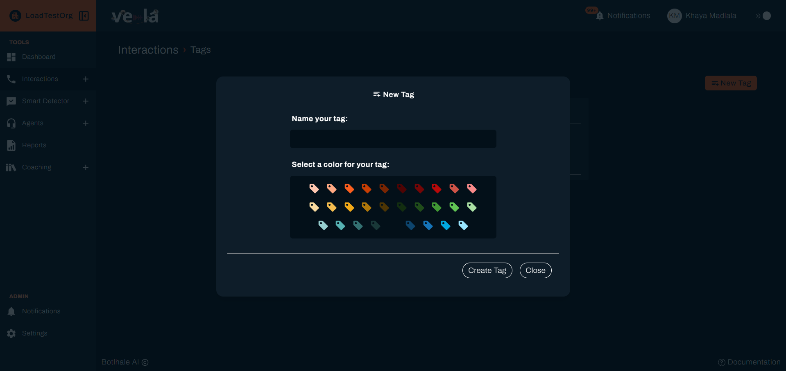

Deleting a tag takes it off every interaction carrying it, and the page does not tell you how many that is. Vela refuses duplicate names, so renaming a tag to something clearer is the safer move when the wording is the problem.

### C. Plan Next Steps

One weak interaction is not a pattern. Before acting, read the agent's recent scorecards and comments together and look for the same category scoring low more than once.

Where you find one, select **Coaching** in the left sidebar, which appears only if your organisation has the Coaching Portal enabled, and create a course whose trigger score range covers that gap. Vela assigns courses on its evaluation cycle, so you set the range rather than picking the agent.

A course is not a substitute for the conversation. Arrange time with the agent to go through the feedback and what you expect to change.

---

## Check Your Work

Your scoring, your comment, and the reviewed flag all live on the interaction itself, so that is the only place to check them. Open it again and confirm three things:

- **The Scorecard tab shows an outcome on every applicable question**, with your overrides in place and the score recalculated. Vela's original figures remain beside yours as **Initial Score**, **Initial Compliance Score**, and **Initial Quality Score**.
- **Your comment is on the interaction**, and the agent is tagged if you meant to notify them. A comment cannot be edited or deleted afterwards, so read it back rather than reposting.
- **The interaction is marked as reviewed.** Your team's review coverage counts the interactions you mark, so marking is what makes the work visible.

If you meant to notify the agent and the tag is missing, add a second comment with the tag rather than editing the first, which cannot be changed.

---

## Related

- [Build an Agent Scorecard](../agent-scorecard-guide.md): create and edit the questions behind these scores
- [Set Up Smart Search](../smart-search-guide.md): build the searches that flag interactions for review
- [Monitor Agent Performance](./monitor-agent-performance.md): track how an agent's scores move over time
- [Scorecard Fields](../reference/scorecard-fields.md): every field on a scorecard question
- [How Scoring Works](../explanation/how-scoring-works.md): how weights, auto-fail, and overrides produce the score
- [Troubleshooting: Scorecard and Scoring Issues](../support/troubleshooting-guide.md#scorecard-and-scoring-issues): a missing scorecard, a score that looks wrong, or criteria changes that did not apply

## Need Help?

**Contact Support:** support@botlhale.ai