import Hotspots from '@site/src/components/Hotspots';
import detailedView from '@site/img/screenshots/calls/calls-3.png';

# Review and Score Interactions
Vela analyses every customer interaction, so you review a full picture rather than a sample. This guide takes Team Leads and Administrators through reviewing interactions, scoring them, and giving agents feedback.

:::tip In short
By the end you will have reviewed an interaction, scored it against your Agent Scorecard, and left feedback the agent can act on.

1. [Find what to review](#1-prioritise-interactions-for-review) through Smart Search alerts, the **Dashboard**, and the **Interactions** list.
2. Open the **Detailed View** and [read the **Smart Detector** tabs](#2-review-and-analyse-the-interaction).
3. [Score or override the **Scorecard**](#3-score-and-provide-feedback), then comment to coach the agent, tagging **@agent** where your organisation uses the Coaching Portal.
4. [Select **Mark as Reviewed**](#4-close-the-review-and-plan-coaching) to close the review.
:::

---

## Before You Begin

You need:

- **An interaction that has finished processing.** Vela analyses each call and chat after upload, and notifies you when the analysis is ready.
- **An Agent Scorecard covering the agent's team.** Without one, the interaction has nothing to be scored against and the Scorecard tab is empty. See [Build an Agent Scorecard](../agent-scorecard-guide.md), or [Scorecard and Scoring Issues](../support/smart-detector-issues.md#scorecard-and-scoring-issues).
- **Access level**, covering the agent. See [Access Level](../reference/glossary.md#access-level).
  - **Organisational**: every agent in the organisation.
  - **Departmental**: the agents in your department.
  - **Team**: the agents in your immediate team.

---

## 1. Prioritise Interactions for Review

Use Smart Search alerts, Dashboard metrics, and the interaction filters to focus on the conversations that matter most. For how often to review and how much to cover, see [Daily and Weekly QA Workflows](../advanced/best-practices.md#running-qa).

### A. Review Smart Search Alerts

A Smart Search flags interactions that match the example phrases you gave it, by meaning rather than by exact wording. These are your first priority, because your own searches raised them rather than chance.

1.  Navigate to **Smart Detector → Smart Search**.
2.  Select **View** in a search's **Results** column, and review the interactions under **Returned Interactions**.

:::tip Try it: put the busiest searches first
1. Select **Sort By**.
2. Choose **Descending**.
3. Sort on **Results**.
4. Select **Save Changes**.

The searches with the most matches move to the top, so you start where the volume is.
:::

:::tip Cover your compliance terms first
A Smart Search checks every processed interaction, so compliance terms are worth setting up before anything else. They help you identify potential compliance violations without relying on manual reviews or sampled calls.
:::

### B. Use Dashboard Metrics

The Dashboard shows how your teams and agents are scoring over the period you select. It reports the figures and does not judge them, so read them against the standard your organisation expects.

1.  Go to the **Dashboard**.
2.  Check **Distribution of Calls by Total RAG Scores** to see how many calls sit in the red band below the Lower Bound your administrator set. It counts calls, not agents. See [Score Boundaries](../reference/glossary.md#score-boundaries).
3.  Check **Sentiment Distribution in Interactions**, in the **Customer Sentiment** group, for a rising negative share, and **Total Number of Alerts** for a high volume of Smart Search matches. Either can point to a problem across the team rather than one agent.

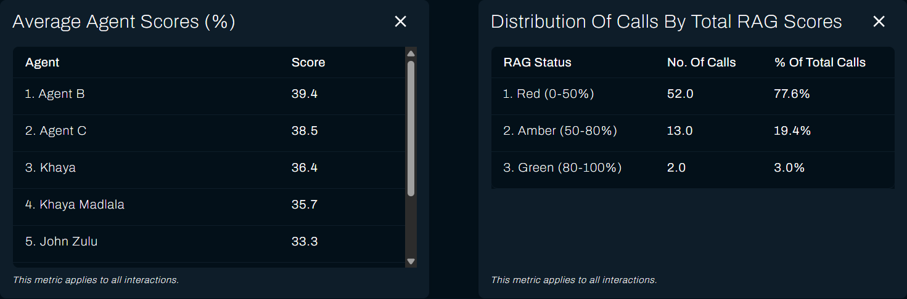

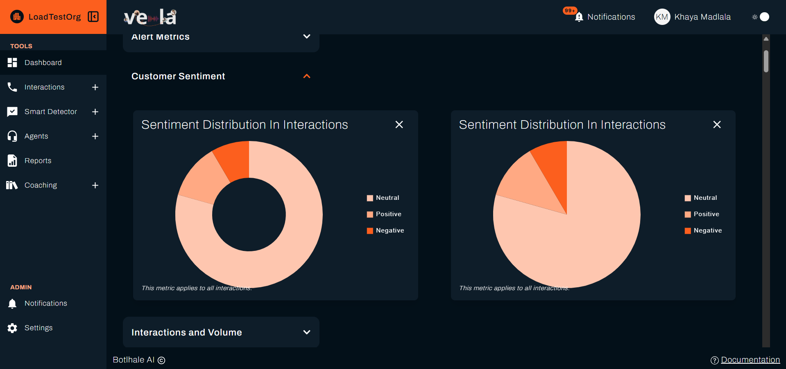

### C. See Where Your Volume Is

Selecting **Interactions** in the sidebar opens a page with a **Calls** card and a **Chats** card, and an **Interactions Distribution** section below them. Set a date range there to see **Calls by Department** and **Chats by Department**, each showing the department, its total, its percentage of all interactions, and a daily average.

Read it before you decide where to spend review time. A department carrying most of your volume deserves proportionate review, and a channel that has grown since you last looked is usually where unreviewed interactions are piling up.

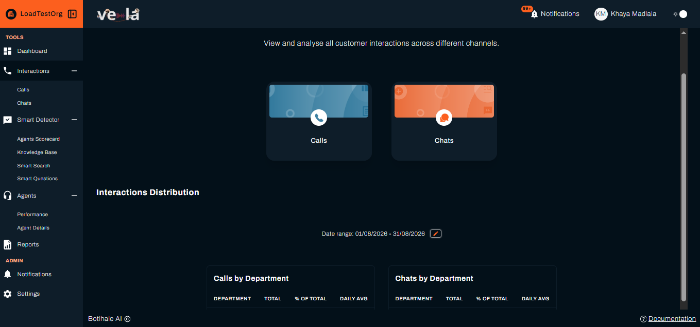

### D. Read the Interactions List

Go to **Interactions**, then **Calls** or **Chats**. The list itself tells you enough to prioritise before you open anything:

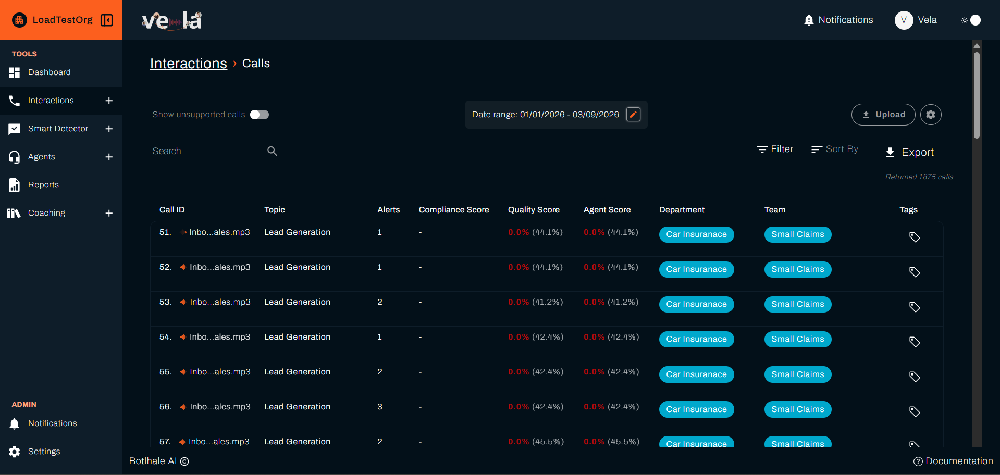

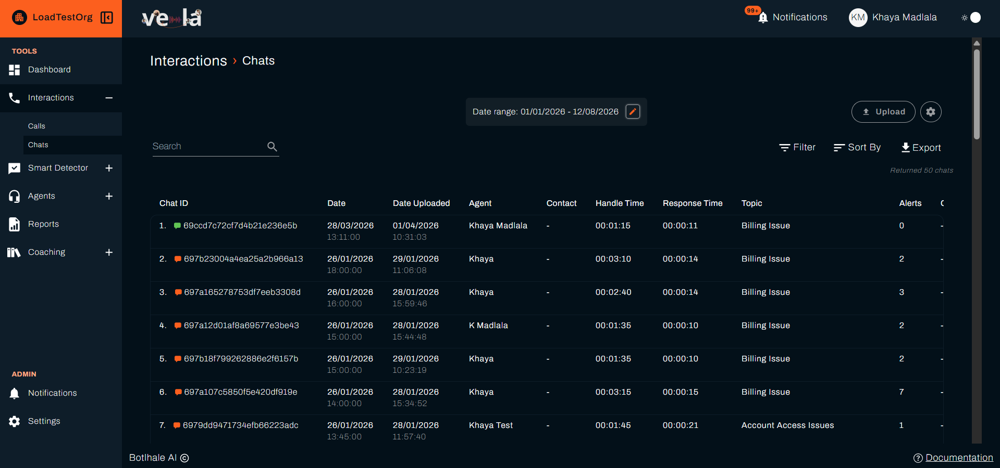

The two lists work the same way, with columns suited to the channel. Chats carry **Response Time** where calls carry **Silent Time**, because silent time needs call audio. Both lists can show **Contact**. {/* Calls Contact column: vela origin/vela-fly interactions/calls/page.jsx headings (commit 1b6e9b92, add number search), not on origin/main. Confirm on screen at the next reshoot. */}

* **Handle and silent time:** the length of the conversation and any significant silent gaps.
* **Agent, compliance, and quality scores:** the scores Vela assigned to the interaction. The compliance and quality scores split the scorecard into its Compliance Questions and everything else. See [Quality & Performance](../reference/metrics.md#quality--performance).
* **Alerts:** how many Smart Searches the interaction triggered.
* **Topic and tags:** what the conversation was about.

:::tip Choose your columns
Not every column is shown by default. Select the settings icon next to **Upload** on the Interactions list to choose which appear. The full set is:

Call ID, Date, Date Uploaded, Agent, Contact, Handle Time, Silent Time, Topic, Alerts, Compliance Score, Quality Score, Agent Score, Department, Team, and Tags.

Your choice is remembered per browser, so each machine keeps its own. The Alerts column appears on every version except [Lite](../reference/glossary.md#lite).
:::

:::note The list hides unsupported calls by default
Turn on **Show unsupported calls**, at the top left of the list, to include older calls that earlier releases of Vela could not transcribe.
:::

### E. Filter Interactions Directly

Filter the list of all interactions to find specific examples based on performance data.

1.  Go to **Interactions** (Calls or Chats). The **Date range** at the top of the list, with its own pencil icon, scopes the whole list to a period. It is separate from the date fields inside Filter By below.
2.  Select **Filter** and set any of the options in the **Filter By** modal, among them:
    * **Agent Score:** filter for a score range, for example the lowest performers.
    * **Agent, Team, or Department:** focus reviews on the people you are coaching.
    * **Reviewed:** show everything, only interactions already marked as reviewed, or only those not marked as reviewed.
    * **Call date** and **Upload date:** two separate date fields, for when the interaction happened and for when it was added to Vela. Neither is the **Date range** control at the top of the list.
    * Department, team, alerts, tags, direction, topic, and handle or silent time are also available.

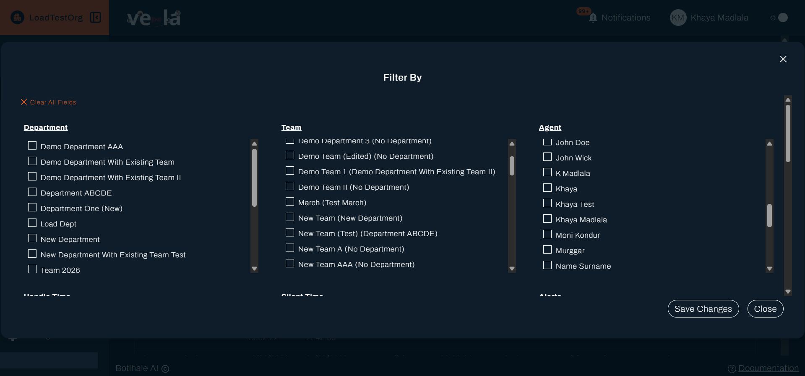

---

## 2. Review and Analyse the Interaction

Once you have selected an interaction, the **Detailed View** gives you everything you need to assess it.

### A. Open the Detailed View

1.  Open the interaction from one of the places that link to it:
    * The **Interactions** list, under Calls or Chats.
    * The **Returned Interactions** section of a Smart Search's results.
    * A **Notifications** entry, where an alert or a comment links to the interaction it came from.

    The Dashboard does not link to individual interactions. Use it to spot which agents or teams need attention, as in [B. Use Dashboard Metrics](#b-use-dashboard-metrics) above, then find their interactions from one of the routes here.

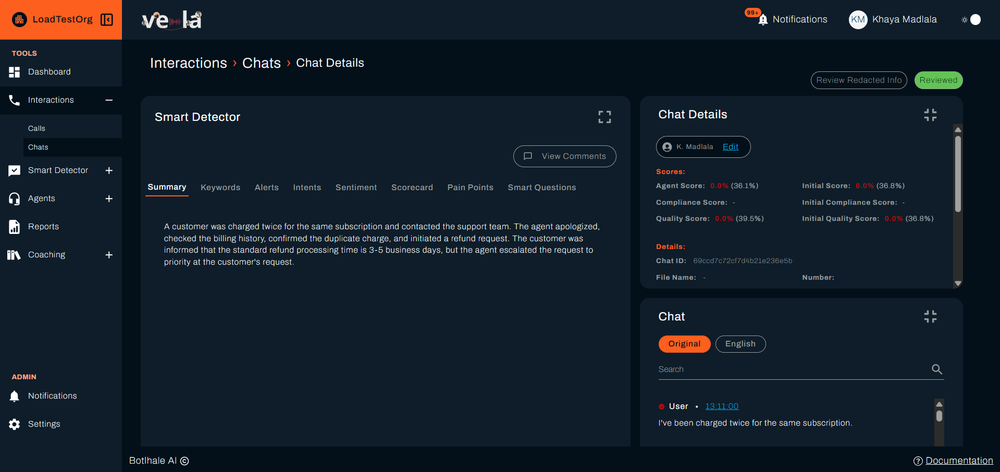

### B. Use the AI Analysis

Vela has already analysed the interaction by the time you open it. Its findings sit under the **Smart Detector** panel, one tab each, and reading them first tells you where to spend your attention.

| Tab | What it shows | What to look for |
| :--- | :--- | :--- |
| **Summary** | A recap of what happened and how it ended. | Whether the agent resolved the customer's query, and whether the outcome was stated clearly before the conversation closed. |
| **Keywords** | Tracked terms that came up. | Whether your mandatory phrases were said, and whether products and policies were named correctly. On a translated call, keywords match the English translation. |
| **Alerts** | Which Smart Searches this interaction matched, with the AI's reason for each match, links to the moment, and a **Resolve** control on each row. | Whether the flagged moment holds up once you read it in context. If a search keeps matching interactions it should not, tell your administrator so its phrases can be tightened. |
| **Intents** | What the customer came for, such as sales, a complaint, or support. | Whether the agent handled it as that kind of conversation, for example following the complaints process when the intent is a complaint. |
| **Sentiment** | The positive, neutral, and negative split for the conversation, shown for the agent and the customer separately. | A high negative share on the customer's side, and whether the agent's own tone held steady. Use the transcript timestamps to find where it turned. |
| **Scorecard** | How Vela scored the interaction against your Agent Scorecard, question by question. | Any question you would have judged differently. Hover over the information icon beside a score to read why Vela answered as it did. This is the tab where you override an answer, in [Score and Provide Feedback](#3-score-and-provide-feedback) below. |
| **Pain Points** | Signs of customer frustration, each with the AI's justification for flagging it. | Whether each frustration was acknowledged when it was raised, rather than left unanswered. Read the justification where a flag looks wrong. |
| **Smart Questions** | The answers to any questions your organisation asks of every interaction for reporting. These carry no score. | Answers that change how you would coach, even though they do not move the score. The information icon here shows Vela's reasoning too, and the download icon saves the answers as CSV (**Download Smart Questions as CSV**). This tab appears where your version includes [Smart Questions](../smart-questions-guide.md). |

On the [Lite](../reference/glossary.md#lite) version, only **Summary**, **Sentiment**, and **Scorecard** appear.

:::tip Vela explains itself on four of these tabs
**Scorecard**, **Smart Questions**, **Alerts**, and **Pain Points** each record why the AI answered, matched, or flagged as it did. Read that explanation before you act on anything that looks wrong: it usually separates a one-off misreading from a question or search that needs rewording.

On **Scorecard** and **Smart Questions** the explanation sits behind the information icon.
:::

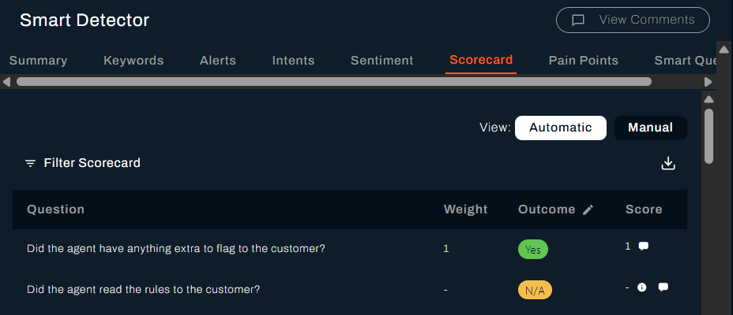

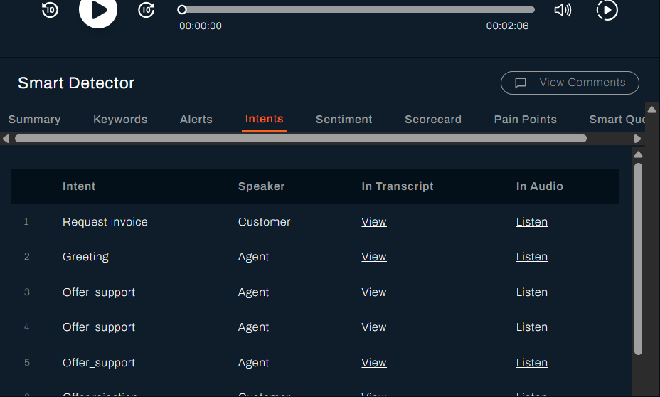

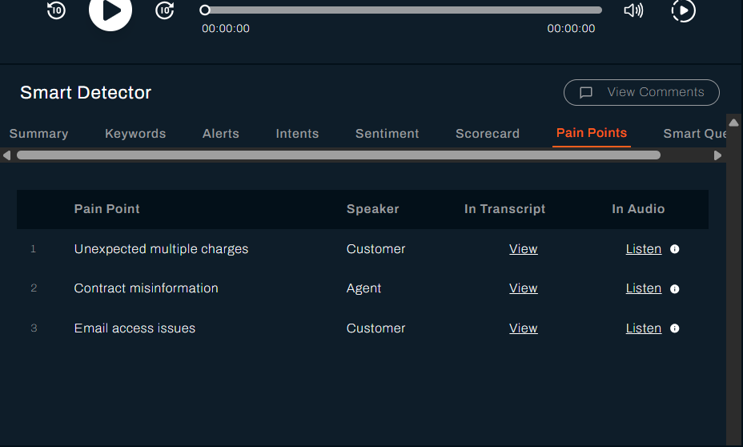

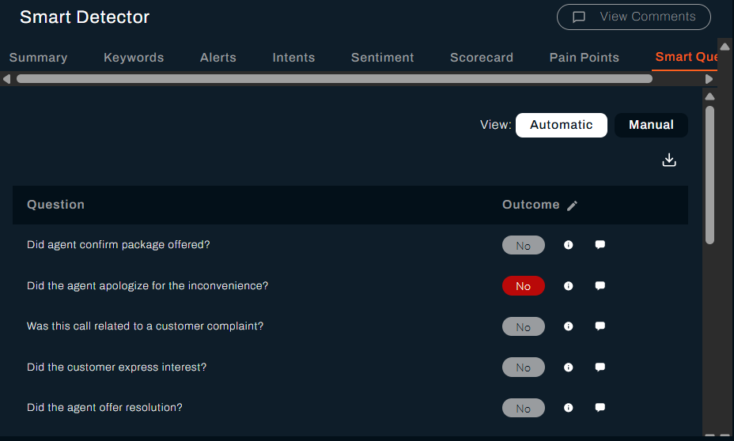

On the **Alerts** tab, a call has two columns that take you straight to the moment the alert refers to, and a chat has one:

* **In Transcript**: select **View** to scroll the transcript to the line that triggered the alert. On a chat, this is the only column, and it is labelled **In Chat**.
* **In Audio**: select **Listen** to move the player to that second, so you can hear the exchange rather than infer it from a phrase. Calls only.

Where no timestamp was recorded for a match, the columns read `-`.

Select **Resolve** once you have acted on the alert, so it counts in **Total Number of Resolved Alerts** on the Dashboard. The row then reads **Resolved**.

A tab with nothing to show says so, for example `No alerts detected in call` or `No pain points detected in call`. Vela analysed the interaction and found nothing of that kind in it.

{/* UNVERIFIED: the View Redactions grant in the hotspot below. In vela-fly source the grant is never read, so non-admins with it may still see Request Redacted Access. Same note as security-compliance.md and access-requests-audits.md. */}

<Hotspots
  src={detailedView}
  alt="The Detailed View of a call: the trail at the top and the Review Redacted Info and Mark as Reviewed buttons across the top, the Audio player and the Smart Detector analysis tabs down the left, and the Call Details panel on the right"
  points={[
    { x: 74.5, y: 17.7, title: 'Review Redacted Info and Mark as Reviewed', body: 'For administrators, for users granted View Redactions, and on an interaction you have approved access to, this button reads Review Redacted Info and reveals masked content, then Close Redacted Info to mask it again. Otherwise it reads Request Redacted Access instead, and opens a request to an administrator. Mark as Reviewed records that the interaction is dealt with. See Access Requests.' },
    { x: 46.9, y: 25.3, title: 'Audio', body: 'The player for the recording. A chat has no Audio card, and shows the transcript alone.' },
    { x: 81.3, y: 25.1, title: 'Call Details', body: 'The facts about the interaction: the Scores block, then Call ID, the dates, Handle Time, Department, Team, Topic, Direction, and Tags.' },
    { x: 76.1, y: 32.4, title: 'Edit, beside the agent name', body: 'Reassigns the interaction to a different agent, and scores it again for them. See D. Reassign the Agent below.' },
    { x: 47.9, y: 47.8, title: 'View Comments', body: 'Replaces the Smart Detector panel with the comments panel, where coaching feedback is added and the agent is tagged with an @ mention. The same button then reads Smart Detector, to switch back.' },
    { x: 57.6, y: 53.6, title: 'Smart Detector tabs', body: "Vela's analysis, one tab each: Summary, Keywords, Alerts, Intents, Sentiment, Scorecard, Pain Points, and Smart Questions. Where they do not fit, the strip scrolls sideways." },
  ]}
/>

### C. Listen to the Call or Read the Chat

The player and the transcript follow each other. As the audio plays, the transcript scrolls to keep the current line in view, and selecting a line's timestamp moves the player to that point.

1.  Listen to the **Audio** card on a call, or read the **Chat** card on a chat.
2.  Use the **Playback Speed** control to review calls efficiently. Available rates are 0.5x, 0.75x, 1x, 1.25x, 1.5x, and 2x.
3.  Select a **timestamp** in the transcript to jump to that moment in the recording.
4.  Switch the transcript between **Original** and **English** when the conversation was not in English. Vela translates every interaction to English as it processes it.

While you listen, attend to the agent's tone, whether they listened actively, and whether they followed procedure.

Transcription covers the 11 spoken official South African languages. These are Afrikaans, English, isiNdebele, isiXhosa, isiZulu, Sesotho (Southern Sotho), Sepedi (Northern Sotho), Setswana, siSwati, Tshivenda, and Xitsonga. Botlhale's wider speech service handles other languages, which Vela does not analyse. Speakers are separated automatically, so agent and customer turns are distinguishable in the transcript.

Chats carry the same analysis as calls. Vela reports average response time on them, in place of the measures that need call audio. See [Metrics](../reference/metrics.md).

### D. Reassign the Agent

The agent's name in the **Call Details** panel has an **Edit** control beside it, which reassigns the interaction to a different agent.

:::warning Reassigning reruns the scorecard
Selecting a new agent scores the interaction again, using today's questions for the new agent's team. Every answer is replaced, including reviewer overrides. The rescoring runs in the background, and Vela emails you when it is complete. Then check the score and set your overrides again. See [How Scoring Works](../explanation/how-scoring-works.md#changing-a-scorecard-after-interactions-are-scored).

This is a different control from **Reassign** on **Agents → Agent Details**, which moves an agent between teams in bulk and does not touch scoring. See [Manage Agents and Teams](./manage-agents-and-teams.md#5-move-agents-between-teams).
:::

The email that lands when the rescoring finishes has the subject "Checklist Search Complete" and is headed **Checklist Scoring is complete**, so search your inbox for "Checklist" to find it. It names the interaction by its **Call ID**, and its **View** button opens that interaction.

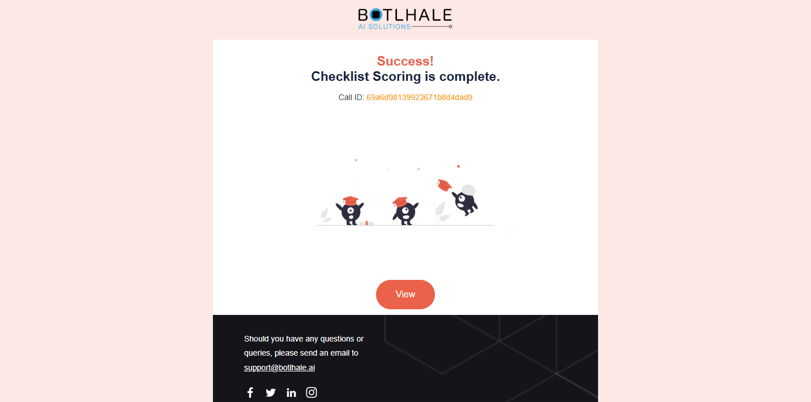

{/* Verified on screen 2026-10-01: email received after reassigning the agent on an already-scored call. Kept in its own light styling because it is an email rather than a Vela screen, so the Dark Mode rule does not apply. "Checklist Scoring" is the product's wording, not ours: the email template still carries the pre-rename term. Do not "correct" it to Scorecard. */}

Use this to correct a genuine misassignment, such as a recording uploaded under the wrong name.

---

## 3. Score and Provide Feedback

Your manual scorecard and comments are the core of the quality process, turning the analysis into coaching the agent can act on.

The Scorecard tab has a **View** control that splits the questions by their **Search Type**. **Automatic** shows the questions the AI answers, including any that use a Knowledge Base document. **Manual** shows the questions a reviewer answers. You can change an outcome in either view, and your outcome then replaces the AI's.

### A. Score or Override the Scorecard

Vela's assessment gives you a base score. You make the final judgement.

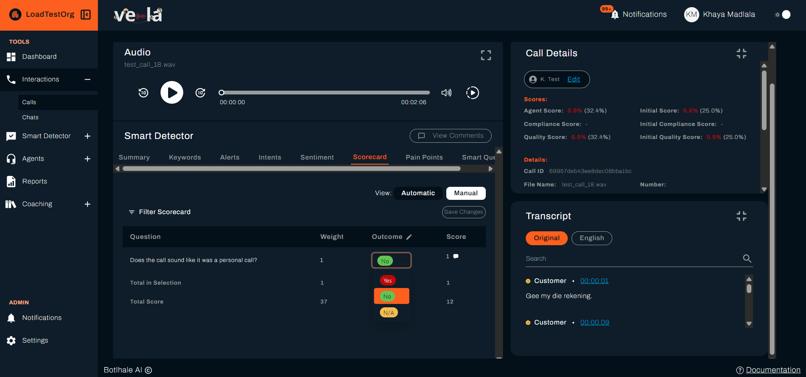

1.  On the Detailed View, open the **Scorecard** tab in the Smart Detector panel.
2.  Switch **View** between **Automatic** (questions the AI answers) and **Manual** (questions a reviewer answers) to find the question you want to change.
3.  Read why Vela answered as it did before you change anything. Hover over the information icon beside a question's score to see its reasoning. Check that reasoning against the transcript. If the AI missed context, override the answer. If the AI was right, leave the score and coach the agent instead.
4.  Select the pencil icon in the **Outcome** column heading to enter edit mode.
5.  Set the **Outcome** for each question to **Yes**, **No**, or **N/A**, using your judgement.
    * **N/A removes the question from the score** rather than counting it as a failure, so use it where the question did not apply to this conversation. The difference is large: see [How Scoring Works](../explanation/how-scoring-works.md) for a worked example.
6.  Select **Save Changes**.
    * Your edited outcome replaces the AI's for that question, and the score is recalculated.

:::note Overriding a question hides its reasoning
Once you override a question, its information icon goes. Read the reasoning before you override, and put anything worth keeping into a comment.
:::

The **Call Details** panel keeps **Initial Score**, **Initial Compliance Score**, and **Initial Quality Score** beside the current ones. They show the AI's original answers, scored with your current question settings, so you can compare them with your changes.

:::tip If you are overriding the same question every week
A question you keep correcting in the same direction is usually a question that needs rewording, not an AI that keeps getting it wrong. Take it back to whoever maintains the scorecard rather than fixing it one interaction at a time. See [How Scoring Works](../explanation/how-scoring-works.md).
:::

To get the same detail question by question in a file, use the download icon on the Scorecard tab (**Download Scorecard as CSV**). The file lists each question with its **Initial Outcome**, **Current Outcome**, weight, score, and the reason Vela gave for each question nobody overrode, which is what you need when an agent disputes a score.

#### Narrow a Long Scorecard

**Filter Scorecard**, above the table, opens **Filter Scorecard By**. Tick the categories you want and select **Apply**, or **clear all fields** to go back to everything. On a long scorecard this lets you review one category at a time.

The table then carries two totals, and they are not the same figure:

| Row | What it counts |
| :--- | :--- |
| **Total in Selection** | Points possible and points earned for the categories you filtered to |
| **Total Score** | Points possible and points earned for every question on the interaction, in both views, whatever the filter |

Both rows are points, not a percentage, and neither applies Auto-Fail. Use **Agent Score** in **Call Details** when you discuss the result with an agent.

#### Comment Straight from a Question

Each row has a comment icon beside its score. Select it and the **Comments** panel opens with that question and its outcome already written in, ready for you to add the coaching point.

This is quicker than retyping the question, and it keeps the agent's feedback tied to the exact scorecard question it came from.

### B. Comment to Coach

Add specific, time-stamped feedback to make coaching clear and concrete.

1.  Select **View Comments** on the interaction to open the panel. It replaces the Smart Detector panel rather than sitting alongside it, and the button that opened it now reads **Smart Detector**. Select that to go back to the analysis tabs.
2.  Add your comment. Remember the best practices:
    * **Be specific:** "At 1:45, you missed the required closing statement."
    * **Be constructive:** "Try to summarise the solution before ending the call next time."
    * **Tag the agent:** where your organisation has the Coaching Portal enabled, type `@` and select **@agent** from the list. Without the tag the comment stays visible to team leads only.
3.  The agent can read and respond to a tagged comment in their Agent Portal. They are not notified, so tell them where to look if it is urgent.
4.  Select **Mark as Resolved** on a comment or reply once the point has been dealt with. It then reads **Resolved by** your name. This closes that comment only, so an alert on the same interaction stays open until you select **Resolve** on it.
5.  Select **Reply** on a comment to answer in the same thread, rather than starting a new one. The agent's replies appear here too.
6.  Select **Like** to acknowledge a comment without writing one. The control then reads **1 Like**, then **2 Likes**, and so on.

:::warning Tag the agent in a new comment
Tagging the agent works in new comments. The panel says so above the list: *"Agent mentions are only available in new comments, not replies."*

A reply in a thread you tagged reaches the agent too. To bring the agent into an untagged thread, post a new comment and tag them there.

:::

:::warning A posted comment is final
Comments cannot be edited or deleted once sent. Read yours back before selecting **Send**, particularly where you have tagged the agent. The delete icon beside the reply box clears what you have typed, not a comment already posted.
:::

---

## 4. Close the Review and Plan Coaching

### A. Track Review Status

Marking an interaction reviewed is what tells the rest of Vela you are done with it.

* Select **Mark as Reviewed** to record that you have finished assessing this interaction. The button becomes a green **Reviewed** label, and hovering it shows who reviewed it and a **Put Back in Review** button to undo it. This drives the **Reviewed** filter on the Interactions list and the reviewed-interaction metrics on your Dashboard, so your team can see review coverage at a glance. See [Reviewed Interactions](../reference/metrics.md#reviewed-interactions).
* If follow-up is needed, add coaching comments for the agent.

:::note Reviewing can be what releases the interaction to the agent
Organisations using the Coaching Portal choose, under **Coaching → Preferences → Agent View Permissions**, whether agents see all their interactions or only the reviewed ones. Where it is set to reviewed only, an agent sees a conversation once someone marks it as reviewed, so marking interactions as reviewed is what releases your coaching to them. See [Set Coaching Preferences](https://docs-coaching.botlhale.xyz/docs/team-leads/coaching-preferences) for the setting itself.
:::

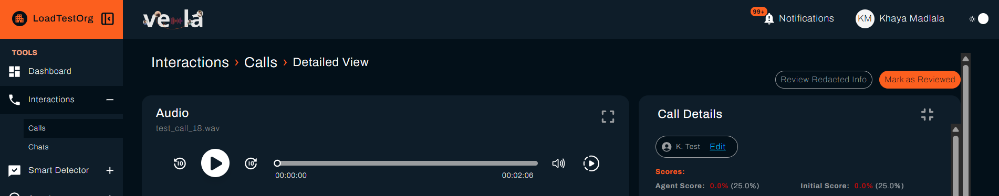

### B. Tag the Interaction

Tags are your own labels for classifying interactions, and they are what you filter and report on later. Give one to anything you want to find again as a group, such as every call about a failed delivery.

You can tag without opening an interaction. The **Tags** column on the Interactions list carries a tag icon on every row, reading **Add a tag** when you hover it. The same control sits on the **Tags** line of the **Call Details** panel in the Detailed View. Both open the same modal, and both work for calls and chats.

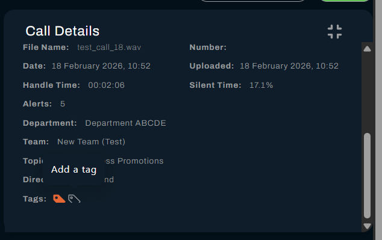

1. Select the tag icon to open **Edit Tags**.
2. On **Select a Tag**, pick one from the list. To make a new one, switch to **Create a Tag**, type the name, and give it a colour. The name and colour are both required. A colour already used by another tag is refused, so an organisation can hold at most 30 tags, one per colour.
3. Select **Add Tag**, or **Discard** to abandon it.

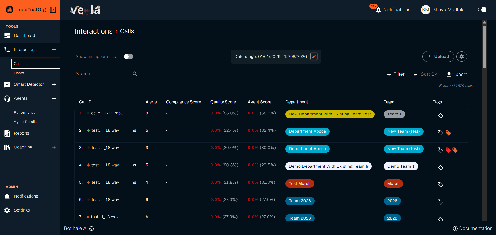

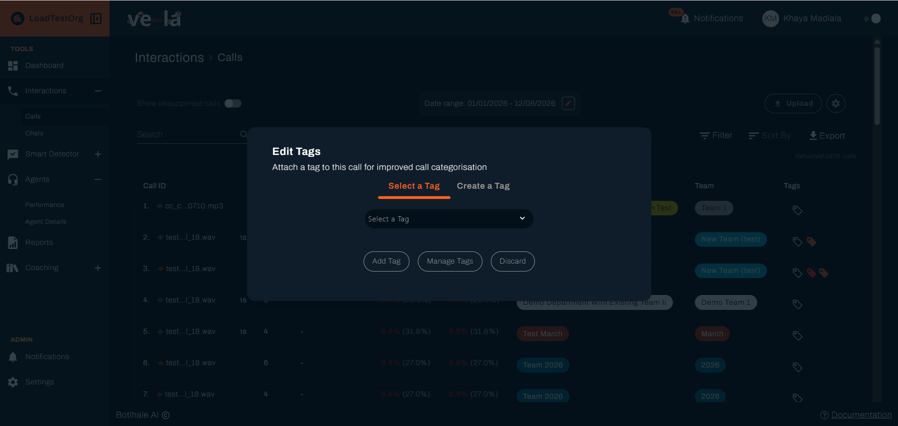

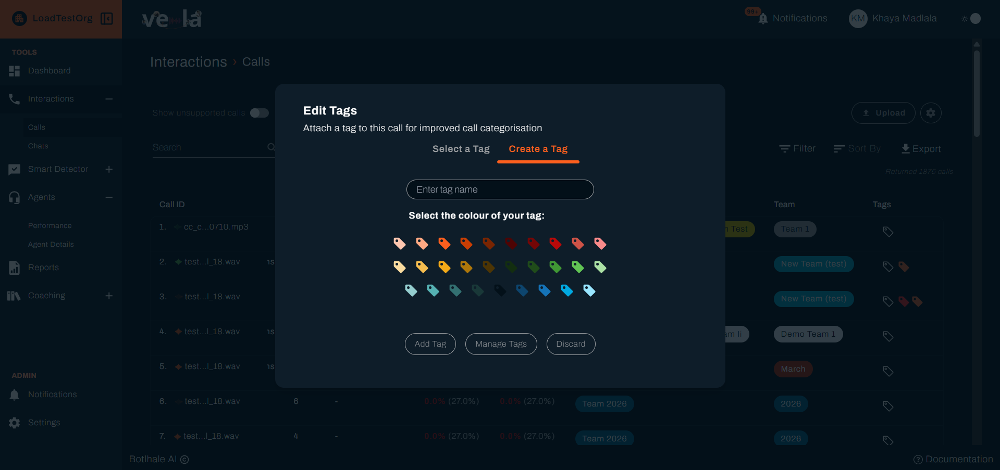

Tags already on an interaction appear beside the icon, and each tag can be removed from there.

:::tip Tag from the list when working through a batch
Tagging from the **Tags** column lets you classify a whole screen of interactions without opening any of them. The settings icon beside **Upload** adds the column.
:::

Tags belong to the organisation rather than to you, so one you create is available to everyone and appears in their filters too. Agree a small set with your team before everyone invents their own wording for the same thing.

#### Managing the Tag List

Editing or deleting a tag changes it for everyone in the organisation:

| Action | What happens to interactions already tagged |
| :--- | :--- |
| **Delete** | Vela removes the tag from every interaction carrying it, in one go. Deleting is permanent |
| **Edit** | Changes the tag's name and colour, on the list and on every interaction carrying it |

{/* ENGINEERING (known bug, documented as intended): editTag in vela origin/vela-fly app/(pages)/interactions/calls/calls.js:47-70 rewrites org.tags only (and lower-cases the new name). Interactions keep the old name, and the Tags filter lists only org.tags, so they can no longer be found by tag. Intended: renaming relabels every interaction carrying the tag. Converted from visible text 2026-10-08. Workaround until fixed, removed from visible text 2026-10-09: create a tag under the new name, apply it to the interactions, then delete the old one. */}

**To manage the list**, select **Manage Tags** in the same modal, which opens the Tags page in a new tab. It is not in the sidebar, so this is how you reach it. The page lists every tag by **Name**, each with its colour, and gives you **New Tag**, **Edit**, and **Delete**.

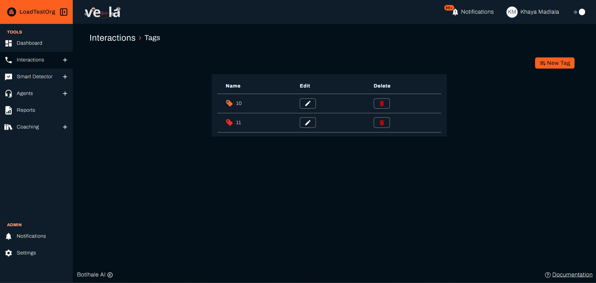

**New Tag** on that page opens its own modal, where you name the tag and pick its colour from the swatches before selecting **Create Tag**.

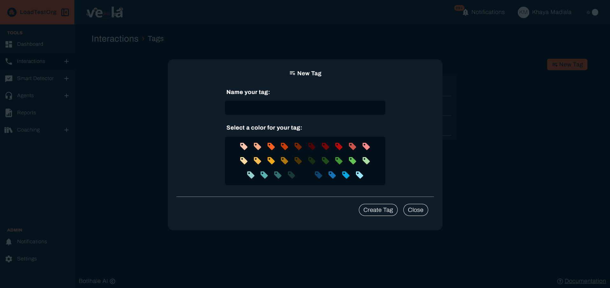

### C. Plan Next Steps

One weak interaction is not a pattern. Before acting, read the agent's recent scorecards and comments together and look for the same category scoring low more than once.

Where you find one, select **Coaching** in the left sidebar and create a course for that category, with a **Training Initiation Score Range** that covers the gap. **Coaching** appears only if your organisation has the Coaching Portal enabled. Vela assigns courses on its evaluation cycle, so you set the category and range rather than picking the agent. {/* UNVERIFIED: the per-Category measurement. See best-practices.md. */} See [Create and Assign Courses](https://docs-coaching.botlhale.xyz/docs/team-leads/create-and-assign-courses) for building the course.

A course is not a substitute for the conversation. Arrange time with the agent to go through the feedback and what you expect to change.

---

## Check Your Work

Your scoring, your comment, and the reviewed flag all live on the interaction itself, so that is the only place to check them. Open it again and confirm three things:

- **The Scorecard tab shows an outcome on every applicable question**, with your overrides in place and the score recalculated. The AI's original answers remain beside yours as **Initial Score**, **Initial Compliance Score**, and **Initial Quality Score**.
- **Your comment is on the interaction**, and the agent is tagged if you meant them to see it.
- **The interaction is marked as reviewed.** Your team's review coverage counts the interactions you mark, so marking is what makes the work visible.

If you meant the agent to see it and the tag is missing, add a new comment with the tag.

---

## Related

- [Build an Agent Scorecard](../agent-scorecard-guide.md): create and edit the questions behind these scores
- [Set Up Smart Search](../smart-search-guide.md): build the searches that flag interactions for review
- [Monitor Agent Performance](./monitor-agent-performance.md): track how an agent's scores move over time
- [Scorecard Fields](../reference/scorecard-fields.md): every field on a scorecard question
- [How Scoring Works](../explanation/how-scoring-works.md): how weights, auto-fail, and overrides produce the score
- [Troubleshooting: Scorecard and Scoring Issues](../support/smart-detector-issues.md#scorecard-and-scoring-issues): a missing scorecard, a score that looks wrong, or criteria changes that did not apply

## Need Help?

**Contact Support:** support@botlhale.ai