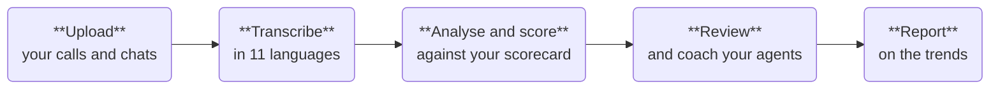

# Platform Overview
Vela is a call centre analytics platform. It transcribes your calls, reads your chats, and scores both against your organisation's criteria. Traditional QA reviews a sample. Vela works through every interaction you upload, so you see all of your team's work, not the handful of calls someone had time to check.

Vela analyses interactions after they are completed and uploaded. It works on finished calls and chats, not on calls while they are in progress.

This page explains what Vela does and who uses it. When you are ready to start, jump to [Next Steps](#next-steps).

:::info Key terms
A few words used throughout the documentation:

- **Interaction**: a single call or chat.
- **Agent Scorecard**: the questions every interaction is scored against.
- **Smart Search**: an automated monitor that flags interactions matching criteria you set.
- **Scope**: how widely something applies, from the whole organisation down to a single department or team.

Full definitions are in the [Glossary](../reference/glossary.md).
:::

Vela runs in your browser, with nothing to install. See [System Requirements](./system-requirements.md) for supported browsers and file formats, and [Security and Compliance](../security-compliance.md) for where your recordings and transcripts are held and how they are encrypted.

---

## What Vela Does

Every interaction follows the same path, from upload to report.

Vela handles transcription, analysis, and scoring. Reviewing and reporting are yours.

1. **Upload**: add calls as WAV or MP3, and chats as CSV or, in bulk, as JSON. See [Upload Your Data](../data-upload.md).
2. **Transcribe**: calls are transcribed across all 11 official South African languages. Chats are already text.
3. **Analyse and score**: every interaction is analysed for sentiment and scored against your [Agent Scorecard](../reference/scorecard-fields.md). Sensitive details such as ID numbers and payment information are masked at this stage, where your administrator has configured redaction. On plans that include it, [Smart Search](../smart-search-guide.md) flags the interactions that match your criteria.
4. **Review**: open an interaction to read the transcript alongside Vela's analysis, override any score, and leave coaching feedback.
5. **Report**: [Dashboards and Reports](../features/custom-reporting.md) turn the results into trends you can share.

Steps 2 and 3 run in the background after you upload, so you do not wait on the page. Vela emails you when an interaction's analysis is ready, depending on your notification settings.

### Review and score every interaction

Every uploaded interaction is scored against your organisation's [Agent Scorecard](../reference/scorecard-fields.md). Calls are transcribed first. Chats are already text. Applying the same scorecard to every interaction keeps scoring consistent across the team.

Calls and chats go through the same core analysis. Both are analysed for sentiment and scored against your scorecard. A few metrics apply to only one channel, since call audio can be measured in ways text chats cannot. See [Metrics](../reference/metrics.md) for the full list.

Transcription covers all 11 official South African languages: Afrikaans, English, isiNdebele, isiXhosa, isiZulu, Sesotho (Southern Sotho), Sepedi (Northern Sotho), Setswana, siSwati, Tshivenda, and Xitsonga.

### Coach and develop agents

If your organisation has the Coaching Portal enabled, you can see where an agent is struggling, assign a course that targets the gap, track whether they finish it, and mark good work with awards and certificates. Coaching has its own [documentation](https://docs-coaching.botlhale.xyz).

### Spot patterns across your conversations

Individual scores are only part of it. Across all your interactions, Vela analyses sentiment automatically, detects the topics and pain points you define, and tracks how each moves over time. [Smart Search](../smart-search-guide.md) flags individual interactions worth a closer look, and [Reports](../features/custom-reporting.md) turn all this into something you can hand to a manager. Between them they surface patterns a manual review would never catch.

---

## Scoring Against Your Own Standards

Vela does not score against a generic idea of good service. You give it your own policies, scripts, and procedures through the [Knowledge Base](../knowledge-base-guide.md), and when a document is linked to a Smart Search or a [scorecard question](../reference/scorecard-fields.md), the AI evaluates against those.

The AI produces a first assessment, not a final verdict. A reviewer can change any outcome, and Vela keeps its original scores alongside the reviewed ones. The AI gives you the coverage. The reviewer keeps the final say. For how the score is worked out, and what the AI can and cannot judge reliably, see [How Scoring Works](../explanation/how-scoring-works.md).

---

## Who Uses Vela

These are the jobs people do in Vela. Separately, each account carries a **Role** (Admin, User, or Agent) and an **access level** that together decide what someone can do and how much they can see. See [Role](../reference/glossary.md#role).

### Team leads and QA managers
Monitor agent and team performance, review interactions, set up automated monitoring, and generate reports. **Main areas:** Dashboard, Interactions, Smart Detector, Reports.

### Administrators
Set the platform up and keep it running: authentication, departments and teams, users, scorecards, and data privacy. **Main area:** Settings.

### Agents
Track personal performance, complete assigned training, read feedback, and earn recognition. Agents work in the separate Agent Portal, which is documented in the [Coaching Portal documentation](https://docs-coaching.botlhale.xyz).

---

## Next Steps

Your next step depends on your role.

| Your role | Start here | What it covers |
| :--- | :--- | :--- |
| **Administrator** | [Administrator Setup](./quick-start/administrator-setup.md) | Setting Vela up before anyone else can use it |
| **Team lead or QA manager** | [Team Lead Quick Start](./quick-start/team-lead-quick-start.md) | Reviewing interactions, coaching agents, and monitoring performance |
| **Agent** | [Coaching Portal documentation](https://docs-coaching.botlhale.xyz) | Your personal development portal, documented separately |

If you are setting Vela up for the first time, start with Administrator Setup. Once setup is complete, Vela can score your interactions.

---

## Need Help?

**Contact Support:** support@botlhale.ai
