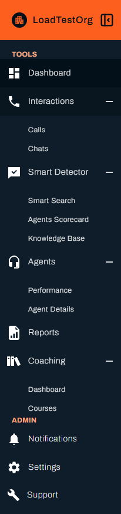

# Quick Start Guide for Administrators

As a **Vela Administrator**, you have the highest level of access and control. This guide focuses on the **setup and configuration tasks** you need to complete before agents and team leads begin using the platform.

---

## Understanding Your Access Level

- **Organisation-wide scope**: Full visibility across all departments and teams.  
- **Permissions management**: Ability to configure who sees what (departmental, team, or organisational level).  
- **System settings**: Manage authentication, integrations, and global configuration.  

---

## Initial Setup Tasks

### 1. Configure Authentication
- Set up SSO with **Google OAuth** or **Microsoft Azure AD**.  
- Manage email/password authentication rules (minimum password complexity, expiry).  

### 2. Create Departments and Teams
- Navigate to **Agents → Departments/Teams**.  
- Add structure to mirror your organisation hierarchy.  

### 3. Add Users
- **Bulk Upload** via CSV for multiple agents.  
- Assign users to teams and departments.  
- Apply appropriate permission scopes (Agent, Team Lead, Admin).  

### 4. Set Up Global Smart Searches
- Define organisation-wide monitors (e.g., compliance phrases, sales objections, critical keywords).  
- Configure notifications for admins or compliance teams.  

---

## System Integrations

- **Telephony/CRM integrations** – Connect external systems to automatically ingest calls/chats.  
- **APIs** – Use Vela’s API to automate uploads and pull analytics.  
- **Data Management** – Configure retention policies, data compression methods, and storage.  

---

## Best Practices for Administrators

- **Keep teams organised** – Ensure departments and teams mirror real-world reporting lines.  
- **Use bulk operations** – Save time when onboarding large groups of agents.  
- **Monitor system health** – Check dashboard performance trends to spot technical issues early.  
- **Delegate permissions** – Use Team Lead roles to reduce admin workload.  

---

## Troubleshooting for Admins

- **Access issues** – Verify role assignments.  
- **Bulk upload errors** – Check CSV/ZIP formatting.  
- **Integration failures** – Validate API keys and endpoints.  

---

## Next Steps
Once setup is complete:  
- Point Team Leads to the **Team Lead Quick Start** guide.  
- Direct Agents to the **Agent Quick Start** guide.  
- Continue to the **Administrator Best Practices** section under **Advanced Documentation**.
