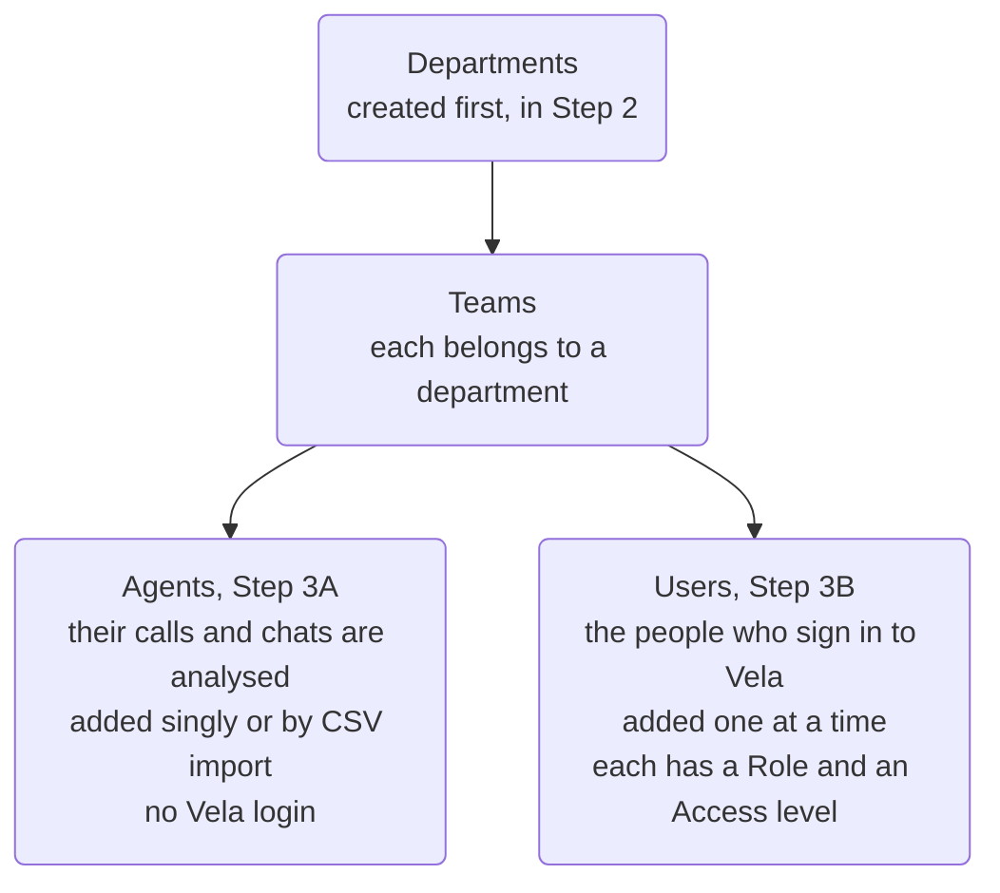
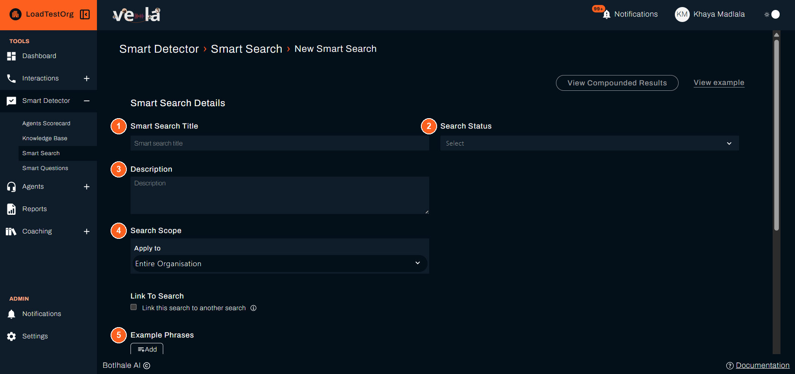
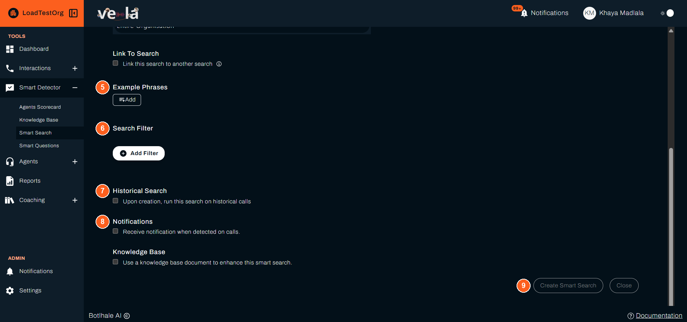

import Tabs from '@theme/Tabs';
import TabItem from '@theme/TabItem';

# Administrator Setup
Before anyone else can use Vela, an administrator configures authentication, departments and teams, users and agents, the Agent Scorecard, organisation-wide Smart Searches, the Knowledge Base, and data privacy. If you have not met Vela yet, [Platform Overview](../platform-overview.md) explains what it does in a couple of minutes.

**To score your interactions, you need the Agent Scorecard in place (Step 4)**, so work through these in order.

---

## What You'll Complete

- ✅ Choose how users sign in
- ✅ Create your organisational structure (departments and teams)
- ✅ Add users individually or in bulk
- ✅ Set up the Agent Scorecard so interactions can be scored
- ✅ Create organisation-wide Smart Searches for compliance monitoring
- ✅ Build the Knowledge Base
- ✅ Configure data privacy (redaction)
- ✅ Confirm an upload works end to end

---

## Before You Begin

You need:

- **An administrator account.** Your Vela organisation is provisioned by the Botlhale team, and your account must have the Admin role.
- **The email addresses of the people who will use Vela.** For SSO, these must match their Google or Microsoft accounts.

---

## Plan Before You Configure

The steps below set Vela up. A few decisions shape how you configure each step, so they are worth making before you start:

- **Your structure**: the departments and teams that mirror your real reporting lines.
- **Your scorecard standards**: the specific, observable behaviours you score agents against.
- **Your compliance searches**: the language you need to monitor for, so Smart Searches are ready before calls arrive.
- **Your redaction policy**: which sensitive details to mask.

For how to make these decisions well, see [Best Practices: Setting Up for Success](../../advanced/best-practices.md#setting-up-for-success).

---

## Step 1: Choose How Users Sign In

Vela offers two ways to sign in, and which applies to your organisation shapes how you add people in Step 3.

<Tabs groupId="auth-method">
<TabItem value="sso" label="Single Sign-On">

Users can sign in with their existing Google or Microsoft account. The **Sign in with Google** and **Sign in with Microsoft** buttons are on the login page for everyone, so there is nothing to switch on and no configuration in Settings.

The only requirement is that the person already exists in Vela. Add them first (Step 3), using the same email address as their Google or Microsoft account. If someone signs in with an email that has not been added to Vela, sign-in is refused.

Users who sign in through SSO manage their password with Google or Microsoft, so the **Security** tab is hidden for them in Vela.

</TabItem>
<TabItem value="password" label="Email and Password">

If SSO is not available, users sign in with an email and password. Passwords must meet a minimum length and mix of characters, listed in [Password Requirements](../../settings-config/account-security.md#password-requirements).

Vela emails each new user a password and a verification link. They must open the link before they can sign in. Vela does not force a password change afterwards, so tell users to set their own under **Settings → Security**.

</TabItem>
</Tabs>


---

## Step 2: Create Departments and Teams

Create departments and teams before you add users. Users are assigned to teams, and teams belong to departments.

### Create Departments First

1. Navigate to **Settings → Users → Org Table**
2. Select **Create**
3. Select **Department**
4. Enter the department name (for example, "Customer Service" or "Sales")
5. Save and repeat for each department

### Then Create Teams

1. From the same **Org Table** view, select **Create**
2. Select **Team**
3. Enter the team name and assign it to a department
4. Save and repeat for each team


:::tip Mirror Your Organisation
Set your departments and teams up to match your real reporting lines. Each team lead then sees the right data, and reports line up with how the organisation actually works.
:::

---

## Step 3: Add Users and Agents

You add two kinds of record in this step. They are separate records, and adding one does not create the other:



- **Agents**, whose interactions are analysed. Add them individually, or import many at once from a CSV.
- **Users**, who sign in to Vela. Add these one at a time in **Settings → Users**.

:::warning Bulk import creates agents, not users
If you are onboarding team leads or administrators, add them individually in Step 3B. A CSV import does not give them a login. See [Agent](../../reference/glossary.md#agent) in the Glossary for the full distinction.
:::

### Step 3A: Bulk Import Agents via CSV

:::note Adding one agent
To add a single agent, go to **Agents → Agent Details** and select **Add Agent**, then fill in their name, email, department, and team.
:::

For onboarding many agents at once:

1. Navigate to **Agents → Agent Details**
2. Download the CSV template from the upload page
3. Fill in the CSV with the following columns:

```csv
name,email,department,team
John Smith,john.smith@company.com,Customer Service,Support Team
Mary Johnson,mary.johnson@company.com,Sales,Sales Team
```

**Required columns:**

| Column | Description |
|--------|-------------|
| `name` | Full name of the agent |
| `email` | Email address (must be unique across Vela) |
| `department` | Must match an existing department name. Matching ignores case |
| `team` | Must match an existing team name. Matching ignores case |

4. Upload the completed CSV
5. Choose how to handle unmatched departments or teams: **create them automatically**, or **skip** the rows that reference them
6. Review the import results and address any errors


:::note What each agent receives
Adding an agent, singly or in bulk, emails them an invitation to the Agent Portal. Vela also asks them for a voice sample. That sample builds a Voice ID, which helps Vela attribute calls to the right agent. Agents who have not submitted one are sent a reminder.
:::

### Step 3B: Add Users Individually

1. Navigate to **Settings → Users**
2. Select **Add User**
3. Enter name, email, and assign their department, team, role, and access level


### Setting Roles and Access

Each user needs:
- **Role**: Admin (full platform control) or User (operational access)
- **Access level**: what data they can see
  - **Organisational**: all departments and teams
  - **Departmental**: their department only
  - **Team**: their immediate team only

---

## Step 4: Set Up the Agent Scorecard

The Agent Scorecard defines the evaluation criteria used to score every interaction. **A scorecard is what lets Vela score your interactions**, which makes this the most important configuration step.

1. Navigate to **Smart Detector → Agents Scorecard**
2. Open the **Create** tab
3. Set the **scope** (organisation, department, or team) that the scorecard applies to
4. Write your scorecard questions. Each question is a yes/no evaluation point, configured as below.
5. Select **Create** to save the scorecard. Its questions are active as soon as it is created.

:::note The sidebar says "Agents Scorecard"
The sidebar and the trail at the top of the page name it in the plural. This documentation uses the singular "Agent Scorecard" for the feature itself.
:::


Each question needs a **Question**, a **Category** to group it under, an **Expected Outcome** saying which answer is a pass, and a **Weight**. The remaining settings, and what each setting does, are covered in [Build an Agent Scorecard](../../agent-scorecard-guide.md). Every field with its values and default is in [Scorecard Fields](../../reference/scorecard-fields.md).


:::tip Write Concrete Questions
Write each question so that the AI, and human reviewers, can give a clear yes or no answer. Prefer specific criteria like "Did the agent use the customer's name at least once?" over vague ones like "Was the agent professional?"
:::

---

## Step 5: Create Smart Searches

Smart Searches automatically monitor all processed interactions for keywords, phrases, and patterns you define. Set these up before calls are uploaded so monitoring begins immediately.

A Smart Search flags an interaction when the phrases or conditions you define are detected in it.

1. Navigate to **Smart Detector → Smart Search**
2. Select **New Smart Search**
3. Configure a compliance monitor, for example:
   - **Smart Search Title:** `Compliance: Guarantee Language`
   - **Description:** `Flags interactions where guarantee language is used`
   - **Example Phrases:** `I guarantee`, `guaranteed approval`, `you will definitely`
   - **Search Scope:** Organisation (to apply across all teams)
   - **Search Status:** Active
   - **Notifications:** Enable if you want alerts when matches are detected
4. Select **Create Smart Search**




The numbers on both screenshots are keyed to the field descriptions in [Set Up Smart Search](../../smart-search-guide.md#step-2-define-your-search-criteria).

Repeat for each compliance or quality check your organisation needs to monitor, within the number of searches your plan allows. Most plans include five. When you reach the limit, **New Smart Search** is greyed out with no message explaining why, so create the searches that matter most first. See [Search Management](../../smart-search-guide.md#search-management).

:::note Smart Questions ask, rather than flag
A Smart Search flags interactions that match your criteria. A **Smart Question** asks a yes or no question of every interaction for reporting, without affecting anyone's score, which suits anything it would be unfair to judge an agent on. On plans that include it, see [Set Up Smart Questions](../../smart-questions-guide.md).
:::

---

## Step 6: Build the Knowledge Base

The Knowledge Base stores your organisation's procedures, product information, and policies. Link a document to a scorecard question, a Smart Search, or a Smart Question, and the AI uses it as reference rather than generic criteria. See [Knowledge Base](../../knowledge-base-guide.md).

1. Navigate to **Smart Detector → Knowledge Base**
2. On the **PDF Upload** tab, drag and drop your PDF files, or select the upload area to browse for them
3. Set the **scope** (organisation, department, or team), and optionally add a description
4. Select **Upload Files**


---

## Step 7: Configure Redaction

Vela can automatically mask sensitive information in transcripts, such as ID numbers and payment details. Configure this before real interactions are uploaded.

In **Settings → Organisations**, choose which entity types Vela should redact.


Once redaction is configured, masked details are hidden from everyone by default, administrators included. Administrators, and any user you grant **View Redactions**, can reveal the unmasked version on a transcript with **Review Redacted Info**. Everyone else sees only the masked version. They can request access to a specific interaction, which you approve in **Settings → Requests**, or you can grant **View Redactions** on the account in **Settings → Users**. See [Access Requests](../../settings-config/access-requests-audits.md) for the full workflow.

---

## Step 8: Confirm an Upload Works End to End

Before you hand Vela over, upload one test interaction and confirm it processes from start to finish. This proves authentication, the scorecard, and redaction are working together.

1. Upload a single test call in **Interactions → Calls** (see [Upload Your Data](../../data-upload.md))
2. Wait for processing to finish. Vela emails you when the analysis is ready
3. Open the processed interaction and confirm it has a transcript, a scorecard outcome, and, if you configured redaction, masked details
4. If an organisation-wide Smart Search should have matched, check that it appears in that search's results

A scorecard outcome on that interaction confirms your questions reach the test agent's team. If the outcome is missing, check the scope on those questions, and see the troubleshooting below.

---

## You're Ready

Once all eight steps are complete, your platform is ready for use.

**Hand-off checklist:**
- ✅ Point team leads to the [Team Lead Quick Start](./team-lead-quick-start.md) guide
- ✅ If your organisation uses the Coaching Portal, read the [Vela Coaching Portal documentation](https://docs-coaching.botlhale.xyz) for the courses, awards, and progress screens, and direct agents to it for their own portal
- ✅ If your organisation uses the Coaching Portal, set **Coaching → Preferences → Agent View Permissions** to decide whether agents see all of their interactions or only the reviewed ones. Set to reviewed only, an agent sees nothing of a conversation until a team lead marks it as reviewed

---

## Troubleshooting for Administrators

For general platform issues, such as uploads, playback, or the app not loading, see the [Troubleshooting Guide](../../support/troubleshooting-guide.md). The items below are specific to setup.

**Users can't sign in via SSO**  
The email must already exist in Vela and match the Google or Microsoft account the user signs in with. Confirm you have added the person (Step 3) using that exact email address. Sign-in is refused for any email that has not been added.

**Bulk agent import errors**  
Check that the CSV has all required columns (name, email, department, team) and that none are empty. Team and department names must match those created in Step 2, unless you use the create option during import.

**Interactions are not being scored**  
Confirm that scorecard questions exist with a scope covering the relevant team or department. Each question carries its own scope, so that is what decides which interactions it is applied to.

An interaction uploaded before you created the scorecard has no score, because scoring happens as an interaction is processed. Open it and select **Rerun Scorecard**, which appears on interactions with no automatic scorecard, to score it against the scorecard you have now. This is worth knowing if you uploaded test calls before Step 4.

**Smart Search not matching expected interactions**  
Check that the search status is set to **Active** and that the scope covers the relevant team or department. If you want historical calls matched, enable the **Historical Search** option when creating the search.

---

## Next Steps

- [How the Pieces Fit Together](../../explanation/how-the-pieces-fit.md): how these features relate, and the order to set them up in
- [Build an Agent Scorecard](../../agent-scorecard-guide.md): every question setting, and editing a scorecard once it is live
- [Best Practices](../../advanced/best-practices.md): advanced configuration guidance
- [Build Your Knowledge Base](../../knowledge-base-guide.md): uploading, scoping, and linking documents
- [Set Up Smart Search](../../smart-search-guide.md): advanced search configuration

---

## Need Help?

**Contact Support:** support@botlhale.ai
