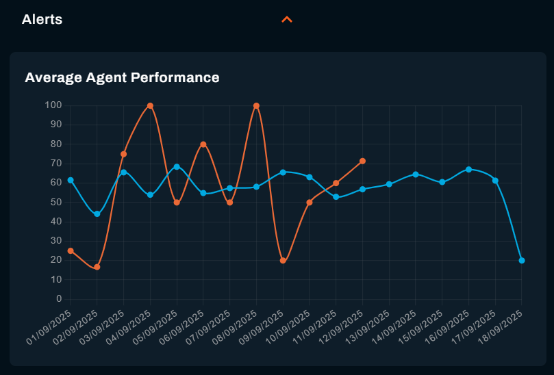
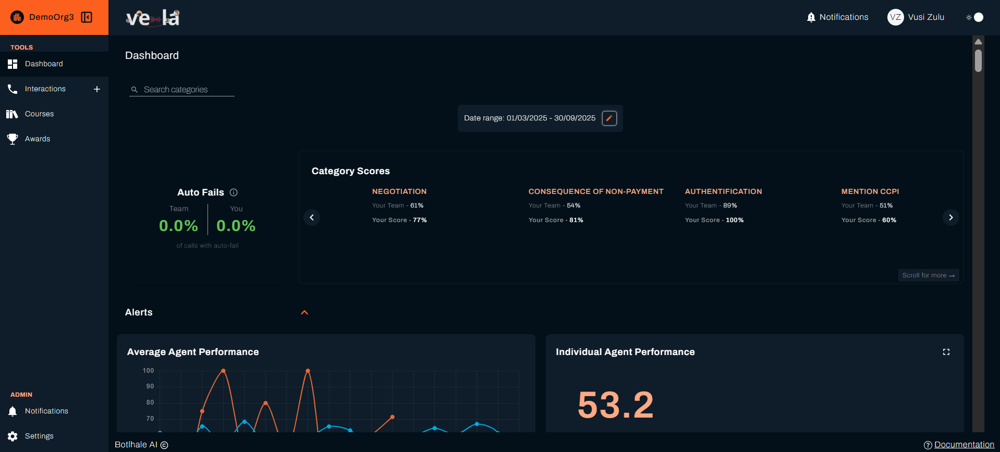

# Quick Start Guide for Agents

Welcome to **Vela Agent Portal**!  
The Agent Portal helps you understand your performance, receive feedback from your team lead, and access courses to improve your skills.  

This guide will get you comfortable using your portal in just **15 minutes**, so you can start tracking your progress and responding to coaching right away.

---

:::info Your Agent Portal
As an agent, you have a focused view designed specifically for your personal development. You can see your own performance, receive feedback from your team lead, complete training courses, and track your progress—all in one place.
:::

---

## What You'll Learn

- ✅ How to log in and navigate your portal
- ✅ Understanding your performance dashboard
- ✅ How to view and respond to feedback
- ✅ Accessing and completing training courses
- ✅ Tracking your achievements and awards
- ✅ Comparing your progress with peers

**Estimated time:** 15 minutes

---

## Before You Begin

### What You Need

- **Active Vela account** - Your team lead or administrator has created your account
- **Login credentials** - Check your email for verification link
- **Supported browser** - Chrome (recommended), Firefox, Safari, or Edge
- **Positive mindset** - Vela is here to help you succeed and grow!

:::tip First Login
Check your email inbox (and spam folder) for your Vela account verification email. Click the link to activate your account before proceeding.
:::

---

## Step 1: Log In to Your Agent Portal (2 minutes)

### Accessing Vela

1. **Navigate to your Vela login page** (your team lead will provide this link)

2. **Choose your login method:**

**Option A: Single Sign-On (SSO)**
- Click **'Sign in with Google'** if your company uses Google Workspace
- Click **'Sign in with Microsoft'** if your company uses Office 365
- Follow your company's standard login process

**Option B: Email and Password**
- Enter your work email address
- Enter your password
- Click **'Log In'**

### Setting Your Password (First Time Only)

When you first log in, you'll need to create a password. Make it secure but memorable:

**Password Requirements:**
- ✓ At least 8 characters
- ✓ At least one letter
- ✓ At least one number
- ✓ At least one special character (@, #, $, %, etc.)

**Good password example:** `Agent2024!Success`

:::tip Password Tips
Use a phrase you'll remember, like the first letters of a sentence: 'I want to be the best agent in 2024!' becomes `Iwtbtbai2024!`
:::

### Your First Look at the Agent Portal

After logging in, you'll see your **Personal Dashboard**—this is your home screen. It's designed to be simple and focused on what matters to you: your performance and development.

---

## Step 2: Understanding Your Performance Dashboard (5 minutes)

Your dashboard shows how you're performing and where you can improve. Let's explore what everything means.

### Your Current Performance Score

**The Big Number at the Top**
- This is your overall performance score (0-100)
- It's based on your recent customer interactions
- Updated regularly as you handle calls and chats

Your score reflects how your interactions are evaluated against your organisation's Agent scorecard criteria. The performance thresholds (what counts as good, acceptable, or needs improvement) are set by your administrator.

:::info How Your Score is Calculated
Your score is a weighted average of the scorecard items evaluated across your interactions. Each scorecard item is defined by your organisation — check with your team lead if you need clarification on the criteria.
:::

### Your Performance Trend

**The Graph Showing Your Journey**

This line graph shows how your performance has changed over time:
- **Going up?** You're improving — keep it up!
- **Staying steady?** Consistent performance. Now aim higher.
- **Going down?** Time to check feedback and focus on training.

**What to Look For:**
- Are you improving after completing training?
- Do you perform better on certain days or times?
- Are there patterns you can learn from?

### Comparing Yourself with Peers

**Anonymous Team Comparison**

See where you stand compared to your teammates (their names aren't shown—this is just for your motivation):

Your dashboard shows how your scores compare against your teammates' scores across each scorecard category. Use this to understand where you stand relative to the team average.

:::tip Use Comparisons Positively
Peer comparison isn't about competition, it's about motivation and understanding what's possible. If others are scoring higher, it means you can too with the right focus and training!
:::

### Recent Activity Summary

**Your Latest Interactions**

Quick view of your most recent calls and chats:
- Date and time of interaction
- Your score for that interaction
- Whether your team lead has added feedback
- Customer sentiment (how the customer felt)

### Key Performance Categories

**Where You Excel and Where to Improve**

Your scorecard breakdown shows the categories your organisation has defined in its Agent scorecard. The specific areas and their names are set by your administrator — ask your team lead if you need clarification on what each category means.

---

## Step 3: Viewing and Responding to Feedback (5 minutes)

Your team lead reviews your interactions and provides specific feedback to help you improve. Here's how to access and respond to it.

### Accessing Your Interactions

1. **Click 'Interactions'** in your portal navigation
2. **Look for the comment icon (💬)** next to any interactions
3. **Click on an interaction** to see full details and feedback

### Understanding Your Interaction Details

When you open an interaction, you'll see:

**Interaction Summary:**
- Date and time
- Call or chat type
- Duration
- Your score
- Customer sentiment

**Transcript or Recording:**
- Full text of what was said (for calls)
- Complete chat conversation (for chats)
- You can search for specific words or moments

**Vela AI Analysis:**
- What you did well
- Areas for improvement
- Key moments in the conversation
- Customer satisfaction indicators

**Your Team Lead's Feedback:**
- Specific comments about your performance
- Suggestions for improvement

### Types of Feedback You'll Receive

**Positive Feedback:**
> 'Excellent work on this call, James! You remained calm when the customer was frustrated (at 2:15) and your explanation at 3:40 was crystal clear. The customer went from annoyed to satisfied, that's great service!'

**Constructive Feedback:**
> 'Good effort on this interaction, Sarah. For next time: try to confirm the customer's issue before offering solutions (around 1:20). This ensures we're solving the right problem.'

**Coaching Feedback:**
> 'This interaction shows improvement in your product knowledge, well done! However, the hold time at 4:30 was quite long. If you need to research something, give the customer a time estimate. '

### How to Respond to Feedback

1. **Read the feedback carefully** - understand exactly what your team lead is saying
2. Click **'Reply'** in the comments section
3. **Write your response** - acknowledge the feedback and share your thoughts
4. Click **'Send'**

:::tip Responding to Feedback
Be specific in your replies — reference the moment or behaviour your team lead highlighted. A short, genuine response shows you've engaged with the feedback.
:::

---

## Step 4: Accessing and Completing Training Courses (5 minutes)

Your team lead can assign training courses to help you improve in specific areas. Here's how to access and complete them.

### Finding Your Courses

1. **Click 'Courses'** in your portal navigation
2. You'll see a list of courses assigned to you, each showing:
   - **Course title and description**
   - **Category** (linked to a performance area in your organisation)
   - **Status** — Incomplete, In Progress, or Complete
   - **Due date** — the deadline for completion
   - **Initiation score** — the score that triggered the course assignment

:::info Courses Are Assigned to You
You don't self-enrol in courses. Your team lead assigns courses based on your performance data. If you feel a course is missing or incorrect, speak to your team lead.
:::

### Completing a Course

1. **Click on a course** to open its detail page
2. **Read the course description** to understand what it covers
3. **Review the course material:**
   - Click **'View Material'** to open the content (this may be an external link or a downloadable file)
   - Go through the material carefully before attempting the quiz
4. **Take the quiz:**
   - Scroll to the **Take Quiz** section and click **'Take Quiz'**
   - Answer all questions
   - Submit your answers to receive your score
5. Your status updates to **Complete** once you submit — your result is recorded and your team lead can see it

:::tip Pass Mark
The pass mark is set by your organisation. If you don't pass on the first attempt, review the material again and speak to your team lead about next steps.
:::

---

## Step 5: Tracking Your Awards (3 minutes)

Awards are recognition given to you by your team lead for strong performance or improvement. You can view all your awards in one place.

### Viewing Your Awards

1. **Click 'Awards'** in your portal navigation
2. Your most recent award appears at the top as a **"New Achievement"** highlight
3. All your awards appear below as individual cards, each showing:
   - **Award name and description**
   - **Category**
   - **Date awarded**

### Viewing Award Details

Click on any award card to open the detail view:
- **Message from your team lead** — a personalised note explaining why you received the award
- **Certificate** — a downloadable PDF certificate for the award
- Click **'Download'** to save your certificate

:::tip Use the Date Filter
If you're looking for awards from a specific period, use the date range filter at the top of the Awards page to narrow the results.
:::

---

## You're Ready to Go

You've completed the Agent Quick Start. You can now:

- ✅ Log in and navigate your Agent Portal
- ✅ Monitor your performance score and trends on the Dashboard
- ✅ View and respond to feedback from your team lead
- ✅ Complete assigned training courses and quizzes
- ✅ View your awards and download certificates

**Suggested next steps:**
- Check your Dashboard daily to monitor your performance trend
- Review any open courses and work through them before their due date
- If you have questions about your scorecard criteria, ask your team lead

