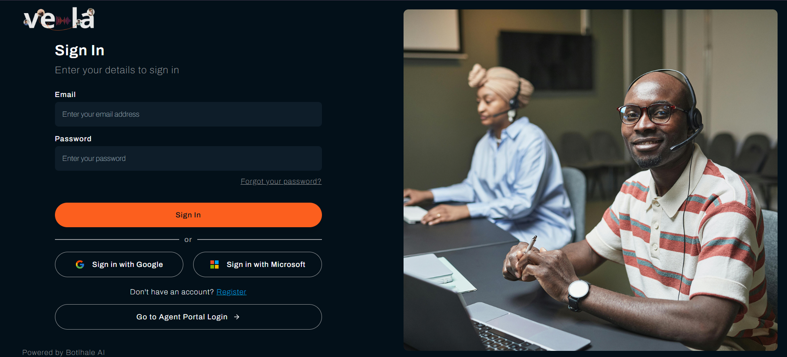
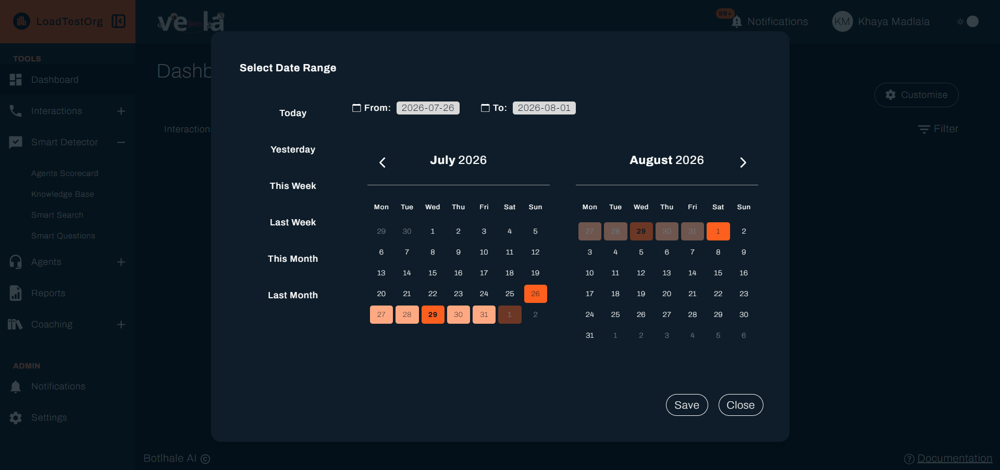
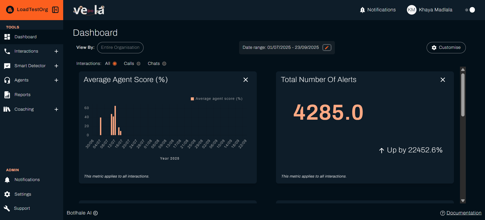
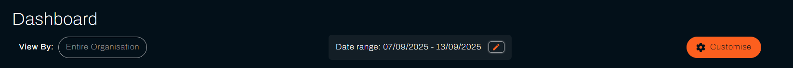
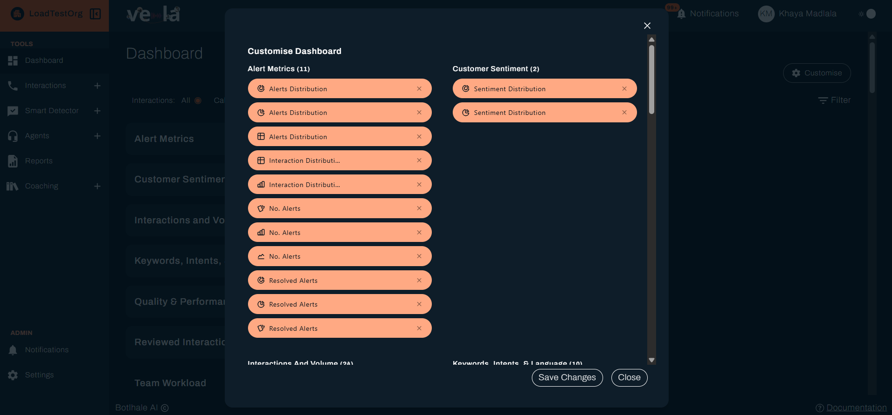
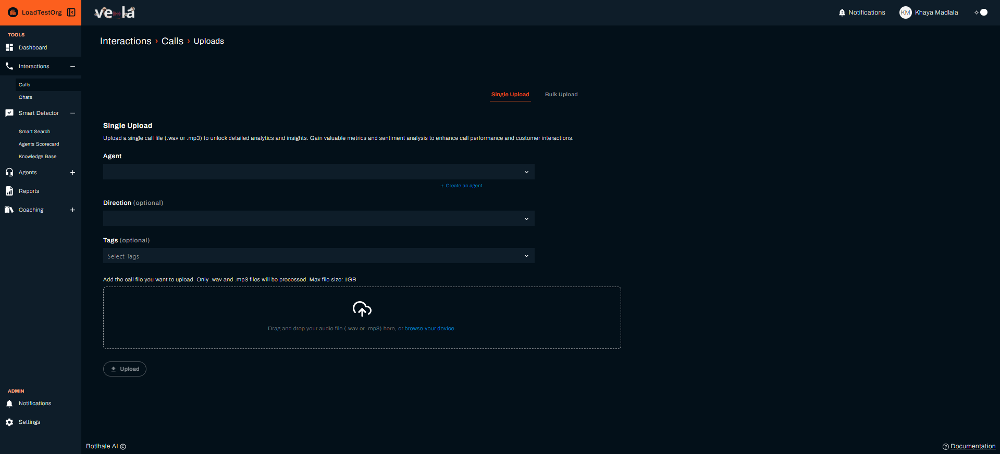
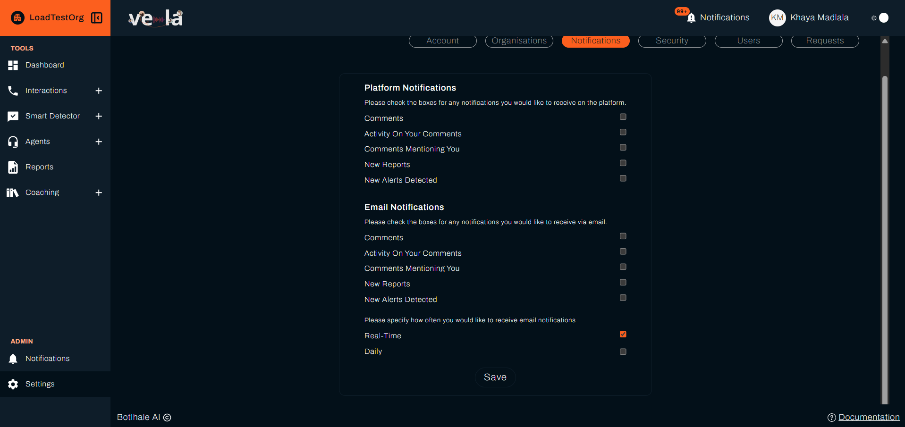
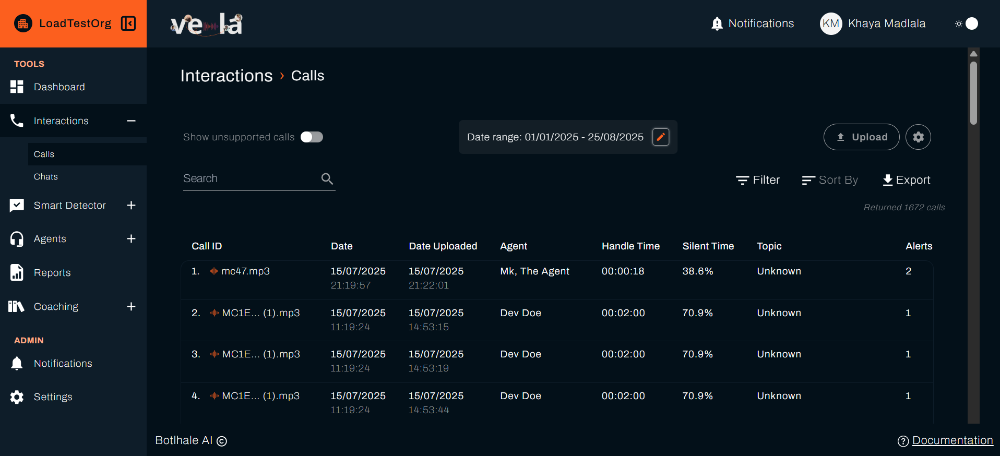
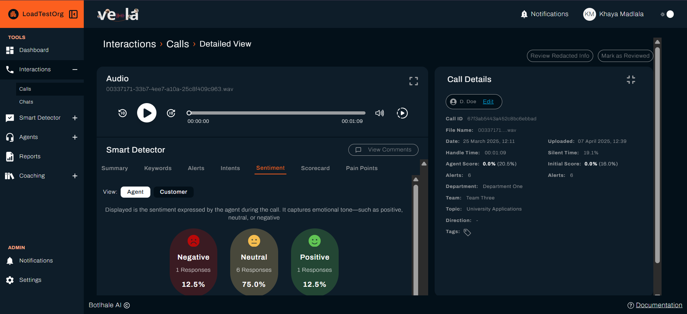
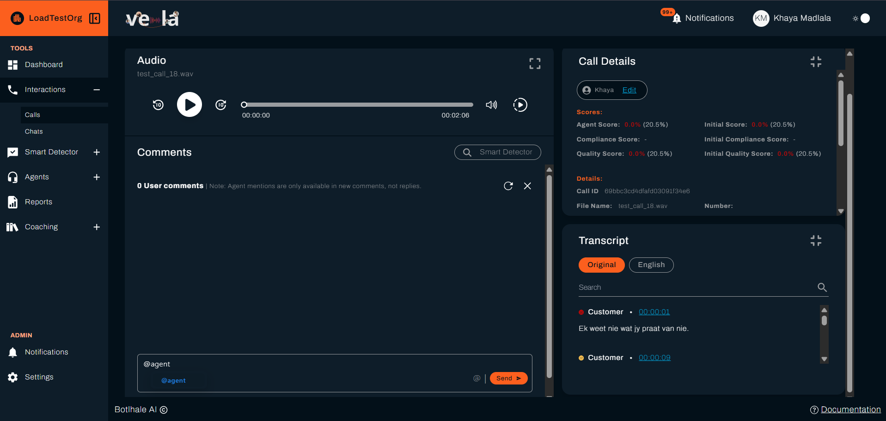

# Team Lead Quick Start
A hands-on walkthrough for team leads and managers new to Vela. By the end you will have checked your dashboard, uploaded and reviewed an interaction, and left coaching feedback. Setting up automated monitoring comes next. See [Smart Search](../../smart-search-guide.md).

---

## What You'll Learn

- ✅ Log in and navigate the platform
- ✅ Check today's team performance at a glance
- ✅ Upload and review your first call or chat
- ✅ Understand key metrics and their meanings
- ✅ Provide feedback to agents

---

## Before You Begin

### What You Need

- **Active Vela account**: Your administrator should have created your account
- **Login credentials**: Email verification link or SSO access
- **A current browser**: Chrome, Edge, Firefox, or Safari
- **A call recording** in WAV or MP3 format, to upload during Step 3

### Understanding Your Access Level

Your administrator assigned you one of these access levels:

| Access Level | What You Can See |
|--------------|------------------|
| **Organisational** | All departments and teams across the organisation |
| **Departmental** | All teams within your specific department |
| **Team** | Only your immediate team's data |

:::tip First-Time Setup
Your administrator's invitation email contains a verification link and a password. **Click the link first.** Vela refuses the sign-in until your address is verified, and tells you to check your email if you try.

Once verified, sign in with the password from the email. Vela does not force you to change it, so change it yourself under **Settings → Security**.
:::

---

## Step 1: Log In to Vela

### Accessing the Platform

1. **Navigate to your Vela login page** (provided by your administrator)
2. **Choose your authentication method:**

**Option A: Single Sign-On (SSO)**
- Click **Sign in with Google** if using Google Workspace
- Click **Sign in with Microsoft** if using Azure AD
- Follow your organisation's authentication flow

**Option B: Email and Password**
- Enter your email address
- Enter your password
- Click **Sign In**

### Password Requirements

When you change your password under **Settings → Security**, or reset a forgotten one, it must meet these requirements.

- At least 8 characters
- At least one letter
- At least one number
- At least one special character (for example `@`, `#`, or `!`)

Signing in with Google or Microsoft? You do not set a Vela password. Your identity provider manages it.

### What You'll See After Login

Signing in takes you to your **Dashboard**, where you monitor performance. The left sidebar shows your main navigation areas.

Vela remembers which organisation you were working in, including the one your administrator assigned when they created your account, so you go straight there. To work in a different organisation, use **Settings → Organisations → My Orgs**.

If Vela has no active organisation set for you, it asks you to choose one before going any further. Pick yours from the **Organisation** list and click **Select**. Vela stores your choice, so this is a one-time step and later sign-ins go straight to the Dashboard.

You see that screen if your account was created without an organisation, or if the one you were working in has been deactivated. If the list is empty, or you get "You are not part of the selected organization", your account has not been added to an organisation yet. Ask your administrator.

---

## Step 2: Understand Your Dashboard

### Dashboard Overview

**Your Dashboard gives you an overview of performance across everything you can access.** That might be your whole organisation, a department, or a single team, depending on your access level.  

If no calls or chats have been uploaded in your organisation yet, performance data is not available. In that case, skip ahead to **Step 3**, and you can return to this step once data is available.  

The Dashboard has a few key components:

### Essential Controls

**Date Range Selector**
- Quick options: Today, Yesterday, This Week, Last Week, This Month, Last Month
- Custom range: Select specific start and end dates
- **Try it now:** Set the date range to "Today" to see current performance

**Filter**: click **Filter** to narrow the dashboard by department, team, and agent, within your access level, and by direction, tags, topic, or score.

**Interaction Type Filter**: show all interactions, calls only, or chats only.

### Key Metrics to Monitor

Your dashboard displays a set of performance indicators. When you are starting out, these three are a good place to begin:

1. **Average Agent Score**: a quick read on overall performance
2. **No. Alerts** (number of alerts): issues raised by your Smart Searches that need attention
3. **Sentiment Distribution**: how sentiment breaks down across the period

Every available metric is defined in [Metrics](../../reference/metrics.md), including what to look for in each one.

### Customising Your Dashboard

Click **Customise** to choose which metrics appear and how each is charted (table, bar, line, pie, doughnut, card, or speedometer), then **Save Changes**. The chart types offered vary by metric. Metrics are grouped, and each group shows how many it holds.

**Try it now:** Add "Top 10 Pain Points" to your dashboard to monitor common customer issues.

---

## Step 3: Upload and Review Your First Interaction

Upload a call and review the analysis to see how Vela analyses an interaction.

:::note Chats work the same way
This walkthrough uses a call. Text chats follow the same flow under **Interactions → Chats**, where a single chat is uploaded as CSV and a bulk upload as JSON. The analysis is the same, except chats report response time instead of talk-to-listen ratio and silent time.
:::

### Uploading a Single Call

1. Navigate to **Interactions → Calls**
2. **Click Upload**, then select the single-call upload tab

3. **Fill in the upload form:**

- **Agent** (required): Select the agent who handled this call. The list is filtered by your access level, and **+ Create an agent** adds one without leaving the page.
- **Direction** (optional): Choose inbound or outbound.
- **Tags** (optional, but recommended): Add labels such as "complaint", "sales", or "billing".

4. **Upload your audio file:**
   - **Drag and drop** the file into the upload area, or click **browse your device**
   - Supported formats: WAV or MP3, up to 1 GB

5. **Click Upload**

### Processing Time

While the file uploads, a progress bar shows how far along it is. Once the upload finishes, Vela processes the call in the background, so you do not need to wait on the page. Processing time depends on the length of the call, the audio quality, and current server load, and longer calls take longer. Vela emails you when the analysis is complete, depending on your notification settings. You can manage these in **Settings → Notifications**.

### Reviewing the Analysis

Click your processed interaction to open it. The full transcript sits alongside Vela's analysis.

Four parts do most of the work when you review:

- **Summary**: a plain-language recap of what happened and how it was resolved.
- **Sentiment**: the positive, neutral, and negative split for the conversation, shown for the agent and the customer separately.
- **Scorecard**: the AI's outcome on each question in your organisation's [Agent Scorecard](../../reference/scorecard-fields.md). You can override any outcome, covered below.
- **Alerts**: anything a Smart Search or the AI flagged. Mark each one resolved once you have acted on it.

The interaction view also shows timestamps on every line, detected keywords, the customer's intent, and pain points. For what each field means, see [Review and Score Interactions](../../features/quality-assurance-tools.md).

### Adding Your Feedback

After reviewing the analysis, add your own observations:

1. **Scroll to the Comments section**
2. Write specific feedback with clear next steps in the comment box.
3. **Tag the agent** with @ so they receive a notification. Type `@` and pick them from the list that appears. Without the tag, only team leads see the comment.
4. Click **Send** to post it.

:::note Mentions only work in new comments
You cannot tag an agent in a reply to an existing comment. If you need to bring an agent into a thread, add a new comment rather than replying.
:::

:::note Example comment
Great job handling this difficult customer, @Samke! I liked how you stayed calm when the customer raised their voice, took ownership immediately, and offered a clear solution with a timeline.
:::

:::tip Comments Best Practices
- **Be specific**: Reference exact moments in the interaction
- **Be practical**: Give clear next steps
- **Balance positive and constructive**: Acknowledge strengths, suggest improvements
:::

### Override a Scorecard Item

The scorecard shows the AI's outcome on each question. If you disagree with one, override it with your own Yes, No, or N/A, and the score recalculates. The AI's original answer stays on the record next to yours.

Override an item when the AI missed context, a required phrase was said in different words, or the situation needed human judgement. For the full step-by-step, see [Review and Score Interactions](../../features/quality-assurance-tools.md#a-complete-a-manual-scorecard).

---

## You're Ready to Go

You've completed the Team Lead Quick Start. You can now:

- ✅ Monitor team performance on the Dashboard
- ✅ Upload and review individual calls
- ✅ Provide coaching feedback to agents via comments

## Next Steps

- [Set up monitoring](../../smart-search-guide.md): create a Smart Search to flag interactions automatically
- Bring in your historical call data with a bulk upload (see [Upload Your Data](../../data-upload.md))
- Create your first Scheduled Report for weekly management updates

