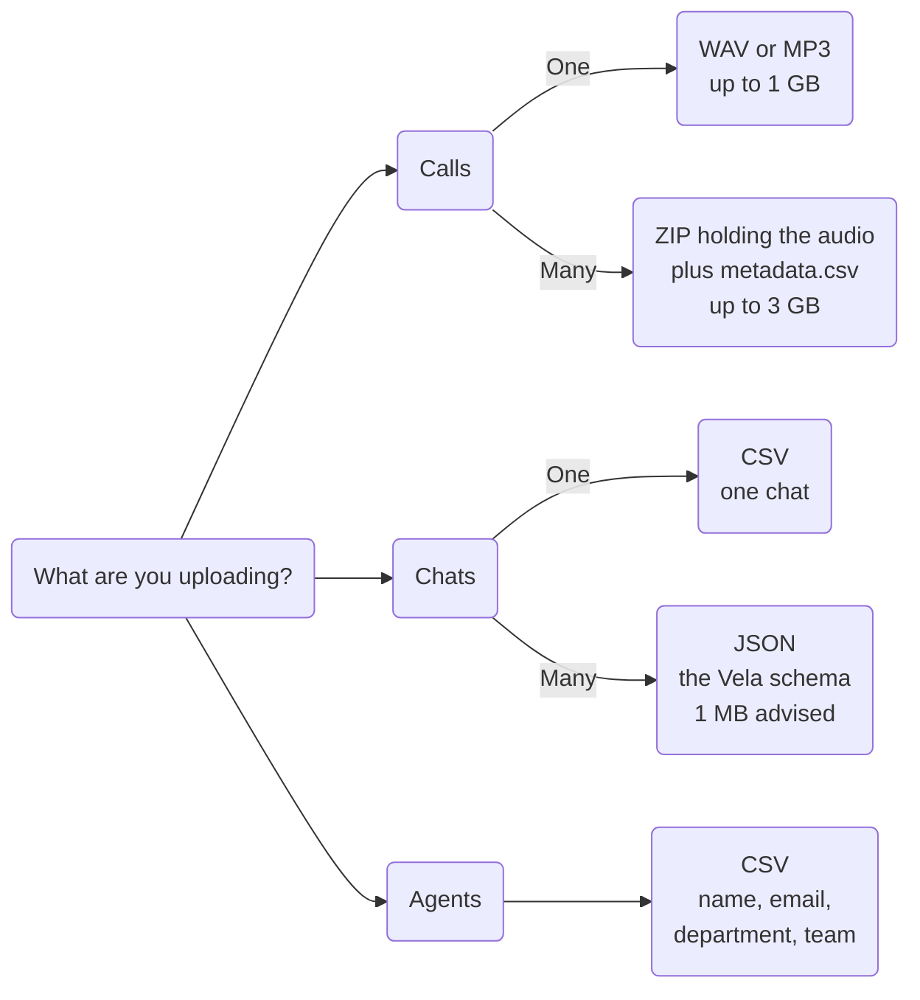

# System Requirements

This page lists the technical requirements for using Vela.

---

## Browser Requirements

### Supported Browsers

Vela is a web-based platform. Use a current version of one of the following browsers:

- **Google Chrome**
- **Microsoft Edge**
- **Mozilla Firefox**
- **Safari**

Keep your browser up to date. Older versions may not support the features Vela relies on.

Vela is built for desktop and laptop browsers. It is not built for phones or small screens.

---

## Network Requirements

### Firewall and Proxy

Vela is a web application. If your organisation uses a restrictive firewall or proxy, allow outbound HTTPS (port 443) to the domains below. Real-time updates use WebSocket connections over these same domains.

**Allow these domains:**

- `*.botlhale.ai`, `*.botlhale.tech`, and `*.botlhale.xyz`: Vela is served across all three, so allow every one of them.
- `*.amazonaws.com`: AWS S3. Vela fetches audio playback, report downloads, and CSV templates from time-limited S3 links, so blocking this domain breaks those rather than the upload itself. An upload goes to Vela's own servers and is unaffected.

---

## File Format Requirements

The format you need depends on what you are uploading and whether it is one file or many. The sections below give the full specification for each.



Three separate screens take these formats: the calls upload page (**Single Upload** and **Bulk Upload** tabs), the chats upload page (**Upload** and **Bulk Upload** tabs), and the **Add Agent** modal's **Batch Upload** tab. Check which one you are on before preparing the file. The chat tabs reject anything else outright. The bulk call tab also takes RAR and 7z, which Vela cannot read, so send it a ZIP. See [Upload Your Data](../data-upload.md).

### Audio Files (Calls)

**Supported Formats:**

| Format | Extension | Recommended Use | Notes |
|--------|-----------|----------------|-------|
| **WAV** | `.wav` | High-quality recordings | Uncompressed, larger file sizes |
| **MP3** | `.mp3` | Standard recordings | Compressed, smaller file sizes |

**Channels:** Mono and stereo recordings both work. Vela identifies the speakers automatically, so the agent and customer do not need to be on separate channels.

:::tip Audio Quality Impact
Clearer source audio produces more accurate transcriptions and better AI analysis. Background noise, overlapping speakers, and heavily compressed recordings all reduce accuracy.
:::

**File Size Considerations:**
- **Maximum size:** 1 GB per file (WAV or MP3)
- Longer files take more time to process

Files larger than 1 GB are rejected before the upload begins.

### Chat Conversations

**Required Format:**
- **File type:** CSV (`.csv`) for a single chat, JSON (`.json`) for a bulk upload. Each tab accepts only its own format.
- **Encoding:** UTF-8
- **Structure:** For bulk uploads, the Vela JSON schema (see the example below, and [Upload Your Data](../data-upload.md)). For a single chat, select the **example** link on the upload page to download a sample CSV.
- **Maximum size:** 3 GB for a single chat CSV. The **Bulk Upload** tab advises keeping each JSON file to 1 MB and one file at a time, so split a large export into several files rather than uploading one big one.

**JSON Structure Example:**
```json
[
    {
        "metadata": {
            "date": "DD/MM/YYYY, HH:mm:ss",
            "agent": "agent@example.com",
            "interaction_id": "unique_identifier",
            "language": "en-ZA"
        },
        "messages": [
            {
                "message": "Message text here",
                "time": "DD/MM/YYYY, HH:mm:ss",
                "sender": "user",
                "language": "en-ZA"
            }
        ]
    }
]
```

**Required fields:** every message must have `message`, `time`, and `sender`. `language` is optional.

:::warning Use the exact `sender` values
For the customer's messages, use `user`, not `customer`. Use `agent` or `bot` for the other side. Response-time metrics are calculated from `user` messages, so any other value for the customer leaves those figures wrong. The file still uploads, so the problem is silent rather than a visible error.
:::

### Bulk Upload (ZIP)

Use bulk upload to import many call recordings at once.

| Specification | Requirement | Notes |
|--------------|-------------|-------|
| **Format** | ZIP (`.zip`) | Standard ZIP compression |
| **Maximum size** | 3 GB | Rejected before the upload begins if the ZIP is larger |
| **Contents** | Audio files plus `metadata.csv` | Every file named in the CSV must be present |
| **Metadata format** | CSV (`.csv`) | UTF-8 encoding required |

For the `metadata.csv` column definitions and a worked example, see [Upload Your Data](../data-upload.md).

### Agent Import (CSV)

Used to add many agents at once, covered in [Administrator Setup](./quick-start/administrator-setup.md).

| Specification | Requirement |
|---|---|
| **File type** | CSV (`.csv`) |
| **Encoding** | UTF-8 |
| **Required columns** | `name`, `email`, `department`, `team` |

```csv
name,email,department,team
John Smith,john.smith@company.com,Sales,Sales Team
Mary Johnson,mary.johnson@company.com,Customer Service,Support Team
```

**Validation rules:**
- Email addresses must be unique across Vela, and are required only where your organisation uses Voice Profiles or Coaching
- `name`, `department`, and `team` cannot be empty
- Team and department names must match existing entries, unless you chose to create unmatched ones on upload

The upload confirming receipt does not mean every row was added. A row with a name that already exists in your organisation is dropped silently. See [Administrator Setup](./quick-start/administrator-setup.md#step-3a-bulk-import-agents-via-csv).

---

## Processing Times

Processing time varies with call length, audio quality, number of speakers, and server load. Longer calls take longer to process, and large batches take longer than single files. For a large historical import, upload during off-peak hours or overnight.

---

## Authentication Requirements

### Supported Methods
- **Single Sign-On (SSO)**  
  - Google, for organisations using Google accounts  
  - Microsoft, for organisations using Microsoft accounts  
- **Email and password**, where SSO is not used

### Password Requirements

Passwords must meet a minimum length and mix of characters. For the full list, and how to change your password, see [Password Requirements](../settings-config/account-security.md#password-requirements).

### Multi-Factor Authentication (MFA)
- Vela does not have native MFA. If your organisation uses SSO, MFA can be enforced through your identity provider's own settings.
- Contact your IT administrator to enable MFA through your Google or Microsoft account.

---

## Data Export

| What you can export | Where | Format |
| :--- | :--- | :--- |
| A report | Reports, download icon on a row | PDF or DOCX |
| An interaction's scorecard | The Scorecard tab, download icon | CSV |
| Smart Search insights | A search's results, **Download Detailed Insights** | PDF |
| A list of interactions | Interactions, **Export** | CSV |
| Agent performance | Agents → Performance, **Export** | CSV |
| The agent list | Agents → Agent Details, **Export** | CSV |

Downloading a report as DOCX opens in a new tab, so allow pop-ups for the Vela domain if that download does nothing when selected. The other downloads in this table save directly, without a pop-up.

---

## Language Support

The interface is in English. Transcription covers the 11 spoken official South African languages. These are Afrikaans, English, isiNdebele, isiXhosa, isiZulu, Sesotho (Southern Sotho), Sepedi (Northern Sotho), Setswana, siSwati, Tshivenda, and Xitsonga.

:::tip Language Accuracy
Transcription accuracy is highest when:
- Audio quality is good (minimal background noise)
- Speakers have clear pronunciation
:::

---

## Security

This section covers the security controls you manage inside Vela. For how your data is hosted, encrypted, backed up, and the standards Vela meets, see [Security and Compliance](../security-compliance.md).

### Redaction
Vela can automatically mask sensitive information in transcripts. Once an administrator has configured which details to mask, calls and chats are redacted for everyone by default, and the administrator grants **View Redactions** to the accounts that need to see them unmasked. For the full workflow, see [Access Requests](../settings-config/access-requests-audits.md).

### Access Level
A user's access level, organisational, departmental, or team, controls what data they can see. See [Roles and Access Levels](../settings-config/access-control.md).

### Sessions
A session expires after 24 hours, after which you sign in again. See [Security and Compliance](../security-compliance.md).

### User Device Security
- Keep browsers up to date
- Lock devices when unattended
- Log out when using a shared computer

---

## Troubleshooting

If Vela does not load, an upload fails, or audio does not play, see [General Issues](../support/troubleshooting-guide.md). It covers each of these with step-by-step resolutions.

---

## Next Steps

- [Administrator Setup](./quick-start/administrator-setup.md): set Vela up before anyone else uses it
- [Team Lead Quick Start](./quick-start/team-lead-quick-start.md): review interactions, coach agents, and monitor performance
- [Upload Your Data](../data-upload.md): the upload steps for the formats listed above

---

## Need Help?

**Contact Support:** support@botlhale.ai

**Before contacting support, provide:**
- Browser type and version
- Operating system details
- Description of the issue and steps to reproduce
- Screenshots or error messages (if available)
