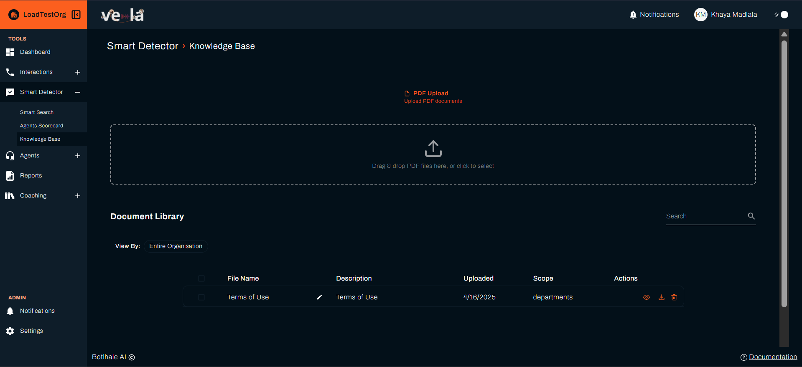

# Build Your Team's Knowledge Base

Create a smart, searchable repository of company information that empowers your agents to provide better service, answer questions confidently, and continuously improve their knowledge.

## What You Can Achieve

A well-built knowledge base enhances your team's capabilities. You'll be able to:

| **Agent Empowerment** | **Service Quality** | **Continuous Learning** |
|---------------------|-------------------|----------------------|
| Give agents instant answers | Ensure consistent responses | Build collective knowledge |
| Reduce training time | Improve accuracy and speed | Keep information current |
| Centralise company knowledge | Maintain quality standards | Foster knowledge sharing |

---

## Getting Started with Knowledge Base

### Step 1: Access Knowledge Base

- [ ] **Go to "Smart Detector" → "Knowledge Base"**
- [ ] **Click "Upload"** to start building your knowledge base
- [ ] **Choose your content focus** based on your team's needs

### Step 2: Upload Your Content
- [ ] **Add company documents** (PDFs or URLs)
- [ ] **Set a scope** (organisation, department, or team) to control which users the document is visible to
- [ ] **Add a description** to help identify the document's purpose

---

## Knowledge Base Content Types

### Essential Information
| **Content Category** | **What to Include** | **Business Value** |
|---------------------|-------------------|------------------|
| Product Information | Features, specifications, pricing, availability | Accurate product knowledge, reduced errors |
| Service Policies | Procedures, guidelines, escalation processes | Consistent service delivery, compliance |
| Troubleshooting Guides | Common issues, solutions, workarounds | Improved problem resolution, enhanced satisfaction |
| Training Materials | Best practices, scripts, techniques | Skill development, performance improvement |

### Advanced Content
| **Content Type** | **Purpose** | **Implementation** |
|-----------------|-------------|------------------|
| FAQ Collections | Quick answers to common questions | Reduce repetitive inquiries, improve efficiency |
| Process Documentation | Step-by-step procedures and workflows | Standardise operations, reduce errors |
| Compliance Information | Regulatory requirements and standards | Ensure compliance, reduce risk |
| Best Practice Guides | Proven techniques and strategies | Improve performance, share excellence |

---

## Building Your Knowledge Base

### Content Quality Standards
- [ ] **Keep it current** - Update information regularly
- [ ] **Be specific** - Provide clear, actionable information
- [ ] **Use clear language** - Write for your audience
- [ ] **Include examples** - Make information practical and useful

### Access Control
Each document is assigned a **scope** that determines which users can see and use it:

| **Scope** | **Who Has Access** |
|-----------|-------------------|
| **Organisation** | All users in the organisation |
| **Department** | Users belonging to the selected department(s) |
| **Team** | Users belonging to the selected team(s) |

---

## Optimising Content Discoverability

### Content Discovery
- [ ] **Use descriptive titles** that clearly indicate what the document covers
- [ ] **Write a clear description** when uploading so users know when to apply it
- [ ] **Assign the correct scope** so the document is only visible to the teams that need it

---

## Knowledge Base Management

### Content Lifecycle
Manage your knowledge base content effectively:

| **Stage** | **Action** | **Timeline** |
|-----------|------------|--------------|
| **Creation** | Add new content with proper organisation | As needed |
| **Review** | Check accuracy and relevance | Monthly |
| **Update** | Modify content based on feedback and changes | Quarterly |
| **Archive** | Remove outdated or irrelevant content | Annually |

### Quality Assurance
- [ ] **Regular content reviews** to ensure accuracy
- [ ] **Expert validation** for technical or complex content

### Continuous Improvement
- [ ] **Monitor search patterns** to identify gaps
- [ ] **Gather agent feedback** on content usefulness
- [ ] **Track customer satisfaction** improvements
- [ ] **Update content** based on business changes

---

## Troubleshooting Common Issues

| **Problem** | **Cause** | **Solution** |
|-------------|-----------|--------------|
| **Low usage rates** | Poor content, difficult navigation, lack of training | Improve content quality, simplify navigation, provide training |
| **Search not finding content** | Poor keywords, unclear organisation, missing content | Optimise search terms, reorganise content, add missing information |
| **Outdated information** | Infrequent updates, no review process | Establish update schedule, assign content owners, regular reviews |
| **Agent resistance** | Poor training, unclear benefits, difficult access | Provide thorough training, demonstrate benefits, improve accessibility |

---

## Best Practices for Knowledge Base

### Content Strategy
- [ ] **Start with essentials** - Focus on most-needed information first
- [ ] **Keep it simple** - Use clear, concise language
- [ ] **Update regularly** - Maintain current and accurate information
- [ ] **Get feedback** - Involve agents in content development

### User Experience
- [ ] **Make it searchable** - Optimise for quick discovery
- [ ] **Organise logically** - Use intuitive categories and structure
- [ ] **Keep it accessible** - Ensure easy access during interactions
- [ ] **Provide examples** - Make information practical and actionable

### Management
- [ ] **Assign ownership** - Designate content managers and reviewers
- [ ] **Establish processes** - Create workflows for content updates
- [ ] **Monitor usage** - Track effectiveness and identify improvements
- [ ] **Celebrate success** - Recognise when knowledge base helps improve performance

---

## Next Steps

| **For Smart Monitoring** | **For Performance Evaluation** | **For Team Development** |
|-------------------------|-------------------------------|------------------------|
| [Set Up Smart Monitoring](./smart-detector-overview.md) | [Create Agent Scorecards](./agent-scorecard-guide.md) | [Improve Agent Performance](./Agents.md) |

### See also
- [Smart Search Guide](./smart-search-guide.md) - Create custom search patterns
- [Agent Performance](./Agents.md) - Coach your team effectively
- [Smart Monitoring](./smart-detector-overview.md) - Set up automated alerts
- [Dashboard Overview](./Dashboard.md) - Monitor team performance
- [Official API Documentation](https://docs-apis.botlhale.ai) - Complete API reference for integrations

## Need Help?

- **Contact Support**: support@botlhale.ai
