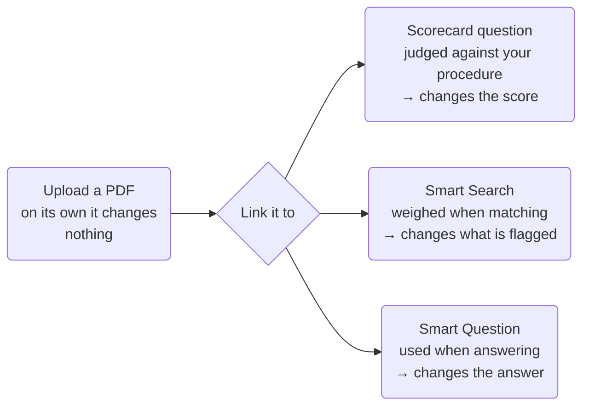
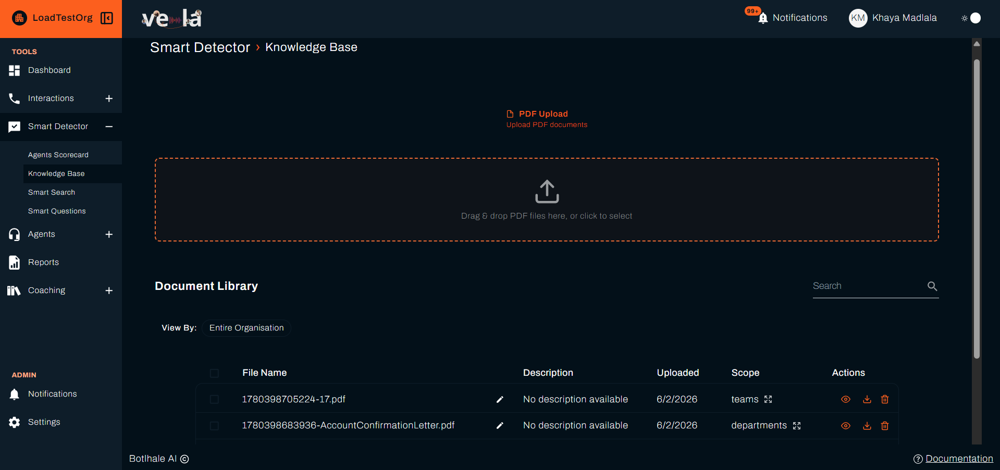
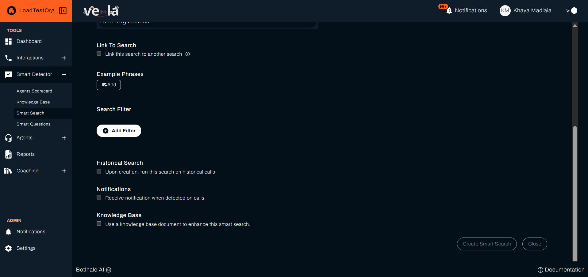

# Build Your Knowledge Base

## What the Knowledge Base Does in Vela

The Knowledge Base stores your organisation's procedures, policies, scripts, and product information as uploaded documents. On its own, a document does nothing. You link it to the feature that should use it, and Vela's AI then reads that document as reference when it evaluates an interaction.

You can link a Knowledge Base document to:

- an **Agent Scorecard question**, so the AI judges that question against your written procedure rather than generic wording. This shapes the automatic score.
- a **Smart Search**, so the AI weighs your document when deciding whether an interaction matches. This sharpens what the search flags, it does not change the score.
- a **Smart Question**, so the AI uses your document when answering the question.

In every case you link the document the same way: in that item's configuration, turn on the Knowledge Base option and select the document.

```mermaid
flowchart LR
    U("Upload a PDF<br/>on its own it changes<br/>nothing") --> L{"Link it to"}
    L --> S("Scorecard question<br/>judged against your procedure<br/>→ changes the score")
    L --> M("Smart Search<br/>weighed when matching<br/>→ changes what is flagged")
    L --> Q("Smart Question<br/>used when answering<br/>→ changes the answer")
```

Uploading is only half of it. A document nobody has linked is the most common reason the Knowledge Base appears to have no effect.

Administrators and team leads manage the Knowledge Base. Agents do not upload or manage documents.

---

## Before You Begin

You need:

- **Your document as a PDF.** The Knowledge Base accepts PDF only. Convert a Word or Google document before you start.
- **To know which teams the document applies to.** You set a scope on upload, and it decides who can see and use the document. Getting this wrong is the usual reason a colleague cannot find a document you uploaded, and scope is fixed once the document is in, so decide it before you upload rather than after.
- **Somewhere to link it.** A document on its own does nothing. Have the scorecard question, Smart Search, or Smart Question in mind that should use it, and turn on the Knowledge Base option there once the document is uploaded.

---

## Uploading a Document

### Step 1: Navigate to the Knowledge Base

In the left sidebar, select **Smart Detector**, then **Knowledge Base**.

### Step 2: Upload Your Document

1. Drag a PDF onto the upload area, or select the area to browse for one. Knowledge Base accepts PDF files.

   Until you choose a file, the page shows only the upload area and the Document Library. The description, scope, and upload button appear once a file is waiting.
2. Add a **Description** (optional). Say what it covers and which teams or situations it applies to, so you can identify the document later when linking it.
3. Set the document's scope under **Apply documents to**: the organisation, a department, or a team. The scope controls which users can see and use the document. Set it to match the teams whose interactions the document is relevant to.
4. Select **Upload Files**.

### Step 3: Link the Document

Uploading a document makes it available in the Knowledge Base, but Vela only uses it once you link it to a scorecard question, a Smart Search, or a Smart Question. The steps are the same for each. Linking to a Smart Search is shown here:

1. Navigate to **Smart Detector → Smart Search**.
2. Open or create the Smart Search you want to link the document to.
3. In the Smart Search configuration, turn on the Knowledge Base option and select your document.
4. Save the Smart Search.

To use the document when **scoring**, link it to an Agent Scorecard question instead, in the same way, under **Smart Detector → Agents Scorecard**. The AI then judges that question against the document rather than generic wording.

:::tip Picking the document on the question form
Setting **Apply Knowledge Base** to **Yes** on a scorecard question opens a **Knowledge Base Document** box on the spot. It has a search field for finding one of your existing documents, and a preview so you can check you picked the right one.

The document has to be in the Knowledge Base already. Upload it there first, then write the question.
:::

### Working with the Document Library

The table below the upload area is where you manage what is already there:

| Control | What it does |
| :--- | :--- |
| The tick box on a row | Selects the document. **Select all** at the head of the column takes every row |
| **Download selected documents** | Downloads everything you have ticked in one go |
| **Download document** | Downloads that one document |
| The **expand** icon | Opens a summary of that document's scope, listing the departments or teams it applies to |
| **Edit filename** | Renames the document in Vela |
| **Delete** | Removes the document from the Knowledge Base, after a confirmation |

Renaming updates the document everywhere it is listed. Anything already linked to it stays linked, so a clearer name is safe to give at any time.

---

## What to Upload

Upload documents that define how agents should behave in specific situations. These are the materials you would hand a new agent and say "follow this". Useful content includes:

- Call scripts and opening or closing statement requirements
- Escalation procedures and criteria
- Compliance obligations and mandatory disclosures
- Product or service information that agents are expected to communicate accurately
- Objection-handling frameworks and approved responses

The test is whether a document describes an observable agent action. The AI reads these to assess what agents said and did, so material written for another purpose, such as background reading or marketing copy, leaves scoring accuracy where it was.

---

## Access Control

Each document is assigned a scope that determines which users can access it:

| **Scope** | **Who Has Access** |
|-----------|-------------------|
| **Organisation** | All users across the organisation |
| **Department** | Users belonging to the selected department |
| **Team** | Users belonging to the selected team |

Set the scope to match the teams whose calls the document is relevant to. A compliance procedure that applies to the whole organisation should be scoped to Organisation. A script specific to one team's product line should be scoped to that team.

---

## Keeping the Knowledge Base Current

Update documents when procedures change. AI scoring based on an outdated procedure document produces results that conflict with your current standards, which undermines both the scoring accuracy and agent confidence in the feedback they receive.

When a procedure is updated, upload the new version with a description that reflects the change and the date it took effect. If the old version is no longer applicable, remove it from the Knowledge Base to prevent confusion.

Before deleting a document, check what still points at it. A scorecard question, Smart Search, or Smart Question that referenced a deleted document falls back to judging against general wording rather than your procedure, and the score it produces changes without anyone editing the question. Relink those items to the new version rather than leaving them pointing at nothing.

Review the documents in your Knowledge Base at least quarterly and whenever a significant policy or process change occurs.

---

## Troubleshooting

**The Knowledge Base document does not appear to be affecting AI scoring.**

Confirm that the document has been explicitly linked to the item that should use it: a scorecard question, a Smart Search, or a Smart Question. To affect the score, it must be linked to a scorecard question. Uploading a document to the Knowledge Base does not apply it anywhere on its own. You create the link yourself in that item's configuration.

**Uploaded document is not visible to certain team leads or agents.**

Check the scope on the document with the **expand** icon on its row, which lists the departments or teams it covers. Users outside that scope do not see it.

Scope is fixed at upload. The Document Library lets you rename and delete a document, so widening access means uploading it again with the wider scope and deleting the original. Relink anything that pointed at the old copy.

---

## Check Your Work

The document appears in the **Document Library** with its name, description, upload date, and scope. That confirms the upload, not that Vela is using it.

To confirm it is actually in use, open the scorecard question, Smart Search, or Smart Question you linked it to and check that **Apply Knowledge Base** is on and your document is the one selected. A document that is uploaded but linked to nothing changes no scores and flags no interactions.

---

## Related

- [Set Up Smart Search](./smart-search-guide.md): link a document to a search so the AI matches against it
- [Review and Score Interactions](./features/quality-assurance-tools.md): review and score the interactions your documents help assess
- [Monitor Agent Performance](./features/monitor-agent-performance.md): track how an agent's scores move over time
- [Administrator Setup](./getting-started/quick-start/administrator-setup.md): build the Knowledge Base as part of initial configuration
- [Security and Compliance](./security-compliance.md): where the documents you upload are held, and how they are encrypted

## Need Help?

**Contact Support:** support@botlhale.ai
