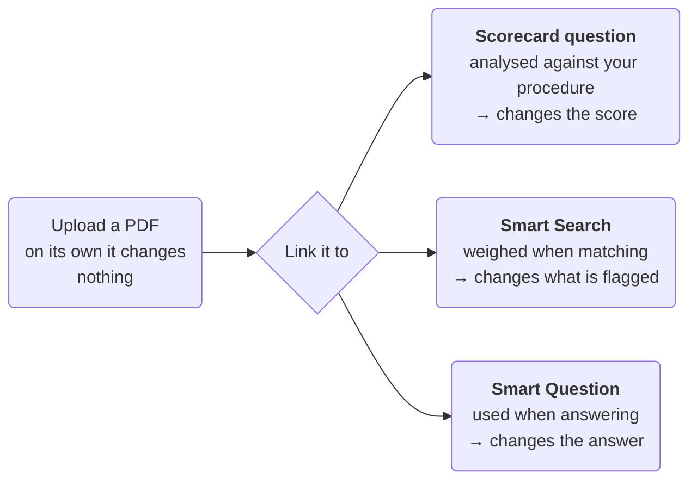
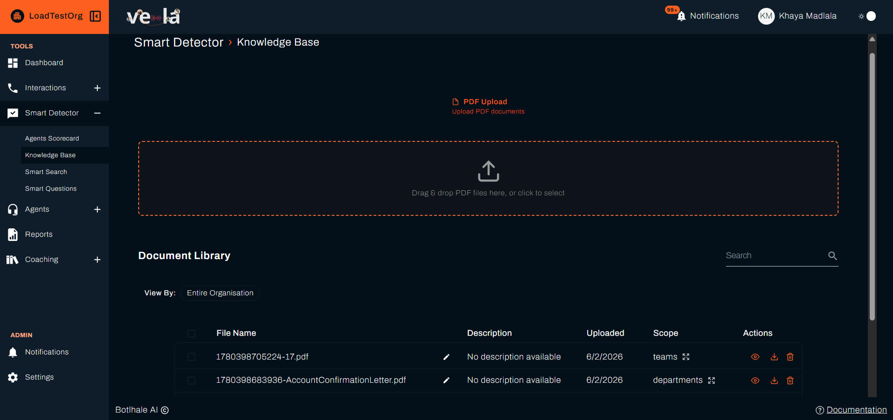
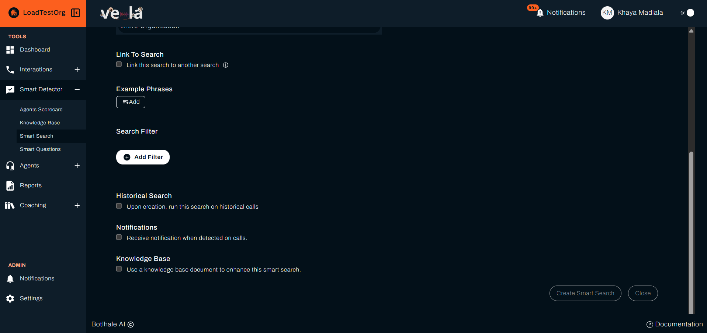

# Build Your Knowledge Base
The Knowledge Base holds your organisation documents, so the AI can analyse interactions against your procedures and product information instead of generic wording.

:::tip In short
By the end you will have a PDF in the Knowledge Base, linked to the scorecard question, Smart Search, or Smart Question that should use it.

1. [Upload your document](#step-2-upload-your-document) under **Smart Detector → Knowledge Base**, choose its scope under **Apply documents to** where your access level shows it, then select **Upload Files**.
2. [Link the document](#step-3-link-the-document) by turning on the Knowledge Base setting in the item's own form.
3. [Keep the Knowledge Base current](#keeping-the-knowledge-base-current) by uploading the new version when a procedure changes, then linking it in place of the old one.
:::

---

## Before You Begin

You need:

- **Your document as a PDF.** The Knowledge Base accepts PDF only. Convert a Word or Google document before you start.
- **To know which teams the document applies to.** Choose your document's scope carefully. Scope is set at upload and stays with the document, so include every team whose colleagues need to find it.
- **Somewhere to link it.** Vela uses a document once you link it. Have the scorecard question, Smart Search, or Smart Question in mind that should use it, and turn on the Knowledge Base option there once the document is uploaded.

---

## What the Knowledge Base Does in Vela

The Knowledge Base stores your organisation's procedures, policies, scripts, and product information as uploaded documents. You link each document to the feature that should use it, and Vela's AI then reads that document as reference when it evaluates an interaction.

You can link a Knowledge Base document to:

- an **Agent Scorecard question**, so the AI analyses that question against your written procedure rather than generic wording. This shapes the automatic score.
- a **Smart Search**, so the AI weighs your document when deciding whether an interaction matches. This sharpens what the search flags but does not change the score.
- a **Smart Question**, so the AI uses your document when answering the question.

You link it the same way each time. In the item's own form, turn the Knowledge Base setting on and pick the document. The setting reads **Apply Knowledge Base** on a scorecard question or a Smart Question, and **Use a knowledge base document to enhance this smart search** on a Smart Search.

```mermaid
flowchart LR
    U("Upload a PDF<br/>on its own it changes<br/>nothing") --> L{"Link it to"}
    L --> S("<b>Scorecard question</b><br/>analysed against your procedure<br/>→ changes the score")
    L --> M("<b>Smart Search</b><br/>weighed when matching<br/>→ changes what is flagged")
    L --> Q("<b>Smart Question</b><br/>used when answering<br/>→ changes the answer")
```

Administrators and team leads manage the Knowledge Base. Agents do not upload or manage documents.

---

## Uploading a Document

### Step 1: Navigate to the Knowledge Base

In the left sidebar, select **Smart Detector**, then **Knowledge Base**.

### Step 2: Upload Your Document

1. Drag one or more PDFs onto the upload area, or select the area to browse for them. Knowledge Base accepts PDF files.

   Until you choose a file, the page shows only the upload area and the Document Library. The description, scope, and upload button appear once a file is waiting.
2. Each file you add gets a card of its own. Add a **Description** (optional) on each, saying what it covers and which teams or situations it applies to, so you can identify the document later when linking it. Select the cross on a card to remove that file before uploading.
3. With organisational or departmental access, set the scope under **Apply documents to**, choosing the organisation, a department, or a team. It applies to every file in the batch, and controls which users can see and use the documents. Set it to match the teams whose interactions they are relevant to. With team access, the documents are scoped to your team automatically. See [Access Control](#access-control).
4. Select **Upload Files**.

### Step 3: Link the Document

Uploading a document makes it available in the Knowledge Base, but Vela only uses it once you link it to a scorecard question, a Smart Search, or a Smart Question. The steps are the same for each. Linking to a Smart Search is shown here:

1. Navigate to **Smart Detector → Smart Search**.
2. Select **New Smart Search**, or select the name of the search you want to link the document to.
3. At the foot of the form, turn on **Use a knowledge base document to enhance this smart search** and select your document.
4. Select **Create Smart Search** on a new search, or **Save Changes** on an existing one.

To use the document when **scoring**, link it to an Agent Scorecard question instead, in the same way, under **Smart Detector → Agents Scorecard**. The AI then analyses that question against the document rather than generic wording.

:::tip Picking the document on the question form
Setting **Apply Knowledge Base** to **Yes** on a scorecard question opens a **Knowledge Base Document** box on the spot. It has a search field for finding one of your existing documents, and a preview so you can check you picked the right one.

The document has to be in the Knowledge Base already. Upload it there first, then write the question.
:::

### Working with the Document Library

**View By** above the table sets how much of the organisation the list covers, and **Search** narrows it by wording. See [Smart Detector](./smart-detector-overview.md#what-the-tools-share).

The table below the upload area is where you manage what is already there:

| Control | What it does |
| :--- | :--- |
| The tick box on a row | Selects the document. **Select all** at the head of the column ticks every row |
| **Download**, above the table | Appears once a row is ticked. Downloads everything you have ticked in one go |
| **Delete**, above the table | Appears once a row is ticked. Deletes everything you have ticked, after a confirmation. See [Keeping the Knowledge Base Current](#keeping-the-knowledge-base-current) before using it on a linked document |
| The **eye** icon | Opens the document to read it without downloading |
| **Download document** | Downloads that one document |
| The **expand** icon, beside the scope in the **Scope** column | Opens **Document Scope**, listing the departments or teams the document applies to. Shown only on documents scoped to specific departments or teams. An organisation-wide document has none, and its **Scope** column reads `organisation` |
| The **pencil** icon, beside the file name (**Edit filename**) | Renames the document in Vela |
| **Delete**, on a row | Removes that one document from the Knowledge Base, after a confirmation |

Renaming updates the document everywhere it is listed. Anything already linked to it stays linked, so a clearer name is safe to give at any time.

---

## What to Upload

Upload documents that define how agents should behave in specific situations. These are the materials you would hand a new agent and say "follow this". Useful content includes:

- Call scripts and opening or closing statement requirements
- Escalation procedures and criteria
- Compliance obligations and mandatory disclosures
- Product or service information that agents are expected to communicate accurately
- Objection-handling frameworks and approved responses

The test is whether a document describes an observable agent action. The AI reads these to assess what agents said and did. Material written for another purpose, such as background reading or marketing copy, does not improve scoring.

---

## Access Control

Each document is assigned a scope that determines which users can access it. Under **Apply documents to**, the options depend on your own access level:

| **Scope** | **Who Has Access** |
|-----------|-------------------|
| **Entire Organisation** | All users across the organisation |
| **Specific Departments** (or **Entire Department**, if your own access is departmental) | Users belonging to the department or departments you selected |
| **Specific Teams** | Users belonging to the teams you selected |

With team access, your documents are scoped to your own team automatically, and the form shows your team's name in place of **Apply documents to**. {/* ENGINEERING (known bug, documented as intended): the team-access line reads "Applying search to:" on the Knowledge Base upload form (batchUpload.jsx:458@vela-fly). Intended: "Applying documents to:". Converted from visible text 2026-10-08. */}

Set the scope to match the teams whose calls the document is relevant to. A compliance procedure that applies to the whole organisation should be scoped to **Entire Organisation**. A script specific to one team's product line should be scoped to that team.

The Document Library's **Scope** column, covered above, shows the same setting in shorter form and in lower case: `organisation`, `departments`, or `teams`.

---

## Keeping the Knowledge Base Current

Update documents when procedures change. An outdated procedure document makes the AI score against old standards. The results then conflict with your current procedures, and agents stop trusting the feedback.

When a procedure is updated, upload the new version with a description that reflects the change and the date it took effect, so you can tell the versions apart when you link one. If the old version is no longer applicable, remove it from the Knowledge Base to prevent confusion.

Before deleting a document, check what still points at it. Vela blocks the deletion of a document linked to a scorecard question or a Smart Question. Deleting it from its own row shows **Document is linked to a scorecard question and cannot be deleted**. {/* ENGINEERING (known bug, documented as intended): the message names a scorecard question for a Smart Question link too. Intended: the message names the kind of link. Converted from visible text 2026-10-08. */} Deleting ticked rows with **Delete** above the table removes the unlinked ones, keeps the linked ones, and shows **Failed to delete some documents**. To delete a linked document, relink those questions to another document or remove the questions first. A document linked only to a Smart Search can be deleted, so relink that search to the replacement document first. {/* UNVERIFIED: the exact match/answer behaviour of a Smart Search or Smart Question whose linked document has been deleted (general-wording fallback vs stale-embedding reuse) is not confirmed from vela or vela-data source. The KB delete route removes the document record and S3 file but does not appear to clear embeddings. Needs engineering or a live test to confirm. */} {/* ENGINEERING (known bug, documented as intended): vela origin/vela-fly knowledge_base/table.jsx:104-138, on the bulk-delete error the catch branch never calls onDelete (router.refresh() in main.jsx:51-55) and does not clear the selection, so the list keeps showing the deleted documents until the page is reloaded. Intended: the list refreshes after a partial delete. Found 2026-10-08. */}

Review the documents in your Knowledge Base at least quarterly and whenever a significant policy or process change occurs, so scoring does not rest on an outdated procedure.

---

## Troubleshooting

**The Knowledge Base document does not appear to be affecting AI scoring.**

Uploading a document is only the first step. To use it, link it in the settings of the item that should use it, whether that is a scorecard question, a Smart Search, or a Smart Question. Only a link to a scorecard question affects the score. See [Step 3: Link the Document](#step-3-link-the-document).

**Uploaded document is not visible to certain team leads or agents.**

Check the document's scope. For one scoped to specific departments or teams, select the **expand** icon beside the scope in its **Scope** column to see which ones. A document scoped to **Entire Organisation** has no expand icon, and its **Scope** column reads `organisation`. Only users within the scope shown can see the document.

Scope is fixed at upload. The Document Library lets you rename and delete a document, but not change its scope. To widen access, upload it again with the wider scope, relink anything that used the old copy, then delete the old one. To delete a document still linked to a scorecard question or Smart Question, relink those questions to another document or remove the questions first.

---

## Check Your Work

The document appears in the **Document Library** with its name, description, upload date, and scope. That confirms the upload, not that Vela is using it.

To confirm it is actually in use, open the scorecard question, Smart Search, or Smart Question you linked it to. Check that the Knowledge Base setting is on and your document is the one selected. It reads **Apply Knowledge Base** on a scorecard question or a Smart Question, and **Use a knowledge base document to enhance this smart search** on a Smart Search.

---

## Related

- [Set Up Smart Search](./smart-search-guide.md): link a document to a search so the AI matches against it
- [Review and Score Interactions](./features/quality-assurance-tools.md): review and score the interactions your documents help assess
- [Monitor Agent Performance](./features/monitor-agent-performance.md): track how an agent's scores move over time
- [Administrator Setup](./getting-started/quick-start/administrator-setup.md): build the Knowledge Base as part of initial configuration
- [Security and Compliance](./security-compliance.md): how the documents you upload are encrypted, and who to ask about where they are held

## Need Help?

**Contact Support:** support@botlhale.ai
