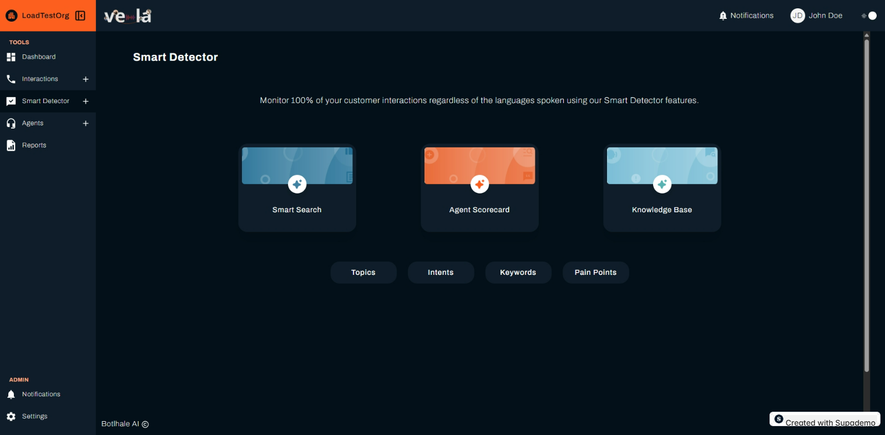
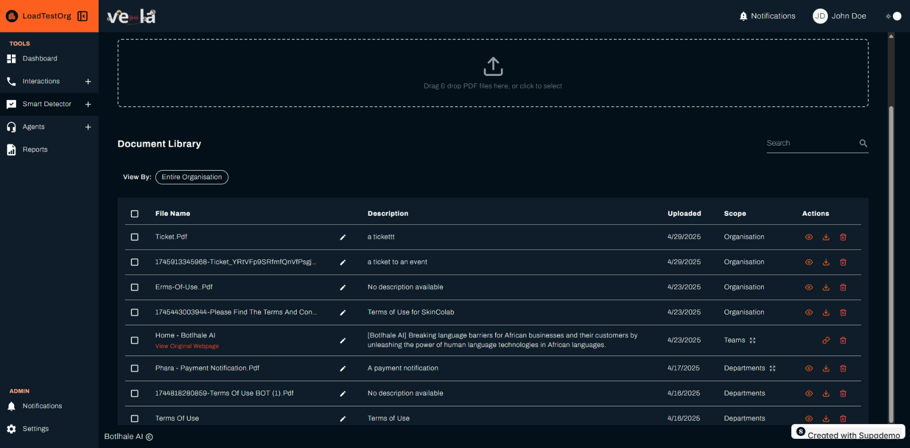

# Knowledge Base Guide

The Knowledge Base feature is a powerful AI-powered tool integrated into your call centre analytics dashboard. This system enables you to build a searchable, smart knowledge base using your own documents and URLs, delivering relevant insights to your organisation.

## Overview

The Knowledge Base allows you to upload company documents, policies, and procedures to create a centralized repository of information that agents can access during customer interactions.

## Getting Started

### Accessing Knowledge Base

1. Navigate to **Smart Detector** from the left sidebar
2. Click on the **Knowledge Base** card
3. You'll see the Knowledge Base interface with document upload and management tools

## Uploading Documents

### Supported Formats

- **PDF Files**: Primary format for document uploads
- **Text Documents**: Various text-based formats
- **URLs**: Web pages and online resources

### Upload Process

1. **Access Upload Area**: Locate the PDF upload area at the top of the page
2. **Upload Documents**:
   - **Drag and Drop**: Drag PDF files from your computer and drop them into the upload area
   - **Click to Select**: Click the upload area to open a file explorer and select files
3. **Provide Document Details**:
   - **Description**: Add a brief description of the document's content
   - **Scope**: Select the document's scope (Entire Organisation, Specific Department, or Specific Team)
4. **Complete Upload**: Click the "Upload" button to add documents to the Knowledge Base

### Document Management

Once uploaded, documents appear in the Document Library table with the following information:

- **File Name**: Name of the uploaded document
- **Description**: Brief description of the document's content
- **Uploaded**: Date when the document was uploaded
- **Scope**: Who can access the document
- **Actions**: Options to view, download, or delete the document

## Managing Your Knowledge Base

### Viewing Documents

1. **Access Document Library**: View all uploaded documents in the table
2. **Search Documents**: Use the search bar to find specific documents by name
3. **Filter by Scope**: Use the "View By" dropdown to filter documents by scope

### Document Actions

- **View**: Click the view icon (eye) to preview the document
- **Download**: Click the download icon (down arrow) to save the document to your computer
- **Delete**: Click the delete icon (trash bin) to remove the document from the Knowledge Base

### Scope Management

You can filter documents by scope using the "View By" dropdown:

- **Entire Organisation**: Shows all documents accessible to the entire organisation
- **Specific Department**: Shows documents accessible to specific departments
- **Specific Team**: Shows documents accessible to specific teams

## Best Practices

### Document Organisation

1. **Use Clear Names**: Give documents descriptive, searchable names
2. **Add Descriptions**: Provide brief descriptions to help users find relevant documents
3. **Categorise Content**: Use appropriate scopes to ensure documents reach the right audience
4. **Regular Updates**: Keep documents current and remove outdated information

### Content Guidelines

- **Relevant Information**: Upload documents that agents frequently need during calls
- **Policy Documents**: Include company policies, procedures, and guidelines
- **Product Information**: Add product specifications, pricing, and features
- **Training Materials**: Include training guides and best practices

### Security Considerations

- **Access Control**: Use appropriate scopes to control document access
- **Sensitive Information**: Ensure sensitive documents are properly secured
- **Regular Review**: Periodically review document access and permissions

## Integration with Other Features

### Smart Search Integration

The Knowledge Base integrates with Smart Search to provide relevant information during call analysis:

- **Contextual Insights**: AI can reference knowledge base content when analyzing calls
- **Agent Assistance**: Agents can access relevant information during customer interactions
- **Quality Improvement**: Knowledge base content helps improve response accuracy

### Agent Scorecard Integration

Knowledge base content can be used in agent scorecard evaluations:

- **Compliance Checking**: Verify agents are following documented procedures
- **Knowledge Assessment**: Evaluate agent familiarity with company policies
- **Training Identification**: Identify areas where agents need additional training

## Troubleshooting

### Common Issues

**Upload Failures**
- Check file format (PDF is preferred)
- Verify file size (maximum 3 GB for batch uploads)
- Ensure proper permissions and access

**Document Not Found**
- Check search terms and spelling
- Verify document scope and access permissions
- Ensure document was uploaded successfully

**Access Issues**
- Verify user permissions and scope settings
- Check if document is still active and available
- Contact administrator for access requests

## Need Help?

For additional support with Knowledge Base:
- Contact support@botlhale.ai
- Review the video tutorials on the homepage
- Check the detailed Smart Detector documentation
