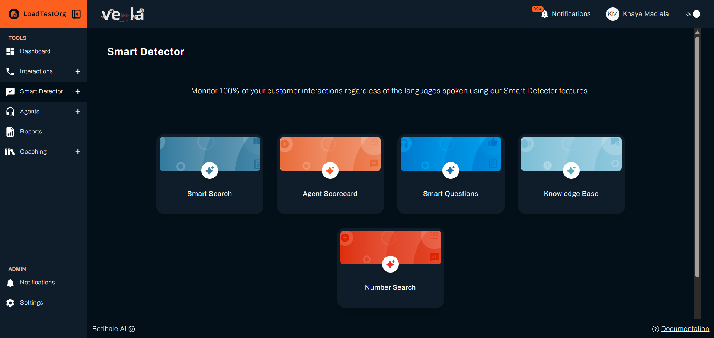
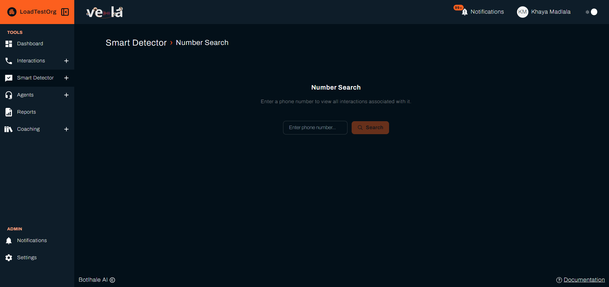
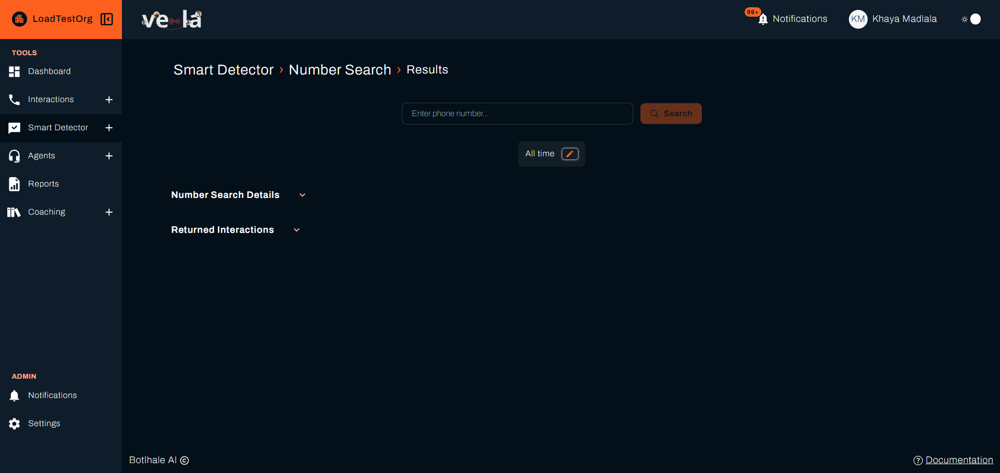
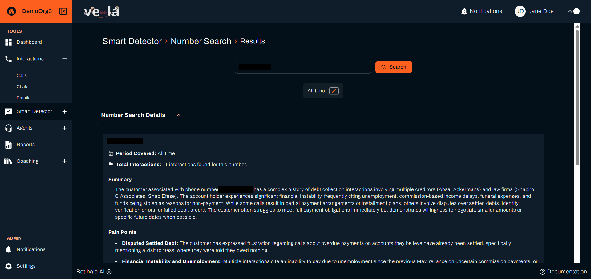
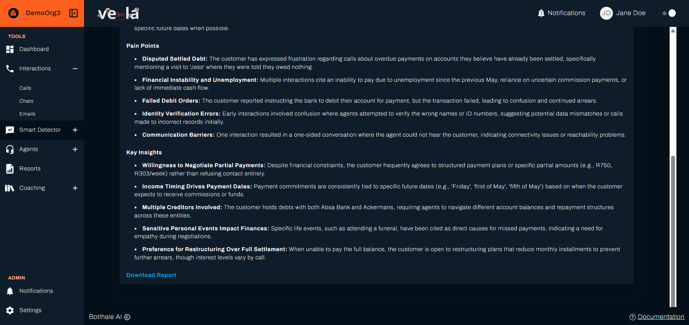
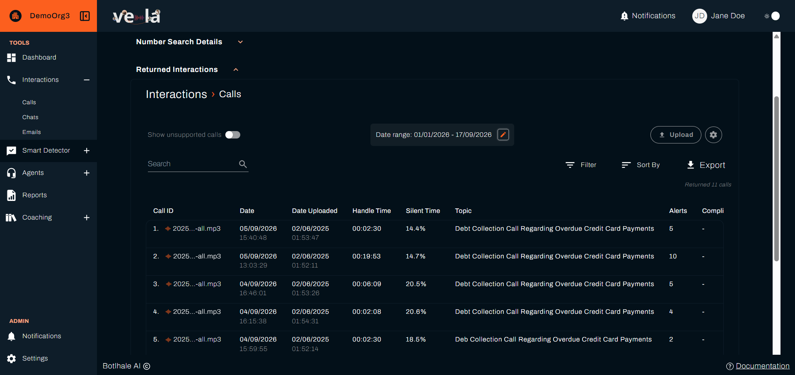
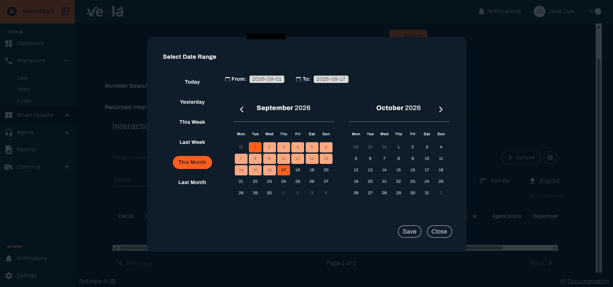

# Search by Phone Number

Number Search answers a question the Interactions list cannot. What has this customer been through? Give it a phone number, and it finds every call involving that number. It then gives you a read across the whole history, instead of one conversation at a time.

Use it before calling a customer back, or when a complaint arrives and you need the context behind it.

---

## Before You Begin

You need:

- **Interactions sent through the API.** The number comes from a `contact` field on the upload, which the API sets. Number Search therefore covers what your integration has sent, rather than anything uploaded through Vela itself. See [API Reference](./advanced/api-documentation.md).
- **The number as Vela holds it.** Vela stores what your integration sent, and matches on it exactly, so `+27821234567` and `0821234567` are different searches. Check a known call's **Number** in its **Call Details** panel to see which form your organisation uses.
- **Number Search on your plan.** It is absent on [Lite](./reference/glossary.md#lite).

---

## 1. Run a Search

1. Select **Smart Detector** in the left sidebar to open its home page.
2. Select the **Number Search** card.

   

3. Enter the number in **Enter phone number...** and select **Search**.

Before you search, the page reads **Enter a phone number to view all interactions associated with it**. That is the resting state rather than an empty result.

:::note Number Search has no sidebar entry
Like the other tools on the Smart Detector home page, you reach it through that page rather than the left sidebar.
:::

---

## 2. Read the History

The results page holds two sections, both of which open and close:

| Section | What it holds |
| :--- | :--- |
| **Number Search Details** | The number, **Period Covered**, **Total Interactions**, and the AI's read of the history |
| **Returned Interactions** | The calls themselves, in the same table as the Interactions list |

Open **Number Search Details** for three pieces of analysis across the whole history:

| Part | What it gives you |
| :--- | :--- |
| **Summary** | The customer's history and relationship with your contact centre, in a few sentences |
| **Pain Points** | Up to five recurring frustrations, unresolved issues, or bad experiences, drawn only from what the calls support |
| **Key Insights** | Up to five patterns or facts worth knowing before the next call |

Open **Returned Interactions** to reach the calls behind that read, and open any one of them to read it in full.

:::note Same period, two controls
**Returned Interactions** shows its own **Date range** control, in the calls table's own toolbar. It is synced to **Period Covered** next to the search field, so narrowing one narrows the other.
:::

The search field stays on the results page, so you can look up another number without going back.

The analysis is written from each call's topic, summary, and alerts rather than from full transcripts. It is a starting point for the conversation, not a substitute for reading the calls that matter.

---

## 3. Narrow to a Period

Select the pencil on the date control to open **Select Date Range**, which is useful when an older pattern is drowning out a recent one. **Period Covered** updates to match, and so does the **Date range** inside **Returned Interactions**.

Set **From** and **To** directly, or select one of the presets, then **Save**. **Close** discards the change.

Select **Clear date filter** to go back to the full history.

---

## 4. Take It With You

Select **Download Report** to save the results as a PDF, including the summary, pain points, key insights, and the interactions behind them.

This is the version to bring to a call or attach to an escalation, since it holds the reasoning rather than a link someone else may not be able to open.

---

## Check Your Work

A search that returns nothing when you expected results is almost always the number format rather than an absence of calls. Open a call you know involves that customer, read the **Number** on its **Call Details** panel, and search for exactly that.

Where the number is right and the count is still zero, those interactions most likely came in through Vela rather than the API. Number Search reads the number from the upload, so sending them through the API is what brings them into range.

---

## Related

- [Review and Score Interactions](./features/quality-assurance-tools.md): open and score the calls this search returns
- [Set Up Smart Search](./smart-search-guide.md): monitor every interaction for words and patterns, rather than one customer
- [Smart Detector](./smart-detector-overview.md): the other tools on that home page

## Need Help?

**Contact Support:** support@botlhale.ai
