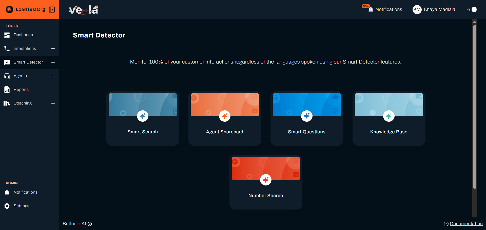
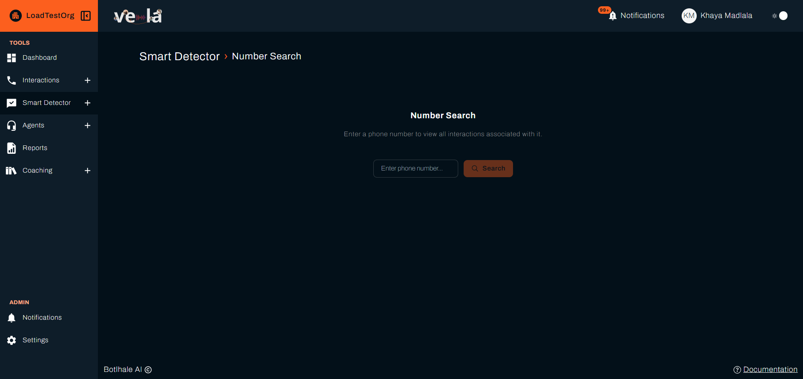
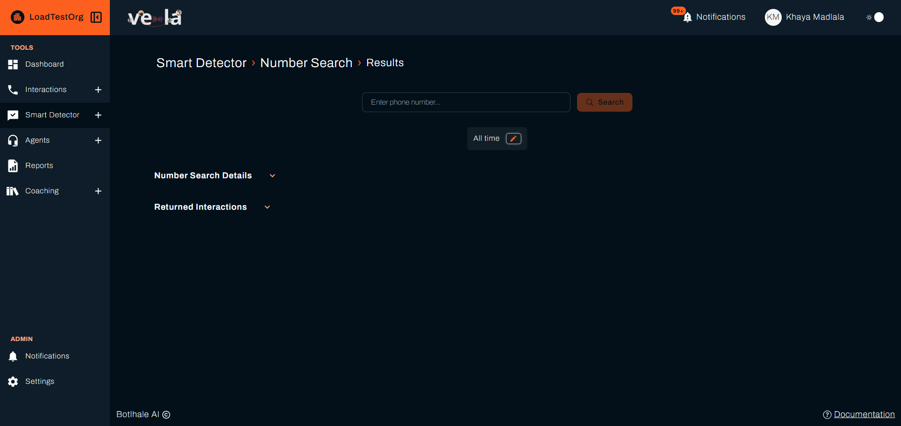
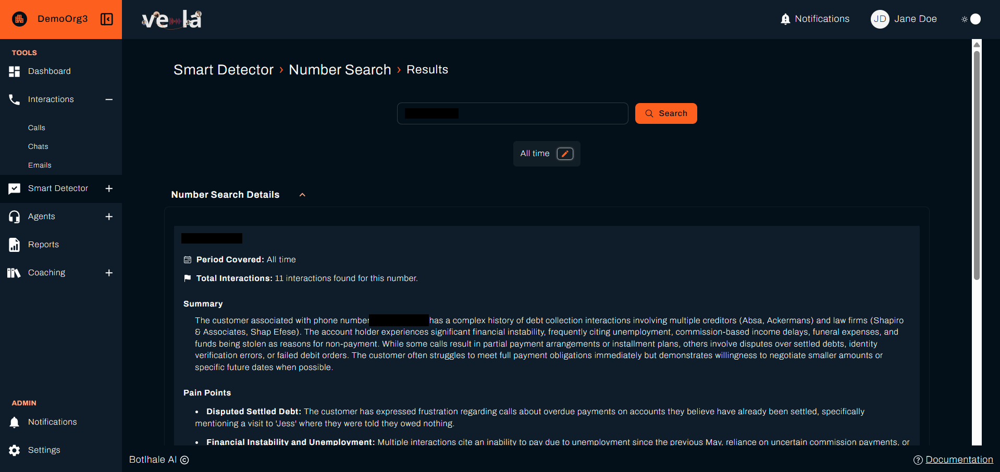
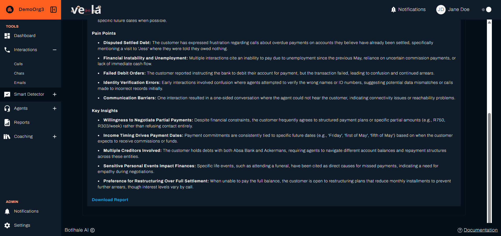
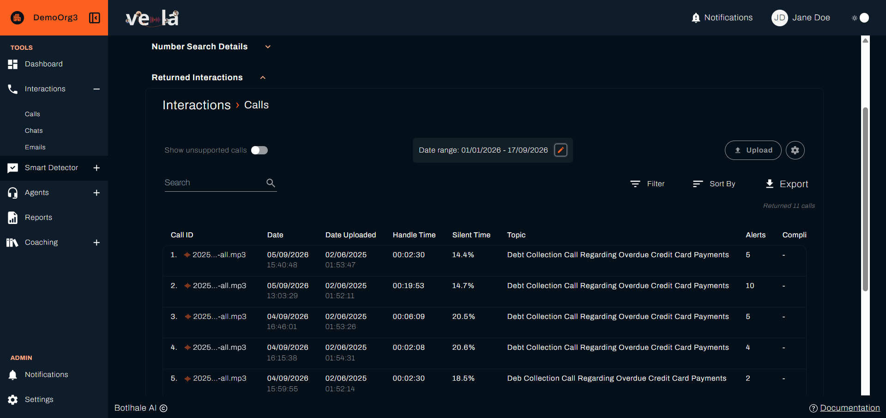
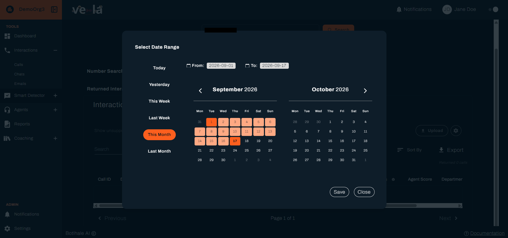

# Search by Phone Number

Number Search answers a question the Interactions list cannot. What has this customer been through? Give it a phone number, and it finds the calls involving that number within your access level. It then gives you an analysis across the customer's recent calls, instead of one conversation at a time.

Use it before calling a customer back, or when a complaint arrives and you need the context behind it.

---

## Before You Begin

You need:

- **Calls sent through the API.** The number comes from a `contact` field on the upload, which the API sets. Number Search therefore covers the calls your integration has sent, rather than anything uploaded through Vela itself. It does not search chats, even where a chat was sent with a `contact`. See [API Reference](./advanced/api-documentation.md).
- **The number as Vela holds it.** Vela stores what your integration sent, and matches on it exactly, so `+27821234567` and `0821234567` are different searches. Check a known call's **Number** in its **Call Details** panel to see which form your organisation uses.
- **Number Search on your plan.** It is absent on [Lite](./reference/glossary.md#lite).

---

## 1. Run a Search

1. Select **Smart Detector** in the left sidebar to open its home page.
2. Select the **Number Search** card.

   

3. Enter the number in **Enter phone number...** and select **Search**.

---

## 2. Read the History

The results page holds two sections. Select a section's heading to open or close it:

| Section | What it holds |
| :--- | :--- |
| **Number Search Details** | The number, **Period Covered**, **Total Interactions**, and the AI's analysis of the history |
| **Returned Interactions** | The calls themselves, in the same table as the Interactions list |

Open **Number Search Details** for three pieces of analysis across the customer's recent calls:

| Part | What it gives you |
| :--- | :--- |
| **Summary** | The customer's history and relationship with your contact centre, in a few sentences |
| **Pain Points** | Up to five recurring frustrations, unresolved issues, or bad experiences, drawn only from what the calls support |
| **Key Insights** | Up to five patterns or facts worth knowing before the next call |

Open **Returned Interactions** to reach the calls behind that analysis, and open any one of them to read it in full.

:::note Same period, two controls
**Returned Interactions** shows its own **Date range** control, in the calls table's own toolbar. It is synced to the date control below the search field, which **Period Covered** follows, so narrowing one narrows the other.
:::

The search field stays on the results page, so you can look up another number without going back.

The analysis is written from the 50 most recent calls in the period, using each call's topic, summary, and alerts rather than full transcripts. **Total Interactions** counts every call. Narrow the period to analyse older calls.

---

## 3. Narrow to a Period

Select the pencil on the date control below the search field to open **Select Date Range**, which is useful when an older pattern is drowning out a recent one. **Period Covered** updates to match, and so does the **Date range** inside **Returned Interactions**.

Set **From** and **To** directly, or select one of the presets, then **Save**. **Close** discards the change.

Select **Clear date filter** to go back to the full history.

---

## 4. Take It With You

Select **Download Report**, at the end of the **Number Search Details** section, to save the results as a PDF, with the number, the period, the interaction count, the summary, pain points, and key insights. The PDF does not list the interactions themselves.

Use the downloaded PDF when sharing outside Vela. It carries the customer's phone number in the file name and in the body, with Vela's analysis of the customer, so handle it as personal information and share it only with people who need it. This is the version to bring to a call or attach to an escalation, as it captures the reasoning behind the result and can be accessed without relying on a link or permissions.

---

## Check Your Work

A search that returns nothing when you expected results is almost always the number format rather than an absence of calls. Open a call you know involves that customer, read the **Number** on its **Call Details** panel, and search for exactly that. To see how a number was stored, search part of it in the **Interactions → Calls** list, which matches partial numbers.

Where the count is still zero after that, the calls were not sent through the API with a `contact` value.

Where **Total Interactions** is above zero and the analysis has not appeared, search again or change the date range to get it, along with its **Download Report**. {/* ENGINEERING (known bug, documented as intended): smart_detector/number_search/results/page.jsx@vela-fly, getCustomerAnalysis (from :225) catches any AI or schema error and returns an empty analysis (~:275-279). The page (:203-211) then shows "There is not enough data to generate an analysis for this number in the selected time period." even when calls were found. Intended: a message that says the analysis failed and to try again. */}

---

## Related

- [Review and Score Interactions](./features/quality-assurance-tools.md): open and score the calls this search returns
- [Set Up Smart Search](./smart-search-guide.md): monitor every interaction for words and patterns, rather than one customer
- [Smart Detector](./smart-detector-overview.md): the other tools on that home page

## Need Help?

**Contact Support:** support@botlhale.ai
