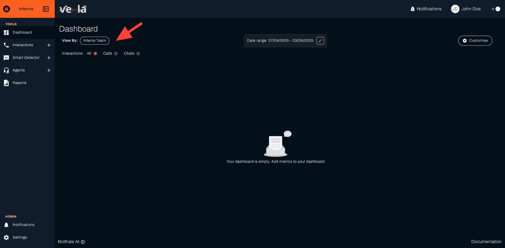

# Get Started with Vela in 5 Minutes

Welcome to Vela! This guide will help you start analyzing your call center data and improving customer experience immediately.

## What You'll Achieve

By the end of this guide, you'll be able to:
- **Monitor your team's performance** in real-time
- **Identify customer pain points** automatically
- **Generate insights** to improve customer satisfaction
- **Track agent performance** with AI-powered scoring

## Step 1: Set Up Your Dashboard (2 minutes)

**Goal**: Create a personalized view of your most important metrics

1. **Log in** to your Vela platform
2. **Click "Dashboard"** in the left sidebar
3. **Click "Customise"** in the top-right corner
4. **Select your team** from the "View By" dropdown
5. **Choose "All" interactions** to see both calls and chats
6. **Set your date range** (try "This Month" to start)
7. **Add these key metrics**:
   - Agent Distribution (see who's handling calls)
   - Average Call Duration (identify efficiency issues)
   - Agent Scores (spot training opportunities)
   - Customer Sentiment (gauge satisfaction)
8. **Click "Save"** to apply your settings

**Why this matters**: Your dashboard becomes your command center for monitoring team performance and customer satisfaction at a glance.

## Step 2: Upload Your First Data (2 minutes)

**Goal**: Get your call data into Vela for analysis

### Option A: Manual Upload (Recommended for new users)
1. **Go to "Calls"** in the left sidebar
2. **Click "Batch Upload"**
3. **Select your call files** (we support most audio formats)
4. **Click "Upload"** and wait for processing

### Option B: FTP Integration (For larger organizations)
Contact your Vela Account Manager to set up automated uploads.

**Why this matters**: Once your data is uploaded, Vela automatically analyzes every interaction for insights you can't get manually.

## Step 3: Review Your First Insights (1 minute)

**Goal**: See immediate value from your data

1. **Go to "Calls"** to see your uploaded interactions
2. **Click on any call** to view detailed analysis:
   - **Full transcript** with sentiment analysis
   - **Agent performance metrics** (automatically scored)
   - **Customer satisfaction insights**
   - **Automated alerts** for important moments

**Why this matters**: You'll immediately see patterns and issues that would take hours to identify manually.

## Step 4: Set Up Smart Monitoring (Optional)

**Goal**: Automatically detect important events and issues

1. **Go to "Smart Detector" → "Smart Search"**
2. **Click "Create"**
3. **Name your search** (e.g., "Customer Complaints")
4. **Add example phrases** like "I'm not happy" or "This is terrible"
5. **Set scope** to your organization or specific team
6. **Click "Create"** to start monitoring

**Why this matters**: Vela will automatically alert you when customers express dissatisfaction, helping you respond proactively.

## What's Next?

- **[Monitor daily](./dashboard.md)**: Check your dashboard for performance trends
- **[Review alerts](./notifications.md)**: Address issues flagged by Smart Detector
- **[Generate reports](./reports.md)**: Create weekly/monthly performance summaries
- **[Train agents](./agents.md)**: Use insights to improve team performance

## Need Help?

- **Contact Support**: support@botlhale.ai
- **Video Tutorials**: Available on the homepage
- **Detailed Guides**: Explore the sections in the left sidebar
- **Upload Assistance**: Get help with data preparation and upload
- **Integration Support**: Technical help for API and FTP setup

---

**Congratulations!** You're now ready to transform your call center operations with AI-powered insights. Vela will automatically process your interactions and provide actionable insights to improve customer experience and team performance.
