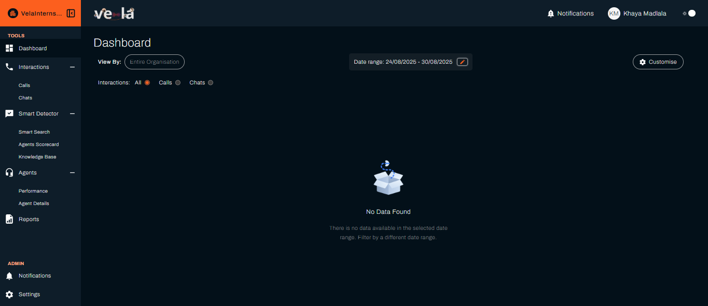

# Get Started with Vela

Welcome to Vela! This guide will help you start analysing your call centre data and improving customer experience immediately.

Call centres handle thousands of conversations every day, but most of that valuable data goes unanalysed, especially when your customers speak African languages like Tshivenda, IsiZulu, Afrikaans, Sesotho, Swahili, IsiXhosa, Setswana, Sepedi, or Xitsonga. Vela automatically transcribes and analyses 100% of your calls regardless of the language spoken, giving you insights that help you improve agent performance and customer satisfaction.

> **What is Vela?** Vela is a **multilingual call centre analytics tool** that processes call recordings in African languages to provide AI-powered insights, agent scoring, and automated alerts for improving your team's performance.

## What You'll Achieve

By the end of this guide, you'll be able to:
- **Monitor your team's performance** with comprehensive call analytics
- **Identify customer pain points** automatically from call recordings
- **Generate insights** to improve customer satisfaction
- **Track agent performance** with AI-powered scoring

We've made this guide as straightforward as possible because we understand you have calls to handle and agents to manage.

---

## Understanding the Vela Interface

Before we dive into the setup, let's quickly familiarise you with the Vela platform interface:

### **Left Sidebar Navigation**
The left sidebar is your main navigation hub in Vela. You can collapse it to maximise your workspace. Here's what you'll find:

- **[Dashboard](./dashboard.md)** - Your main monitoring view with customisable metrics
- **Interactions**
  - **[Calls](./data-upload.md)** - Upload and analyse call recordings
  - **[Chats](./chats.md)** - Review chat conversations and interactions
- **Smart Detector**
  - **[Smart Search](./smart-search-guide.md)** - AI-powered search across all your calls
  - **[Knowledge Base](./knowledge-base-guide.md)** - Build and manage agent resources
  - **[Topics](./smart-detector-overview.md)** - Identify and track conversation topics
  - **[Pain Points](./smart-detector-overview.md)** - Automatically detect customer issues
  - **[Keywords](./smart-detector-overview.md)** - Monitor specific terms and phrases
  - **[Intents](./smart-detector-overview.md)** - Understand customer intentions
  - **[Agent Search](./smart-detector-overview.md)** - Find calls by agent performance
  - **[Agent Checklist](./agent-scorecard-guide.md)** - Create custom evaluation criteria
- **Agents**
  - **[Agent Details](./agents.md)** - View detailed agent profiles and information
  - **[Agent Performance](./agents.md)** - Monitor individual agent performance metrics
- **[Reports](./reports.md)** - Generate custom reports and insights
- **[Notifications](./notifications.md)** - Manage your alert preferences
- **[Settings](./settings.md)** - Configure your organisation and platform settings

> **💡 Tip**: The sidebar is collapsible - click the hamburger menu (☰) to expand or collapse it, giving you more workspace when needed.

---

## Quick Setup Checklist

### Step 1: Upload Your First Data
**Goal**: Get your call data into Vela for analysis

Getting your call data into Vela is straightforward. We offer two approaches depending on your needs.

#### Option A: Manual Upload (Recommended for new users)
Perfect for getting started or testing the system.

- [ ] **Go to "Interactions" → "Calls"** in the left sidebar
- [ ] **Click "Upload"**
- [ ] **Select your call files**
- [ ] **Click "Upload"** and wait for processing

> **[📖 Detailed upload guide](./data-upload.md)** - Learn about supported formats, batch uploads, and troubleshooting

#### Option B: FTP Integration (For larger organisations)
Ideal for organisations handling hundreds of calls daily.

- [ ] Contact your Vela Account Manager to set up automated uploads

> **Why this matters**: Once your data is uploaded, Vela analyses every interaction for insights you can't get manually.

### Step 2: Review Your First Insights
**Goal**: See immediate value from your data

This is where you'll see the real value. You'll discover patterns and insights about your calls that weren't visible before.

- [ ] **Go to "Interactions" → "Calls"** to see your uploaded interactions
- [ ] **Click on any call** to view detailed analysis:
  - [ ] **Full transcript** with sentiment analysis
  - [ ] **Agent performance metrics** (AI-powered scoring)
  - [ ] **Customer satisfaction insights**
  - [ ] **Automated alerts** for important moments

> **[📖 Understanding call analysis](./calls.md)** - Learn how to interpret transcripts, scores, and insights
> **[📖 Agent performance metrics](./agents.md)** - Understand how agent scoring works

> **Why this matters**: You'll immediately see patterns and issues that would take hours to identify manually.

### Step 3: Set Up Your Dashboard
**Goal**: Create a personalised view of your most important metrics

Now that you have data, you can create a meaningful dashboard that shows actual insights.

- [ ] **Log in** to your Vela platform
- [ ] **Click "Dashboard"** in the left sidebar
- [ ] **Click "Customise"** in the top-right corner
- [ ] **Select your team** from the "View By" dropdown
- [ ] **Choose "All" interactions** to see both calls and chats
- [ ] **Set your date range** (try "This Month" to start)
- [ ] **Add these key metrics**:
  - [ ] Agent Distribution (see who's handling calls)
  - [ ] Average Call Duration (identify efficiency issues)
  - [ ] Agent Scores (spot training opportunities)
  - [ ] Customer Sentiment (gauge satisfaction)
- [ ] **Click "Save"** to apply your settings

> **[📖 Complete dashboard guide](./dashboard.md)** - Learn about all available metrics and customisation options
> **[📖 Dashboard troubleshooting](./dashboard.md#troubleshooting-common-issues)** - Fix common dashboard issues

> **Why this matters**: Your dashboard becomes your command centre for monitoring team performance and customer satisfaction at a glance.

### Step 4: Set Up Smart Monitoring (Optional)
**Goal**: Automatically detect important events and issues

This is an advanced feature that lets you set up automated monitoring for specific events in your calls.

- [ ] **Go to "Smart Detector" → "Smart Search"**
- [ ] **Click "Create"**
- [ ] **Name your search** (e.g., "Customer Complaints")
- [ ] **Add example phrases** like "I'm not happy" or "This is terrible"
- [ ] **Set scope** to your organisation or specific team
- [ ] **Click "Create"** to start monitoring

> **[📖 Smart Search guide](./smart-search-guide.md)** - Learn advanced search techniques and best practices
> **[📖 Setting up notifications](./notifications.md)** - Configure alerts for your searches

> **Why this matters**: Vela can alert you when customers express dissatisfaction, helping you respond proactively.

---

## 🎉 You're All Set!

**Congratulations!** You're now ready to transform your call centre operations with AI-powered insights. Vela processes your interactions and provides actionable insights to improve customer experience and team performance.

Call centres face unique challenges - managing customer expectations, supporting agents, and driving continuous improvement. Vela helps you see what's really happening so you can make informed decisions.

You've just unlocked the capabilities that will make your call centre more effective!

---

## What's Next?

### **Daily Operations**
- **[Monitor your dashboard](./dashboard.md)** - Track daily performance and trends
- **[Review alerts](./notifications.md)** - Stay on top of important events
- **[Check agent performance](./agents.md)** - Identify coaching opportunities

### **Team Management**
- **[Generate reports](./reports.md)** - Create detailed performance summaries
- **[Set up agent scorecards](./agent-scorecard-guide.md)** - Create custom evaluation criteria
- **[Build knowledge base](./knowledge-base-guide.md)** - Help agents with resources

### **Advanced Features**
- **[Smart Search](./smart-search-guide.md)** - Find specific patterns in your calls
- **[API integration](./api.md)** - Connect Vela with your existing systems
- **[Custom dashboards](./dashboard.md)** - Create specialised views for different teams

> **💡 Pro Tip**: Use the left sidebar in the Vela platform to quickly access any section. Each section has its own dedicated documentation that you can reference while working in the platform.

## Need Help?

- 📧 **Contact Support**: support@botlhale.ai
- 🎥 **Video Tutorials**: Available on the homepage

---

## Was This Guide Helpful?

We're constantly improving our documentation based on your feedback. Let us know how this guide worked for you:

**Did this guide help you get started with Vela?**
- ✅ **Yes** - I was able to set up Vela successfully
- ❌ **No** - I need more help

**What could we improve?**
- More detailed steps
- Better screenshots
- Additional examples
- Different organisation

Send your feedback to: **support@botlhale.ai**

---

## Still Need Help?

If this guide didn't answer your question, we're here to help:

### 📞 **Get Human Support**
- **Email**: support@botlhale.ai
- **Response Time**: Within 24 hours (usually much faster)
- **Available**: Monday - Friday, 9 AM - 5 PM SAST

### 🎥 **Video Tutorials**
- **Complete walkthroughs** available on the homepage
- **Step-by-step guides** for every major feature
- **Best practices** and tips from our team

### 📚 **Additional Resources**

- [API Documentation](https://docs-apis.botlhale.xyz) - For technical integrations
- [Release Notes](./release-notes.md) - Latest updates and features
