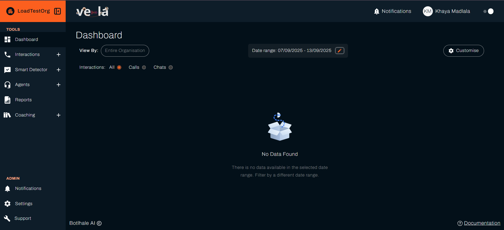

# Get Started with Vela

This guide will show you how to upload and analyse your customer interactions. Giving you clear insights to improve agent performance, business operations and customer satisfaction.

> **What is Vela?** Vela is a **call centre analytics tool** that processes customer interactions in multiple languages to provide insights on calls/chat and agent performance. 

## What You'll Achieve

By the end of this guide, you'll be able to:
- **understand how to navigate thorugh Vela**
- **View insights of each one of your interractions** This could be calls or chats
- **Monitor your agents' performance** with different scopes (departments, teams, individual agents)
- **Generate insights through reports** 
- **Search for specific events in your interactions**
- **Setup scorecards to automate QA on your interactions**
-

Ready to dive in? Click any of the goals above to jump right to that section.
---

## Understanding the Vela Interface

Before we dive into the features, let's quickly familiarise you with the Vela platform interface:

### **Left Sidebar Navigation**
The left sidebar is your main navigation hub in Vela. You can collapse it to maximise your workspace. You'll find:

- **[Dashboard](./dashboard.md)** - Your main monitoring view with customisable metrics
- **Interactions**
  - **[Calls](./data-upload.md)** - Upload and analyse call recordings
  - **[Chats](./chats.md)** - Review chat conversations and interactions
- **Smart Detector**
  - **[Smart Search](./smart-search-guide.md)** - AI-powered search across all your calls
  - **[Knowledge Base](./knowledge-base-guide.md)** - Build and manage agent resources
  - **[Agent Scorecard](./agent-scorecard-guide.md)** - Create custom evaluation criteria
  - **[Topics](./smart-detector-overview.md)** - Identify and track conversation topics
  - **[Pain Points](./smart-detector-overview.md)** - Automatically detect customer issues
  - **[Keywords](./smart-detector-overview.md)** - Monitor specific terms and phrases
  - **[Intents](./smart-detector-overview.md)** - Understand customer intentions

- **Agents**
  - **[Agent Details](./agents.md)** - View detailed agent profiles and information
  - **[Agent Performance](./agents.md)** - Monitor individual agent performance metrics
- **[Reports](./reports.md)** - Generate custom reports and insights
- **[Notifications](./notifications.md)** - Manage your alert preferences
- **[Settings](./settings.md)** - Configure your organisation and platform settings

> **💡 Tip**: The sidebar is collapsible - click the hamburger menu (☰) to expand or collapse it, giving you more workspace when needed.

---

## Quick Setup Checklist

### Step 1: Upload Your First Data
**Goal**: Get your call data into Vela for analysis

Getting your call data into Vela is straightforward. We offer two approaches depending on your needs.

#### Option A: Manual Upload (Recommended for new users)
Perfect for getting started or testing the system.

- [ ] **Go to "Interactions" → "Calls"** in the left sidebar
- [ ] **Click "Upload"**
- [ ] **Select your call files**
- [ ] **Click "Upload"** and wait for processing

> **[📖 Detailed upload guide](./data-upload.md)** - Learn about supported formats, batch uploads, and troubleshooting

#### Option B: FTP Integration (For larger organisations)
Ideal for organisations handling hundreds of calls daily.

- [ ] Contact your Vela Account Manager to set up automated uploads

> **Why this matters**: Once your data is uploaded, Vela analyses every interaction for insights you can't get manually.

### Step 2: Review Your First Insights
**Goal**: See immediate value from your data

This is where you'll see the real value. You'll discover patterns and insights about your calls that weren't visible before.

- [ ] **Go to "Interactions" → "Calls"** to see your uploaded interactions
- [ ] **Click on any call** to view detailed analysis:
  - [ ] **Full transcript** with sentiment analysis
  - [ ] **Agent performance metrics** (AI-powered scoring)
  - [ ] **Customer satisfaction insights**
  <!-- - [ ] **Automated alerts** for important moments -->

> **[📖 Understanding call analysis](./calls.md)** - Learn how to interpret transcripts, scores, and insights
> 
> **[📖 Agent performance metrics](./agents.md)** - Understand how agent scoring works

> **Why this matters**: You'll immediately see patterns and issues that would take hours to identify manually.

### Step 3: Set Up Your Dashboard
**Goal**: Create a personalised view of your most important metrics

Now that you have data, you can create a meaningful dashboard that shows actual insights.

- [ ] **Log in** to your Vela platform
- [ ] **Click "Dashboard"** in the left sidebar
- [ ] **Click "Customise"** in the top-right corner
- [ ] **Select your team** from the "View By" dropdown
- [ ] **Choose "All" interactions** to see both calls and chats
- [ ] **Set your date range** (try "This Month" to start)
- [ ] **Add these key metrics**:
  - [ ] Agent Distribution (see who's handling calls)
  - [ ] Average Call Duration (identify efficiency issues)
  - [ ] Agent Scores (spot training opportunities)
  - [ ] Sentiment Distribution  (gauge satisfaction)
- [ ] **Click "Save"** to apply your settings

> **[📖 Complete dashboard guide](./dashboard.md)** - Learn about all available metrics and customisation options
> 
> **[📖 Dashboard troubleshooting](./dashboard.md#troubleshooting-common-issues)** - Fix common dashboard issues

> **Why this matters**: Your dashboard becomes your command centre for monitoring team performance and customer satisfaction at a glance.

### Step 4: Set Up Smart Monitoring (Optional)
**Goal**: Automatically detect important events and issues

This is an advanced feature that lets you set up automated monitoring for specific events in your calls.

- [ ] **Go to "Smart Detector" → "Smart Search"**
- [ ] **Click "Create"**
- [ ] **Name your search** (e.g., "Customer Complaints")
- [ ] **Add example phrases** like "I'm not happy" or "This is terrible"
- [ ] **Set scope** to your organisation or specific team
- [ ] **Click "Create"** to start monitoring

> **[📖 Smart Search guide](./smart-search-guide.md)** - Learn advanced search techniques and best practices
> 
> **[📖 Setting up notifications](./notifications.md)** - Configure alerts for your searches

> **Why this matters**: Vela can alert you when customers express dissatisfaction, helping you respond proactively.

---

## 🎉 You're All Set!

**Congratulations!** You've just completed your first steps with Vela. You're now ready to transform your call centre operations with AI-powered insights. Vela processes your interactions and gives you actionable insights to improve customer experience and team performance.

Call centres face unique challenges - managing customer expectations, supporting agents, and driving continuous improvement. Vela helps you see what's really happening so you can make informed decisions.

You've just unlocked the capabilities that will make your call centre more effective!

---

## What's Next?

### **Daily Operations**
- **[Monitor your dashboard](./dashboard.md)** - Track daily performance and trends
- **[Review alerts](./notifications.md)** - Stay on top of important events
- **[Check agent performance](./agents.md)** - Identify coaching opportunities

### **Team Management**
- **[Generate reports](./reports.md)** - Create detailed performance summaries
- **[Set up agent scorecards](./agent-scorecard-guide.md)** - Create custom evaluation criteria
- **[Build knowledge base](./knowledge-base-guide.md)** - Help agents with resources

### **Advanced Features**
- **[Smart Search](./smart-search-guide.md)** - Find specific patterns in your calls
- **[API integration](./api.md)** - Connect Vela with your existing systems
- **[Custom dashboards](./dashboard.md)** - Create specialised views for different teams

> **💡 Pro Tip**: Use the left sidebar in the Vela platform to quickly access any section. Each section has its own dedicated documentation that you can reference while working in the platform.

---

## Was This Guide Helpful?

We're constantly improving our documentation based on your feedback. Your input helps us identify pain points and make the guides more useful for everyone.

### Quick Feedback
**How would you rate this guide?**
- ⭐⭐⭐⭐⭐ **Excellent** - Everything I needed to get started
- ⭐⭐⭐⭐ **Good** - Mostly helpful with minor issues
- ⭐⭐⭐ **Average** - Some useful information but needs improvement
- ⭐⭐ **Poor** - Missing important information
- ⭐ **Terrible** - Not helpful at all

### What Could We Improve?
- [ ] **More detailed steps** - Need more specific instructions
- [ ] **Better screenshots** - Visual examples would help
- [ ] **Additional examples** - Real-world use cases
- [ ] **Different organization** - Restructure the content flow
- [ ] **Missing information** - Something important wasn't covered
- [ ] **Too complex** - Need simpler explanations

### Share Your Experience
- **What worked well?** Tell us what was most helpful
- **What was confusing?** Help us identify unclear sections
- **What's missing?** What would make this guide better?

**[📝 Submit Feedback](https://forms.gle/oiTZYysNvyRnGRcY6)** - Help us improve this guide for everyone

> **Why this matters**: Your feedback directly influences how we improve our documentation. We review every submission and use it to make our guides more helpful for future users.
