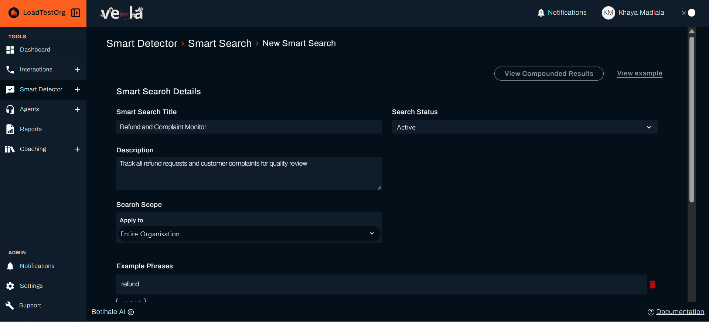
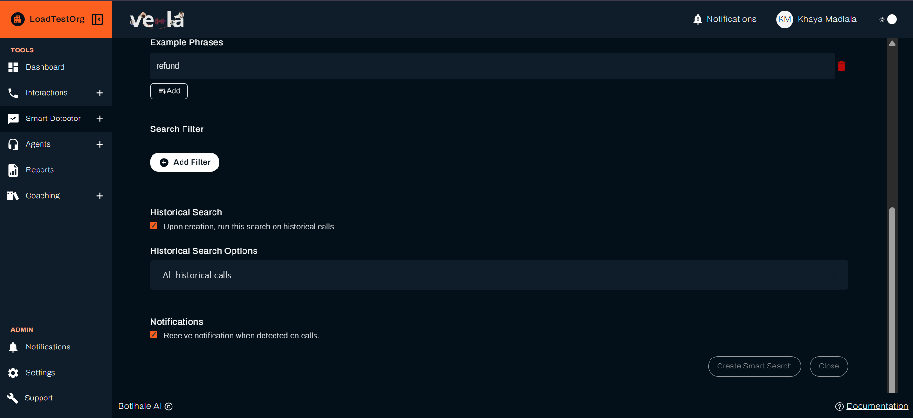
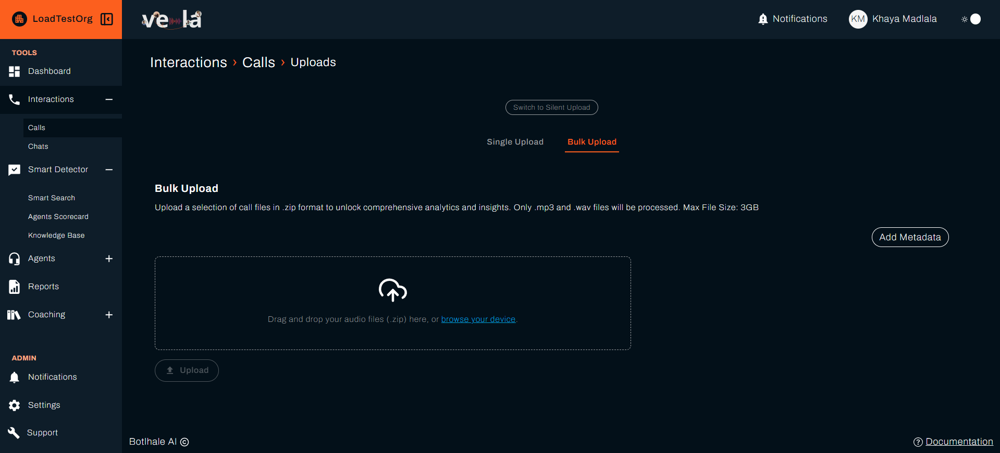
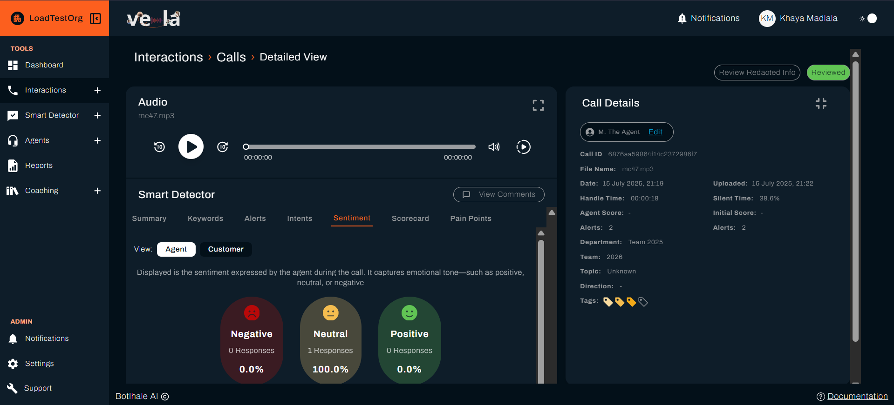
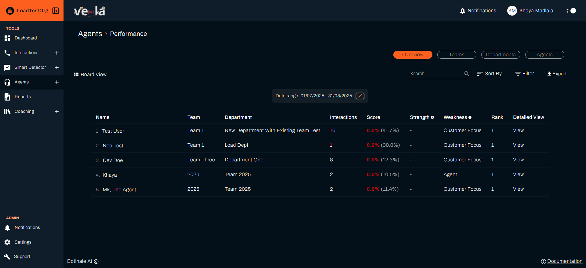
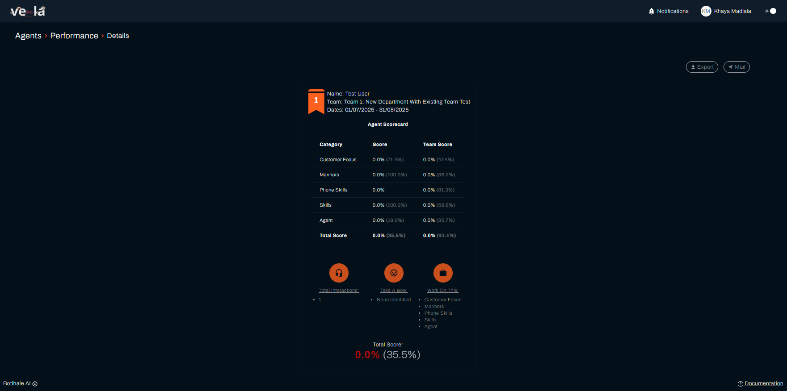
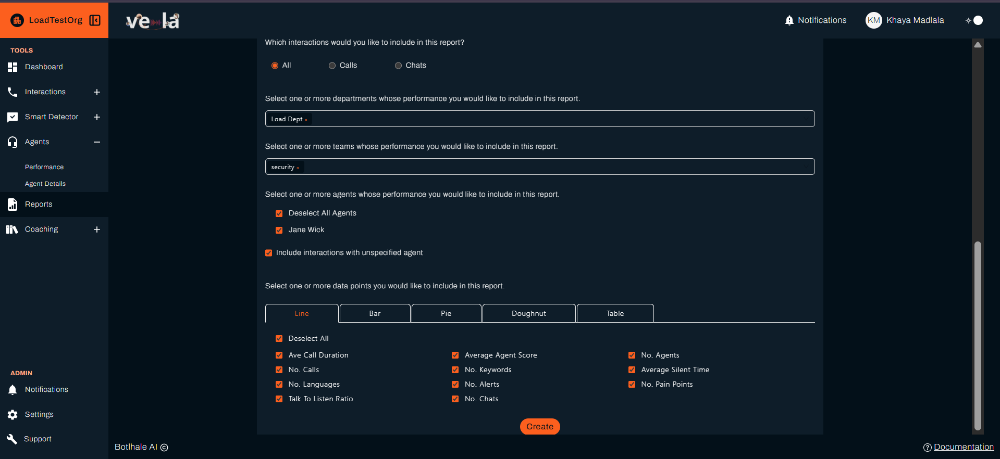

# Quick Start Guide for Team Leads & Admin

Welcome to Vela! Vela is your call centre analytics platform that provides 100% Quality Assurance on all customer interactions, regardless of language. This guide will get you up and running as a Team Lead or Administrator in 30 minutes, focusing on the management and oversight capabilities you need to monitor performance, conduct quality assurance, and coach your team effectively.

## Getting Started

### System Requirements
- **Supported browsers**: Chrome, Firefox, Edge
- **Internet connection**: Required for all functionality
- **Audio formats supported**: WAV, MP3 (for call uploads)
- **Bulk upload recommendation**: Maximum 3GB per batch for optimal performance (This depends on the memory your computer allocated to your browser. Ask support for clarifications)

### Logging Into Vela
Vela offers multiple login options to suit your organisation's setup:

1. Navigate to your Vela login page (provided by your administrator)
2. Choose your login method:
   - **Google OAuth**: Click "Sign in with Google" if your organisation uses Google Workspace
   - **Microsoft Azure AD**: Click "Sign in with Microsoft" for Enterprise Active Directory
   - **Email and Password**: Enter your credentials directly
3. First-time login: You'll be prompted to:
   - Verify your email address
   - Set a new password meeting these requirements:
     - At least 8 characters
     - At least one letter
     - At least one number
     - At least one special character

### Understanding Your Access Level
As a Team Lead or Administrator, you have comprehensive access to monitor and manage your team's performance:

#### Your Main Navigation Areas
- **Dashboard** - Performance overview and key metrics across teams
- **Interactions** - All call and chat recordings with Vela-AI analysis
- **Smart Detector** - Vela-AI powered search, scorecards, and knowledge base
- **Agents** - Individual and team performance management
- **Reports** - Custom analytics and automated reporting
- **Coaching** - Training management, course creation, and awards
- **Settings** - Platform configuration and user management (Admin level)

#### Permission Scopes
Your access level determines what data you can view:
- **Organisational** - Full access across all departments
- **Departmental** - Access to your department's teams and agents
- **Team** - Access limited to your specific team

## Essential First Tasks

### 1. Upload and Analyse Your First Interaction (10 minutes)
The first screen you'll see is an empty dashboard since you don't have data uploaded yet. Let's get started with that.

#### Single Call Upload
1. Navigate to **Interactions → Calls**
2. Click **"Upload Single Call"**
3. Complete the upload form:
   - **Agent**: Select from your team dropdown
   - **Direction**: Choose Inbound or Outbound
   - **Tags**: Add classifications (e.g., "complaint", "sales", "support")
   - **Upload your file**: Browse or drag-and-drop your audio file (WAV/MP3)
4. Click **"Upload"**

#### Review AI Analysis Results
1. Wait for processing (typically 30 seconds to 2 minutes depending on call length)
2. Click on your uploaded interaction to open the analysis
3. Review Smart Detector insights:
   - **Summary** - AI-generated interaction overview
   - **Sentiment Analysis** - Customer emotion tracking throughout the call
   - **Keywords** - Important terms and phrases detected
   - **Automatic Scorecard** - AI performance evaluation with breakdown
   - **Pain Points** - Customer frustration indicators
   - **Intents** - Customer purpose and goals identified

**Expected outcome**: You'll understand how Vela's AI processes interactions and provides actionable insights for quality assurance decisions.

### 2. Check Today's Performance Overview (5 minutes)
Navigate to your Dashboard:

1. Click **Dashboard** in the left sidebar
2. Set date filter to **"Today"** (top right corner)
3. Select your scope (Organisation/Department/Team) if applicable
4. Review key performance indicators:

#### Critical metrics to monitor:
- **Average Agent Score** - Overall team performance quality
- **No. Alerts** - Interactions requiring immediate attention
- **Resolved vs. Unresolved Alerts** - Issue resolution rate
- **Sentiment Distribution** - Customer satisfaction trends
- **Agent Scores Distribution** - Performance spread across your team

#### What to look for:
- Agent scores consistently below your organisation's performance threshold
- High volume of unresolved alerts indicating systemic issues
- Negative sentiment spikes that might indicate service problems
- Significant performance gaps between agents

**Expected outcome**: You'll have immediate visibility into today's performance and can identify agents or issues that need your attention.

### 3. Set Up Smart Search for Compliance Monitoring (10 minutes)
Create your first automated monitor:

1. Go to **Smart Detector → Smart Search**
2. Click **"+ New Smart Search"**
3. Configure your search (This is a customer support example):
   - **Title**: "Refund and Complaint Monitor"
   - **Search Status**: "Active"
   - **Description**: "Track all refund requests and customer complaints for quality review"
   - **Phrases**: Enter terms like "refund, money back, complaint, dissatisfied, manager"
   - **Scope**: Select your search level (team, department, or organisation)
   - **Historical Search**: Select this option if you want this search to run on the previous calls you've uploaded
   - **Notifications**: Enable if you want in-app alerts
4. Save and activate your Smart Search

**Expected outcome**: You'll automatically receive notifications whenever agents handle refunds or complaints, allowing you to prioritise quality reviews, segment interactions and ensure compliance with company policies.

## Bulk Operations for Efficiency

### Bulk Upload Calls with Metadata
**When to use**: You have multiple recorded calls that need analysis

#### Preparation steps:
1. Create a ZIP archive (maximum 3GB recommended)
2. Prepare metadata.csv file with these columns:
   - **filename** - Exact audio file name
   - **agent_name** - Agent who handled the call
   - **team** - Team assignment
   - **department** - Department name
   - **direction** - "inbound" or "outbound"
   - **tags** - Semicolon-separated tags (e.g., "sales;follow-up")
3. Download the metadata template from the upload page for reference

#### Upload process:
1. Go to **Interactions → Calls → "Bulk Upload"**
2. Upload your prepared ZIP file
3. Monitor processing status - large batches may take 10-30 minutes
4. Review upload results and address any errors

### Bulk Agent Management
Add multiple agents efficiently:

1. Prepare a CSV file with columns: name, email, team, department
2. Navigate to **Agents → "Bulk Upload"**
3. Choose your import strategy:
   - Create new departments/teams for agents with non-existing assignments
   - Skip agents whose departments/teams don't exist yet
4. Upload and review the import results

**Expected outcome**: You can onboard entire teams quickly without manual individual agent creation.

## Key Quality Assurance Workflows

### Interaction Review Process
#### Daily quality checks:
1. Filter interactions by date range, agent, or team
2. Prioritise reviews using these criteria:
   - Low automatic scorecard scores
   - High number of alerts triggered
   - Negative customer sentiment
   - Specific Smart Search matches
3. Listen to calls or/and read chat transcripts
4. Review Smart Detector results but make your own quality judgment
5. Add comments for agent feedback and coaching
6. Create manual scorecards if you disagree with Automatic assessment

### Agent Performance Monitoring
#### Weekly performance review:
1. Go to **Agents** section
2. Compare individual performance to team averages
3. Identify coaching opportunities: Look for consistent patterns in low-scoring areas
4. Export performance data for management reporting

**Expected outcome**: You'll have clear visibility into which agents need coaching and in what specific areas.

## Reporting and Analytics

### Create Your First Custom Report
Generate management insights:

1. Navigate to **Reports** section
2. Click **"Create Report"**
3. Configure report parameters:
   - **Date Range**: Select specific period (e.g., "Last Week")
   - **Scope**: Choose teams or departments to include
   - **Metrics**: Select key performance indicators
   - **Chart Type**: Choose visualisation (bar, line, pie, table)
   - **Interaction Type**: All, calls only, or chats only
4. Generate report and review AI-powered insights and recommendations
5. Download or schedule for regular delivery

**Expected outcome**: You'll have professional analytics ready to share with management, plus AI suggestions for performance improvements.

## Navigation and Productivity Tips

### Dashboard Customisation
- **Personalise metrics** - Add or remove KPIs based on your management priorities
- **Use date filters effectively** - Compare "This Week vs. Last Week" for trend analysis
- **Leverage chart types** - Tables for detailed data, graphs for trend visualisation

### Search and Filter Best Practices
- Use interaction search to find specific calls by keywords in transcripts
- Apply multiple filters simultaneously (agent + date range + sentiment)
- Save frequently used filter combinations for quick access

### Keyboard Shortcuts
- **Ctrl/Cmd + F** - Search within any page
- **Tab** - Navigate through forms efficiently
- **Esc** - Close modal dialogs
- **Enter** - Submit forms and searches

## Troubleshooting Common Issues

### Upload Problems
- **"File not supported"** - Ensure audio files are WAV or MP3 format
- **"Metadata errors"** - Check CSV column names match template exactly
- **"Processing stuck"** - Large files may take several minutes; avoid refreshing

### Performance Issues
- **Slow dashboard loading** - Try reducing date range or scope
- **Bulk upload timeouts** - Keep batches under 3GB
- **Browser compatibility** - Chrome and Edge typically offer best performance

### Access and Permission Issues
- **"Access denied"** - Contact your administrator to verify your permission scope
- **"Feature not available"** - Some features may be limited based on your role level

## Advanced Features Preview
Once you're comfortable with these basics, explore:
- **Custom Agent Scorecards** - Create evaluation criteria specific to your business
- **Coaching Automation** - Set up training triggers based on performance thresholds
- **Advanced Smart Searches** - Complex keyword combinations and sentiment-based monitoring
- **API Integration** - Connect Vela data with other business systems
- **Scheduled Reports** - Automated weekly/monthly management dashboards

## Getting Support

### Within Vela
- **Tooltips and help icons** - Hover over (i) symbols for feature explanations
- **Sample files** - Download templates for bulk operations
- **Built-in guidance** - Look for contextual help text throughout the platform

### When You Need Help
- **Technical issues** - Contact your organisation's IT support
- **Feature questions** - Refer to the comprehensive Team Lead User Guide
- **Training needs** - Work with your Vela administrator on advanced features
- **Performance consulting** - Leverage Vela's AI insights and recommendations

## Success Metrics to Track

### Quality Assurance KPIs
- **Percentage of interactions reviewed** - Aim for comprehensive coverage
- **Average agent score improvement** - Track coaching effectiveness over time
- **Alert resolution rate** - Measure how quickly issues are addressed
- **Customer sentiment trends** - Monitor satisfaction improvements

### Operational Efficiency Gains
- **Time saved vs. manual reviews** - Quantify productivity improvements
- **Coaching precision** - More targeted development vs. generic training
- **Compliance coverage** - 100% monitoring vs. sample-based approaches

**Expected outcome**: You'll transform from reactive management to proactive performance optimization, with data-driven insights enabling more effective team leadership.

## Quick Reference

### Essential Keyboard Shortcuts
- **Dashboard filters** - Use date and scope dropdowns for focused analysis
- **Bulk operations** - Prepare CSV templates carefully to avoid upload errors
- **Smart Search alerts** - Enable notifications for proactive quality management
- **Export functions** - Available in most sections for external reporting

### Key Metrics Definitions
- **Agent Score** - AI evaluation of interaction quality (0-100 scale)
- **Talk to Listen Ratio** - Balance of agent speaking vs. customer listening time
- **Pain Points** - AI-detected indicators of customer frustration or dissatisfaction
- **Sentiment** - Customer emotional state: Positive, Neutral, Negative
- **Intents** - Customer goals: Support, Sales, Complaint, Information, etc.

### File and System Limits
- **Audio formats** - WAV, MP3 supported
- **Bulk upload maximum** - 3GB per batch recommended
- **Browser requirements** - Chrome, Firefox, Safari, Edge
- **Processing time** - 30 seconds to 2 minutes per call depending on duration
