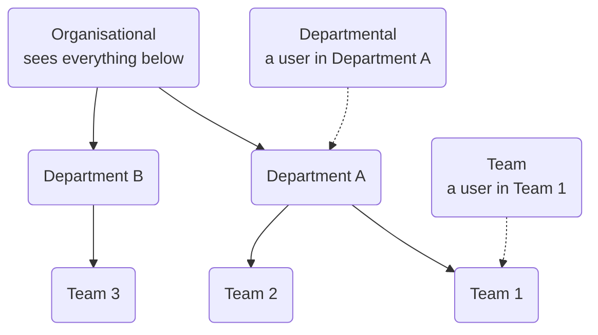

# Glossary

Definitions of the terms used in Vela and in this documentation.

---

## Access Level

How much of the organisation a user can see. An administrator sets this per user. There are three levels:

- **Organisational**: all departments and teams
- **Departmental**: their department only
- **Team**: their immediate team only

A user sees the node they are attached to and everything beneath it, and nothing to the side. This is why two team leads looking at the same Dashboard on the same day can see different numbers.

Access level is separate from [Role](#role), which controls what actions they can take. A user with the Admin role and Team access can manage users, but only sees their own team's data.

Agents do not have an access level. They only ever see their own interactions. See [Roles and Access Levels](../settings-config/access-control.md).

## Agent

A person whose interactions are analysed by Vela. Agents do not need a login unless your organisation uses the Agent Portal. Agents are the only records you can import in bulk from a CSV file.

See also [User](#user).

## Agent Scorecard

The set of questions Vela evaluates every interaction against. Each question has a category and a weight, and the results combine into the agent's score.

In the Smart Detector sidebar this appears as "Agents Scorecard" (plural). This documentation uses the singular "Agent Scorecard" for the feature, and the plural in navigation steps, so that what you select matches what you read. See [Scorecard Fields](./scorecard-fields.md).

## Alert

A match raised when a processed interaction triggers one of your [Smart Searches](#smart-search). Each alert links back to the interaction and to the search that raised it. Select **Resolve** on an alert once you have reviewed it. This is separate from **Mark as Resolved** on a comment and **Mark as Reviewed** on the interaction.

Alerts appear in the **Alerts** tab under Notifications, and the **No. Alerts** metric counts them.

## Auto-Fail

A setting on a scorecard question. When it is on, failing that question flags the whole interaction as auto-failed. The flag is recorded next to the score rather than replacing it, so you can see both that a critical requirement was missed and how the interaction scored otherwise.

## Compliance Item

A scorecard question marked as a compliance check rather than a quality one. Vela scores compliance items separately, which produces the **Average Agent Compliance Score** alongside the quality score.

## Department

An organisational grouping that contains teams. The hierarchy is Organisation, then Department, then Team. A department must exist before you can assign a team to it.

## Detected and Organisational

Two sources for topics, intents, and pain points:

- **Detected**: found automatically by the AI in your interactions
- **Organisational**: created manually by your team

This lets you separate what the AI found from what you told it to look for.

Keywords have one source. Vela does not detect them on its own, so a keyword matches only where your team has added it.

To read either list, or to add your own terms, see [Manage Smart Search Terms](../topics-and-terms-guide.md).

## Direction

Whether a call was **inbound** or **outbound**. You can set scorecard questions and Smart Questions to apply to inbound only, outbound only, or all calls.

## Expected Outcome

A setting on a scorecard question that records whether **Yes** or **No** is the desired answer. Set it to match the way you have phrased the question.

## Historical Search

An option available when you create a Smart Search or Smart Question. By default a new search only applies to interactions processed after you create it. Turning on Historical Search also runs it against interactions already in Vela.

## Intent

The customer's reason for the interaction, for example Sales, Support, or Complaint. The AI can detect intents, or your organisation can create them.

## Interaction

A single customer conversation, either a **call** (voice) or a **chat** (text). Vela uses "interaction" as the collective term for both.

## Keyword

A specific term your organisation tracks across interactions. Unlike topics, intents, and pain points, the AI never detects keywords on its own, so a keyword exists only after someone adds it under **Smart Detector → Keywords**.

Once added, a keyword can be used as a Smart Search filter, and it appears in the keyword metrics on your Dashboard and in reports. See [Manage Smart Search Terms](../topics-and-terms-guide.md).

## Knowledge Base

A store of your organisation's documents, such as policies, scripts, and procedures. You upload them as PDF files. When you link a Knowledge Base document to a Smart Search or a scorecard question, the AI uses its content as reference when it evaluates interactions. See [Knowledge Base](../knowledge-base-guide.md).

## Lite

A Vela edition with a reduced feature set. Smart Search and Smart Questions are unavailable on Lite, so the **Alerts** tab under Notifications and the **Alerts** column on the Interactions list do not appear. Dashboard and report metrics are limited to interaction volume, duration, review progress, topics, and agent scores.

If a feature this documentation describes is missing from your sidebar, your edition is the first thing to check. Your Account Manager can tell you which one your organisation has.

## Pain Point

A sign of customer frustration identified by the AI, such as repeated explanations, long waits, or unresolved issues. Pain points can be detected automatically or defined by your organisation.

## Redaction

Automatic masking of sensitive information in transcripts. Administrators choose which types to mask. The available types are:

Credit Card, IBAN Code, Person, Location, Crypto, Phone Number, Email, NRP, IP Address, Date & Time, URL, ID Number, Medical License, and Organisation.

**NRP** covers nationality, religion, and political group. Settings shows the abbreviation on its own, so it is the one entity type whose name does not say what it masks.

The masked version is what everyone sees by default, administrators included. Administrators, and users granted **View Redactions** (as a standing permission or for one specific interaction), can reveal the unmasked version on demand with **Review Redacted Info**. Other users can request access to a specific interaction, which an administrator approves or declines. See [Access Requests](../settings-config/access-requests-audits.md).

## Review Status

Whether someone has marked an interaction as reviewed. Use it to track QA progress and to tell AI-scored interactions apart from ones a person has checked.

## Role

What kind of user someone is, and which actions they can take. There are three roles:

- **Admin**: can manage users, departments, and organisation settings
- **User**: can view users and work with interactions, but cannot manage users, approve access requests, or manage departments
- **Agent**: restricted to the Agent Portal and their own data

When you add a user you choose **Admin** or **User**. The Agent role belongs to agent records, which are created separately and do not sign in to the main platform. See [Agent](#agent).

Role is separate from [Access Level](#access-level), which controls how much data they see. The two combine: an Admin with Team access has full admin actions, but only over their own team.

Agents are the exception. They have no access level, because they only ever see their own interactions.

## Scope

Which parts of the organisation a Smart Search, Smart Question, scorecard, or Knowledge Base document applies to. Set it to organisation, department, or team.

## Score Boundaries

The thresholds that sort agent performance into Red, Amber, and Green bands. An administrator sets them in Organisation Configuration, and they decide which band a score falls into. See [How Scoring Works](../explanation/how-scoring-works.md).

## Silent Time

Periods in an interaction where neither person is speaking. High silent time can mean an agent is searching for information.

## Smart Question

A question asked of your interactions whose answer Vela records but **does not count towards any agent's score**. Use Smart Questions to gather information about conversations where scoring an agent would not be fair or relevant.

This is the main difference from the Agent Scorecard. See [Smart Questions](../smart-questions-guide.md).

## Smart Search

An automated monitor that flags interactions matching criteria you define, such as words, intents, keywords, topics, pain points, or specific agents. Each match raises an [Alert](#alert).

A search can match on presence (**includes**) or absence (**excludes**). Use excludes to monitor for something an agent failed to say. See [Smart Search](../smart-search-guide.md).

## Tag

Your own label for classifying an interaction, applied by a person rather than found by the AI. This is what separates a tag from a [Topic](#topic), an [Intent](#intent), or a [Keyword](#keyword), which describe what was said in the conversation.

Tags belong to the organisation, not to the person who created one, so every tag appears in everyone's filters. Each has a name and a colour, both required. See [Tag the Interaction](../features/quality-assurance-tools.md#b-tag-the-interaction).

## Talk to Listen Ratio (TTLR)

How much of an interaction the agent spent talking, compared with the customer.

## Team

The smallest organisational grouping. Teams belong to departments. You assign agents and users to teams.

## Topic

A theme identified across conversations. The AI can detect topics, or your organisation can create them. The Top 10 and Bottom 10 Topics metrics report on them.

## User

A person who signs in to Vela, usually an administrator or team lead. Users have a [Role](#role) and an [Access Level](#access-level).

See also [Agent](#agent). Bulk CSV import creates agents, not users.

---

## Related

- [Metrics](./metrics.md): what each dashboard and report metric measures
- [Scorecard Fields](./scorecard-fields.md): every field on a scorecard question

---

## Need Help?

**Contact Support:** support@botlhale.ai
