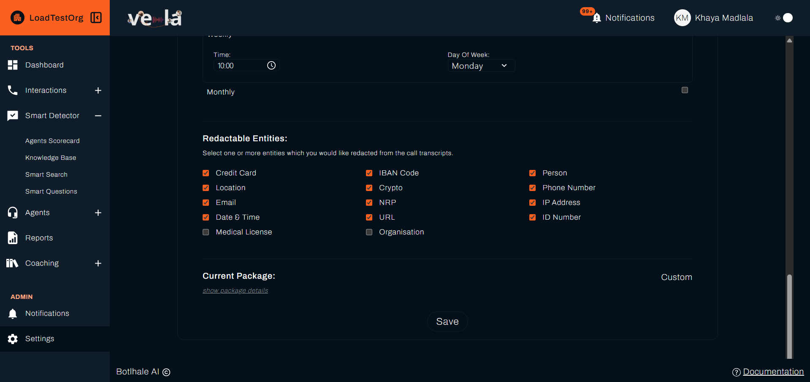

# Security and Compliance

Vela encrypts your data in transit and at rest, and is independently audited for POPIA and GDPR compliance. This page covers hosting, encryption, the standards Vela meets, how your data is backed up and recovered, and the security controls you operate yourself inside Vela.

{/*
Keep this comment below the intro paragraph. Docusaurus takes the category card
description from the first content block, so a comment at the top of the file
becomes the card description.

Sources.

"In the Product" is verified against the vela source and the live platform:
the 24-hour session length, the
password rules, and the redaction defaults. TLS was confirmed against the live
platform, which negotiates 1.3 and accepts 1.2.

Everything from "Hosting" onwards comes from Botlhale's DR policy and security
statement, and cannot be checked from this repository. DevOps confirms these,
and they move between releases:

  - the independent audit, and that it covers POPIA and GDPR
  - AWS SOC 2 Type 2, and the ISO 27001 status, which currently reads "in progress"
  - AES-256 at rest, and that AWS has no access to unencrypted customer data
  - RPO 24 hours and RTO 4 business hours
  - how often backups run, how often automated security tests run, and who
    carries out penetration testing. The page says "regularly" and "around the
    clock" because no figure has been supplied. Replace those with the real
    frequencies once DevOps gives them.

Ask for the date of the policy version each claim came from, and stamp it on
the page. A reader cannot tell how current "in progress" is.

UNVERIFIED (2026-10-01): the page previously named AWS as the host. Live DNS
now resolves vela.botlhale.xyz, .io, and .tech to vela-jnb.fly.dev (Fly.io,
Johannesburg), and the vela-fly branch stores audio in Tigris and older files
in Alibaba OSS. AWS-specific claims (VPC, SOC 2 via AWS, the AWS-partner
audit, availability zones) were removed until DevOps confirms the current
provider, region, and which audit and certifications still apply.
*/}

---

## In the Product

These are the controls your own administrators configure and use.

### Signing In

* Vela supports Google and Microsoft sign-in. Where an organisation uses either, the sign-in password is held by that identity provider rather than by Vela.
* Passwords set in Vela must be at least 8 characters and include a letter, a number, and a special character. See [Password Requirements](./settings-config/account-security.md#password-requirements). They are stored hashed, never in plain text.
* Sessions expire after 24 hours without activity, after which you sign in again.

### Controlling What People See

Access is governed by two settings on each account, a **role** and an **access level**. Together they decide which parts of Vela a person reaches and how much of the organisation's data they see. See [Roles and Access Levels](./settings-config/access-control.md).

Deactivating an account withdraws access while keeping the record. See [User and Team Management](./settings-config/user-management.md#e-deleting-and-reactivating).

### Masking Sensitive Information

An administrator chooses which categories to mask, from credit card and bank account numbers to ID numbers, phone numbers, and email addresses. Once configured, masked details are hidden from everyone by default, administrators included. See [Organisation Configuration](./settings-config/organisation-configuration.md#5-redactable-entities).

Getting to the unmasked version is a deliberate act:

* Administrators, and users granted **View Redactions**, reveal it themselves. This is not recorded. {/* UNVERIFIED: in vela-fly source the View Redactions grant is never read (calls/[id]/page.jsx compares profile.organisations entries, which are objects, with the organisation id), so non-admins with the grant still see Request Redacted Access. Raised as a product bug. Needs a live check before the docs change. */}
* Everyone else raises a request for that one interaction, which an administrator approves or declines. This works the same way for a call or a chat.
* Every request is recorded, showing who asked, which interaction it was for, and who decided. See [Access Requests](./settings-config/access-requests-audits.md).

---

## Hosting

The production environment that holds the platform and your data is isolated, with access restricted to operations support staff. For the hosting provider and the region that holds your organisation's data, contact your Account Manager.

---

## Encryption

* **In transit:** traffic between your browser and Vela is encrypted with TLS 1.2 or above.
* **At rest:** stored data is encrypted with AES-256.

---

## Compliance

* An independent party audits Vela's infrastructure, including POPIA and GDPR compliance.
* ISO 27001 certification is in progress.

---

## Monitoring and Testing

Security, performance, and availability are monitored around the clock. Automated security tests run regularly, and an independent party carries out penetration testing.

---

## Backups and Recovery

Customer data is backed up regularly and held redundantly, encrypted in transit and at rest.

Vela's recovery targets are:

* **Recovery Point Objective (RPO): 24 hours.** The most data, measured in time, that a major incident could cost you.
* **Recovery Time Objective (RTO): 4 business hours.** The target time to restore service after a major incident.

---

## Data Residency

The region that stores your recordings and transcripts is set per deployment. For the region holding your organisation's data, contact your Account Manager.

---

## Requesting More Detail

For a security questionnaire, an audit summary, or any detail not covered here, contact your Account Manager or **support@botlhale.ai**.

---

## Related

- [Roles and Access Levels](./settings-config/access-control.md): the roles and access levels that govern what people see
- [Organisation Configuration](./settings-config/organisation-configuration.md): choose which sensitive entities are masked
- [Access Requests](./settings-config/access-requests-audits.md): how access to masked content is granted and recorded

---

## Need Help?

**Contact Support:** support@botlhale.ai
