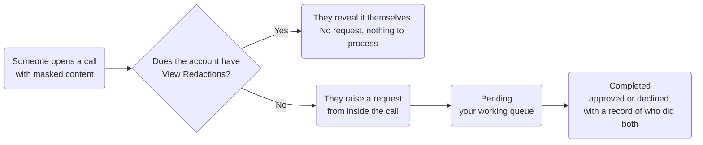
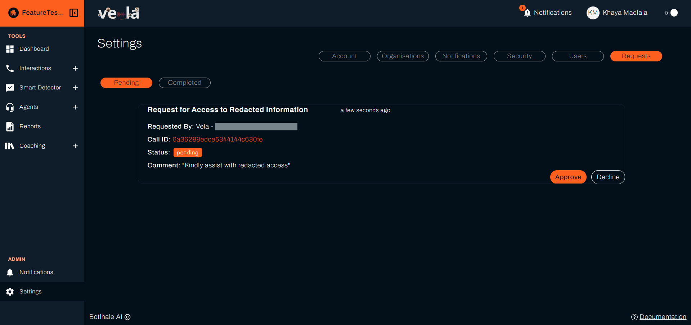
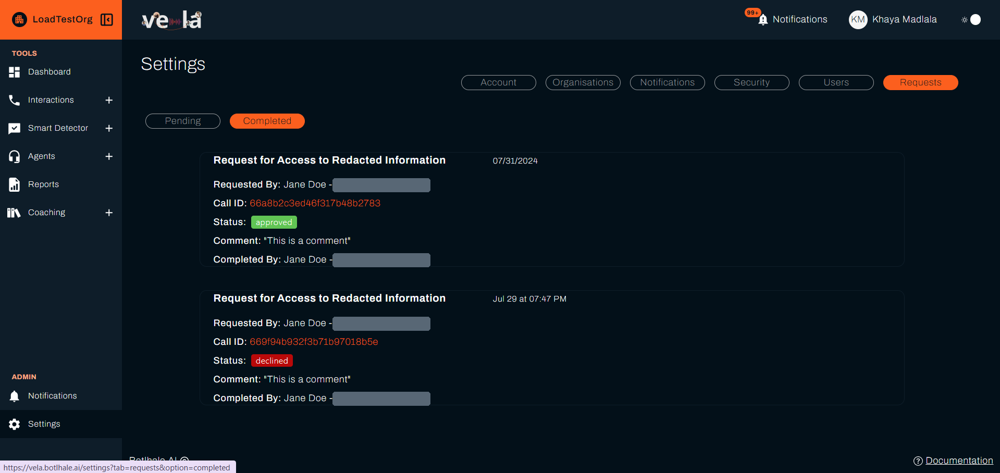

# Access Requests

The **Requests** tab is where Administrators process requests to view redacted information. When a user without **View Redactions** needs to see masked content in a call, they raise a request here for an Administrator to approve or decline.

:::warning Administrators only
This tab is **only visible to and manageable by Administrators**. A user without **View Redactions** initiates a request from within a call, but only Administrators can view, process, and approve requests here.

Transcripts are masked by default for everyone. Administrators, and users granted **View Redactions**, reveal masked content on demand, so they do not raise requests themselves. The permission is set per account in **Settings → Users**, described in [User and Team Management](./user-management.md#2-role-access-and-view-redactions).
:::

---

## 1. Processing Access Requests

Whether someone raises a request at all depends on one setting on their account, which is why most people never see this workflow:

The **Requests** tab is divided into two sub-sections to manage the workflow of access requests.

### A. Pending Requests

Requests that users have submitted and that have **not yet been processed**.

This is your working queue. Review each request and either **Approve** or **Decline** it.

Each request is a card reading **Request for Access to Redacted Information**, with how long ago it arrived. It shows **Requested By**, the **Call ID** the request is for, a **Status** of **pending**, and the **Comment** the user wrote when asking.

Read the **Comment** before deciding. It is the only place the user says why they need the unmasked version, and it is what you are approving against.

### B. Completed Requests

Requests you have already processed, kept as a record. Each request is a card rather than a table row, with the fields below down the left of it.

| Field | Description | Status Indication |
| :--- | :--- | :--- |
| *(timestamp)* | When the request was submitted. It sits beside the heading **Request for Access to Redacted Information** rather than under a label. Requests from today read as relative time, such as "2 hours ago". Older ones show a date and time, such as "Jul 29 at 07:47 PM". | N/A |
| **Requested By** | The name and email address of the user who initiated the request. | N/A |
| **Call ID** | A link to the specific call the user requested access to. | N/A |
| **Status** | The final outcome of the request. | **Approved** (Green) or **Declined** (Red). |
| **Comment** | An optional note added by the requester when submitting. | N/A |
| **Completed By** | The name and email of the Administrator who approved or declined the request. | N/A |

---

{/* The email addresses in Requested By and Completed By are masked on purpose, to keep real people's personal information out of the documentation under POPIA. The bars show where an address sits without disclosing it. */}

## 2. Why It Matters

The Requests tab keeps access to redacted information controlled and recorded:

* **Redaction:** Vela masks the entities an Administrator selects in the organisation's redaction settings, such as Credit Card, Phone Number, ID Number, and Email.
* **Controlled access:** A user without **View Redactions** sees unredacted content only after an Administrator approves their request.
* **A record of each request:** The **Completed** tab keeps every processed request, showing who asked, which call it was for, and who approved or declined it.

---

## Related

- [User and Team Management](./user-management.md): grant View Redactions so a user does not need to ask
- [Organisation Configuration](./organisation-configuration.md): choose which entities are masked
- [Settings Access by Role](./access-control.md): why only administrators see this tab

## Need Help?

**Contact Support:** support@botlhale.ai
