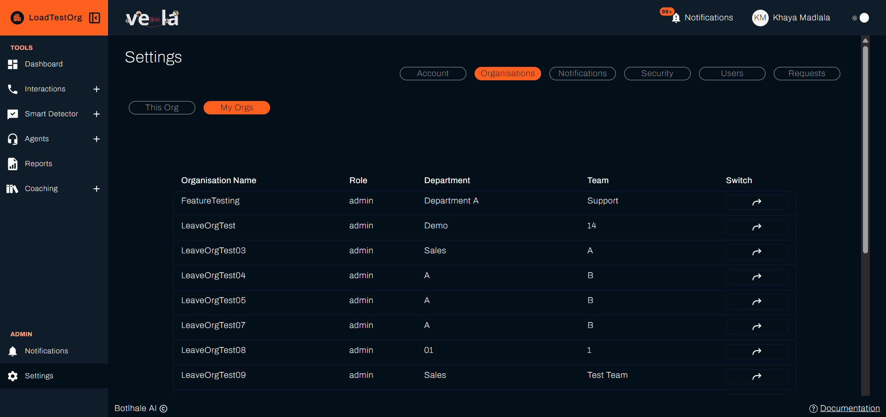
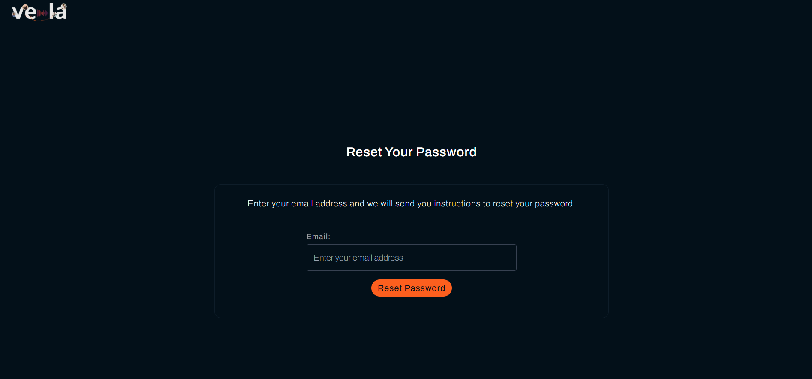
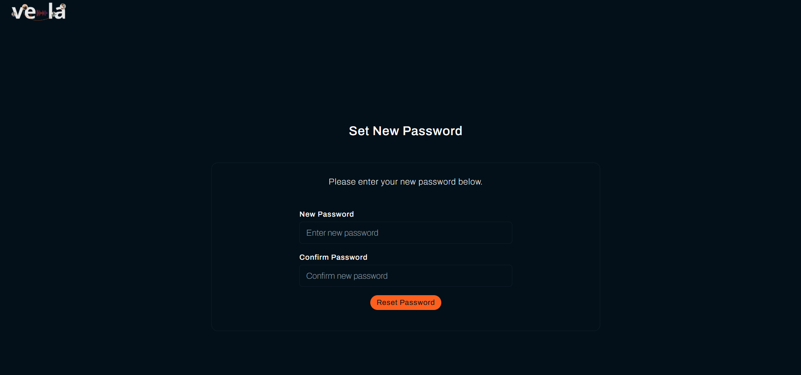
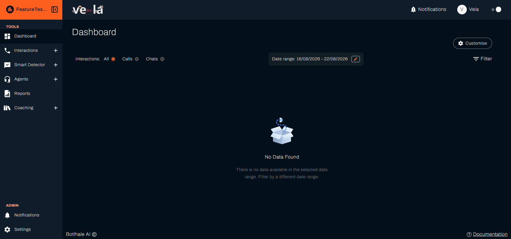
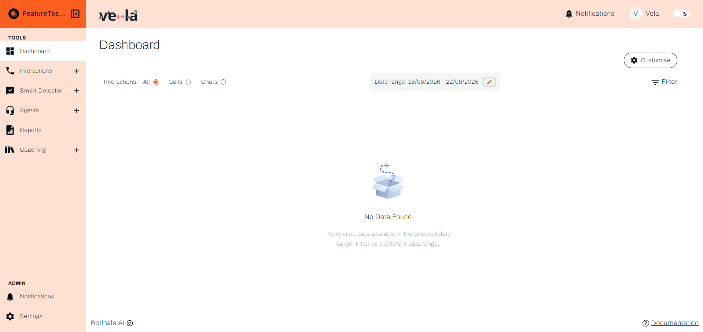

# Account and Security
The **Account** tab shows your personal profile information, and the **Security** tab lets you change your password. Your display mode is set from the top navigation bar rather than from Settings, and it is covered here too.

:::info ACCESS
The Account tab is visible to **all users**, regardless of role or scope. The Security tab is visible to all users **except** those signing in through SSO.
:::

---

## Your Account Details

The Account tab displays your personal information and current organisational context.

### Viewing Account Details

This section allows you to quickly verify your credentials and current status.

* **Name:** Your full name as recorded in Vela.
* **Email:** The primary email address associated with your Vela account.
* **Current Organisation:** The organisation you are working in.
* **Current Team:** Shown if your access level is team.

:::note Read-only
These fields are read-only. The Account tab has no Save button.

An administrator can change your **team**, **department**, **role**, and **access level** from **Settings → Users**. To change your **name** or **email address**, contact **support@botlhale.ai**. Those two are set outside Vela.
:::

### Switching Organisations

If you belong to more than one organisation, you can change which one you are working in.

1.  Navigate to **Settings → Organisations → My Orgs**.
2.  Locate the organisation you wish to access in the list.
3.  Select the switch icon (the arrow) next to the organisation to make it your active organisation.

---

## Changing Your Password

The Security tab is dedicated to protecting your account by allowing you to update your password.

:::note SSO Users
If your organisation uses Single Sign-On (Google or Microsoft), the Security tab is not shown. Your password is managed by your identity provider, not Vela.
:::

### Open the Change Password Form

1.  Navigate to **Settings → Security**.
2.  Locate the **Change your password** form.

### Enter Your Details

* **Current Password:** Enter your existing password to authorise the change.
* **New Password:** Enter your desired new password. It has to meet the rules in [Password Requirements](#password-requirements) below.
* **Verify Password:** Re-enter the new password exactly as typed to confirm it.

### Save Your Changes

1.  Once all fields are complete and the new password meets the requirements, select the **Save** button.
2.  The new password takes effect immediately. You stay signed in on this device, and use the new password the next time you sign in anywhere else.

### Password Requirements

Your new password must meet all of these:

* At least **8 characters**.
* At least **one letter** (a-z, A-Z).
* At least **one number** (0-9).
* At least **one special character** (for example `@`, `#`, or `!`).

---

## Resetting a Forgotten Password

Where you cannot sign in because you have forgotten your password, reset it from the sign-in page rather than asking your administrator for a new invitation.

1. On the sign-in page, select **Forgot your password?**. It opens **Reset Your Password**.
2. Enter your email address and select **Reset Password**. Vela emails you a link headed **Reset Your Password**.

   

3. Open the link in the email. It takes you to **Set New Password**.
4. Enter your new password under **New Password** and again under **Confirm Password**. The rules above apply.

   

5. Select **Reset Password**. The page confirms **Password reset successful**.

{/* Wording verified against app/(auth)/forgot_password/page.jsx, app/(auth)/reset_password/page.jsx, ForgotPasswordForm.jsx, and ResetPasswordForm.jsx on vela origin/main. Both pages use lib/password.js, the same validatePassword as the Security tab above, so the requirements listed there apply here too. */}

This applies to password sign-in only. Where you sign in with Google or Microsoft, reset it with your provider.

---

## Choose Light or Dark Mode

Vela opens in **Dark Mode**. To change it, use the switch at the right of the top navigation bar. A message confirms the change each time you use it.

The switch shows the mode it takes you to rather than the one you are in: a moon while you are in Light Mode, a sun while you are in Dark Mode.

Your choice is stored against your account rather than in the browser, so it follows you to any machine you sign in on.

{/* Both captures are deliberate. This is the one section that needs a Light Mode screenshot, because the subject is the difference between the two modes. Every other capture in the documentation is Dark Mode. See STYLE_GUIDE.md section 8. */}

---

## Related

- [Roles and Access Levels](./access-control.md): which Settings tabs your role reaches
- [User and Team Management](./user-management.md): who can change your role, team, and access level
- [Security and Compliance](../security-compliance.md): how Vela protects the data behind your account

## Need Help?

**Contact Support:** support@botlhale.ai
