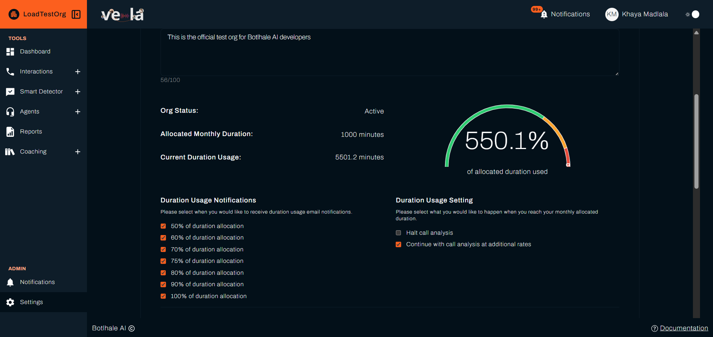

# Organisation Configuration

The **Organisations → This Org** sub-tab holds the settings that apply to your whole organisation: the profile, the monthly duration allocation, the score boundaries, agent report scheduling, redaction, and the package limits.

:::warning Administrators only
The **Organisations** tab is hidden from the Agent role. Everyone else can open **This Org** and read the settings, but only an Administrator whose access level is **organisational** can change them. An administrator scoped to a department or a team has read access only.
:::

The **My Orgs** sub-tab is covered in [Account and Security Settings](./account-security.md).

---

## 1. Organisation Profile

| Field | Description |
| :--- | :--- |
| **Organisation Logo** | The logo shown for the organisation. Click the pencil icon to open the file picker. |
| **Organisation Name** | Read-only. The name cannot be changed here. |
| **Organisation Bio** | A short description of the organisation. Maximum 100 characters, with a counter under the box. |
| **Org Status** | `Active` or `Inactive`. Read-only. |

The logo accepts image files up to 5 MB. The upload happens as soon as you choose a file, so it does not wait for **Save**. The preview panel reads `No image uploaded` until a logo is in place.

---

## 2. Duration Allocation and Usage

This section tracks the analysis minutes your organisation has used against the minutes its package allows.

| Field | Description |
| :--- | :--- |
| **Allocated Monthly Duration** | The analysis minutes the package allocates each month. Set by the package, not editable here. |
| **Current Duration Usage** | The analysis minutes consumed so far, to one decimal place. |
| **Gauge** | Current usage as a percentage of the allocation, labelled `of allocated duration used`. |

### A. Duration Usage Notifications

Select the points at which Vela sends a duration usage email. Each threshold is a separate checkbox, so you can select more than one.

* 50% of duration allocation
* 60% of duration allocation
* 70% of duration allocation
* 75% of duration allocation
* 80% of duration allocation

:::note
The list also shows a 90% and a 100% checkbox. Those two do not respond to clicks on this screen. Contact **support@botlhale.ai** if you need either threshold changed.
:::

### B. Duration Usage Setting

Choose what happens when the organisation reaches its monthly allocated duration. The two options are mutually exclusive, so selecting one clears the other.

| Option | Effect |
| :--- | :--- |
| **Halt call analysis** | Call processing stops once the allocation is reached. |
| **Continue with call analysis at additional rates** | Call processing continues past the allocation and the extra usage is billed at an additional rate. |

---

## 3. Agent Score Boundaries

These two numbers set the red, amber, and green bands Vela uses to categorise agent performance across the platform.

| Field | Description |
| :--- | :--- |
| **Lower Bound** | The score at which performance moves from red to amber. Whole number, 0 to 100. Default `50`. |
| **Upper Bound** | The score at which performance moves from amber to green. Whole number, 0 to 100. Default `80`. |

The bands that result are:

| Band | Range |
| :--- | :--- |
| **Red** | 0 (inclusive) to the Lower Bound (exclusive) |
| **Amber** | The Lower Bound (inclusive) to the Upper Bound (exclusive) |
| **Green** | The Upper Bound (inclusive) to 100 (inclusive) |

Vela keeps the two in order as you type, so the Lower Bound always stays at or below the Upper Bound.

For where these bands are applied, see [Metrics](../reference/metrics.md).

---

## 4. Agent Performance Sharing

Select **Share agent performance reports** to send agents their own performance reports on a schedule. When the checkbox is selected, choose one interval.

| Interval | Options you set |
| :--- | :--- |
| **Daily** | Time (24-hour, on the hour). |
| **Weekly** | Time, and Day of Week. |
| **Monthly** | Time, and Day of Month (1 to 28, or `Last`). |

The default is weekly at `09:00` on a Monday.

---

## 5. Redactable Entities

Select the categories of sensitive information Vela masks in call and chat transcripts. A masked value appears in the transcript as a placeholder such as `[CREDIT_CARD]`.

| Entity | What it covers |
| :--- | :--- |
| **Credit Card** | Credit card numbers. |
| **IBAN Code** | International bank account numbers. |
| **Person** | Full names, first and last names, and titles used with a name. |
| **Location** | Cities, countries, states, and geographic features. |
| **Crypto** | Cryptocurrency wallet addresses (Bitcoin). |
| **Phone Number** | Phone numbers, including country codes. |
| **Email** | Email addresses. |
| **NRP** | Nationality, religion, and political group. |
| **IP Address** | IPv4 and IPv6 addresses. |
| **Date & Time** | Dates, times, and durations, such as "tomorrow" or "3 days ago". |
| **URL** | Web addresses. |
| **ID Number** | South African ID numbers. |
| **Medical License** | Medical licence numbers. |
| **Organisation** | Companies, agencies, institutions, and stores. |

Redaction applies to every user by default, administrators included. For how to view the unmasked version, see [Access Requests](./access-requests-audits.md).

---

## 6. Current Package

The package name is shown at the bottom of the page. Click **show package details** to open the limits table.

| Row | Description |
| :--- | :--- |
| **Package Name** | The package your organisation is on. |
| **Monthly Allocated Duration (minutes)** | The analysis minutes allocated each month. |
| **Smart Search Limit** | How many Smart Searches your organisation can have Active at once. Inactive searches are kept without using a place. |
| **Agent Scorecard Limit** | The number of Agent Scorecards your organisation can hold. |
| **Pain Points Limit** | The number of [pain points](../reference/glossary.md#pain-point) your organisation can hold. |

Your edition also decides which features appear at all. On a [Lite](../reference/glossary.md#lite) edition, Smart Search and Smart Questions are unavailable, and the Dashboard and report metrics are reduced.

To change your package, contact **support@botlhale.ai**. It is set outside Settings.

---

## 7. Saving Changes

Click **Save** at the bottom of the page. One Save applies to the bio, the duration notifications, the duration usage setting, the score boundaries, the agent performance sharing schedule, and the redactable entities. The logo is uploaded separately and is not affected by **Save**.

---

## Related

- [Settings Access by Role](./access-control.md): who can change these settings
- [Metrics](../reference/metrics.md): where the score boundaries are applied
- [Access Requests](./access-requests-audits.md): the workflow behind the redaction settings

## Need Help?

**Contact Support:** support@botlhale.ai
