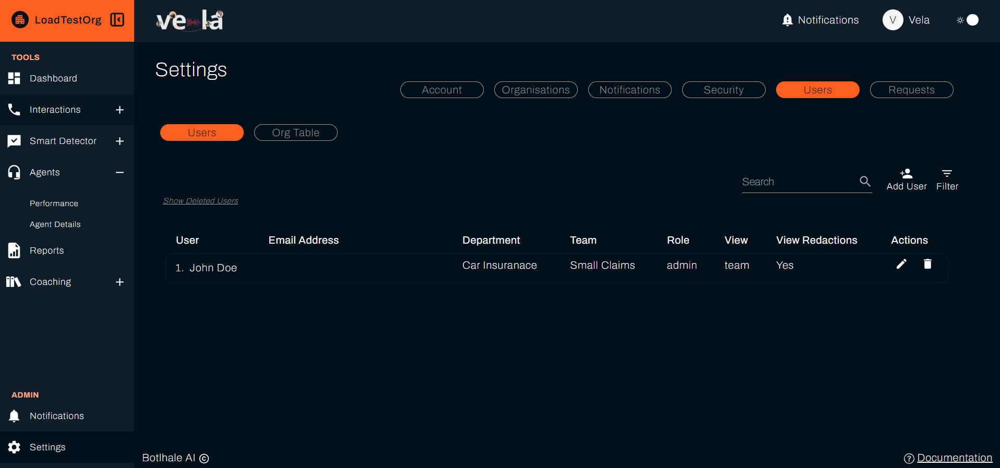
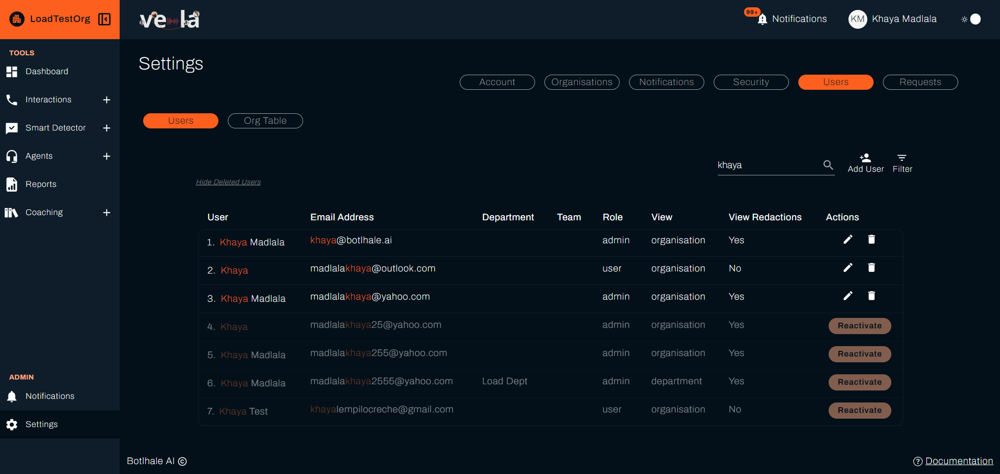

# User and Team Management
The **Users** tab has two sub-tabs. **Users** lists every account in your organisation and holds the controls for adding, editing, and deactivating them. **Org Table** shows the departments and teams those accounts sit in.

:::warning What you can do here depends on your role
The **Users** tab is hidden from the Agent role. Administrators get the **Add User** control and the **Actions** column. Users with the User role see the same lists but none of the controls that change an account.

What you see is also capped by your own access level. Organisational access shows the whole organisation, departmental access shows your department, and team access shows your team. See [Roles and Access Levels](./access-control.md).
:::

---

## 1. Managing User Accounts

### A. Finding Users

* **Search (1):** Matches on name, email address, department, and team. Matching text is highlighted in the results.
* **Filter (2):** Opens the **Filter By** modal. The fields you get depend on your own access level:
  * **Department**, for organisational access only.
  * **Team**, for organisational or departmental access. Teams are listed as the team name followed by its department.
  * **Role**, `admin` or `user`. These are mutually exclusive, so selecting one clears the other.

  Select **Apply** to filter, or **Clear All Fields** to reset.
* **Show Deleted Users (3):** Adds deactivated accounts to the list, shown faded. The button then reads **Hide Deleted Users**.

If nothing matches, the table reads `No results found.`

**Add User (4)** is covered in [Adding a User](#c-adding-a-user) below.

{/* The Email Address column is masked on purpose. The table lists real addresses, and publishing them here would put other people's personal information into the documentation, which POPIA does not allow. The bars show that an address sits in the column without disclosing it. Do not "improve" this by reshooting an unmasked table. */}

### B. The User Table

| Column | Description |
| :--- | :--- |
| **User** | The user's name. |
| **Email Address** | The address they sign in with. |
| **Department** | The department they are assigned to. Empty for organisational access. |
| **Team** | The team they are assigned to. Empty for organisational and departmental access. |
| **Role** | `admin` or `user`. |
| **View** | The user's access level: `organisation`, `department`, or `team`. |
| **View Redactions** | `Yes` or `No`. Always `Yes` for administrators. |
| **Actions** | Edit and delete. Shown to administrators only. |

### C. Adding a User

Select **Add User** to open the modal. It is available to administrators only.

| Field | Notes |
| :--- | :--- |
| **Name** | The user's full name. |
| **Email Address** | Must be unique across Vela, rather than within your organisation alone. |
| **Access** | **Organisational**, **Departmental**, or **Team**. |
| **Department** | Shown when Access is Departmental or Team. |
| **Team** | Shown when Access is Team. Only teams in the selected department are listed. |
| **Role** | **Admin** or **User**. |

Every field is required, so the modal reports an error if one is missing. Select **Add User** to finish, or **Close** to abandon the form. Vela emails the new user an invitation containing a generated password and a link to confirm their address. The email recommends they change the password after signing in.

:::note You cannot grant more than you hold
The Access options offered are limited to your own access level. An administrator with departmental access can create departmental and team users, but not organisational ones. An administrator with team access can only create team users.
:::

The Add User modal has no **View Redactions** field. New users start without it, and you grant it by editing the account afterwards.

### D. Editing a User

Select the pencil icon in the **Actions** column. The modal is titled **Edit** followed by the user's name, and holds **Access**, **Department**, **Team**, **Role**, and **View Redactions**. Select **Apply** to save.

Changing the department clears the team selection, because the team list is filtered to the department you choose.

To change a name or email address, contact **support@botlhale.ai**. Those two fields are set outside Vela.

### E. Deleting and Reactivating

{/* The email column is masked, to keep real addresses out of the documentation under POPIA. The bars show where an address sits without disclosing it. */}

Select the bin icon in the **Actions** column and confirm on the **Delete User** prompt. This deactivates the account rather than erasing it, so the user can no longer sign in but their record stays in place.

To bring an account back, select **Show Deleted Users**, find the row, and select **Reactivate**.

---

## 2. Role, Access, and View Redactions

These three settings decide what a user can do and how much they can see.

| Setting | Values | What it controls |
| :--- | :--- | :--- |
| **Role** | `admin` or `user` | Administrative rights. Administrators configure the organisation, manage users, and process access requests. |
| **Access** | organisational, departmental, or team | The user's access level: how much of the organisation's data they see. Shown in the **View** column. |
| **View Redactions** | `Yes` or `No` | Whether the user can reveal masked information themselves. |

Transcripts are masked for everyone by default, administrators included. **View Redactions** decides how a user gets to the unmasked version. With `Yes`, they reveal it themselves through **Review Redacted Info**. With `No`, they raise a request for each interaction and wait for an administrator to approve it. See [Access Requests](./access-requests-audits.md).

Administrators hold this permission by default. The **View Redactions** column reads `Yes` for every administrator, and the field disappears from the edit modal when you set the role to `admin`.

---

## 3. Departments and Teams

The Org Table shows the organisation, its departments, and its teams side by side, with the users assigned at each level.

### A. Reading the Table

| Column | Contains |
| :--- | :--- |
| **Organisation** | The organisation name, then the users whose access level is organisational. |
| **Departments** | Each department with its colour marker, then the users whose access level is departmental. |
| **Teams** | The teams in each department, then the users whose access level is team. |

`No Users` marks a level that exists but has nobody assigned at it. `No Departments` means the organisation has none yet.

The search box filters departments by name. It does not search users.

Next to each user is a menu with **View More**, which opens their name, email, role, department, team, and the dates the account was created and last updated.

### B. Creating a Department

Select **Create** and choose **Department**. Creating departments requires organisational access.

| Field | Notes |
| :--- | :--- |
| **Department Name** | Must not match an existing department. |
| **Create New Team** | Selected by default. Enter a **Team Name** for the department's first team. |
| **Select a Team** | Shown when **Create New Team** is cleared. Moves an existing team into the new department. |
| **Colour** | Fourteen swatches. Each department must have a colour no other department is using. |

Select **Add Department** to finish. Every department needs at least one team, so supply a new one or move an existing one across.

### C. Creating a Team

Select **Create** and choose **Team**. Creating teams requires organisational or departmental access.

Enter the **Team Name**, choose the **Department Name** it belongs to, and select **Create team**.

### D. Editing a Department or Team

Open the menu next to the department or team and select **Edit**.

* **Edit Department:** Change the name or the colour.
* **Edit Team:** Change the name, or move the team to a different department. Moving a team takes all of its users and agents with it into the new department.

---

## 4. Importing Agents in Bulk

Agents are separate from users. They have their interactions analysed but do not sign in to Vela, and they are the only records you can import from a CSV. That import lives under **Agents → Agent Details**, not here.

For the columns, the template, and how unmatched departments and teams are handled, see [Administrator Setup](../getting-started/quick-start/administrator-setup.md#step-3a-bulk-import-agents-via-csv). For the distinction between an agent and a user, see the [Glossary](../reference/glossary.md#user).

---

## Related

- [Roles and Access Levels](./access-control.md): what each role and access level allows
- [Access Requests](./access-requests-audits.md): what happens when a user without View Redactions asks to see masked content
- [Organisation Configuration](./organisation-configuration.md): the settings that apply to the whole organisation

## Need Help?

**Contact Support:** support@botlhale.ai
