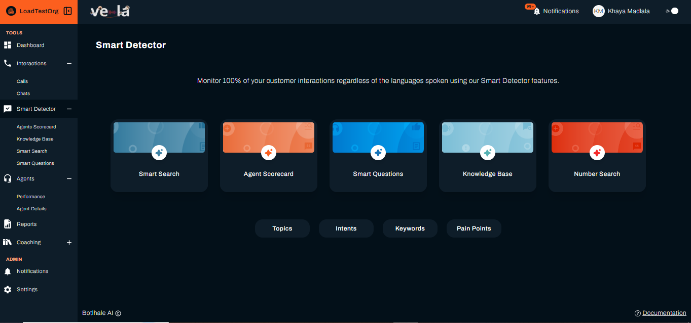

# Smart Detector

Smart Detector is where you set up automatic monitoring and evaluation. It brings together several tools.

---

## The Smart Detector Home Page

Selecting **Smart Detector** in the left sidebar opens a home page with a card for each tool, rather than jumping straight into one of them. The sidebar lists the same tools, so you can go directly to any of them once you know which you want.

Below the cards sit four more buttons: **Topics**, **Intents**, **Keywords**, and **Pain Points**. These are the term lists your searches and analysis match against. See [Manage Smart Search Terms](./topics-and-terms-guide.md).

{/* UNVERIFIED: Number Search. Deferred to the next version, so it stays named but undocumented on purpose. The card is on the Smart Detector home page, but the feature is absent from the vela codebase this documentation is verified against, so its behaviour, inputs and results are unconfirmed. Write it up when the next version confirms it, and take a screenshot then. */}

---

## The Tools

- **Smart Search**: monitor every processed interaction for the phrases, keywords, and patterns you define, and raise an alert when they appear.
- **Smart Questions**: ask a yes/no question about each interaction for reporting, without affecting anyone's score.
- **Agent Scorecard**: the evaluation criteria Vela scores every interaction against.
- **Knowledge Base**: your own policies and procedures, used as the reference point when Vela evaluates agents.

The home page also has a **Number Search** card, for looking up the interactions associated with a phone number. It is not covered in this documentation yet.

Smart Search and Smart Questions appear in the sidebar on the plans that include them. Where one is absent, your Account Manager can tell you what it would take to add.

---

## Related

- [Build an Agent Scorecard](./agent-scorecard-guide.md): the criteria every interaction is scored against
- [Set Up Smart Search](./smart-search-guide.md): monitor every interaction against searches you define
- [Set Up Smart Questions](./smart-questions-guide.md): ask questions of interactions without affecting scores
- [Build Your Knowledge Base](./knowledge-base-guide.md): give the AI your own documents as reference
- [Manage Smart Search Terms](./topics-and-terms-guide.md): the topics, intents, keywords, and pain points searches match on
- [Scorecard Fields](./reference/scorecard-fields.md): every field on a scorecard question

---

## Need Help?

**Contact Support:** support@botlhale.ai
