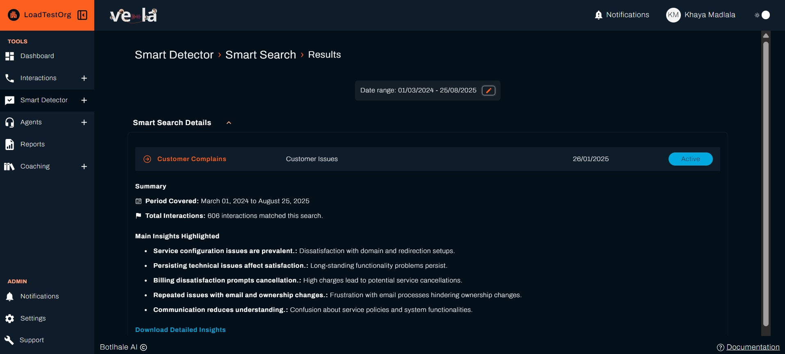

# Automate Issue Detection and Agent Evaluation

Smart Detector automatically analyses completed interactions, evaluates agents, and builds a knowledge base to help you catch customer complaints before they become escalations and spot training gaps before they impact your team's performance.

> **Note**: Smart Detector analyses **completed calls and chats** to identify patterns and issues, helping you improve future interactions.

## What You Can Achieve

Smart Detector provides automated analysis and insights. It helps you:

| **Issue Detection** | **Performance Evaluation** | **Knowledge Management** |
|-------------------|---------------------------|------------------------|
| **Catch complaints before they escalate** | **Score agents objectively** | **Build your team's knowledge** |
| **Monitor compliance efficiently** | **Track improvement over time** | **Find information efficiently** |
| **Spot training needs early** | **Identify coaching opportunities** | **Centralise company knowledge** |

---

## Advanced Intelligent Analysis Tools

### **Smart Search: Complete Call Analysis**
Detect important events and patterns in your customer interactions:

#### What It Monitors:
- **Topics** - Identify and track conversation themes across calls
- **Pain Points** - Automatically detect customer issues and complaints
- **Keywords** - Monitor specific terms and phrases
- **Intents** - Understand customer intentions and goals
- **Agent Performance** - Find calls based on agent scoring and behaviour
- **Customer complaints** - Get alerts when customers express dissatisfaction
- **Compliance violations** - Monitor for regulatory or policy breaches
- **Service quality issues** - Identify patterns that affect customer experience
- **Training opportunities** - Spot areas where agents need support

#### How It Works:
1. **Create search rules** with example phrases
2. **Set monitoring scope** (organisation, department, or team)
3. **Receive automated alerts** when issues are detected in processed calls
4. **Take action** to resolve problems and prevent future issues

### **Agent Scorecard & Checklist: Complete Performance Evaluation**
Evaluate and improve agent performance with AI-powered assessments and custom criteria:

#### What It Evaluates:
- **Intelligent evaluations** - Score every interaction consistently using advanced technology
- **Custom checklists** - Create tailored evaluation criteria for your organisation
- **Performance tracking** - Monitor improvement over time with detailed metrics
- **Training identification** - Spot specific areas for coaching and development
- **Best practice recognition** - Learn from top performers and share insights
- **Multi-dimensional scoring** - Evaluate different aspects of agent performance

#### How It Works:
1. **Define evaluation criteria** for different scenarios
2. **Set performance standards** and scoring weights
3. **Score** every interaction
4. **Generate coaching insights** for improvement

### **Knowledge Base: Intelligent Resource Management**
Build a smart, searchable repository of company information and resources:

#### What It Contains:
- **Document upload** - Add policies, procedures, training materials, and resources
- **Smart search** - Find relevant information efficiently using intelligent search
- **Agent access** - Provide support based on call analysis insights and patterns
- **Continuous improvement** - Update knowledge based on interaction analysis
- **Resource organisation** - Categorise and tag content for easy discovery
- **Integration with coaching** - Connect knowledge base with training programmes

#### How It Works:
1. **Upload company documents** (PDFs, text files, URLs)
2. **Organise with tags** and categories
3. **Enable agent access** during calls
4. **Update content** based on common questions

---

## Getting Started with Smart Search

### Step 1: Create Your First Search

1. **Go to "Smart Detector" → "Smart Search"**
2. **Click "New Smart Search"** to start a new search
3. **Name your search** (e.g., "Customer Complaints")
4. **Add example phrases** that indicate the issue:
   - "I'm not happy with this service"
   - "This is terrible"
   - "I want to speak to a manager"
   - "I'm going to cancel my account"
5. **Set the scope** - Choose organisation-wide or specific teams
6. **Click "Create"** to start monitoring

### Step 2: Monitor Results

1. **Go to "Smart Detector" → "Smart Search"**
2. **Click "View"**
   - [ ] **Review matches** in the Smart Search results
   - [ ] **Investigate flagged calls** to understand the context
   - [ ] **Take action** based on the insights
   - [ ] **Refine your search** based on what you learn

---

## Setting Up Agent Scorecards

### Step 1: Define Evaluation Criteria

1. **Go to "Smart Detector" → "Agent Scorecard"**
2. **Click "Create"** tab
3. **Create evaluation checklists** for different scenarios
4. **Set performance standards** for each criterion
5. **Define scoring weights** based on importance

### Step 2: Monitor Performance
- [ ] **Review automated scores** for each agent
- [ ] **Identify improvement areas** from the data
- [ ] **Plan coaching sessions** based on specific weaknesses
- [ ] **Track progress** over time

---

## Building Your Knowledge Base

### Step 1: Upload Company Documents
1. **Go to "Smart Detector" → "Knowledge Base"**
2. **Upload important documents**:
   - Company policies and procedures
   - Product information and FAQs
   - Training materials and scripts
   - Compliance guidelines
3. **Organise content** with tags and categories
4. **Set access permissions** for different teams

---

## 💼 Real-World Use Cases

### Customer Service Excellence
**Goal**: Improve customer satisfaction and reduce complaints

**Smart Search Setup**:
- Monitor for complaint phrases
- Track escalation requests
- Identify service quality issues

**Scorecard Criteria**:
- Problem resolution effectiveness
- Customer empathy and understanding
- Professional communication
- Follow-up actions

**Knowledge Base Content**:
- Product information and FAQs
- Service policies and procedures
- Escalation guidelines
- Best practice scripts

### Compliance and Quality Assurance
**Goal**: Ensure regulatory compliance and maintain quality standards

**Smart Search Setup**:
- Monitor for compliance violations
- Track policy breaches
- Identify quality issues

**Scorecard Criteria**:
- Policy adherence
- Documentation accuracy
- Security protocol compliance
- Escalation procedures

**Knowledge Base Content**:
- Compliance guidelines
- Policy documents
- Quality standards
- Training materials

### Sales Performance Optimization
**Goal**: Improve sales effectiveness and conversion rates

**Smart Search Setup**:
- Monitor for sales opportunities
- Track objection handling
- Identify upselling moments

**Scorecard Criteria**:
- Sales technique effectiveness
- Objection handling skills
- Product knowledge demonstration
- Closing techniques

**Knowledge Base Content**:
- Product specifications
- Sales scripts and templates
- Pricing information
- Competitive analysis

---

## Troubleshooting Common Issues

| **Problem** | **Solution** |
|-------------|--------------|
| **Too many false positives** | Refine search phrases, add more specific criteria, adjust scope |
| **Missing important issues** | Add more example phrases, expand search scope, review recent calls |
| **Scorecard not reflecting reality** | Review evaluation criteria, adjust scoring weights, check data quality |
| **Knowledge base not being used** | Train agents on access, improve search functionality, add relevant content |

---

## Next Steps

| **For Issue Detection** | **For Performance Evaluation** | **For Knowledge Management** |
|------------------------|--------------------------------|------------------------------|
| [Create Smart Searches](./smart-search-guide.md) | [Build Agent Scorecards](./agent-scorecard-guide.md) | [Build Knowledge Base](./knowledge-base-guide.md) |

### See also
- [Smart Search Guide](./smart-search-guide.md) - Create custom search patterns
- [Knowledge Base Guide](./knowledge-base-guide.md) - Build your team's knowledge resources
- [Agent Performance](./agents.md) - Coach your team effectively
- [Dashboard Monitoring](./dashboard.md) - Monitor automated alerts and insights
- [Official API Documentation](https://docs-apis.botlhale.xyz) - Complete API reference for integrations

## Need Help?

- **Contact Support**: support@botlhale.ai
