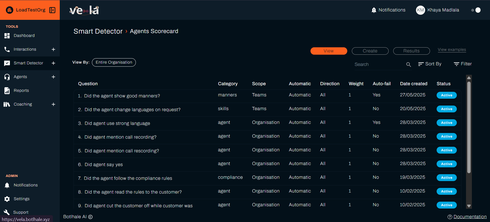
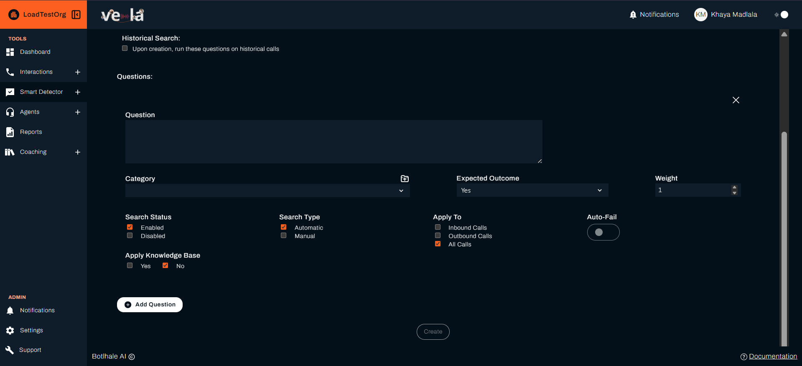

# 🔍 Automate Issue Detection and Agent Evaluation

What if you could catch customer complaints before they become escalations? Or spot training gaps before they impact your team's performance? Smart Detector does the heavy lifting for you, automatically analyzing completed interactions, evaluating agents, and building a knowledge base that makes your team unstoppable.

> 💡 **Note**: Smart Detector analyzes **completed calls and chats** to identify patterns and issues, helping you improve future interactions.

## What You Can Achieve

Smart Detector is like having a super-powered assistant that never sleeps. Here's what it does for you:

| **Issue Detection** | **Performance Evaluation** | **Knowledge Management** |
|-------------------|---------------------------|------------------------|
| 🚨 **Catch complaints before they explode** | 📊 **Score agents objectively** | 🧠 **Build your team's brain** |
| ⚡ **Monitor compliance efficiently** | 📈 **Track improvement over time** | 🔍 **Find information efficiently** |
| 🎯 **Spot training needs early** | 🎯 **Identify coaching opportunities** | 📚 **Centralize company knowledge** |

---

## 🛠️ Three Powerful Tools for Your Team

### 🔍 **Smart Search: Catch Issues Early**
Detect important events in your customer interactions:

#### What It Monitors:
- 🚨 **Customer complaints** - Get alerts when customers express dissatisfaction
- ⚖️ **Compliance violations** - Monitor for regulatory or policy breaches
- 🔧 **Service quality issues** - Identify patterns that affect customer experience
- 📚 **Training opportunities** - Spot areas where agents need support

#### How It Works:
1. **Create search rules** with example phrases
2. **Set monitoring scope** (organisation, department, or team)
3. **Receive automated alerts** when issues are detected in processed calls
4. **Take action** to resolve problems and prevent future issues

### 📊 **Agent Scorecard: Improve Performance Systematically**
Evaluate and improve agent performance with AI-powered assessments:

#### What It Evaluates:
- 🎯 **AI-powered evaluations** - Score every interaction consistently
- 📈 **Performance tracking** - Monitor improvement over time
- 🎓 **Training identification** - Spot specific areas for coaching
- 🌟 **Best practice recognition** - Learn from top performers

#### How It Works:
1. **Define evaluation criteria** for different scenarios
2. **Set performance standards** and scoring weights
3. **Score** every interaction
4. **Generate coaching insights** for improvement

### 📚 **Knowledge Base: Empower Your Team**
Build a smart, searchable repository of company information:

#### What It Contains:
- 📄 **Document upload** - Add policies, procedures, and training materials
- 🔍 **Smart search** - Find relevant information efficiently
- 👥 **Agent access** - Provide support based on call analysis insights
- 🔄 **Continuous improvement** - Update knowledge based on interactions

#### How It Works:
1. **Upload company documents** (PDFs, text files, URLs)
2. **Organize with tags** and categories
3. **Enable agent access** during calls
4. **Update content** based on common questions

---

## 🚀 Getting Started with Smart Search

### Step 1: Create Your First Search

1. **Go to "Smart Detector" → "Smart Search"**
2. **Click "New Smart Search"** to start a new search
3. **Name your search** (e.g., "Customer Complaints")
4. **Add example phrases** that indicate the issue:
   - "I'm not happy with this service"
   - "This is terrible"
   - "I want to speak to a manager"
   - "I'm going to cancel my account"
5. **Set the scope** - Choose organisation-wide or specific teams
6. **Click "Create"** to start monitoring

### Step 2: Monitor Results

1. **Go to "Smart Detector" → "Smart Search"**
2. **Click "View"**
   - [ ] **Review matches** in the Smart Search results
   - [ ] **Investigate flagged calls** to understand the context
   - [ ] **Take action** based on the insights
   - [ ] **Refine your search** based on what you learn

---

## Setting Up Agent Scorecards

### Step 1: Define Evaluation Criteria

1. **Go to "Smart Detector" → "Agent Scorecard"**
2. **Click "Create"** tab
3. **Create evaluation checklists** for different scenarios
4. **Set performance standards** for each criterion
5. **Define scoring weights** based on importance

### Step 2: Monitor Performance
- [ ] **Review automated scores** for each agent
- [ ] **Identify improvement areas** from the data
- [ ] **Plan coaching sessions** based on specific weaknesses
- [ ] **Track progress** over time

---

## 📚 Building Your Knowledge Base

### Step 1: Upload Company Documents
1. **Go to "Smart Detector" → "Knowledge Base"**
2. **Upload important documents**:
   - Company policies and procedures
   - Product information and FAQs
   - Training materials and scripts
   - Compliance guidelines
3. **Organize content** with tags and categories
4. **Set access permissions** for different teams

---

## 💼 Real-World Use Cases

### Customer Service Excellence
**Goal**: Improve customer satisfaction and reduce complaints

**Smart Search Setup**:
- Monitor for complaint phrases
- Track escalation requests
- Identify service quality issues

**Scorecard Criteria**:
- Problem resolution effectiveness
- Customer empathy and understanding
- Professional communication
- Follow-up actions

**Knowledge Base Content**:
- Product information and FAQs
- Service policies and procedures
- Escalation guidelines
- Best practice scripts

### Compliance and Quality Assurance
**Goal**: Ensure regulatory compliance and maintain quality standards

**Smart Search Setup**:
- Monitor for compliance violations
- Track policy breaches
- Identify quality issues

**Scorecard Criteria**:
- Policy adherence
- Documentation accuracy
- Security protocol compliance
- Escalation procedures

**Knowledge Base Content**:
- Compliance guidelines
- Policy documents
- Quality standards
- Training materials

### Sales Performance Optimization
**Goal**: Improve sales effectiveness and conversion rates

**Smart Search Setup**:
- Monitor for sales opportunities
- Track objection handling
- Identify upselling moments

**Scorecard Criteria**:
- Sales technique effectiveness
- Objection handling skills
- Product knowledge demonstration
- Closing techniques

**Knowledge Base Content**:
- Product specifications
- Sales scripts and templates
- Pricing information
- Competitive analysis

---

## ⏰ Daily Smart Detector Routine

### 🌅 Morning Review (10 minutes)
- [ ] **Check Smart Search alerts** - Review any issues detected overnight
- [ ] **Review agent scores** - Identify anyone needing immediate attention
- [ ] **Update knowledge base** - Add any new information from recent calls

### 📅 Weekly Analysis (30 minutes)
- [ ] **Analyse search patterns** - Look for recurring issues
- [ ] **Review scorecard trends** - Identify team-wide improvement areas
- [ ] **Update search criteria** - Refine based on what you've learned
- [ ] **Enhance knowledge base** - Add content for common questions

---

## Troubleshooting Common Issues

| **Problem** | **Solution** |
|-------------|--------------|
| **Too many false positives** | Refine search phrases, add more specific criteria, adjust scope |
| **Missing important issues** | Add more example phrases, expand search scope, review recent calls |
| **Scorecard not reflecting reality** | Review evaluation criteria, adjust scoring weights, check data quality |
| **Knowledge base not being used** | Train agents on access, improve search functionality, add relevant content |

---

## Next Steps

| **For Issue Detection** | **For Performance Evaluation** | **For Knowledge Management** |
|------------------------|--------------------------------|------------------------------|
| [Create Smart Searches](./smart-search-guide.md) | [Build Agent Scorecards](./agent-scorecard-guide.md) | [Build Knowledge Base](./knowledge-base-guide.md) |

## Need Help?

- **Contact Support**: support@botlhale.ai
- 📚 **Navigation Guide**: [Find the right documentation](./navigation-guide.md) for your needs
