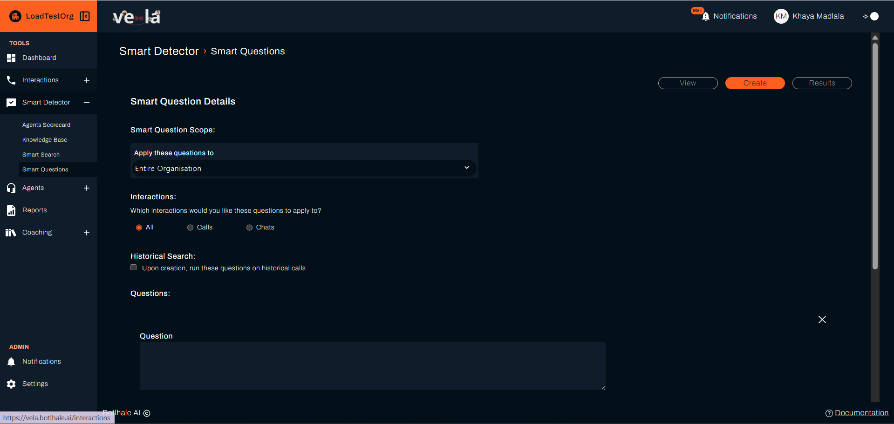
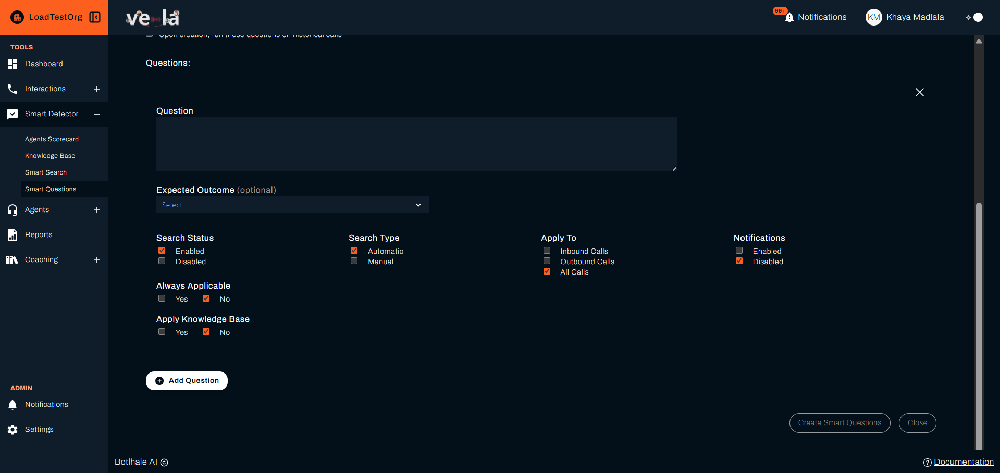
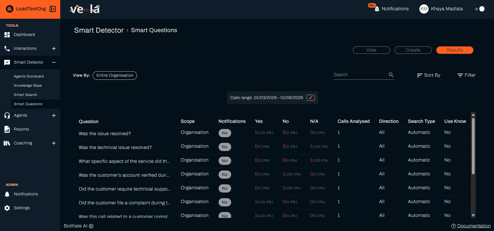

# Set Up Smart Questions

Smart Questions let you ask a question of your interactions and see the answers, without those answers affecting anyone's score.

:::info Plan availability
Smart Questions is available on plans that include it. If **Smart Questions** does not appear under **Smart Detector** in the left sidebar, your organisation's plan does not cover it. Contact your Account Manager.
:::

## How Smart Questions Differ from the Agent Scorecard

Both features ask yes/no questions about an interaction, and both are evaluated automatically by the AI. The difference is what happens to the answer:

| | **Agent Scorecard** | **Smart Questions** |
| :--- | :--- | :--- |
| **Affects the agent's score** | Yes, weighted into the overall score | **No** |
| **Has a weight** | Yes | Not applicable |
| **Purpose** | Evaluating agent performance | Gathering information about interactions |

Because Smart Questions are not scored, use them whenever you want to know something about your conversations but it would be unfair, or irrelevant, to judge an agent on the answer.

:::tip When to use a Smart Question instead of a scorecard item
If the answer says something about **the conversation** rather than **the agent's performance**, it belongs in Smart Questions. Asking whether a customer mentioned a competitor, or referenced a specific product, tells you something useful without implying the agent did anything right or wrong.
:::

---

## Creating a Smart Question

1. Click **Smart Detector** in the left sidebar, then **Smart Questions**.
2. Select the **Create** tab.
3. Configure the settings described below.
4. Click **Create Smart Questions** to save.

{/* RESHOOT: create_1.png shows a set-level "Interactions" radio (All / Calls / Chats) that has been removed from the product. The prompt string no longer exists anywhere in the app. The surrounding text is correct; only the image is behind. */}

### Scope

Under **Smart Question Scope**, use **Apply these questions to** to choose how far the set reaches. The options depend on your own access level:

* Organisational access: **Entire Organisation**, **Specific Departments**, or **Specific Teams**.
* Departmental access: **Entire Department** or **Specific Teams**.
* Team access: **Entire Team**, the only option offered.

Choosing **Specific Departments** or **Specific Teams** opens a second selector for picking which ones.

### Questions

Enter your question in the **Question** field. Click **Add Question** to include more than one question in a single set.

Write questions so they can be answered clearly from the transcript. As with scorecard items, a concrete question produces more reliable answers than a vague one.

Set an **Expected Outcome** (optional) to record the answer you expect. Because Smart Questions are not scored, this does not affect anyone's score.

### Search Type

| Option | Meaning |
| :--- | :--- |
| **Automatic** | The AI answers the question for each interaction |
| **Manual** | The question is answered by a reviewer rather than the AI |

### Apply To

Choose which interactions the question runs against:

- **Inbound Calls**
- **Outbound Calls**
- **All Calls**

The setting filters on direction, and chats have a direction too. A chat uploaded without one is treated as inbound, so a question set to **Outbound Calls** never reaches those chats. Use **All Calls** if you want the question answered on chats as well as calls.

### Search Status

Set to **Enabled** to run the question against incoming interactions, or **Disabled** to pause it without deleting it.

### Notifications

Set to **Enabled** to receive a notification when the question is answered on a new interaction, or **Disabled** to review answers in the results view only.

When Notifications is **Enabled**, use **Receive notifications when** to choose whether you are alerted when the answer is **Yes** or **No**.

### Always Applicable

Set to **Yes** if the question always applies, so the AI answers only **Yes** or **No**. Set to **No** to let the AI mark the question **N/A** when it does not apply to an interaction.

### Historical Search

By default a Smart Question applies to interactions processed after it is created. To also run it against interactions already in Vela, tick **Upon creation, run these questions on historical calls**.

Then choose **All historical calls** to run against every past interaction, or **Specific date range** to set a **Start Date** and **End Date**.

### Knowledge Base Document

Set **Apply Knowledge Base** to **Yes** to link a Knowledge Base document, then select it under **Knowledge Base Document**. The AI uses that document as reference when it answers. This helps when the answer depends on your own procedures or product details rather than general knowledge.

See [Knowledge Base](./knowledge-base-guide.md) for how to upload documents.

---

## Reviewing Answers

1. Go to **Smart Detector → Smart Questions**.
2. Select the **Results** tab. Each question shows how many interactions were answered **Yes**, **No**, or **N/A**, as a count and a percentage, alongside its **Scope**, **Calls Analysed**, **Direction**, **Search Type**, and whether it uses a Knowledge Base document.
3. Click a count to open the matching interactions, then open any interaction to read the full transcript and AI analysis in context.

Because the answers do not feed into scoring, they are best read as a body of evidence across many interactions rather than a judgement on any single one. Patterns in the answers are usually more informative than individual results.

---

## Related

- [Smart Detector](./smart-detector-overview.md): the home page these tools sit under, and what each one does
- [Set Up Smart Search](./smart-search-guide.md): detect keywords, intents, topics, and pain points
- [Build Your Knowledge Base](./knowledge-base-guide.md): upload the documents a question is judged against
- [Review and Score Interactions](./features/quality-assurance-tools.md): score interactions against the Agent Scorecard

## Need Help?

**Contact Support:** support@botlhale.ai
