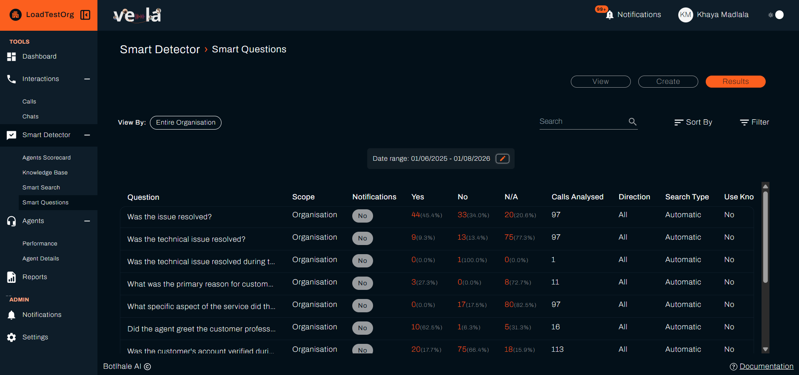
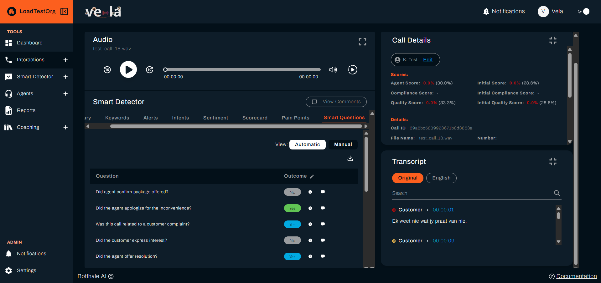

import Hotspots from '@site/src/components/Hotspots';
import questionFormTop from '@site/img/screenshots/smart_questions/question-form-top.png';
import questionFormBottom from '@site/img/screenshots/smart_questions/question-form-bottom.png';

# Set Up Smart Questions

Smart Questions let you ask a question against your interactions and see the answers, without those answers affecting anyone's score.

:::info Plan availability
**Smart Questions** appears under **Smart Detector** in the left sidebar on the plans that include it. Where it is unavailable, ask your Account Manager about upgrading your plan.
:::

---

## Before You Begin

You need:

- **Smart Questions on your plan.** Where **Smart Questions** appears under **Smart Detector** in the left sidebar, your plan includes it.
- **Access level:** Organisational, Departmental, or Team, covering the scope you want. See [Access Level](./reference/glossary.md#access-level).
- **To decide about Historical Search before you save.** It runs the questions against interactions already in Vela, and it cannot be changed once you save.

---

## How Smart Questions Differ from the Agent Scorecard

Both features ask yes/no questions about an interaction, and both are evaluated automatically by the AI. The difference is what happens to the answer:

| | **Agent Scorecard** | **Smart Questions** |
| :--- | :--- | :--- |
| **Affects the agent's score** | Yes, weighted into the overall score | **No** |
| **Has a weight** | Yes | Not applicable |
| **Purpose** | Evaluating agent performance | Gathering information about interactions |

Because Smart Questions are not scored, use them whenever you want to know something about your conversations but it would be unfair, or irrelevant, to judge an agent on the answer.

:::tip When to use a Smart Question instead of a scorecard item
If the answer says something about **the conversation** rather than **the agent's performance**, it belongs in Smart Questions. Asking whether a customer mentioned a competitor, or referenced a specific product, tells you something useful without implying the agent did anything right or wrong.
:::

---

## Creating a Smart Question

1. Select **Smart Detector** in the left sidebar, then **Smart Questions**.
2. Select the **Create** tab.
3. Configure the settings described below.
4. Select **Create Smart Questions** to save.

The form is one page, scrolled. The scope, interactions, and Historical Search settings at the top cover the **whole set**. Everything from **Question** down is set **per question**, so one set can hold questions that differ from each other. Each section below covers one field in full.

<Hotspots
  src={questionFormTop}
  alt="The top of the New Smart Question form: the Create tab, Smart Question Scope, Interactions, and Historical Search"
  points={[
    { x: 66.7, y: 21.6, title: 'The Create tab', body: 'Everything here builds a new set of questions. View lists the sets you already have.' },
    { x: 31.8, y: 33.5, title: 'Smart Question Scope', body: 'Which parts of the organisation the questions apply to. A question is answered on interactions handled by agents in scope.' },
    { x: 44.8, y: 51.9, title: 'Interactions', body: 'All, Calls, or Chats. This covers the whole set.' },
    { x: 43.3, y: 67.8, title: 'Historical Search', body: 'Runs the questions against interactions already in Vela. Set at creation, and cannot be added later.' },
  ]}
/>

<Hotspots
  src={questionFormBottom}
  alt="The question block of the New Smart Question form: Question, Expected Outcome, Search Status, Search Type, Apply To, Notifications, Always Applicable, Apply Knowledge Base, and the Create Smart Questions button"
  points={[
    { x: 26.1, y: 13.7, title: 'Question', body: 'The question to ask of each interaction, phrased for a yes or no answer.' },
    { x: 36.5, y: 32.6, title: 'Expected Outcome', body: 'Optional here, since the answers are never scored. Set it only to highlight a Yes or a No in the results.' },
    { x: 28.1, y: 44.1, title: 'Search Status', body: 'Enabled runs the question. Disabled keeps it without answering anything.' },
    { x: 46.9, y: 44.1, title: 'Search Type', body: 'Automatic lets the AI answer. Manual leaves it for a reviewer.' },
    { x: 65.7, y: 44.1, title: 'Apply To', body: 'Inbound calls, outbound calls, or all calls. A chat is treated as inbound.' },
    { x: 84.4, y: 44.1, title: 'Notifications', body: 'Alerts you when the question is answered on a new interaction.' },
    { x: 30.2, y: 55.6, title: 'Always Applicable', body: 'No lets the AI answer N/A where the question does not fit. Yes forces a Yes or No.' },
    { x: 32.3, y: 63.6, title: 'Apply Knowledge Base', body: 'Answers the question against one of your own documents rather than general knowledge.' },
    { x: 73, y: 88.6, title: 'Create Smart Questions', body: 'Saves the set. Answers appear as new interactions are processed.' },
  ]}
/>

### Scope

Under **Smart Question Scope**, use **Apply these questions to** to choose how far the set reaches. The options depend on your own access level:

* Organisational access: **Entire Organisation**, **Specific Departments**, or **Specific Teams**.
* Departmental access: **Entire Department** or **Specific Teams**.
* Team access: **Entire Team**, the only option offered.

Choosing **Specific Departments** or **Specific Teams** opens a second selector for picking which ones.

### Interactions

Under **Interactions**, answer "Which interactions would you like these questions to apply to?" with **All**, **Calls**, or **Chats**. The choice covers the whole set, so every question in it runs against the same interaction types.

This is not the same control as **Apply To** further down the form. Interactions chooses the *type*, calls or chats. Apply To chooses the *direction*, inbound or outbound.

### Questions

Enter your question in the **Question** field. Select **Add Question** to include more than one question in a single set.

Write questions so they can be answered clearly from the transcript. As with scorecard items, a concrete question produces more reliable answers than a vague one.

Set an **Expected Outcome** (optional) to record the answer you expect. Because Smart Questions are not scored, this does not affect anyone's score.

### Search Type

| Option | Meaning |
| :--- | :--- |
| **Automatic** | The AI answers the question for each interaction |
| **Manual** | A reviewer answers the question rather than the AI |

### Apply To

Choose which interactions the question runs against:

- **Inbound Calls**
- **Outbound Calls**
- **All Calls**

The setting filters on direction. The chat upload form has no direction field, so a chat is treated as inbound unless your own integration sets one explicitly. A question restricted to **Outbound Calls** therefore never reaches a chat, but **Inbound Calls** and **All Calls** both do. Use **All Calls** if you want the question answered on chats as well as calls of either direction.

### Search Status

Set to **Enabled** to run the question against incoming interactions, or **Disabled** to pause it without deleting it.

### Notifications

Set to **Enabled** to receive a notification when the question is answered on a new interaction, or **Disabled** to review answers in the results view only.

When Notifications is **Enabled**, use **Receive notifications when** to choose whether you are alerted when the answer is **Yes** or **No**.

### Always Applicable

Set to **Yes** if the question always applies, so the AI answers only **Yes** or **No**. Set to **No** to let the AI mark the question **N/A** when it does not apply to an interaction.

### Historical Search

By default a Smart Question applies to interactions processed after it is created. To also run it against interactions already in Vela, tick **Upon creation, run these questions on historical calls**.

Then choose **All historical calls** to run against every past interaction, or **Specific date range** to set a **Start Date** and **End Date**.

### Knowledge Base Document

Set **Apply Knowledge Base** to **Yes** to link a Knowledge Base document, then select it under **Knowledge Base Document**. The AI uses that document as reference when it answers. This helps when the answer depends on your own procedures or product details rather than general knowledge.

See [Knowledge Base](./knowledge-base-guide.md) for how to upload documents.

---

## Reviewing Answers

1. Go to **Smart Detector → Smart Questions**.
2. Select the **Results** tab. Each question shows how many interactions were answered **Yes**, **No**, or **N/A**, as a count and a percentage, alongside its **Scope**, whether **Notifications** are on for it, **Calls Analysed**, **Direction**, **Search Type**, and whether it uses a Knowledge Base document.
3. Select a count to open the matching interactions, then open any interaction to read the full transcript and AI analysis in context.

**View By** sets how much of the organisation the figures cover, and the date range bounds the interactions counted. **Search**, **Sort By**, and **Filter** narrow the list of questions.

{/* results_3.png has the Support entry painted out of the sidebar. It is internal-only, so a customer never sees it. See STYLE_GUIDE.md section 8. */}

Because the answers do not feed into scoring, they are best read as a body of evidence across many interactions rather than a judgement on any single agent. Patterns in the answers are usually more informative than individual results.

### Reading the Answers on One Interaction

The **Results** tab counts answers across interactions. To see why a single conversation was answered as it was, open the interaction and select the **Smart Questions** tab in the **Smart Detector** panel.

Each row holds the question, its answer, and two controls:

| Control | What it does |
| :--- | :--- |
| The **information** icon | Shows the AI's reasoning for that answer, in its own words |
| The **comment** icon | Opens the **Comments** panel with the question and its answer already written in |

Read the reasoning before you act on an answer that looks wrong. It usually shows whether the AI misread the conversation or the question itself is ambiguous, and those need different fixes: the first is a one-off, the second means rewording the question.

Select the **download** icon to view the answers for that interaction as a CSV.

:::note Correcting an answer removes its reasoning
You can correct an answer where the AI got it wrong. Doing so takes the information icon off that row, because the reasoning explained the AI's answer rather than yours. The CSV leaves the reason column empty for corrected answers for the same reason.

Correcting an answer does not change the agent's score. Smart Questions are never scored, so a correction here records what happened rather than adjusting a figure.
:::

---

## Check Your Work

Your set appears on the **View** tab straight away. Answers do not.

A question with **Historical Search** off only applies to interactions processed after you created it, so the **Results** tab remains empty until new interactions arrive.

You are finished when the **Results** tab shows Yes, No, and N/A counts against your question and **Calls Analysed** is above zero. If it stays at zero after new interactions have been processed, check that Search Status is **Enabled** and that the scope covers the teams those interactions belong to.

---

## Related

- [Smart Detector](./smart-detector-overview.md): the home page these tools sit under, and what each tool does
- [Set Up Smart Search](./smart-search-guide.md): detect keywords, intents, topics, and pain points
- [Build Your Knowledge Base](./knowledge-base-guide.md): upload the documents a question is judged against
- [Review and Score Interactions](./features/quality-assurance-tools.md): score interactions against the Agent Scorecard

## Need Help?

**Contact Support:** support@botlhale.ai
