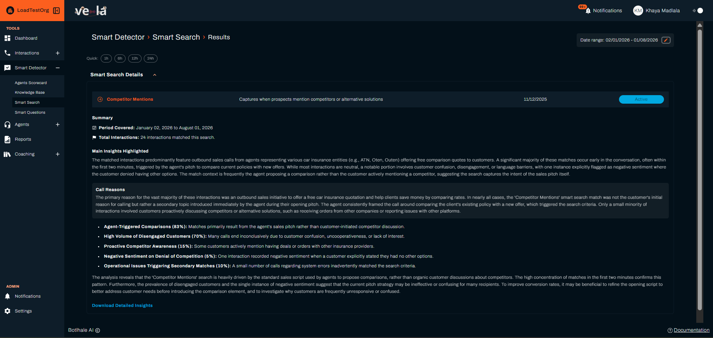
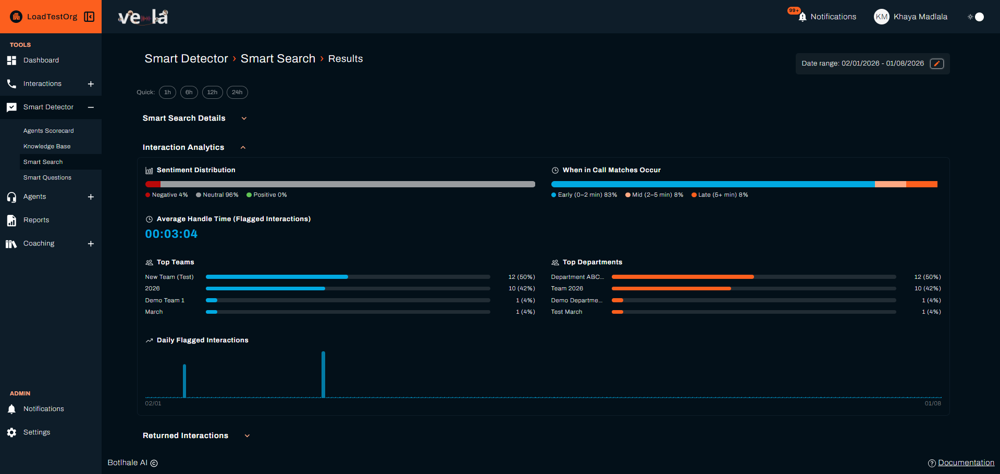
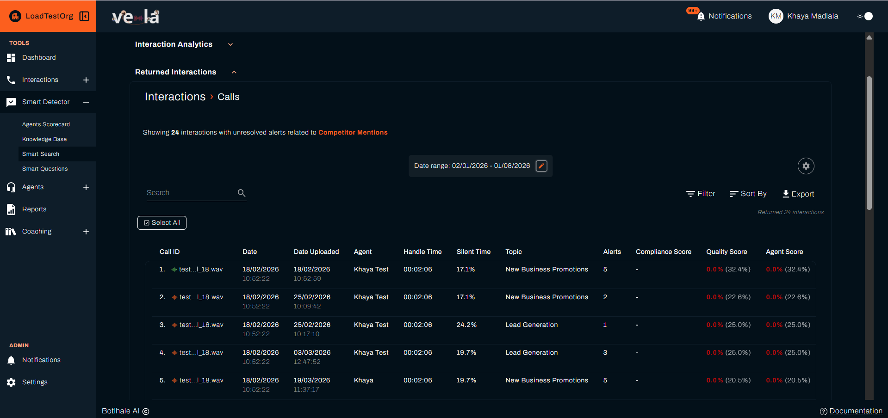

# Set Up Smart Search

Smart Search automatically monitors every processed interaction for keywords, phrases, and patterns you define. Each time a processed call or chat matches one of your searches, an alert is raised and linked directly to that interaction. This lets you focus your QA effort on the conversations that matter most rather than reviewing interactions at random.

:::info Plan availability
Smart Search is available on plans that include it. If **Smart Search** does not appear under **Smart Detector** in the left sidebar, your organisation's plan does not cover it. Contact your Account Manager.
:::

---

## What You Can Achieve

Smart Search gives you automated monitoring across three areas:

- **Issue detection**: catch problems early and respond before they escalate
- **Compliance and quality monitoring**: confirm that agents are following required procedures and scripts
- **Opportunity identification**: spot training needs and surface examples of excellent service

---

## How Matching Works

Vela matches on meaning, not on exact words. When you add an example phrase, Vela flags interactions that say something very similar or express the same thing, so you do not need to list every wording. Capitalisation, punctuation, and small differences in phrasing do not affect a match.

Two things guide a match:

- **The example phrases** you provide, as representative examples of what to look for.
- **The Description**, which Vela also reads when deciding whether an interaction matches. Write it to describe what the search is looking for, not only as a note to yourself.

Vela matches on clear evidence in the transcript rather than guessing. A vague description or a single ambiguous phrase matches less reliably than a clear description with a few concrete examples.

Searches work across languages. Calls and chats in the 11 official South African languages are translated to English as they are processed, and matching reads that translation alongside the original. You can write your example phrases in English, and they match interactions spoken in another language.

You can also narrow a search with structured filters (intents, keywords, topics, pain points, or agents), each set to **include** or **exclude**, and combine several conditions in one search. For every filter type and setting, see [Smart Search Criteria](./reference/smart-search-criteria.md).

---

## Creating a Smart Search

### Step 1: Access Smart Search

1. In the left sidebar, open **Smart Detector** and select **Smart Search**.
2. Click **New Smart Search** to open the creation form.

### Step 2: Define Your Search Criteria

{/* RESHOOT: 11.png and 12.png predate Smart Questions, so the sidebar shows three Smart Detector entries in the old order. The form fields themselves still match createForm.jsx. Same applies to 10.png above. */}

1. Enter a descriptive **Smart Search Title** (for example, "Customer Complaints: Escalation Language").
2. Set the **Search Status** to Enabled so the search starts matching once you save it. A disabled search is kept but does not run.
3. Add a **Description** of what the search is looking for. Vela reads this when matching, so it shapes the results, and it also helps you when reviewing a list of searches months later.
4. Under **Search Scope**, use **Apply to** to choose how far the search reaches. The options depend on your own access level:
   * Organisational access: **Entire Organisation**, **Specific Departments**, or **Specific Teams**.
   * Departmental access: **Entire Department** or **Specific Teams**.
   * Team access: **Entire Team**.

   Choosing **Specific Departments** or **Specific Teams** opens a second selector for picking which ones.
5. Add the criteria you want to monitor. Most searches start with phrases: click **Add** under **Example Phrases** for each one. To narrow the search further, click **Add Filter** under **Search Filter** to match on intents, keywords, topics, pain points, or specific agents. Those come from your organisation's lists, whether Vela detected them or your team added them, so add the term first if it is not offered. See [Smart Search Criteria](./reference/smart-search-criteria.md) and [Manage Smart Search Terms](./topics-and-terms-guide.md).
6. Toggle **Notifications** on if you want to be alerted each time a new match is detected. You can change this later by editing the search.
7. Enable **Historical Search** if you want the search to also run against interactions that were already uploaded before the search was created.
8. Click **Create Smart Search** to save the search.

The form also lets you combine several conditions, link this search to another, and attach a Knowledge Base document. See [More Search Options](#more-search-options).

---

### Step 3: Review and Refine Results

Once interactions are processed, matches appear automatically in the search results.

1. Navigate to **Smart Detector → Smart Search**.
2. Click **View** next to your search.
3. Review the matched interactions. Each result links directly to the call or chat that triggered the match.
4. Click an interaction to open it and review the full transcript, AI analysis, and context.
5. Resolve the alert once you have reviewed and acted on it.

If the results contain too many irrelevant matches, return to the search and make the description and examples more specific. If matches are being missed, add another clear example or sharpen the description. Refining a search based on early results is a normal part of getting it to perform well.

---

## More Search Options

Beyond phrases, a Smart Search has a few optional ways to focus what it matches. Each is set on the same creation form.

### Combine Several Conditions

A search can use more than one criterion at once, for example a set of phrases together with an intent or a pain point. When a search has more than one condition, set **Show Results When** to decide how they combine:

- **All conditions are met**: an interaction matches only when every condition matches.
- **Some of the conditions are met**: an interaction matches when at least one condition matches.

For every criterion and its include, exclude, and all of / some of settings, see [Smart Search Criteria](./reference/smart-search-criteria.md).

### Link to Another Search

Turn on **Link to Search** and choose a main search to have this search checked only on interactions that the main search has already matched. This focuses a specific search on a narrower set of interactions, for example checking for escalation language only where a billing search already matched.

The main search must share the same scope. A linked search cannot itself be a main search, so links are one level deep. If a main search is set to Inactive it stops matching, so any search linked to it has nothing to run against.

### Use a Knowledge Base Document

Turn on **Knowledge Base** and select a document to have Vela use its content as reference when matching your phrases. This helps the search judge interactions against your own procedures rather than generic wording. The document must be within the search's scope. See [Knowledge Base](./knowledge-base-guide.md).

---

## Common Search Types

### Customer Experience Monitoring

| **Search Type** | **Example Phrases** |
|-----------------|-------------------|
| Customer Complaints | "I'm not happy", "This is terrible", "I want to speak to a manager" |
| Service Issues | "This doesn't work", "I've been waiting", "Nobody helped me" |
| Billing Problems | "I was charged twice", "This bill is wrong", "I want a refund" |
| Product Issues | "This is broken", "It's not working", "Defective product" |

### Compliance and Quality Assurance

| **Search Type** | **Example Phrases** |
|-----------------|-------------------|
| Regulatory Violations | "I didn't authorise this", "That's illegal", "You can't do that" |
| Policy Breaches | "That's against policy", "You're not following procedure" |
| Security Concerns | "My information was shared", "Data breach", "Privacy violation" |
| Documentation Issues | "That wasn't documented", "No record of this", "Missing information" |

### Training and Development

| **Search Type** | **Example Phrases** |
|-----------------|-------------------|
| Knowledge Gaps | "I don't know", "Can you explain", "I'm not sure how" |
| Process Confusion | "What's the procedure", "How do I do this", "I'm confused" |
| Escalation Requests | "I need a supervisor", "Can I speak to someone else", "This is too complex" |
| Positive Feedback | "Great service", "Thank you so much", "You're amazing" |

---

## Monitoring and Alerts

### Notifications

Each search has its own **Notifications** setting. You can turn it on when you create the search, and change it later by editing the search. When it is on, every new match for that search raises an alert.

Whether that alert reaches you in-app, by email, or both depends on your preferences in **Settings → Notifications**. Matches always appear in the results view, whether notifications are on or off.

### Alert Management

Work through alerts regularly rather than letting them accumulate. See [Notifications](./features/notifications.md) for the review routine and where alerts appear.

If a search is producing more matches than your team can act on, edit it to use more specific phrases, or turn its Notifications setting off and review its matches in the results view instead.

---

## Analysing Search Results

### Understanding the Results View

Click **View** on a search to open its results. At the top, set the **Date range**, or use the **Quick** picks (**1h**, **6h**, **12h**, **24h**) to jump to a recent window. Everything below updates to the period you choose.

The results view has three collapsible sections.

#### Smart Search Details

A summary of the search across the period:

- The search's **name**, **description**, date created, and **status** (Active or Inactive).
- A **Summary**, showing the **Period Covered** and the **Total Interactions** that matched the search.
- **Main Insights Highlighted**: an AI-written read of the matched interactions. It opens with a short overview, then a **Call Reasons** explanation of why the interactions matched, then a bulleted list of the main patterns, each with the percentage of matches it applies to (for example, "Agent-Triggered Comparisons (83%)"). Use **Download Detailed Insights** to save it as a PDF. Insights appear once a search has enough matches.

#### Interaction Analytics

Charts that break down the matched interactions:

- **Sentiment Distribution**: the split of Negative, Neutral, and Positive interactions.
- **When in Call Matches Occur**: whether matches fall Early (0 to 2 min), Mid (2 to 5 min), or Late (5+ min) in the conversation.
- **Average Handle Time (Flagged Interactions)**: the average length of the matched interactions.
- **Top Teams** and **Top Departments**: which teams and departments the matches came from, with counts and percentages.
- **Daily Flagged Interactions**: how many interactions matched on each day across the period.

#### Returned Interactions

The list of matched calls and chats. Open any one to see its full transcript and AI analysis (summary, sentiment, scorecard, keywords, and more) in context. That per-interaction analysis lives on the interaction itself, not in the summaries above.

Only unresolved matches appear here, so resolving an alert removes it from the list.

### Trend Analysis

Review match frequency over time to understand whether an issue is increasing, stable, or improving. Compare periods around known events, such as a training programme, a process change, or a new product launch, to see whether they changed the pattern.

On the Smart Search list, use **Sort By** to order your searches by **results** (their match count), highest first. This shows which searches are triggering most often. A high count is worth a closer look. It may point to a widespread issue, or to a search that is too broad and needs tighter phrases.

### Action Planning

| **Result Type** | **Suggested Action** | **Expected Outcome** |
|-----------------|--------------------|-------------------|
| **High frequency issues** | Process improvement, targeted training | Fewer repeat issues |
| **Agent-specific patterns** | Individual coaching, skill development | Improved performance |
| **Trending problems** | Review resourcing and escalate | Problems caught before they spread |
| **Positive patterns** | Share and recognise good practice | Good practice repeated across the team |

---

## Troubleshooting Common Issues

| **Problem** | **Cause** | **Solution** |
|-------------|----------|-------------|
| **Too many false positives** | Description or examples too broad | Tighten the description and use more specific examples. Review the false-positive matches to see what is triggering them |
| **Missing expected matches** | Description or examples too vague | Add another clear example or clarify the description. Check whether the search scope covers the relevant teams |
| **No matches at all** | Search not active, scope too narrow, or Historical Search not enabled | Verify the search status is Active. Confirm the scope covers the correct teams. Recreate the search with Historical Search enabled if past calls should be included |
| **Notifications not arriving** | Notifications turned off for the search | Edit the search and turn the Notifications toggle on |

---

## Search Management

Review your active Smart Searches regularly. For each one, check that it is still relevant, that its matches are being actioned, and that its phrases still reflect how customers and agents actually speak. Language drifts over time, so a phrase list that was accurate months ago may start producing false positives or missing new patterns.

Set a search to **Inactive** when it is no longer being acted upon. Unreviewed alerts pile up and make it harder for the team to spot the ones that matter.

To apply a working search to another team or department, create a new search with the same phrases and a different scope, rather than changing the scope of the existing one.

---

## Related

- [Notifications](./features/notifications.md): receive and work through the alerts your searches raise.
- [Review and Score Interactions](./features/quality-assurance-tools.md): turn matches into scored reviews.
- [Monitor Agent Performance](./features/monitor-agent-performance.md): coach your team on what the searches surface.
- [Build Your Knowledge Base](./knowledge-base-guide.md): give Vela your documents to sharpen matching.
- [Smart Search Criteria](./reference/smart-search-criteria.md): every criterion type you can search on.
- [Manage Smart Search Terms](./topics-and-terms-guide.md): build the term lists a search matches against.

## Need Help?

**Email:** `support@botlhale.ai`
