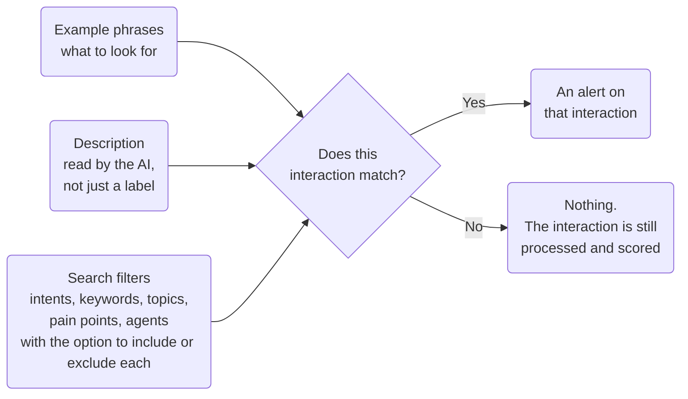
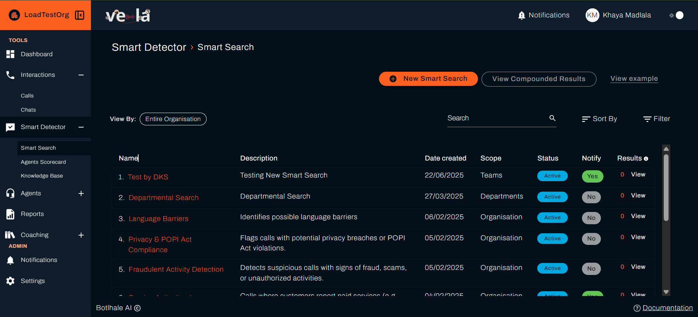
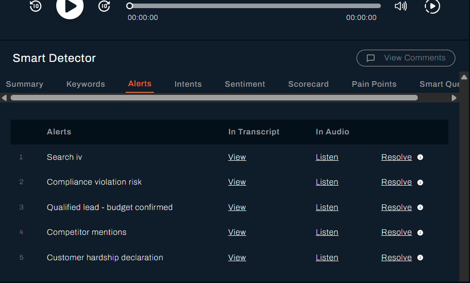
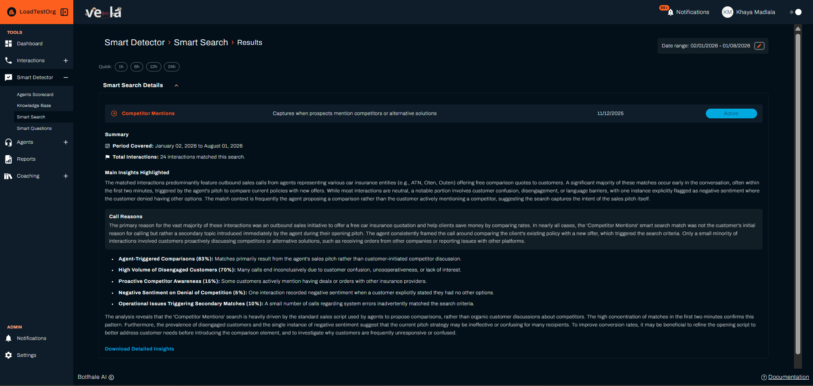
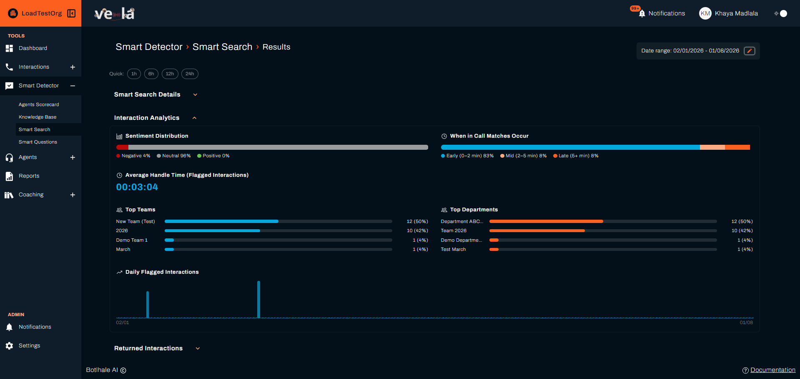
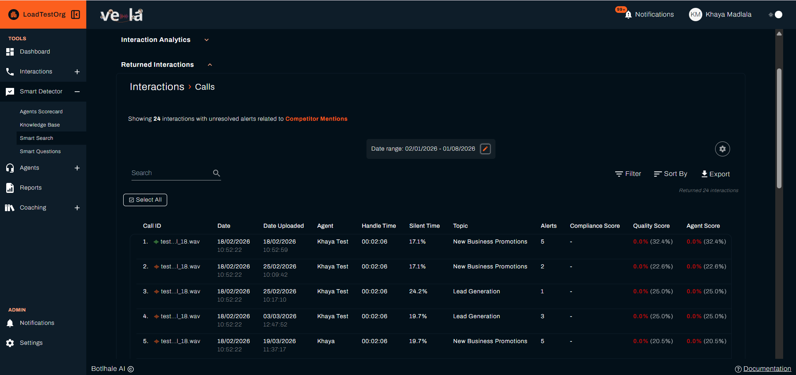
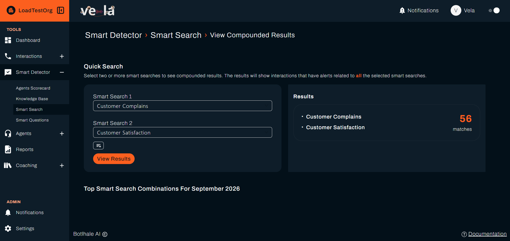
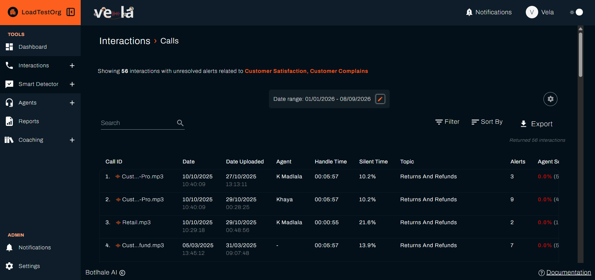

import { SmartSearchFormTop, SmartSearchFormBottom } from '@site/src/components/annotatedForms';

# Set Up Smart Search

Smart Search automatically monitors every processed interaction for keywords, phrases, and patterns you define. Each time a processed call or chat matches one of your searches, an alert is raised and linked directly to that interaction. This lets you focus your QA effort on the conversations that matter most rather than reviewing interactions at random.

:::tip In short
By the end you will have a Smart Search running on your interactions, and the steps to read and refine what it matches.

1. Open **Smart Detector → Smart Search** and [select **New Smart Search**](#step-1-access-smart-search).
2. [Write a clear **Description**](#step-2-define-your-search-criteria) and a few **Example Phrases**, set the **Search Scope** and **Historical Search**, then select **Create Smart Search**.
3. Select **View** to [read the matches and sharpen the search](#step-3-review-and-refine-results). For each alert you act on, select **Resolve** on its row in the interaction's **Alerts** tab.
:::

:::info Plan availability
Smart Search is absent on the [Lite](./reference/glossary.md#lite) version. Where it is unavailable, ask your Account Manager about upgrading your plan.
:::

---

## Before You Begin

- **Your access level sets how far a search can reach.** Organisational access can scope a search to the whole organisation, chosen departments, or chosen teams. Departmental access reaches its own department and the teams in it, and team access reaches one team. See [Access Level](./reference/glossary.md#access-level).
- **Set up any filter terms first.** You type example phrases straight into the form, but an intent, keyword, topic, or pain point has to already exist in your organisation's lists before you can filter on it. See [Manage Smart Search Terms](./topics-and-terms-guide.md).
- **Your plan limits the number of searches that can be Active at once**, so prioritise the searches that matter most. Inactive searches are saved without counting towards your limit. See [Search Management](#search-management).

New to this? Select **View example** on the Smart Search page to browse the ready-made example searches supplied with Vela, with their names and descriptions, before writing your own.

---

## How Matching Works

Vela matches on meaning, not on whether the phrase was said verbatim. When you add an example phrase, Vela flags interactions that say something very similar or express the same thing. Capitalisation, punctuation, and small differences in phrasing do not affect a match.

Two things guide a match:

- **The example phrases** you provide, as representative examples of what to look for.
- **The Description**, which Vela also reads when deciding whether an interaction matches. Write it to describe what the search is looking for, not only as a note to yourself.

Vela matches on clear evidence in the transcript rather than guessing. A vague description or a single ambiguous phrase matches less reliably than a clear description with a few concrete examples.

Searches work across languages. Calls and chats in the 11 spoken official South African languages are translated to English as they are processed, and matching reads that translation alongside the original. You can write your example phrases in English, and they match interactions spoken in another language.

You can also narrow a search with structured filters (intents, keywords, topics, pain points, or agents), with the option to include or exclude each, and combine several conditions in one search. For every filter type and setting, see [Smart Search Criteria](./reference/smart-search-criteria.md).

Three separate things therefore feed one decision, which is why editing the description changes your results:

```mermaid
flowchart LR
    P("Example phrases<br/>what to look for") --> M{"Does this<br/>interaction match?"}
    D("Description<br/>read by the AI,<br/>not just a label") --> M
    F("Search filters<br/>intents, keywords, topics,<br/>pain points, agents<br/>with the option to include or exclude each") --> M
    M -- Yes --> A("An alert on<br/>that interaction")
    M -- No --> N("Nothing.<br/>The interaction is still<br/>processed and scored")
```

---

## Creating a Smart Search

### Step 1: Access Smart Search

1. In the left sidebar, open **Smart Detector** and select **Smart Search**.
2. Select **New Smart Search** to open the creation form.

### Step 2: Define Your Search Criteria

The form is one page. The two views below show its top and bottom, and they overlap at Link To Search and Example Phrases.

<SmartSearchFormTop />

<SmartSearchFormBottom />

Three of the fields carry detail worth reading before you save:

- **Search Scope** offers what your access level allows. Organisational access can pick Entire Organisation, Specific Departments, or Specific Teams. Departmental access picks Entire Department or Specific Teams. A "Specific" choice opens a second selector for the departments or teams. Team access has no choice to make: the form shows **Applying search to:** and your team.
- **Search Filter** matches on intents, keywords, topics, pain points, or agents, each set to include or exclude. The intents, topics, and pain points come from your organisation's lists, whether Vela detected them or your team added them. Keywords are only the ones your team added, because Vela does not detect keywords. If a term is not available, add it to the list under [Manage Smart Search Terms](./topics-and-terms-guide.md) first. See also [Smart Search Criteria](./reference/smart-search-criteria.md).
- **Historical Search** offers All historical calls or a Specific date range. Pick the range unless you want your whole archive reprocessed.

You can build more advanced searches by combining conditions, linking searches, and attaching a Knowledge Base document. See [More Search Options](#more-search-options).

---

### Step 3: Review and Refine Results

Once interactions are processed, matches appear automatically in the search results.

1. Navigate to **Smart Detector → Smart Search**.
2. Select **View** next to your search to open its results. For what each panel on that page shows, see [Understanding the Results View](#understanding-the-results-view).
3. Open a matched interaction from **Returned Interactions**. Each row links to the call or chat that triggered the match.
4. Read the transcript alongside Vela's analysis to judge whether the match is genuine.
5. Once you have acted on the alert, select **Resolve** on its row in the interaction's **Alerts** tab. The interaction drops out of Returned Interactions. See [Alert Management](#alert-management).

If the results contain too many irrelevant matches, return to the search and make the description and examples more specific. If matches are being missed, add another clear example or sharpen the description. Refining a search based on early results is a normal part of getting it to perform well.

---

## More Search Options

Beyond phrases, a Smart Search has a few optional ways to focus what it matches. Each is set on the same creation form.

### Combine Several Conditions

A search can use more than one criterion at once, for example a set of phrases together with an intent or a pain point. With phrases and one Search Filter row, an interaction has to match both. Once you add a second Search Filter row, **Show results when** appears, and you set it to decide how the conditions combine:

- **All conditions are met**: an interaction matches only when every condition matches.
- **Some of the conditions are met**: an interaction matches when at least one condition matches.

When you edit a search, the same options read **All of the filters are matched** and **Some of the filters are matched**.

{/* ENGINEERING (known bug, documented as intended): on vela-data origin/main (app/api/notifications/route.js:331-338) a phrase non-match is not counted, so a filter match alone raises the alert even under All. Fixed on origin/dev-hold by 597551b (lib/inference/query.js:208-211, hasWordsClause). Documented as on dev-hold, user decision 2026-10-08. Labels: createForm.jsx:926-931 vs [id]/editForm.jsx:993-998 on vela-fly. */}

For every criterion and its include, exclude, and all of / some of settings, see [Smart Search Criteria](./reference/smart-search-criteria.md).

### Link to Another Search

Turn on **Link to Search** and choose a main search to have this search checked only on interactions that the main search has already matched. This focuses a specific search on a narrower set of interactions, for example checking for escalation language only where a billing search already matched.

The main search must cover at least the same scope as this one. An organisation-wide search can be the main search for any search, and a department search can be the main search for a team inside that department. A linked search cannot itself be a main search, so links are one level deep. If a main search is set to Inactive it stops matching, so any search linked to it has nothing to run against.

### Use a Knowledge Base Document

Turn on **Knowledge Base** and select a document to have Vela use its content as reference when matching your phrases. This helps the search analyse interactions against your own procedures rather than generic wording. The document must be within the search's scope. See [Knowledge Base](./knowledge-base-guide.md).

---

## A Worked Example

A team lead suspects agents are promising refund timelines the business cannot meet.

1. **Create the search.** Title it `Refund Promises`. Description: `Flags interactions where the agent commits to a refund or a refund timeline`. Because Vela reads the description when matching, that sentence does as much work as the phrases.
2. **Add example phrases**: `you'll get your refund by`, `I'll process the refund today`, `the money will be back in your account`.
3. **Set the scope** to the department handling billing, and the status to **Active**.
4. **Turn on Historical Search** for a specific date range covering last month, so there is something to look at immediately rather than waiting for new calls.
5. **Leave Notifications off** for now. Watch the first batch of matches before deciding whether every one deserves a notification.
6. **Read the results.** Twenty matches, and **When in Call Matches Occur** shows most of them late in the conversation, at the point agents are closing the call.
7. **Refine.** Four matches are agents correctly reading the standard refund policy. Tighten the description to say you are looking for a specific date or timeline being promised, not the policy being explained.
8. **Act.** Coach the two agents responsible, and resolve the alerts as you work through them.

The pattern generalises: describe the behaviour, give a few real phrases, run it over a known period, read the results before switching notifications on, then tighten.

---

## Common Search Types

### Customer Experience Monitoring

| **Search Type** | **Example Phrases** |
|-----------------|-------------------|
| Customer Complaints | "I'm not happy", "This is terrible", "I want to speak to a manager" |
| Service Issues | "This doesn't work", "I've been waiting", "Nobody helped me" |
| Billing Problems | "I was charged twice", "This bill is wrong", "I want a refund" |
| Product Issues | "This is broken", "It's not working", "Defective product" |

### Compliance and Quality Assurance

| **Search Type** | **Example Phrases** |
|-----------------|-------------------|
| Regulatory Violations | "I didn't authorise this", "That's illegal", "You can't do that" |
| Policy Breaches | "That's against policy", "You're not following procedure" |
| Security Concerns | "My information was shared", "Data breach", "Privacy violation" |
| Documentation Issues | "That wasn't documented", "No record of this", "Missing information" |

:::note Searching for what was said, not what was missed
A Smart Search matches language that appears in a conversation, so it catches a customer objecting or an agent promising something they should not. It cannot flag a required disclosure the agent never made, because there is nothing in the transcript to match.

Put "did the agent say it" checks on the [Agent Scorecard](./reference/scorecard-fields.md) instead, where a question can be answered No, and mark the critical ones Auto-Fail. Use Smart Search for the language you want to find, and the scorecard for the language you require.
:::

### Training and Development

| **Search Type** | **Example Phrases** |
|-----------------|-------------------|
| Knowledge Gaps | "I don't know", "Can you explain", "I'm not sure how" |
| Process Confusion | "What's the procedure", "How do I do this", "I'm confused" |
| Escalation Requests | "I need a supervisor", "Can I speak to someone else", "This is too complex" |
| Positive Feedback | "Great service", "Thank you so much", "You're amazing" |

---

## Monitoring and Alerts

### Notifications

Each search has its own **Notifications** setting. You can turn it on when you create the search, and change it later by editing the search. When it is on, every new match for that search raises a notification. The alert itself appears on the interaction either way.

Whether that notification reaches you in-app, by email, or both depends on your preferences in **Settings → Notifications**. Matches always appear in the results view, whether notifications are on or off.

### Alert Management

Work through alerts regularly rather than letting them accumulate. An unresolved alert stays in the search's **Returned Interactions** list and its **Results** count, so a backlog hides the new ones. See [Manage Notifications](./features/notifications.md) for the review routine and where alerts appear.

Resolving is what closes the loop. Open the interaction, find the alert on the **Alerts** tab of the **Smart Detector** panel, and read it in context. Select **Resolve** on that row. It changes to **Resolved**, and the interaction drops out of the search's **Returned Interactions** list, which shows unresolved matches only.

Three controls close three different things, and they sit close together on the detailed view. Pick by what you want to close:

<table>
  <thead>
    <tr>
      <th>To close</th>
      <th>Select</th>
      <th>Where</th>
      <th>Then it reads</th>
    </tr>
  </thead>
  <tbody>
    <tr>
      <td>One alert</td>
      <td><strong>Resolve</strong></td>
      <td>The <strong>Alerts</strong> tab of the <strong>Smart Detector</strong> panel, on the alert's row</td>
      <td><strong>Resolved</strong></td>
    </tr>
    <tr style={{backgroundColor: 'var(--ifm-table-background)'}}>
      <td>A comment or a reply</td>
      <td><strong>Mark as Resolved</strong></td>
      <td>The <strong>View Comments</strong> panel, on that comment</td>
      <td><strong>Resolved by</strong> your name</td>
    </tr>
    <tr>
      <td>The whole interaction</td>
      <td><strong>Mark as Reviewed</strong></td>
      <td>The top of the detailed view</td>
      <td><strong>Reviewed</strong></td>
    </tr>
  </tbody>
</table>

These three are independent of each other. Marking the interaction reviewed leaves its alerts open, and resolving a comment leaves the alert that prompted it open, so close the alert itself with **Resolve**.

To clear several alerts at once, open a single search's results view and go to its **Returned Interactions** list. That list gives you a checkbox on each row and **Select All** above them, and choosing any row reveals **Resolve Selected**. {/* ENGINEERING (known bug, documented as intended): on the live screen the Returned Interactions list on a search's results view shows no row checkboxes, no Select All, and no Resolve Selected, so alerts cannot be resolved in bulk (reported by the user 2026-10-09). Cause on vela origin/vela-fly: app/(pages)/smart_detector/smart_search/results/page.jsx:516 renders <CallsPageUI searchParams={searchParams} /> without the query prop, while app/(pages)/interactions/calls/table.jsx renders SelectAll (:502-503) and the row SelectCall (:536) only when query && query.length < 2. Intended: pass the search as query so the list offers row selection and Resolve Selected. Workaround until fixed: resolve each alert from the interaction's Alerts tab. */}

An unresolved alert stays visible until you act on it. Resolving it without taking action removes that reminder.

If a search is producing more matches than your team can act on, edit it to use more specific phrases, or turn its Notifications setting off and review its matches in the results view instead.

---

## Analysing Search Results

### Understanding the Results View

Select **View**, in the **Results** column of the Smart Search list, to open a search's results.

The results view has three collapsible sections.

**Set the date range first.** The date range sits at the top of the page, with **Quick** picks for **1h**, **6h**, **12h**, and **24h** beside it. Everything in Smart Search Details and Interaction Analytics is recalculated for the period you choose. Until you choose one, the period is the start of this month to today.

{/* UNVERIFIED: the 12h Quick pick. vela origin/vela-fly results/page.jsx accepts only 1, 6, and 24 hours (ALLOWED_RELATIVE_HOURS), so 12h falls back to the date parameter rounded to whole days, while relative-filter.jsx still offers it. Raised with engineering. Confirm on screen before documenting the 12h behaviour. */}

Smart Search Details and Interaction Analytics count only matches whose alert is still unresolved, so resolving alerts lowers their figures as well as the list. They are worked out from at most the 2,000 most recent matches in the period.

#### Smart Search Details

A summary of the search across the period:

- The search's **name**, **description**, date created, and **status** (Active or Inactive).
- A **Summary**, showing the **Period Covered** and the **Total Interactions** with unresolved alerts from the search.
- **Main Insights Highlighted**: an AI-generated summary of the interactions the search matched. It opens with a short overview, then a **Call Reasons** explanation of why they matched, then a bulleted list of the main patterns, each with the percentage of matches it applies to (for example, "Agent-Triggered Comparisons (83%)"). Use **Download Detailed Insights** to save it as a PDF. If there is not enough data in the selected period to generate insights, Vela shows **There are no insights available for this search in the selected time period**. This means there is not enough data yet, not that something has gone wrong. Widening the period usually fills it.

#### Interaction Analytics

{/* VERIFIED against the live product, in details_2.png. This panel is absent from vela origin/main and present on origin/dev from 2026-05-25, so a source check alone reads it as unreleased. The capture is the higher authority. Recheck the screen, not the branch, before removing anything here. */}

Charts that break down the matched interactions with unresolved alerts:

- **Sentiment Distribution**: the split of Negative, Neutral, and Positive interactions.
- **When in Call Matches Occur**: whether matches fall Early (0 to 2 min), Mid (2 to 5 min), or Late (5+ min) in the conversation.
- **Average Handle Time (Flagged Interactions)**: the average length of the matched interactions.
- **Top Teams** and **Top Departments**: which teams and departments the matches came from, with counts and percentages.
- **Daily Flagged Interactions**: how many interactions matched on each day across the period.

#### Returned Interactions

The list of matched calls and chats. Open any one to see its full transcript and AI analysis (summary, sentiment, scorecard, keywords, and more) in context. That per-interaction analysis lives on the interaction itself, not in the summaries above.

Only unresolved matches appear here. The heading above the list says what you are looking at, for example **Showing 4 interactions with unresolved alerts related to Compliance Violation Risk**.

The controls above the list let you **Search**, **Filter**, **Sort By**, and **Export** results.

:::warning Two date controls, one period
The list carries a second date control, in its own toolbar. Set a date in either control and both use it, so the Summary and the list cover the same period.
:::

{/* ENGINEERING (known bug, documented as intended): before anyone sets a date, Smart Search Details and Interaction Analytics cover this month so far, while Returned Interactions lists every unresolved match however old, so the two counts can differ. Intended: one period across the whole results view from the start. Moved from visible text 2026-10-09. */}

### Interactions That Match Several Searches

**View Compounded Results**, above the Smart Search list, answers a different question from any single search: which interactions raised alerts on more than one of your searches at once.

Under **Quick Search**, select two or more searches to see the interactions that matched **all** of them. A call flagged by both a billing search and an escalation search is a more specific problem than either search describes on its own, and usually a better use of review time than working down one list.

Below that, **Top Smart Search Combinations** shows the pairs of searches that most often fire together this month. Select one to open the matching interactions.

Selecting the match count in **Results** opens the **Interactions → Calls** list, filtered to interactions with unresolved alerts from the searches you selected. It is the same list covered in [Read the Interactions List](./features/quality-assurance-tools.md#d-read-the-interactions-list), not a page of its own.

### Trend Analysis

Widen the date range on a search's results view and read **Daily Flagged Interactions** to see whether an issue is increasing, stable, or improving. Compare periods around known events, such as a training programme, a process change, or a new product launch, to see whether they changed the pattern.

On the Smart Search list, **View By** sets how much of the organisation the list covers. See [Smart Detector](./smart-detector-overview.md#what-the-tools-share).

Use **Sort By** to order your searches by **Results**, highest first. **Results** counts unresolved alerts on interactions recorded this month, so it shows which searches are triggering most often this month. A high count is worth a closer look. It may point to a widespread issue, or to a search that is too broad and needs tighter phrases.

### Action Planning

| What you are seeing | What to do about it | What you should see next |
|-----------------|--------------------|-------------------|
| **High frequency issues** | Process improvement, targeted training | Fewer repeat issues |
| **Agent-specific patterns** | Individual coaching, skill development | Improved performance |
| **Trending problems** | Review resourcing and escalate | Problems caught before they spread |
| **Positive patterns** | Share and recognise good practice | Good practice repeated across the team |

---

## Troubleshooting Common Issues

| **Problem** | **Cause** | **Solution** |
|-------------|----------|-------------|
| **Too many false positives** | Description or examples too broad | Tighten the description and use more specific examples. Review the false-positive matches to see what is triggering them |
| **Missing expected matches** | Description or examples too vague | Add another clear example or clarify the description. Check whether the search scope covers the relevant teams |
| **Missing matches on interactions with no team** | An interaction filed under Unspecified, for example one with no agent assigned, is checked by organisation-wide searches only | Assign the agent to a team before uploading, or use an organisation-wide search |
| **No matches at all** | Search not active, scope too narrow, or Historical Search not enabled | Verify the search status is Active. Confirm the scope covers the correct teams. Recreate the search with Historical Search enabled if past calls should be included |
| **Notifications not arriving** | Notifications not ticked on the search, or **New Alerts Detected** not ticked in your **Settings → Notifications** | Edit the search and tick **Notifications**, then tick **New Alerts Detected** in **Settings → Notifications** |
| **New Smart Search is greyed out** | Your organisation has reached the number of active searches its plan allows | Set a search you no longer need to **Inactive**, or delete it, to free a place. For a higher limit, ask your Account Manager about upgrading your plan |
| **A linked search stopped matching** | Its main search was set to Inactive, so there is nothing for it to run against | Set the main search back to Active, or unlink the search |

---

## Search Management

Review your active Smart Searches regularly. For each search, check that it is still relevant, that its matches are being actioned, and that its phrases still reflect how customers and agents actually speak. Language drifts over time, so a phrase list that was accurate months ago may start producing false positives or missing new patterns.

Set a search to **Inactive** when it is no longer being acted upon. Alerts nobody works through make it harder for the team to spot those that matter.

### Edit or Delete a Search

Select a search's name in the Smart Search list to change its title, description, status, **Apply to** scope, example phrases, **Show results when** setting, and linked Knowledge Base document. **Historical Search cannot be added afterwards**, so a search that needs to cover past interactions has to be created with it enabled.

The same view has a **Delete Search** control for searches you no longer need.

:::note Your plan limits how many active searches you can have
The limit counts searches set to **Active**. When you reach it, **New Smart Search** is greyed out. To free a place, set a search you no longer need to **Inactive**, or select **Delete Search**. For a higher limit, ask your Account Manager about upgrading your plan. Your allowance is under **Settings → Organisations → This Org**, where **show package details** lists the **Smart Search Limit**. A 0 means your plan has no custom limit, so the standard limit of five applies.
:::

To use a working search for another team or department, create a new search with the same phrases and the new scope. Do not edit the scope of the existing search instead. Editing replaces the old scope rather than adding to it, so the original team stops being monitored. The edited search also checks only new interactions, not earlier ones in the new scope.

---

## Check Your Work

A saved search appears in the Smart Search list immediately. Matches do not, so an empty result is the normal first state.

Unless you turned on **Historical Search**, the search only monitors interactions processed from the moment you saved it, so it stays at zero results until new interactions arrive.

You are finished when the search's results view shows matches for the period you chose. Open one of those matches and confirm the interaction really contains what you meant to catch before you trust the count.

If it stays at zero once new interactions have been processed, work through [Troubleshooting Common Issues](#troubleshooting-common-issues) above, starting with the search's status and scope.

---

## Related

- [Smart Detector](./smart-detector-overview.md): the home page these tools sit under, and what each tool does
- [Manage Notifications](./features/notifications.md): receive and work through the alerts your searches raise
- [Review and Score Interactions](./features/quality-assurance-tools.md): turn matches into scored reviews
- [Monitor Agent Performance](./features/monitor-agent-performance.md): coach your team on what the searches surface
- [Build Your Knowledge Base](./knowledge-base-guide.md): give Vela your documents to sharpen matching
- [Smart Search Criteria](./reference/smart-search-criteria.md): every criterion type you can search on
- [Manage Smart Search Terms](./topics-and-terms-guide.md): build the term lists a search matches against

## Need Help?

**Contact Support:** support@botlhale.ai
