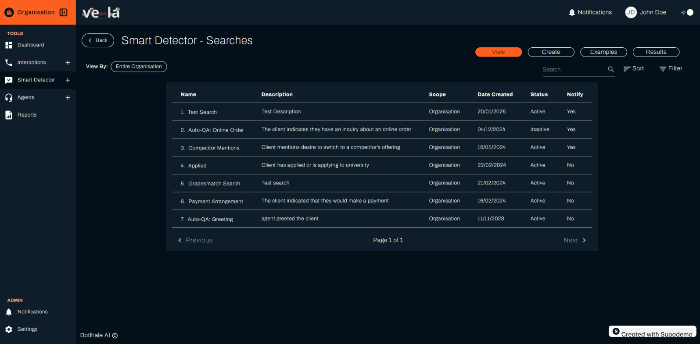
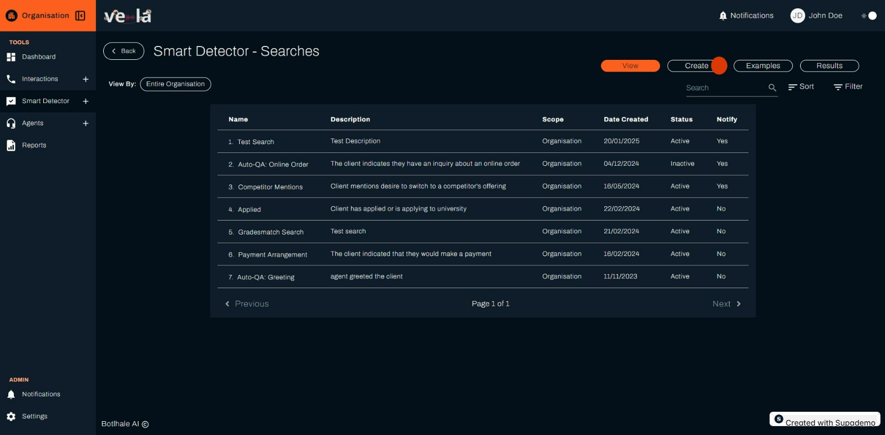

# Smart Search Guide

Smart Search is a powerful feature that allows you to create and manage automated searches to identify specific topics, intents, keywords, or pain points within call transcripts. This enables deeper insights and proactive issue resolution.

## Overview

Smart Search uses advanced natural language processing (NLP) and machine learning algorithms to analyse your call transcripts and identify patterns, compliance issues, and business opportunities.

## Getting Started

### Accessing Smart Search

1. Navigate to **Smart Detector** from the left sidebar
2. Click on the **Smart Search** card
3. You'll be taken to the Smart Search section with four main tabs:
   - **View**: See all your existing searches
   - **Create**: Build new searches
   - **Examples**: Use predefined templates
   - **Results**: Review search outcomes

## View Tab - Managing Existing Searches

The View tab displays a table of all automated search queries created within your organisation.

### Understanding the Table

- **Name**: The name of the search query (e.g., "Customer Complaints")
- **Description**: Brief explanation of what the search looks for
- **Scope**: Range of calls the search applies to (Organisation, Department, or Team)
- **Date Created**: When the search was created
- **Status**: Whether the search is active or inactive
- **Notify**: Indicates if notifications are enabled

### Changing Search Scope

You can filter searches by scope using the "View By" dropdown:

1. **Entire Organisation**: Shows all searches across your organisation
2. **Specific Department**: Focus on searches for a particular department
3. **Specific Team**: Focus on searches for a specific team

### Managing Individual Searches

Click on any search name to view and edit its details:

- **Name and Description**: Update the search title and purpose
- **Search Scope**: Change which calls the search applies to
- **Example Phrases**: Add or remove phrases the search looks for
- **Filters**: Set additional criteria like call duration or keywords
- **Status**: Enable or disable the search
- **Notifications**: Configure alert settings

## Create Tab - Building New Searches

### Step-by-Step Creation Process

1. **Navigate to Create Tab**: Click the "Create" sub-tab
2. **Fill Out the Form**:

   **Name**: Enter a unique, descriptive name
   - Example: "Customer Complaints"
   - Choose a name that clearly indicates the purpose

   **Description**: Explain what the search will look for
   - Example: "Searches for calls where customers express complaints about products or services"

   **Search Scope**: Set the range of calls to monitor
   - Entire Organisation: Monitor all calls
   - Specific Department: Focus on particular departments
   - Specific Team: Focus on specific teams

   **Example Phrases**: Add phrases the search should detect
   - Example: "I'm not happy with", "This product is defective", "I want to complain"
   - Add multiple phrases for comprehensive coverage

   **Filters**: Set additional criteria (optional)
   - Call Duration: Search for calls longer/shorter than specific times
   - Agent ID: Focus on specific agents
   - Keywords: Search for additional words or phrases

   **Search Status**: Determine if the search starts immediately
   - Enabled: Search starts monitoring right away
   - Disabled: Search is saved but not active

   **Historical Search**: Apply to past calls
   - Check this box to analyse historical data
   - Useful for identifying patterns in existing calls

   **Notifications**: Set up alerts
   - Receive notifications when matches are found
   - Useful for real-time monitoring

3. **Create the Search**: Click the orange "Create" button

## Examples Tab - Using Templates

The Examples tab provides predefined search templates to help you get started quickly.

### Available Templates

- **Competitor Mentions**: Detect when customers mention competitors
- **Auto-QA: Identity Confirmation**: Check if agents properly verify customer identity
- **Auto-QA: Greeting**: Ensure agents use proper greetings
- **Auto-QA: Online Order**: Monitor online order inquiries

### Using Templates

1. **Browse Templates**: Review available templates in the table
2. **Select Template**: Click on a template name to view details
3. **Customise**: Modify the template settings as needed
4. **Enable**: Activate the template for your organisation

## Results Tab - Analysing Outcomes

The Results tab shows a summary of matches found by your active search queries.

### Understanding Results

- **Single View**: Shows results for each search query individually
- **Compound View**: Combines multiple searches to find calls matching multiple criteria

### Interpreting Results

- **Match Count**: Number of calls that matched the search criteria
- **Date Range**: Time period covered by the results
- **Summary**: Overview of findings and insights
- **Returned Calls**: List of specific calls that matched

### Working with Results

1. **View Call Details**: Click on call IDs to see full transcripts
2. **Sort and Filter**: Organize results by various criteria
3. **Export Data**: Download results for further analysis
4. **Navigate Pages**: Browse through multiple pages of results

## Best Practices

### Creating Effective Searches

1. **Be Specific**: Use precise phrases that clearly indicate the topic
2. **Test Thoroughly**: Run searches on historical data to verify accuracy
3. **Start Small**: Begin with a few key searches and expand gradually
4. **Monitor Results**: Regularly review search outcomes and adjust as needed

### Common Use Cases

- **Compliance Monitoring**: Detect regulatory violations or policy breaches
- **Quality Assurance**: Identify training opportunities and performance issues
- **Customer Experience**: Monitor satisfaction levels and pain points
- **Business Intelligence**: Track product mentions and competitor references

## Troubleshooting

### Common Issues

**No Matches Found**
- Check if the search criteria are too specific
- Verify the date range includes relevant calls
- Ensure the search scope is appropriate

**Too Many Matches**
- Refine search phrases to be more specific
- Add filters to narrow down results
- Review and adjust search criteria

**Search Not Working**
- Verify the search is enabled
- Check notification settings
- Ensure proper permissions are set

## Need Help?

For additional support with Smart Search:
- Contact support@botlhale.ai
- Review the video tutorials on the homepage
- Check the detailed Smart Detector documentation
