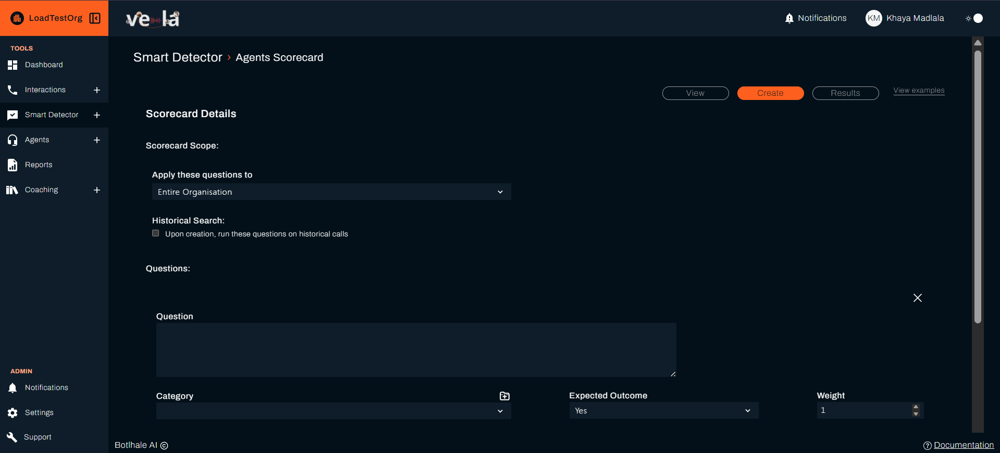

# Create Automated Searches

Stop manually reviewing every call. Smart Search detects important events in your customer interactions, so you can respond to issues before they become problems and spot opportunities to improve your service.

## What You Can Achieve

Smart Search is your monitoring system. Here's what you'll accomplish:

| **Issue Detection** | **Quality Monitoring** | **Opportunity Identification** |
|-------------------|----------------------|------------------------------|
| **Catch problems early** | **Monitor compliance** | **Spot improvement opportunities** |
| **Respond proactively** | **Track quality trends** | **Identify training needs** |
| **Never miss important events** | **Maintain standards** | **Drive continuous improvement** |

---

## 🚀 Getting Started with Smart Search

### Step 1: Access Smart Search
- [ ] **Go to "Smart Detector" → "Smart Search"**
- [ ] **Click "Create"** to start building your first search
- [ ] **Choose your search type** based on your monitoring goals

### Step 2: Define Your Search Criteria

- [ ] **Name your search** (e.g., "Customer Complaints")
- [ ] **Add example phrases** that indicate the issue
- [ ] **Set the scope** (organisation, department, or team)
- [ ] **Configure notification preferences**

### Step 3: Test and Refine

- [ ] **Review initial results** to ensure accuracy
- [ ] **Adjust search criteria** based on findings
- [ ] **Fine-tune sensitivity** to reduce false positives
- [ ] **Set up alerts** for immediate notification

---

## 📋 Common Search Types

### Customer Experience Monitoring
| **Search Type** | **Example Phrases** | **Business Value** |
|-----------------|-------------------|------------------|
| **Customer Complaints** | "I'm not happy", "This is terrible", "I want to speak to a manager" | Early intervention, prevent escalations |
| **Service Issues** | "This doesn't work", "I've been waiting", "Nobody helped me" | Identify service gaps, improve processes |
| **Billing Problems** | "I was charged twice", "This bill is wrong", "I want a refund" | Financial impact, customer retention |
| **Product Issues** | "This is broken", "It's not working", "Defective product" | Product quality, warranty management |

### Compliance and Quality Assurance
| **Search Type** | **Example Phrases** | **Compliance Focus** |
|-----------------|-------------------|-------------------|
| **Regulatory Violations** | "I didn't authorize this", "That's illegal", "You can't do that" | Legal compliance, risk management |
| **Policy Breaches** | "That's against policy", "You're not following procedure" | Policy adherence, quality standards |
| **Security Concerns** | "My information was shared", "Data breach", "Privacy violation" | Data protection, security compliance |
| **Documentation Issues** | "That wasn't documented", "No record of this", "Missing information" | Audit readiness, record keeping |

### Training and Development
| **Search Type** | **Example Phrases** | **Training Value** |
|-----------------|-------------------|------------------|
| **Knowledge Gaps** | "I don't know", "Can you explain", "I'm not sure how" | Identify training needs, skill development |
| **Process Confusion** | "What's the procedure", "How do I do this", "I'm confused" | Process improvement, documentation |
| **Escalation Requests** | "I need a supervisor", "Can I speak to someone else", "This is too complex" | Skill assessment, escalation procedures |
| **Positive Feedback** | "Great service", "Thank you so much", "You're amazing" | Recognize excellence, share best practices |

---

## Creating Effective Searches

### Best Practices for Search Design
- [ ] **Start with specific phrases** - Be precise about what you're looking for
- [ ] **Include variations** - Add synonyms and different ways to express the same thing
- [ ] **Test with real data** - Review results to ensure accuracy
- [ ] **Refine over time** - Adjust based on what you learn

### Search Sensitivity Settings
| **Sensitivity Level** | **Use Case** | **Trade-offs** |
|---------------------|--------------|---------------|
| **High Sensitivity** | Critical issues, compliance violations | More false positives, alerts |
| **Medium Sensitivity** | General monitoring, quality assurance | Balanced accuracy and coverage |
| **Low Sensitivity** | Trend analysis, long-term monitoring | Fewer false positives, may miss some issues |

### Scope Configuration
- [ ] **Organisation-wide** - Monitor all interactions across your company
- [ ] **Department-specific** - Focus on particular business areas
- [ ] **Team-based** - Target specific teams or groups
- [ ] **Agent-specific** - Monitor individual performance

---

## Monitoring and Alerts

### Setting Up Notifications
Configure how you want to be notified about search matches:

| **Notification Type** | **When to Use** | **Delivery Method** |
|---------------------|-----------------|-------------------|
| **Alerts** | Critical issues, compliance violations | Email, platform notifications |
| **Daily Summaries** | General monitoring, trend analysis | Email digest, dashboard updates |
| **Weekly Reports** | Long-term trends, strategic insights | Scheduled reports, analytics |

### Alert Management
- [ ] **Review alerts promptly** - Don't let them pile up
- [ ] **Investigate matches** - Understand the context and severity
- [ ] **Take appropriate action** - Address issues or opportunities
- [ ] **Document responses** - Track what actions were taken

### Escalation Procedures
| **Alert Level** | **Response Time** | **Action Required** |
|-----------------|------------------|-------------------|
| **Critical** | Within 1 hour | Direct intervention, management notification |
| **High** | Same day (within 4 hours) | Investigation and action plan |
| **Medium** | Within 24 hours | Review and follow-up |
| **Low** | Within 48 hours | Monitor and trend analysis |

---

## 📈 Analyzing Search Results

### Understanding Match Data
When Smart Search finds matches, you'll see:

| **Data Point** | **What It Shows** | **How to Use It** |
|----------------|-------------------|------------------|
| **Match Count** | How many times the search triggered | Identify frequency and patterns |
| **Date Range** | When matches occurred | Spot trends and timing patterns |
| **Agent Information** | Who was involved in matched calls | Identify training needs or excellence |
| **Call Details** | Specific context of the match | Understand the full situation |

### Trend Analysis
- [ ] **Track match frequency** over time to identify trends
- [ ] **Compare periods** to see if issues are improving or worsening
- [ ] **Analyse patterns** by time of day, day of week, or agent
- [ ] **Correlate with other metrics** like customer satisfaction or resolution rates

### Action Planning
Based on search results, you can:

| **Result Type** | **Action Plan** | **Expected Outcome** |
|-----------------|-----------------|-------------------|
| **High frequency issues** | Process improvement, training programs | Reduced occurrence, improved service |
| **Agent-specific patterns** | Individual coaching, skill development | Improved performance, reduced issues |
| **Trending problems** | Strategic intervention, resource allocation | Proactive problem solving |
| **Positive patterns** | Best practice sharing, recognition | Replication of success |

---

## Troubleshooting Common Issues

| **Problem** | **Cause** | **Solution** |
|-------------|----------|--------------|
| **Too many false positives** | Search criteria too broad, low specificity | Refine search phrases, add more specific criteria, adjust sensitivity |
| **Missing important issues** | Search criteria too narrow, missing variations | Add more example phrases, expand search scope, review recent calls |
| **Alerts not triggering** | Search not active, notification settings incorrect | Check search status, verify notification settings, test with sample data |
| **Inconsistent results** | Varying data quality, changing patterns | Review data consistency, update search criteria, monitor for changes |

---

## Best Practices for Smart Search

### Search Management
- [ ] **Regular review** - Check search effectiveness monthly
- [ ] **Update criteria** - Refine based on new patterns and insights
- [ ] **Archive old searches** - Remove searches that are no longer relevant
- [ ] **Document purpose** - Keep track of why each search was created

### Team Collaboration
- [ ] **Share insights** - Use search results to inform team discussions
- [ ] **Coordinate responses** - Ensure consistent handling of similar issues
- [ ] **Learn from patterns** - Use findings to improve processes and training
- [ ] **Celebrate improvements** - Recognize when search results show positive trends

### Continuous Improvement
- [ ] **Monitor effectiveness** - Track how well searches are working
- [ ] **Adjust strategies** - Modify approaches based on results
- [ ] **Scale successful searches** - Apply working patterns to other areas
- [ ] **Innovate new searches** - Create searches for emerging issues

---

## Next Steps

| **For Performance Evaluation** | **For Knowledge Management** | **For Team Management** |
|-------------------------------|----------------------------|------------------------|
| [Create Agent Scorecards](./agent-scorecard-guide.md) | [Build Knowledge Base](./knowledge-base-guide.md) | [Improve Agent Performance](./agents.md) |

## Need Help?

- **Contact Support**: support@botlhale.ai
- 📚 **Navigation Guide**: [Find the right documentation](./navigation-guide.md) for your needs
