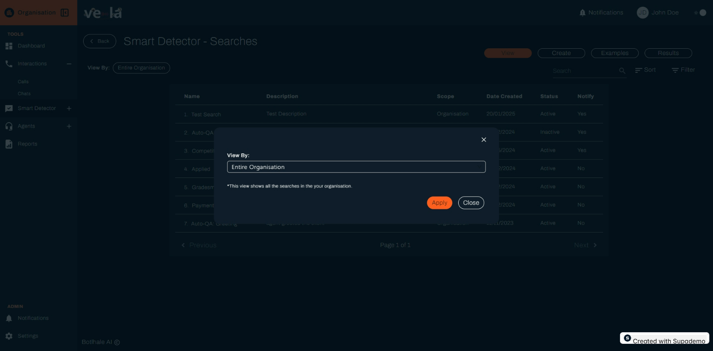

# Create Automated Searches That Catch Issues

Set up intelligent monitoring to automatically detect customer complaints, compliance violations, and other important events in your customer interactions. This guide shows you how to create effective searches that help you respond proactively to issues.

## What You Can Achieve

With Smart Search, you can:
- **Detect customer complaints** before they escalate
- **Monitor compliance violations** automatically
- **Identify training opportunities** for your team
- **Spot service quality issues** in real-time
- **Track important trends** across all interactions

## Getting Started with Smart Search

### Step 1: Access Smart Search
1. **Go to "Smart Detector"** in the left sidebar
2. **Click "Smart Search"** card
3. **Review the four main tabs**:
   - **View** - See existing searches
   - **Create** - Build new searches
   - **Examples** - Use predefined templates
   - **Results** - Review search outcomes

### Step 2: Plan Your Search Strategy
Before creating searches, identify what you want to monitor:

- **Customer satisfaction** - Complaints, dissatisfaction indicators
- **Compliance issues** - Policy violations, regulatory concerns
- **Service quality** - Problems with products or services
- **Training needs** - Areas where agents struggle
- **Business opportunities** - Upselling, cross-selling moments

## Creating Effective Searches

### Understanding Search Components
Each search includes:

- **Name** - Clear, descriptive identifier
- **Description** - What the search looks for
- **Scope** - Which calls to monitor (Organization, Department, Team)
- **Example phrases** - Specific terms to detect
- **Filters** - Additional criteria (duration, agent, keywords)
- **Notifications** - Alert settings for matches

### Step-by-Step Search Creation
1. **Go to "Create" tab** to build new searches
2. **Name your search** - Use descriptive, memorable names
3. **Write clear description** - Explain what you're looking for
4. **Set the scope** - Choose which calls to monitor
5. **Add example phrases** - Include specific terms to detect
6. **Configure filters** - Add additional criteria if needed
7. **Set up notifications** - Choose when to receive alerts
8. **Save and activate** - Make your search live

## Building Effective Search Criteria

### Customer Complaint Detection
Monitor for customer dissatisfaction:

- **Direct complaints**: "I'm not happy with", "This is terrible"
- **Escalation requests**: "I want to speak to a manager"
- **Cancellation threats**: "I'm going to cancel my account"
- **Service issues**: "This doesn't work", "I've been waiting"

### Compliance Monitoring
Track regulatory and policy adherence:

- **Data protection**: "Can you confirm my details", "Is this secure"
- **Policy violations**: "That's against company policy"
- **Required disclosures**: "You didn't tell me about"
- **Regulatory concerns**: "Is this legal", "Are you following the rules"

### Service Quality Issues
Identify problems with products or services:

- **Technical problems**: "It's not working", "There's an error"
- **Product defects**: "This is broken", "It's defective"
- **Service delays**: "I've been waiting", "This is taking too long"
- **Billing issues**: "I was charged incorrectly", "This bill is wrong"

### Training Opportunities
Spot areas where agents need help:

- **Knowledge gaps**: "I don't know", "Let me check"
- **Process confusion**: "I'm not sure how to", "What should I do"
- **Escalation patterns**: "I need to transfer you", "Let me get my supervisor"
- **Customer frustration**: "I've explained this before", "You're not listening"

## Managing Your Searches

### Viewing Existing Searches
The View tab shows all your active searches:

- **Search name** - What you're monitoring
- **Description** - Purpose and scope
- **Status** - Active or inactive
- **Notifications** - Alert settings
- **Date created** - When the search was set up

### Organizing by Scope
Filter searches to focus on specific areas:

- **Entire Organization** - Monitor all calls across your company
- **Specific Department** - Focus on particular business areas
- **Specific Team** - Target individual teams or groups

### Editing and Updating Searches
Keep your searches current and effective:

- **Update phrases** - Add new terms as you learn
- **Adjust scope** - Change which calls to monitor
- **Modify filters** - Refine criteria based on results
- **Enable/disable** - Turn searches on or off as needed

## Analyzing Search Results

### Understanding Your Results
The Results tab shows what your searches found:

- **Search name** - Which search detected the issue
- **Call details** - When and with whom the interaction occurred
- **Matched phrases** - What triggered the detection
- **Context** - Surrounding conversation for understanding
- **Action taken** - How the issue was resolved

### Interpreting the Data
- **High match rates** - Indicate common issues to address
- **Low match rates** - May need to refine search criteria
- **Patterns over time** - Show trends and improvements
- **Agent-specific results** - Identify individual training needs

## Best Practices for Effective Searches

### Phrase Selection Strategy
- **Be specific** - Use exact phrases customers say
- **Include variations** - Add different ways to express the same thing
- **Test thoroughly** - Verify searches catch the right interactions
- **Update regularly** - Add new phrases as you learn

### Scope and Filtering
- **Start broad** - Monitor organization-wide for major issues
- **Add specificity** - Create targeted searches for specific teams
- **Use filters wisely** - Don't over-filter and miss important matches
- **Review regularly** - Adjust scope based on results and needs

### Notification Management
- **Set appropriate alerts** - Don't overwhelm with too many notifications
- **Escalate important issues** - Ensure critical problems get immediate attention
- **Review notification effectiveness** - Adjust based on response times
- **Balance automation** - Use notifications for important, not all, matches

## Troubleshooting Common Issues

### Searches Not Finding Matches
**Problem**: Searches aren't detecting expected issues
**Solutions**:
- Review and refine your search phrases
- Check if the scope is too narrow
- Verify that data is being processed correctly
- Test with different example phrases

### Too Many False Positives
**Problem**: Searches are flagging interactions that aren't actually issues
**Solutions**:
- Make phrases more specific and targeted
- Add additional filters to narrow results
- Review and adjust search criteria
- Test searches with sample data

### Missing Important Issues
**Problem**: Important problems aren't being detected
**Solutions**:
- Add more comprehensive phrase lists
- Review customer feedback for common complaints
- Expand search scope to include more interactions
- Create additional searches for specific issue types

## Measuring Search Effectiveness

### Key Performance Indicators
- **Detection accuracy** - How often searches find real issues
- **Response time** - How quickly you address detected problems
- **Issue resolution** - How often detected issues are resolved
- **Customer satisfaction** - Impact on overall customer experience

### Success Metrics
- **Reduced complaints** - Fewer customer issues over time
- **Faster response** - Quicker identification and resolution
- **Improved training** - Better targeted coaching opportunities
- **Enhanced compliance** - Fewer policy violations

## Next Steps

- **[Set Up Smart Monitoring](./smart-detector-overview.md)** - Integrate searches with other Smart Detector features
- **[Improve Agent Performance](./agents.md)** - Use search results for coaching
- **[Generate Reports](./reports.md)** - Create reports based on search findings
- **[Create Agent Scorecards](./agent-scorecard-guide.md)** - Build evaluation systems based on search patterns
- **[Build Knowledge Base](./knowledge-base-guide.md)** - Address knowledge gaps identified by searches
- **[Configure Notifications](./notifications.md)** - Set up alerts for search matches

## Need Help?

- **Contact Support**: support@botlhale.ai
- **Search Strategy Training**: Get help with effective search design
- **Phrase Optimization**: Assistance with improving search accuracy
- **Search Configuration**: Help with setting up effective searches
- **Results Analysis**: Assistance with interpreting search findings
