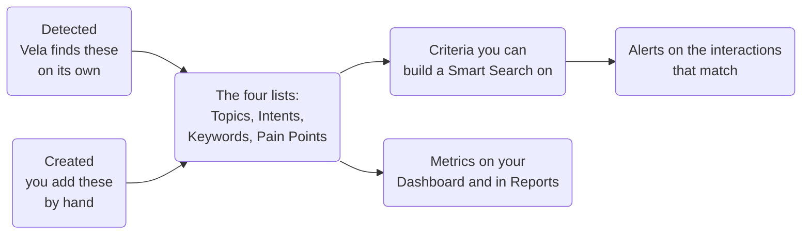
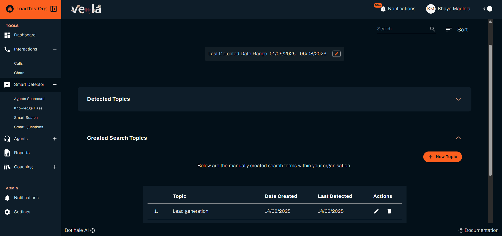
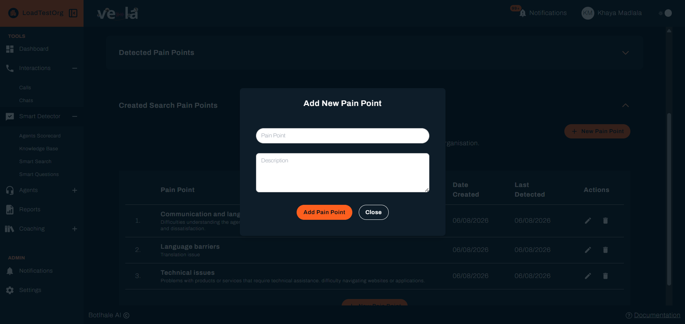
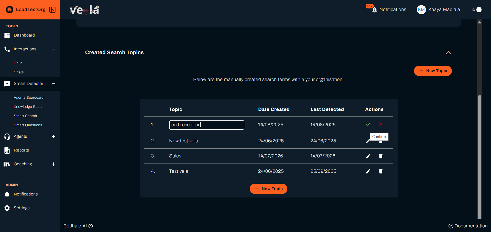

# Manage Smart Search Terms

Your Smart Search terms are the four lists of things Vela looks for in your interactions: **Topics**, **Intents**, **Keywords**, and **Pain Points**. Each list has two sources. Vela adds what it finds on its own, and you add the terms your organisation cares about. This page covers how to read those lists and how to add your own terms.

These terms feed the rest of the platform. They appear as criteria when you build a [Smart Search](./smart-search-guide.md), and as metrics on your Dashboard and in [Reports](./features/custom-reporting.md).

A term you create is not a search. It is an ingredient a search can use, and a figure the Dashboard can count.

:::info Plan availability
On plans that do not include Smart Search, only **Topics** is available. Intents, Keywords, and Pain Points do not appear.
:::

---

## Before You Begin

You need:

- **Your organisation's own wording.** The terms worth adding are the ones your business uses and the ones your customers say, so have them to hand rather than inventing them at the keyboard.
- **To know which lists your plan offers.** On plans without Smart Search, only **Topics** is available.
- **Nothing set up first.** These lists exist from day one, and Vela fills the detected side on its own as interactions are analysed.

---

## 1. Opening a List

These lists are not in the left sidebar. Click **Smart Detector** in the sidebar to open its landing page, then choose **Topics**, **Intents**, **Keywords**, or **Pain Points** from the entries below the feature cards.

---

## 2. Reading a List

Each page is split into two sections you expand and collapse:

| Section | Contains |
| :--- | :--- |
| **Detected** | Terms Vela found on its own while analysing your interactions. Read-only. |
| **Created Search** | Terms your organisation added by hand. These are the terms you can edit and delete. |

The Created section is open when you arrive, and the Detected section is collapsed.

**Keywords works differently.** Vela does not detect keywords on its own, so the Keywords page has only a **Created Search Keywords** section. A keyword matches only when you have added it.

Both tables show the term, **Date Created**, and **Last Detected**. The Created table adds an **Actions** column.

:::warning The date range defaults to today
The date control above the two sections filters both of them on **Last Detected**, and it starts on today's date. A term that was not detected today is hidden until you widen the range, so a list can look empty when it is not.

Click the date control, pick a start and end date, and click **Apply**. The heading above the sections tells you which range is in effect.
:::

Terms you created but that have never been detected are dated from when you added them, so they stay visible on the day you create them.

---

## 3. Finding a Term

Two controls sit at the top of every list.

* **Search**: type any part of a term. Matches are highlighted in orange as you type. On Pain Points, the search also covers the description.
* **Sort**: click **Sort** to open **Sort By**. Choose **Ascending** or **Descending**, then sort by the term itself or by **Date Created**, and click **Apply**.

Both apply to the Detected and Created sections at once. When nothing matches, the table reads `No results found.`

---

## 4. Adding a Term

Open the **Created Search** section and click the button at the top right. Its label matches the list: **New Topic**, **New Intent**, **New Keyword**, or **New Pain Point**.

| List | What you enter |
| :--- | :--- |
| **Topics** | The topic. |
| **Intents** | The intent. |
| **Keywords** | The keyword. |
| **Pain Points** | The pain point, and a **Description**. Both are required. |

Click the confirm button in the modal to save, or **Close** to abandon it. The term appears in the Created section straight away.

Each term needs text, and must be different from every term already in the list. Vela reports either problem rather than saving.

:::tip Write terms the way people say them
A keyword is matched against what was actually said. Terms taken from an internal process document often never appear in a conversation. Prefer the customer's wording.
:::

---

## 5. Editing and Deleting

In the **Created Search** section, each row has an **Actions** column.

* **Edit**: the row becomes editable in place. Change the text and confirm, or cancel to leave it as it was. On Pain Points you can edit the description as well as the name.
* **Delete**: Vela asks you to confirm before removing the term.

Detected terms have no Actions column. You cannot edit or delete what Vela found on its own, and you cannot move a detected term into your created list.

Deleting a term does not change interactions that have already been analysed. It stops the term being applied to interactions processed from that point on.

---

## Check Your Work

A term you added appears in the **Created Search** section straight away, dated today, so it stays visible on the day you create it whatever the date range is set to.

Detection comes later. The term is matched against interactions processed from that point on, so **Last Detected** stays on its creation date until it is actually found in a conversation. An unchanged Last Detected after a week of interactions usually means the wording does not match how people speak, rather than that anything is broken.

Your term is properly in use when it appears as an option when you build a [Smart Search](./smart-search-guide.md), and when its **Last Detected** date starts moving.

---

## Related

* [Set Up Smart Search](./smart-search-guide.md): use these terms as search criteria
* [Smart Search Criteria](./reference/smart-search-criteria.md): every criterion type and what it matches
* [Glossary](./reference/glossary.md): definitions of topic, intent, keyword, and pain point

---

## Need Help?

**Contact Support:** support@botlhale.ai
