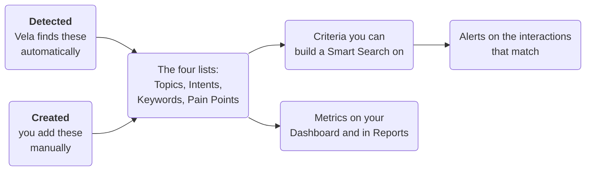
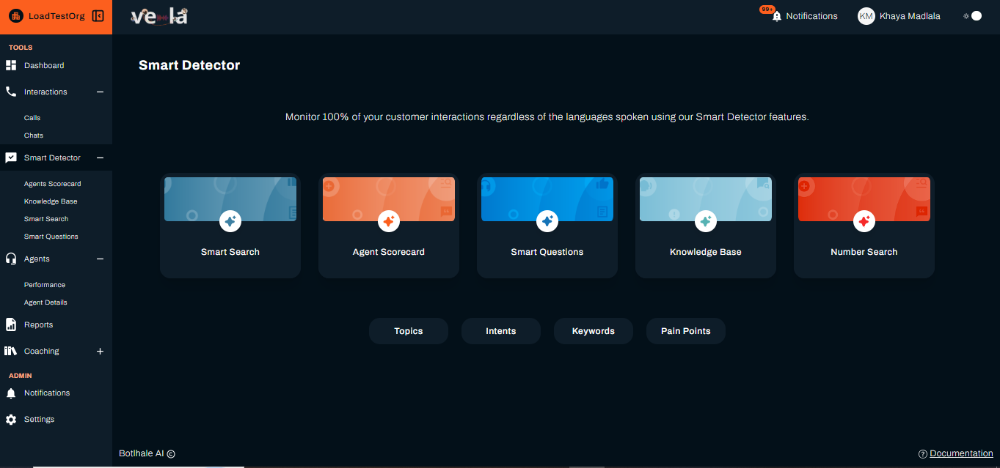
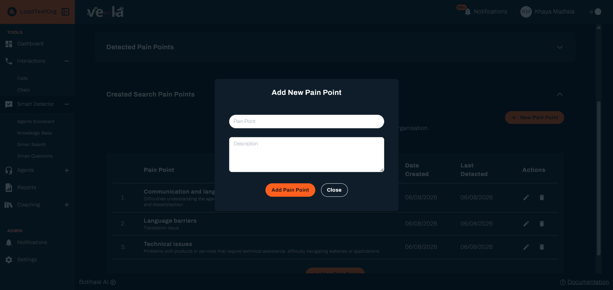
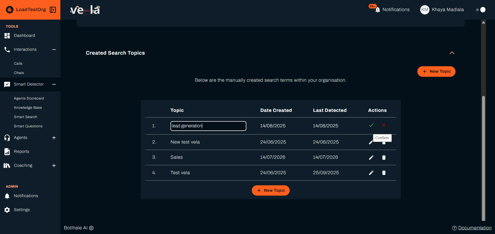

import Hotspots from '@site/src/components/Hotspots';
import topicsPage from '@site/img/screenshots/smart_detector/topics-page1.png';

# Manage Smart Search Terms

Your Smart Search terms define what Vela looks for in your interactions. They are organised into four categories, called **Topics**, **Intents**, **Keywords**, and **Pain Points**. Each list except **Keywords** combines terms Vela identifies automatically with terms you add based on your organisation's priorities. Keywords holds only the terms you add. This page explains how to review the lists and add your own terms.

These terms feed the rest of Vela. They appear as criteria when you build a [Smart Search](./smart-search-guide.md), and as metrics on your Dashboard and when you [generate reports](./features/custom-reporting.md).

```mermaid
flowchart LR
    D("<b>Detected</b><br/>Vela finds these<br/>automatically") --> L("The four lists:<br/>Topics, Intents,<br/>Keywords, Pain Points")
    C("<b>Created</b><br/>you add these<br/>manually") --> L
    L --> S("Criteria you can<br/>build a Smart Search on")
    L --> M("Metrics on your<br/>Dashboard and in Reports")
    S --> A("Alerts on the interactions<br/>that match")
```

A term you create is not a search. It is an ingredient a search can use, and a figure the Dashboard can count.

:::info Plan availability
Intents, Keywords, and Pain Points are absent on the [Lite](./reference/glossary.md#lite) version, which offers **Topics** only. Where they are absent, ask your Account Manager about upgrading your plan.
:::

---

## Before You Begin

You need:

- **Your organisation's own wording.** The terms worth adding are the ones your business uses and the ones your customers say, so have them to hand rather than inventing them at the keyboard.
- **To know which lists your plan offers.** Only **Topics** is available on the [Lite](./reference/glossary.md#lite) version.
- **Nothing set up first.** These lists exist from day one, and Vela fills the detected side automatically as interactions are analysed.

---

## 1. Opening a List

Select **Smart Detector** in the sidebar to open its landing page, then choose **Topics**, **Intents**, **Keywords**, or **Pain Points** from the entries below the feature cards.

---

## 2. Reading a List

Each page is split into two sections you expand and collapse.

<Hotspots
  src={topicsPage}
  alt="The Topics page: Search and Sort at the top right, the Last Detected date range below them, the collapsed Detected Topics section, and the open Created Search Topics section with its New Topic button and its table of Topic, Date Created, Last Detected, and Actions"
  points={[
    { x: 72.9, y: 22.7, title: 'The Last Detected date range', body: 'Filters both sections on Last Detected.' },
    { x: 36.5, y: 41.9, title: 'Detected', body: 'Terms Vela found automatically while analysing your interactions. Read-only, and collapsed when you arrive.' },
    { x: 41.7, y: 58.4, title: 'Created Search', body: 'Terms your organisation added manually, and the only ones you can edit and delete. Open when you arrive.' },
    { x: 83.4, y: 83.1, title: 'Actions', body: 'Edit and delete, on the Created Search table only.' },
  ]}
/>

**Keywords works differently.** Vela does not detect keywords automatically, so the Keywords page has only a **Created Search Keywords** section. A keyword matches only when you have added it.

Both tables show the term, **Date Created**, and **Last Detected**.

:::warning The date range defaults to today
The date control above the two sections filters both of them on **Last Detected**, and it starts on today's date, so the lists show the terms detected today. To see terms detected earlier, widen the range.

{/* ENGINEERING (known bug, documented as intended): once a date range is applied, the Detected section is also filtered on first-detected date. topics/page.jsx:93-107 @vela-fly passes startDate/endDate to filterAndSortTopics, which keeps only terms whose dateCreated (detectionInfo.firstDetectedAt) falls between new Date(startDate) and new Date(endDate) (topics/topics.js:42-50; same in intents/intents.js:44-50 and pain_points/painPoints.js:47-52). new Date(endDate) is midnight, so the end day is excluded on that check. Intended: the Last Detected filter only, end date included, as topicsClient.jsx:64-70 already applies it (isBetween(start, end, "day", "[]")). Replaces the 2026-10-07 UNVERIFIED marker. Source is clear, but no screen has confirmed it. */}

Select the date control, pick a start and end date, and select **Apply**. The heading above the sections tells you which range is in effect.
:::

---

## 3. Finding a Term

Two controls sit at the top of every list.

* **Search**: type any part of a term. Matches are highlighted in orange as you type. On Pain Points, the search also covers the description.
* **Sort**: select **Sort** to open **Sort By**. Choose **Ascending** or **Descending**, then sort by the term itself or by **Date Created**, and select **Apply**.

Both apply to the Detected and Created sections at once. When nothing matches, the table reads `No results found.`

---

## 4. Adding a Term

Open the **Created Search** section and select the button at the top right. Its label matches the list, reading **New Topic**, **New Intent**, **New Keyword**, or **New Pain Point**.

| List | What you enter |
| :--- | :--- |
| **Topics** | The topic. |
| **Intents** | The intent. |
| **Keywords** | The keyword. |
| **Pain Points** | The pain point, and a **Description**. Both are required. |

To save, confirm in the modal by selecting **Add Topic**, **Add Intent**, **Add Keyword**, or **Add Pain Point**. Select **Close** to cancel. The term appears in the Created section straight away.

Each term needs text, and must be different from the terms already in the list. A repeated term shows a message such as `Topic already exists.` {/* ENGINEERING (known bug, documented as intended): on Topics, Intents, and Keywords the duplicate check never fires. topics/create.jsx:31, intents/create.jsx:30, keywords/create.jsx:30 @vela-fly call includes(<typed string>) on the created rows, which are objects (topicsClient.jsx:163 passes createdTopics), so the check is always false. addNewTopic (smart_detector/smart_detector.js:10-47) then upserts the existing SearchTerms row, setting source "created" and resetting firstDetectedAt/lastDetectedAt to now, and returns "Successfully added a new topic." Intended: "Topic already exists." / "Intent already exists." / "Keyword already exists.", as Pain Points does (pain_points/create.jsx:47-52). */}

:::tip Write terms the way people say them
A keyword is matched word for word. On a chat it is matched against the original message. On a call it is matched against the English translation wherever the speech was translated, so add keywords in English for calls in other languages. Terms taken from an internal process document often never appear in a conversation. Use the words and phrases your customers naturally use when describing their needs.
:::

---

## 5. Editing and Deleting

In the **Created Search** section, each row has an **Actions** column.

* **Edit**: the row becomes editable in place. Change the text and select the tick to confirm, or the cross to leave it as it was. On Pain Points you can edit the description as well as the name.
* **Delete**: Vela asks you to confirm before removing the term.

Detected terms are read-only, with no Actions column. To work with a detected term, add it to your own list.

Deleting a term does not change interactions that have already been analysed. It stops the term being applied to interactions processed from that point on.

---

## Check Your Work

A term you added appears in the **Created Search** section straight away. Its **Last Detected** date stays on the day you added it, so on a later day, widen the date range back to that day to see it.

Your term is in use when it appears as an option when you build a [Smart Search](./smart-search-guide.md).

---

## Related

* [Set Up Smart Search](./smart-search-guide.md): use these terms as search criteria
* [Smart Search Criteria](./reference/smart-search-criteria.md): every criterion type and what it matches
* [Glossary](./reference/glossary.md): definitions of topic, intent, keyword, and pain point

---

## Need Help?

**Contact Support:** support@botlhale.ai
